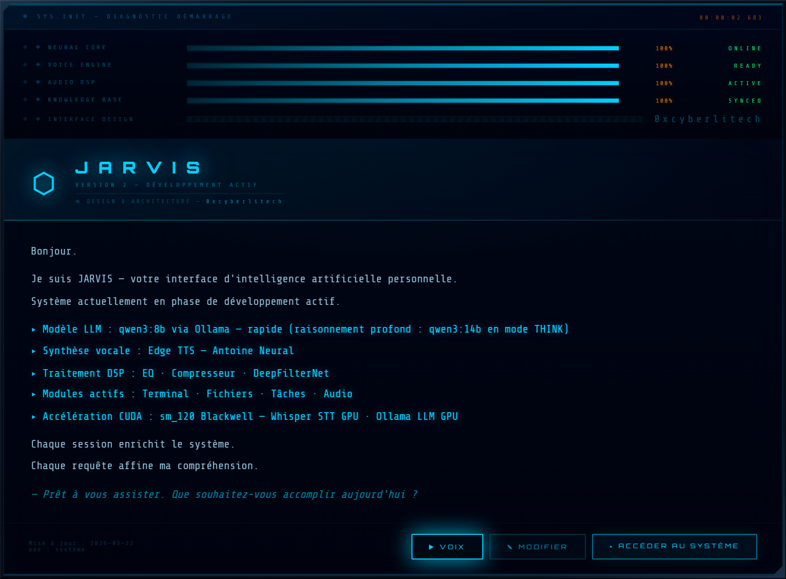
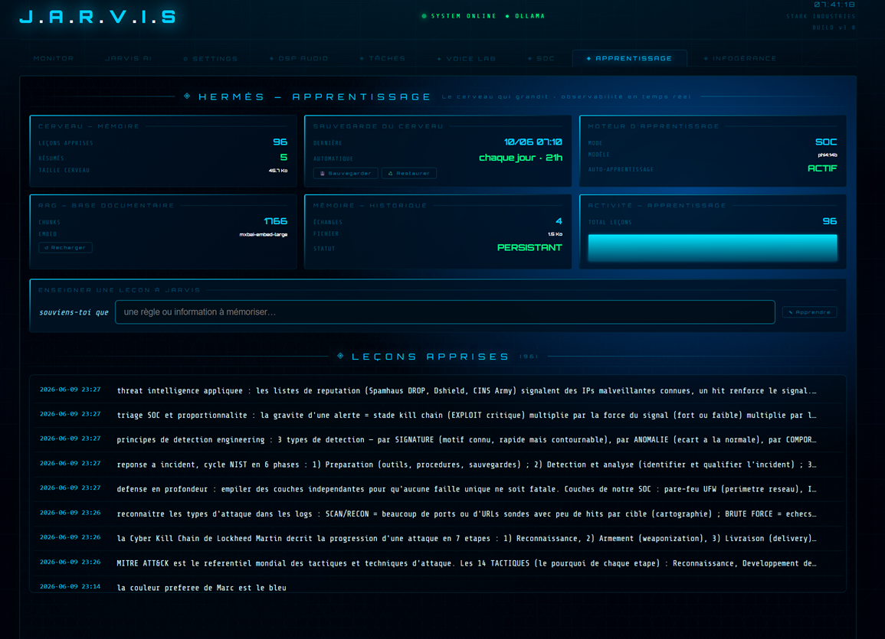

<div align="center">

  <br></br>

  <a href="https://github.com/0xCyberLiTech">
    
  </a>

  <br></br>

  <h2>Assistant IA local · voix · interface holographique · automatisation SOC 24/7</h2>

  <p align="center">
    <a href="https://0xcyberlitech.github.io/">
      
    </a>
    <a href="https://github.com/0xCyberLiTech">
      
    </a>
    <a href="https://github.com/0xCyberLiTech/JARVIS/releases/latest">
      
    </a>
    <a href="https://github.com/0xCyberLiTech/JARVIS/blob/main/CHANGELOG.md">
      
    </a>
    <a href="https://github.com/0xCyberLiTech?tab=repositories">
      
    </a>
    <a href="https://github.com/0xCyberLiTech/JARVIS/graphs/contributors">
      
    </a>
  </p>

</div>

<div align="center">
  
</div>

<div align="center">
  <p>
    <strong>IA 100% locale</strong>  &nbsp;•&nbsp; <strong>Voix naturelle · STT · TTS</strong>  &nbsp;•&nbsp; <strong>Automatisation SOC</strong> 
  </p>
</div>

---

# Hermès — L'agent persistant

## Qu'est-ce qu'Hermès ?

Un **assistant** répond à des questions — et oublie tout dès que la session se ferme.

Un **agent** est fondamentalement différent : il **observe** son environnement en permanence, **mémorise** ce qu'il apprend entre les sessions, **anticipe** les besoins récurrents, et **agit** de façon autonome quand une condition est remplie — sans attendre d'être interrogé.

**Hermès est la couche d'agentification de JARVIS.** C'est lui qui transforme un assistant LLM classique en agent autonome persistant. Il s'intercale entre l'utilisateur et le moteur LLM, et prend en charge tout ce que le LLM ne devrait pas faire : la mémoire long terme, les décisions déterministes, les actions système et le briefing proactif.

<div align="center">
  
  <br/>
  <sub>Interface holographique JARVIS — état du moteur local (LLM, voix, modules, accélération GPU) en un coup d'œil.</sub>
</div>

---

## Schéma 1 — Position d'Hermès dans l'architecture

```
╔══════════════════════════════════════════════════════════════════╗
║                 UTILISATEUR  (voix ou texte)                     ║
╚══════════════════════════╤═══════════════════════════════════════╝
                           │
              ┌────────────▼──────────────┐
              │                           │
              │       H E R M È S         │
              │ (couche agentification)   │
              │                           │
              │  ┌─────────────────────┐  │
              │  │ 1. Bypass ?         │  │  ← commande déterministe ?
              │  │    OUI → action     │  │     exécution directe < 100ms
              │  │    NON ↓            │  │     zéro LLM consommé
              │  └─────────────────────┘  │
              │  ┌─────────────────────┐  │
              │  │ 2. Facts inject     │  │  ← date/heure + leçons
              │  │    Mémoire RAG      │  │     persistées entre sessions
              │  └─────────────────────┘  │
              │  ┌─────────────────────┐  │
              │  │ 3. RAG conditionnel │  │  ← documentation locale
              │  │    (si pertinent)   │  │     injectée si besoin
              │  └─────────────────────┘  │
              │  ┌─────────────────────┐  │
              │  │ 4. SOC inject       │  │  ← contexte sécurité live
              │  │    (mode SOC seul)  │  │     side-channel, jamais
              │  └─────────────────────┘  │    dans l'historique chat
              └────────────┬──────────────┘
                           │
              ┌────────────▼──────────────┐
              │          L L M            │
              │  phi4 / gemma4 / qwen     │  ← ne voit que ce qu'Hermès
              └────────────┬──────────────┘    lui prépare
                           │
              ┌────────────▼──────────────┐
              │   RÉPONSE ENRICHIE        │
              │   + TTS vocal Antoine     │
              └───────────────────────────┘
```

> **Règle fondamentale** : Hermès décide ce qui arrive au LLM. Le LLM ne voit jamais les données brutes — seulement un contexte filtré, structuré et pertinent.

---

## Schéma 2 — Les 5 briques fondatrices d'Hermès

> Ces 5 briques sont le socle. Elles sont complétées par des **briques avancées**
> (mode pédagogique, infogérance orchestrée, DR du cerveau, cache vocal) —
> détaillées plus bas.

```
┌───────────────────────────────────────────────┐
│                  H E R M È S                  │
│                                               │
│  ┌──────────────────┐   ┌──────────────────┐  │
│  │  BRIQUE 1        │   │  BRIQUE 2        │  │
│  │  SYNOPTIQUE      │   │  TUILE MÉMOIRE   │  │
│  │  TEMPS RÉEL      │   │                  │  │
│  │                  │   │  ● Échanges      │  │
│  │  ● LLM actif     │   │  ● Résumés       │  │
│  │  ● RAG chunks    │   │  ● Leçons        │  │
│  │  ● STT/TTS état  │   │  ● Conventions   │  │
│  │  ● Auto-engine   │   │                  │  │
│  │  ● Mémoire état  │   │  Persistant      │  │
│  │  ● Mode actif    │   │  entre sessions  │  │
│  └──────────────────┘   └──────────────────┘  │
│                                               │
│  ┌──────────────────┐   ┌──────────────────┐  │
│  │  BRIQUE 3        │   │  BRIQUE 4        │  │
│  │  BYPASS          │   │  BOUCLE          │  │
│  │  DÉTERMINISTE    │   │  APPRENTISSAGE   │  │
│  │                  │   │                  │  │
│  │  Interception    │   │  "Souviens-toi"  │  │
│  │  avant LLM       │   │  → persisté RAG  │  │
│  │  < 100ms         │   │  → réinjecté     │  │
│  │  0 hallucination │   │    auto futures  │  │
│  └──────────────────┘   └──────────────────┘  │
│                                               │
│  ┌──────────────────┐                         │
│  │  BRIQUE 5        │                         │
│  │  BRIEFING        │                         │
│  │  MATINAL         │                         │
│  │                  │                         │
│  │  "Bonjour JARVIS"│                         │
│  │  → menaces SOC   │                         │
│  │  → état machines │                         │
│  │  → alertes 24h   │                         │
│  └──────────────────┘                         │
│                                               │
│                                               │
└───────────────────────────────────────────────┘
```

---

## Brique 1 — Synoptique temps réel

Le synoptique est le **tableau de bord live d'Hermès** — visible en permanence dans l'interface. Il affiche l'état des 6 couches du moteur au moment présent.

```
┌─────────────────────────────────────────────────────────┐
      ◈  HERMÈS  --  SYNOPTIQUE  MOTEUR                        
├─────────────────┬───────────────────────────────────────┤
│  LLM ACTIF      │  phi4:14b  ●  CHAUD  (en mémoire)     │
│  RAG            │  1698 chunks  ●  PRÊT  TTL: 4m32s     │
│  STT            │  large-v3-turbo  ●  EN ÉCOUTE         │
│  TTS            │  edge-tts  Antoine fr-CA  ●  ACTIF    │
│  AUTO-ENGINE    │  ●  ACTIF  —  dernier scan: 42s       │
│  MÉMOIRE        │  96 leçons  ●  résumés  ●  SYNC       │
└─────────────────┴───────────────────────────────────────┘
```

> Ce synoptique est désormais un **onglet dédié** de l'interface (`◈ APPRENTISSAGE`) :
> un tableau de bord d'observabilité Hermès où l'on voit, en direct, le moteur
> « vivre » — compteurs (leçons, chunks RAG, dernière sauvegarde, taille du
> cerveau), flux des leçons récentes en haut, et l'enseignement en direct.

<div align="center">
  
  <br/>
  <sub>L'onglet <b>◈ APPRENTISSAGE</b> : compteurs du moteur, champ « souviens-toi que… » pour enseigner en direct, et le flux des <b>leçons apprises</b> (ici, des connaissances cyber — threat intel, triage SOC, kill chain, MITRE).</sub>
</div>

L'utilisateur sait **en un coup d'œil** si JARVIS est pleinement opérationnel, si un modèle est en cours de chargement, si le RAG est à jour, ou si l'auto-engine SOC surveille activement.

---

## Brique 2 — Mémoire persistante

C'est la brique qui différencie le plus radicalement un agent d'un chatbot.

### Sans mémoire persistante (chatbot classique)

```
Session 1 :  "Appelle-moi Marc"      → JARVIS apprend
             Session fermée          → TOUT OUBLIÉ

Session 2 :  "Bonjour JARVIS"
             "Tu te souviens de moi ?" → "Je suis désolé, je n'ai pas
                                          de mémoire des sessions précédentes"
```

### Avec Hermès — mémoire persistante RAG

```
Session 1 :  "Souviens-toi : les backups le samedi soir"
                │
                ▼
             Leçon indexée dans jarvis_facts.json
             + vecteur créé dans la base RAG

Session 2 (lendemain) :
             "Quand faire les backups ?"
                │
                ▼  RAG retrouve la leçon automatiquement
             "Les backups se font le samedi soir — tu me l'as appris hier."
```

### Structure de la mémoire

```
jarvis_facts.json  (persistant sur disque)
├── leçons        : règles et conventions apprises
├── tâches        : TODO persistants entre sessions
└── préférences   : comportements personnalisés

jarvis_memory.json  (persistant sur disque)
├── résumés       : condensés des longues conversations
└── contexte      : état de l'échange en cours

Base vectorielle RAG  (~1700 chunks)
├── documentation technique locale
├── leçons apprises  (injection automatique)
└── résumés de sessions
```

---

## Brique 3 — Bypass déterministe

### Le problème sans bypass

Quand on passe toutes les commandes par le LLM, on accepte deux risques :
- **Latence** : le modèle 14b prend 2 à 8 secondes pour répondre
- **Hallucination** : le LLM peut inventer une heure, un nom de fichier, un état de service

Pour des commandes simples et prévisibles, ce comportement est inacceptable.

### La solution Hermès — interception avant le LLM

```
Entrée utilisateur
       │
       ▼
┌──────────────────────────────────┐
│   MOTEUR BYPASS  (regex Python)  │
│                                  │
│   Patterns interceptés :         │
│   ● temporel     → datetime()    │
│   ● état VM      → SSH qm list   │
│   ● lecture fich → open() local  │
│   ● recharge RAG → rag.reload()  │
│   ● briefing mat → brief()       │
│   ● menu-lint    → lint()        │
│   ● ... (29 patterns)            │
└──────────┬───────────────────────┘
           │ Match ?
    ┌──────┴──────┐
    │ OUI         │ NON
    ▼             ▼
Action       Continuer vers
directe      LLM (étapes 2-5)
< 100ms
0 token LLM
```

### Exemples concrets

| Commande vocale | Sans Hermès | Avec Hermès |
|-----------------|-------------|-------------|
| `"Quelle heure est-il ?"` | LLM invoqué — 4 secondes — risque hallucination | Python `datetime.now()` direct — 8 ms — exact |
| `"État des VMs"` | LLM génère une commande SSH — risque d'erreur de syntaxe | `qm list` SSH direct — résultat brut exact |
| `"Recharge le RAG"` | LLM interprète — résultat incertain | `rag_engine.reload()` direct — confirmation immédiate |
| `"Bonjour JARVIS"` | LLM génère un bonjour générique | Briefing matinal complet : SOC + infra + alertes 24h |

---

## Brique 4 — Boucle d'apprentissage

### Comment JARVIS apprend

```
UTILISATEUR :  "Souviens-toi que X"  (texte ou voix)
                    │
                    ▼
            Hermès détecte le pattern "souviens-toi"
                    │
         ┌──────────▼────────────────────┐
         │   PERSISTANCE                 │
         │   ├── jarvis_facts.json       │  ← écriture disque
         │   └── jarvis_memory.json      │
         └──────────┬────────────────────┘
                    │
         ┌──────────▼────────────────────┐
         │   INDEXATION RAG              │
         │   ├── embedding calculé       │  ← mxbai-embed-large
         │   └── chunk ajouté à l'index  │
         └──────────┬────────────────────┘
                    │
         ┌──────────▼────────────────────┐
         │   INJECTION AUTOMATIQUE       │
         │   Toute future question       │  ← sans action de
         │   pertinente reçoit cette     │    l'utilisateur
         │   leçon en contexte           │
         └───────────────────────────────┘

  RÉSULTAT :  JARVIS connaît cette règle dans TOUTES
              les sessions suivantes — sans re-briefing
```

### Exemples de leçons apprisibles

- Conventions de travail : `"Souviens-toi : les commits en anglais"`
- Règles métier : `"Souviens-toi : ne jamais redémarrer nginx sans vérifier les configs"`
- Préférences vocales : `"Souviens-toi : réponds toujours en français"`
- Contexte infra : `"Souviens-toi : le disque D est le disque de secours"`

---

## Brique 5 — Briefing matinal

Le briefing matinal est la manifestation la plus visible du comportement **proactif** d'Hermès.

Au lieu d'attendre une question, JARVIS prend l'initiative de livrer un résumé complet de la situation à la première interaction de la journée.

### Déclencheur et pipeline

```
"Bonjour JARVIS"  (ou variantes vocales)
         │
         ▼  Hermès identifie le pattern matinal
         │
         ▼  Assemblage sans LLM (bypass total — données directes)
         │
    ┌────┴────────────────────────────────────┐
    │  ● ThreatScore SOC en cours             │
    │  ● Bans actifs dernières 24h            │
    │  ● Alertes IDS / WAF                    │
    │  ● État des VMs Proxmox                 │
    │  ● Dernière sauvegarde (date + état)    │
    │  ● État LLM + RAG + mémoire JARVIS      │
    └────┬────────────────────────────────────┘
         │
         ▼  Synthèse vocale TTS Antoine fr-CA
         │
    Briefing complet lu en < 30 secondes
    sans interaction clavier
```

---

# Briques avancées — l'évolution d'Hermès

Aux 5 briques fondatrices se sont ajoutées des briques nées de l'usage
quotidien. Chacune suit la même philosophie : **déterminisme, sûreté,
accessibilité** — Hermès protège le LLM et l'utilisateur.

---

## Brique 6 — Mode pédagogique (JARVIS tuteur)

**Rôle : distinguer *expliquer* de *analyser*, et enseigner.**

En mode SOC, le moteur de raisonnement tend à *analyser* la situation live à
chaque sollicitation — y compris quand l'utilisateur veut simplement
*comprendre* un concept. Hermès tranche cette ambiguïté **avant** le LLM.

```
"Analyse la situation"          "Explique-moi ce qu'est un WAF"
        │                                │
        ▼  détecteur d'intention         ▼  détecteur d'intention
   = ANALYSE                         = EXPLICATION
        │                                │
        ▼                                ▼
   Contexte SOC live injecté        Prompt PÉDAGOGIQUE neutre
   (méthode d'analyse)              (aucune donnée live injectée)
        │                                │
        ▼                                ▼
   Recommandation actionnable       Leçon claire, analogies,
   ancrée sur les données           niveau débutant
```

Un détecteur d'intention unique (source unique, réutilisé partout) reconnaît
les tournures pédagogiques (*explique, décris, apprends-moi, à quoi sert,
différence entre…*). En explication, Hermès **n'injecte ni le contexte
sécurité live ni la documentation** : il sert un prompt pédagogique neutre.
JARVIS devient alors le **tuteur** de son utilisateur — utile pour monter en
compétence sur la cybersécurité défensive.

---

## Brique 7 — Infogérance assistée (orchestration sûre)

**Rôle : exécuter une opération multi-étapes risquée en un seul geste, avec garde-fous.**

Mettre à jour une machine demande normalement une séquence manuelle (mise à
jour → redémarrage → re-vérification de l'intégrité fichier). Hermès
l'orchestre derrière **un seul bouton**, sans jamais sacrifier la sûreté.

```
1 bouton « MAJ complète »
        │
        ▼  1 seule confirmation OUI / NON
        │
   ┌────┴─────────────────────────────────────────────┐
   │  ① mise à jour des paquets                       │
   │  ② redémarrage SI requis                         │
   │     └─ preuve du reboot (uptime vérifié)         │
   │  ③ re-base de l'intégrité fichier (post-reboot)  │
   └────┬─────────────────────────────────────────────┘
        │
        ▼  FAIL-CLOSED : toute étape qui échoue STOPPE la chaîne
        │
   Journal horodaté (JSONL) de chaque étape
```

Trois principes non négociables :

- **Fail-closed** — une étape qui échoue interrompt tout (jamais de re-base sur
  un état non vérifié).
- **Ordre prouvé** — la re-base d'intégrité n'a lieu **qu'après** un
  redémarrage prouvé (uptime), jamais avant.
- **Traçabilité** — chaque étape est journalisée (JSONL horodaté), comme toute
  opération sensible.

Pensée pour l'**accessibilité** : gros boutons, confirmation OUI/NON
inconfondable, verdict lu à voix haute.

---

## Brique 8 — Mémoire protégée (DR du cerveau)

**Rôle : ne jamais perdre le savoir appris.**

La boucle d'apprentissage (brique 4) n'a de valeur que si la mémoire survit à
une panne. Hermès protège son propre cerveau par une stratégie de reprise
après sinistre, pilotable **à la voix**.

```
"Sauvegarde le cerveau"  ──►  copie légère quotidienne
                              ├─ rotation glissante
                              ├─ archives mensuelles PERMANENTES
                              └─ "latest" pour restauration 1-geste
                                   │
"Restaure le cerveau"   ──►  retour à la dernière sauvegarde
                              └─ vocal : "Cerveau restauré. 96 leçons."
```

Le fichier des leçons est **cumulatif** : la rotation ne supprime jamais le
savoir, elle ne fait que dater des photos. Le bilan annoncé (nombre de leçons)
est **extrait de la sortie réelle** du script — jamais un chiffre inventé.

---

## Brique 9 — Cache vocal (restitution instantanée)

**Rôle : rendre la voix immédiate sur les phrases répétées.**

Confirmations, menu vocal, réponses figées : ces phrases revenaient en
re-synthèse à chaque fois. Hermès mémorise le rendu audio et le ressert
instantanément.

- **Clé** = empreinte du texte + voix + moteur + réglages DSP → un changement
  de voix ou de DSP invalide l'entrée (jamais d'audio périmé).
- **Best-effort intégral** : toute erreur du cache est avalée → repli sur la
  génération normale, **la voix ne casse jamais**.
- **Borné** (LRU) : le volume disque reste maîtrisé.

> Détail technique : [04 — Audio &amp; DSP](04-AUDIO-DSP.md#cache-tts--restitution-instantanée).

---

## Bilan — Ce qu'Hermès apporte à JARVIS

```
┌─────────────────────────┬────────────────────────────────────────┐
│  SANS HERMÈS            │  AVEC HERMÈS                           │
│  (chatbot LLM classique)│  (agent persistant)                    │
├─────────────────────────┼────────────────────────────────────────┤
│  Chaque session repart  │  Contexte, leçons et conventions       │
│  de zéro                │  conservés entre toutes les sessions   │
├─────────────────────────┼────────────────────────────────────────┤
│  Toutes les commandes   │  Bypass déterministe : 29 patterns     │
│  passent par le LLM     │  exécutés directement < 100 ms         │
│  (latence + risque      │  sans consommer un seul token LLM      │
│  d'hallucination)       │                                        │
├─────────────────────────┼────────────────────────────────────────┤
│  L'assistant attend     │  L'agent surveille en permanence,      │
│  d'être interrogé       │  alerte vocalement si seuil dépassé,   │
│                         │  agit (ban IP, restart) si configuré   │
├─────────────────────────┼────────────────────────────────────────┤
│  Le LLM voit toutes     │  Hermès filtre : le LLM ne reçoit      │
│  les données brutes     │  que le contexte utile — structuré     │
│                         │  et pertinent                          │
├─────────────────────────┼────────────────────────────────────────┤
│  Pas de conscience      │  Briefing matinal proactif :           │
│  de l'état du système   │  sécurité + infra + état JARVIS        │
│  au démarrage           │  lu vocalement sans interaction        │
├─────────────────────────┼────────────────────────────────────────┤
│  Apprentissage limité   │  Boucle d'apprentissage : une leçon    │
│  à la session courante  │  apprise persiste dans toutes les      │
│                         │  sessions futures automatiquement      │
├─────────────────────────┼────────────────────────────────────────┤
│  Répond toujours pareil │  Mode pédagogique : sait distinguer    │
│  (analyse même quand on │  expliquer d'analyser — devient un     │
│  veut comprendre)       │  tuteur cybersécurité                  │
├─────────────────────────┼────────────────────────────────────────┤
│  Opérations système     │  Infogérance orchestrée : 1 bouton,    │
│  manuelles, risquées    │  fail-closed, ordre prouvé, journal    │
├─────────────────────────┼────────────────────────────────────────┤
│  La mémoire peut être   │  DR du cerveau : sauvegarde/restaure   │
│  perdue                 │  pilotable à la voix, savoir cumulatif │
└─────────────────────────┴────────────────────────────────────────┘
```

> Hermès ne remplace pas le LLM — il le **protège** des tâches pour lesquelles il est mauvais (déterminisme, mémoire, temps réel), et lui réserve ce pour quoi il excelle : le raisonnement, l'analyse et la réponse contextuelle.

---

**Retour →** [README](../README.md) &nbsp;&nbsp; **Suivant →** [02 — Intégration SOC](02-SOC-INTEGRATION.md)

---

<div align="center">

<table>
<tr>
<td align="center"><b>🖥️ Infrastructure &amp; Sécurité</b></td>
<td align="center"><b>💻 Développement &amp; Web</b></td>
<td align="center"><b>🤖 Intelligence Artificielle</b></td>
</tr>
<tr>
<td align="center">
  <a href="https://www.kernel.org/"></a>
  <a href="https://www.debian.org"></a>
  <a href="https://www.gnu.org/software/bash/"></a>
  <br/>
  <a href="https://nginx.org"></a>
  <a href="https://git-scm.com"></a>
</td>
<td align="center">
  <a href="https://www.python.org"></a>
  <a href="https://flask.palletsprojects.com"></a>
  <a href="https://developer.mozilla.org/docs/Web/HTML"></a>
  <br/>
  <a href="https://developer.mozilla.org/docs/Web/CSS"></a>
  <a href="https://developer.mozilla.org/docs/Web/JavaScript"></a>
  <a href="https://code.visualstudio.com"></a>
</td>
<td align="center">
  <a href="https://ollama.com"></a>
  <br/><br/>
  <a href="https://anthropic.com"></a>
</td>
</tr>
</table>

<br/>

<sub>🔒 Projets proposés par <a href="https://github.com/0xCyberLiTech">0xCyberLiTech</a> · Développés en collaboration avec <a href="https://claude.ai">Claude AI</a> (Anthropic) 🔒</sub>

</div>
