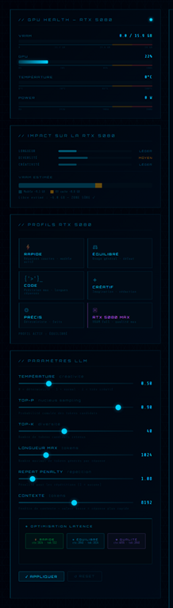

<div align="center">

  <br></br>

  <a href="https://github.com/0xCyberLiTech">
    
  </a>

  <br></br>

  <h2>Assistant IA local · voix · interface holographique · automatisation SOC 24/7</h2>

  <p align="center">
    <a href="https://0xcyberlitech.github.io/">
      
    </a>
    <a href="https://github.com/0xCyberLiTech">
      
    </a>
    <a href="https://github.com/0xCyberLiTech/JARVIS/releases/latest">
      
    </a>
    <a href="https://github.com/0xCyberLiTech/JARVIS/blob/main/CHANGELOG.md">
      
    </a>
    <a href="https://github.com/0xCyberLiTech?tab=repositories">
      
    </a>
    <a href="https://github.com/0xCyberLiTech/JARVIS/graphs/contributors">
      
    </a>
  </p>

</div>

<div align="center">
  
</div>

<div align="center">
  <p>
    <strong>IA 100% locale</strong>  &nbsp;•&nbsp; <strong>Voix naturelle · STT · TTS</strong>  &nbsp;•&nbsp; <strong>Automatisation SOC</strong> 
  </p>
</div>

---
# Architecture globale

## Vue d'ensemble — 5 zones

```
┌─────────────────────────────────────────────────────────────────────┐
│  NAVIGATEUR  (localhost:5000)                                        │
│                                                                      │
│  ┌──────────────────┐  ┌──────────────────┐  ┌──────────────────┐   │
│  │  ZONE UI / ONGLETS│  │  ZONE AUDIO DSP  │  │  ZONE SOC CLIENT │   │
│  │  Chat · Monitor  │  │  EQ · Compresseur│  │  Kill Chain      │   │
│  │  Voice Lab · DSP │  │  Reverb · TTS    │  │  alertes         │   │
│  └────────┬─────────┘  └────────┬─────────┘  └──────┬───────────┘   │
└───────────┼─────────────────────┼────────────────────┼──────────────┘
            │ HTTP / SSE           │ Web Audio API       │ poll 30s
            ▼                     ▼                     ▼
┌─────────────────────────────────────────────────────────────────────┐
│  SERVEUR FLASK  (jarvis.py — 75 routes)   localhost:5000            │
│                                                                      │
│  ┌─────────────────────┐   ┌──────────────────────────────────────┐  │
│  │  ZONE IA             │   │  ZONE SOC SERVEUR                    │  │
│  │  Orchestrateur Flask │   │  auto-engine SOC (thread 60s)        │  │
│  │  31 modules Python   │   │  ban/unban · restart · journal       │  │
│  └─────────────────────┘   └──────────────────────────────────────┘  │
└─────────────────────────────────────────────────────────────────────┘
            │ Ollama API                      │ monitoring.json
            ▼                                ▼
   ┌──────────────────┐              ┌────────────────────┐
   │  Ollama local    │              │  Dashboard SOC     │
   │  phi4:14b (SOC)  │              │  CrowdSec · F2B    │
   │  gemma4 (GÉNÉRAL)│              │  Suricata · nginx  │
   └──────────────────┘              └────────────────────┘
```

---

## Modèles LLM — stratégie VRAM

| Mode | Modèle | VRAM | Usage |
|------|--------|------|-------|
| **SOC** (défaut · toujours chaud) | phi4:14b | 9.1 GB | Cybersécurité · raisonnement |
| **GÉNÉRAL** | gemma4:latest | 9.6 GB | Conversation · vision native |
| **CODE** | qwen2.5-coder:14b | 9.0 GB | Développement · infogérance |
| **RAG** (keep_alive 10m) | mxbai-embed-large | 0.7 GB | Embeddings vectoriels |

> phi4:14b est toujours chaud (défaut SOC). Le switch vers gemma4 ou qwen2.5-coder entraîne un swap VRAM — accepté car c'est un changement de mode explicite.

<div align="center">
  
  <br/>
  <sub>Monitoring GPU (VRAM, température, puissance) et profils LLM — l'optimisation matérielle RTX 5080 est pilotable depuis l'interface.</sub>
</div>

---

## Architecture modulaire

`jarvis.py` est l'**orchestrateur Flask** — il délègue à **31 modules Python** :

| Catégorie | Modules |
|-----------|---------|
| **Bypass Hermès** | `bypass/morning_brief.py`, `learn.py`, `sysctrl.py`, `backup.py` (menu vocal : sauvegardes, cerveau, lint), `wrappers.py` |
| **Chat / LLM** | `chat/orchestrator.py`, `routing.py`, `soc_inject.py`, `soc_context.py` |
| **RAG** | `rag/engine.py`, `rag/indexer.py`, `rag/retriever.py` |
| **Voice** | `voice/tts_engines.py`, `voice/tts_cache.py` (cache WAV best-effort), `voice/stt.py`, `voice/voice_lab.py` |
| **Infra** | `ssh/tools.py`, `proxmox/api.py`, `ollama_circuit.py` |
| **Sécurité** | `security_whitelists.py` |
| **Blueprint SOC** | `blueprints/soc.py` — auto-engine + routes |

---

## Frontend — 21 modules JS

L'interface est entièrement en **Vanilla JS** (zéro framework) :

| Module | Rôle |
|--------|------|
| `jarvis_main.js` | Point d'entrée unique — `_jarvisInit()` |
| `chat_core.js` | Pipeline chat + SSE streaming |
| `soc_tab.js` | Interface SOC — Kill Chain, bans, alertes |
| `audio_rack.js` | Rack DSP broadcast — 3 étages |
| `voice_lab.js` | Voice Lab — TTS/STT — comparateur A/B |
| `gpu_monitor.js` | Métriques GPU RTX — jauges, graphiques |
| `terminal_code.js` | xterm.js — terminal SSH |
| `boot_init.js` | Initialisation et diagnostic au démarrage |

---

## Modules centralisés — source unique

| Module | Centralise | Règle |
|--------|-----------|-------|
| `_buildChatPayload()` | 6/6 appels LLM | Injection contexte SOC centralisée |
| `_jarvisInit()` | 1/1 DOMContentLoaded | Un seul point d'entrée JS |
| `_SSH_LOCK` | Toutes connexions SSH | Une seule connexion à la fois |
| `_TTS_LOCK` | Séquencement TTS | Évite les doublons vocaux |

---

## Polling — architecture temporelle

```
monitoring_gen.py ── cron 60s ──→ monitoring.json
                                        │
  Dashboard SOC   ── 60s ──────────────┤
  JARVIS chatbot  ── 30s ──────────────┤  (Nyquist buffer)
  JARVIS engine   ── 10s ──────────────┘  (GPU live)
  Heartbeat       ── 15s → ping JARVIS
```

---

**Précédent ←** [02 — SOC](02-SOC-INTEGRATION.md) &nbsp;&nbsp; **Suivant →** [04 — Audio DSP](04-AUDIO-DSP.md)

---

<div align="center">

<table>
<tr>
<td align="center"><b>🖥️ Infrastructure &amp; Sécurité</b></td>
<td align="center"><b>💻 Développement &amp; Web</b></td>
<td align="center"><b>🤖 Intelligence Artificielle</b></td>
</tr>
<tr>
<td align="center">
  <a href="https://www.kernel.org/"></a>
  <a href="https://www.debian.org"></a>
  <a href="https://www.gnu.org/software/bash/"></a>
  <br/>
  <a href="https://nginx.org"></a>
  <a href="https://git-scm.com"></a>
</td>
<td align="center">
  <a href="https://www.python.org"></a>
  <a href="https://flask.palletsprojects.com"></a>
  <a href="https://developer.mozilla.org/docs/Web/HTML"></a>
  <br/>
  <a href="https://developer.mozilla.org/docs/Web/CSS"></a>
  <a href="https://developer.mozilla.org/docs/Web/JavaScript"></a>
  <a href="https://code.visualstudio.com"></a>
</td>
<td align="center">
  <a href="https://ollama.com"></a>
  <br/><br/>
  <a href="https://anthropic.com"></a>
</td>
</tr>
</table>

<br/>

<sub>🔒 Projets proposés par <a href="https://github.com/0xCyberLiTech">0xCyberLiTech</a> · Développés en collaboration avec <a href="https://claude.ai">Claude AI</a> (Anthropic) 🔒</sub>

</div>
