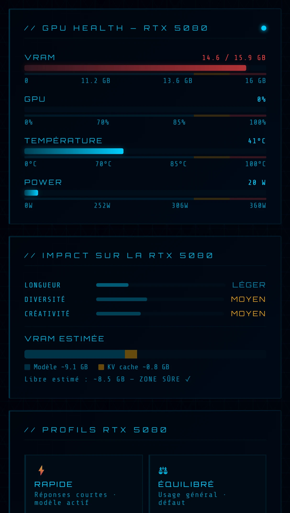

<div align="center">

  <br></br>

  <a href="https://github.com/0xCyberLiTech">
    
  </a>

  <br></br>

  <h2>Assistant IA local · voix · interface holographique · automatisation SOC 24/7</h2>

  <p align="center">
    <a href="https://0xcyberlitech.github.io/">
      
    </a>
    <a href="https://github.com/0xCyberLiTech">
      
    </a>
    <a href="https://github.com/0xCyberLiTech/JARVIS/tags">
      
    </a>
    <a href="https://github.com/0xCyberLiTech/JARVIS/blob/main/CHANGELOG.md">
      
    </a>
    <a href="https://github.com/0xCyberLiTech?tab=repositories">
      
    </a>
    <a href="https://github.com/0xCyberLiTech/JARVIS/graphs/contributors">
      
    </a>
  </p>

</div>

<div align="center">
  
</div>

<div align="center">
  <p>
    <strong>IA 100% locale</strong>  &nbsp;•&nbsp; <strong>Voix naturelle · STT · TTS</strong>  &nbsp;•&nbsp; <strong>Automatisation SOC</strong> 
  </p>
</div>

---
# Architecture globale

> *Dernière mise à jour : 2026-08-16 (Refactoring modulaire et étanchéité)*

## Vue d'ensemble — 5 zones

```
┌───────────────────────────────────────────────────────────────────────┐
│  NAVIGATEUR  (localhost:5000)                                         │
│                                                                       │
│  ┌────────────────────┐  ┌───────────────────┐  ┌──────────────────┐  │
│  │  ZONE UI / ONGLETS │  │  ZONE AUDIO DSP   │  │  ZONE SOC CLIENT │  │
│  │  Chat · Monitor    │  │  EQ · Compresseur │  │  Kill Chain      │  │
│  │  Voice Lab · DSP   │  │  Reverb · TTS     │  │  alertes         │  │
│  └────────┬───────────┘  └────────┬──────────┘  └──────┬───────────┘  │
└───────────┼───────────────────────┼────────────────────┼──────────────┘
            │ HTTP / SSE            │ Web Audio API      │ poll 30s
            ▼                       ▼                    ▼
┌───────────────────────────────────────────────────────────────────────┐
│  SERVEUR FLASK  (jarvis.py)   localhost:5000                          │
│                                                                       │
│  ┌──────────────────────┐   ┌──────────────────────────────────────┐  │
│  │  ZONE IA             │   │  ZONE SOC SERVEUR                    │  │
│  │  Orchestrateur Flask │   │  auto-engine SOC (thread 60s)        │  │
│  │  modules Python      │   │  ban/unban · restart · journal       │  │
│  └──────────────────────┘   └──────────────────────────────────────┘  │
└───────────────────────────────────────────────────────────────────────┘
            │ Ollama API                      │ monitoring.json
            ▼                                 ▼
   ┌───────────────────┐              ┌────────────────────┐
   │  Ollama local     │              │  Dashboard SOC     │
   │  qwen3.5:9b (SOC) │              │  CrowdSec · F2B    │
   │  qwen3.5:9b (VIS.)│              │  Suricata · nginx  │
   └───────────────────┘              └────────────────────┘
```

---

## Modèles LLM — stratégie VRAM

| Rôle | Modèle | Usage |
|------|--------|-------|
| **SOC** (défaut · toujours chaud) | qwen3.5:9b | Cybersécurité · raisonnement |
| **GÉNÉRAL** | qwen3.5:9b | Conversation (même modèle que SOC — zéro swap) |
| **THINK** | qwen3.5:9b | Raisonnement profond (think natif) |
| **CODE** | qwen3.5:9b | Développement · infogérance (même modèle — zéro swap) |
| **VISION** | qwen3.5:9b | Multimodal natif — analyse d'images (même modèle que SOC/GÉNÉRAL/CODE/THINK) |
| **RAG** (keep_alive 10m) | qwen3-embedding:4b | Embeddings vectoriels (dim 2560) |

> qwen3.5:9b est toujours chaud (défaut SOC + GÉNÉRAL + CODE + THINK — un seul modèle, zéro swap entre tous les modes de raisonnement). La VISION utilise le même qwen3.5:9b (multimodal natif) — donc aucun swap VRAM, même pour l'analyse d'image.
>
> ⚠ **La table `rôle → modèle` et l'empreinte VRAM déclarée de chaque modèle vivent dans UN SEUL fichier** — le registre LLM source-unique lu au démarrage. Elles ne sont **pas recopiées ici** : un chiffre dupliqué dans une page de doc dérive au premier changement de modèle (c'est exactement ce qui était arrivé à la valeur du modèle d'embedding). Un garde-fou interdit tout nom de modèle écrit en dur hors de ce registre.
> ⚠ Ne pas confondre l'empreinte **déclarée** (registre, sert au calcul *a priori* « Impact VRAM ») avec l'empreinte **réellement chargée** que le moniteur affiche en direct : ce sont **deux grandeurs différentes**.

<div align="center">
  
  <br/>
  <sub>Monitoring GPU (VRAM, température, puissance) et profils LLM — l'optimisation matérielle RTX 5080 est pilotable depuis l'interface.</sub>
</div>

---

## Architecture modulaire

`jarvis.py` est l'**orchestrateur Flask** — il délègue à **ses modules Python**. Le tableau ci-dessous cite **quelques** modules par domaine : ce n'est **pas un inventaire** (il dériverait), l'arborescence réelle fait foi.

| Catégorie | Circuits & Modules Spécialisés |
|-----------|--------------------------------|
| **Cœur Flask** | `jarvis.py` (orchestrateur), `mcp_supervisor.py`, `server_runners.py`, `command_security.py` |
| **Bypass Hermès** | `bypass/morning_brief.py`, `bypass/learn.py`, `bypass/system_ctrl.py`, `bypass/backup.py`, `bypass/wrappers.py` |
| **Chat / LLM** | `chat/orchestrator.py`, `chat/routing.py`, `chat/dispatcher.py`, `chat/soc_inject.py`, `chat/soc_context.py` |
| **SOC & Cyberdéfense** | `blueprints/soc.py`, `soc_ssh_collector.py`, `soc_autoban_engine.py`, `soc_monitor_engine.py`, `soc_rsyslog_engine.py`, `soc_report_voice.py` |
| **Bootstrap Threads** | `bootstrap/threads.py`, `bootstrap/alarm_voice_channel.py`, `bootstrap/infra_monitors.py`, `bootstrap/models_prewarm.py`, `bootstrap/maintenance_engine.py` |
| **Mémoire Conversationnelle** | `memory/routes.py`, `memory/memory_stats_service.py`, `memory/memory_health_service.py`, `memory/memory_self_heal_service.py`, `memory/store.py` |
| **RAG & Vectoriel** | `rag/engine.py`, `rag/rag_storage.py`, `rag/rag_indexer.py`, `rag/rag_searcher.py`, `rag/rag_prompt_injector.py`, `rag/routes.py` |
| **Mobile BFF** | `mobile_bus.py`, `mobile/mobile_emergency.py`, `mobile/mobile_proxmox.py`, `mobile/mobile_soc.py`, `mobile/mobile_system.py`, `mobile/__init__.py` |
| **Disaster Recovery (DR)** | `dr_watch.py`, `dr/dr_io_contract.py`, `dr/dr_state_evaluator.py`, `dr/dr_speech_composer.py` |
| **Serveur MCP** | `jarvis_mcp_server.py`, `mcp_tools/mcp_tools_system.py`, `mcp_tools/mcp_tools_soc.py`, `mcp_tools/mcp_tools_multimodal.py` |
| **Sécurité & Whitelists** | `security_whitelists.py`, `security_whitelists_sub/patterns.py`, `security_whitelists_sub/exfil_guard.py`, `security_whitelists_sub/validator.py`, `security_origin.py`, `net_auth.py` |
| **Voice & DSP** | `voice/tts_engines.py`, `voice/tts_cache.py`, `voice/tts_dedup.py`, `voice/stt.py`, `voice/voice_lab.py`, `dsp_config.py` |
| **Infra & Hyperviseur** | `ssh/tools.py`, `proxmox/api.py`, `proxmox/routes.py`, `ollama_circuit.py` |

---

## Frontend — modules JS

L'interface est entièrement en **Vanilla JS** (zéro framework). Extrait — **pas un inventaire** (le nombre de modules est compté sur l'arborescence, jamais recopié ici) :

| Module | Rôle |
|--------|------|
| `jarvis_main.js` | Socle global — constantes de cadence (source unique des intervalles de polling), horloge, heartbeat UI |
| `chat_core.js` | Pipeline chat + SSE streaming |
| `soc_tab.js` | Interface SOC — Kill Chain, bans, alertes ; définit `_buildChatPayload()` |
| `audio_rack.js` | Rack DSP intégré — faders gain/comp/EQ/widener, DeepFilterNet, VU-mètres, presets EQ et spectre |
| `voice_lab.js` | Voice Lab — TTS/STT — comparateur A/B |
| `gpu_monitor.js` | Métriques GPU RTX — jauges, graphiques |
| `terminal_code.js` | xterm.js — terminal SSH |
| `boot_init.js` | Chargé **en dernier** — initialisation, diagnostic de démarrage et **point d'entrée** `_jarvisInit()` |

---

## Accessibilité — conçue pour la basse vision

L'interface est pensée dès la conception pour un usage en **basse vision** :

- **Navigation clavier complète + ARIA** — la barre d'onglets se pilote entièrement au clavier (flèches, Entrée/Espace, Début/Fin, focus roving) ; la touche **Échap** ramène à l'écran principal, ferme une fenêtre ou quitte un champ. Onglets et panneaux sont exposés aux technologies d'assistance (`role=tablist`/`tab`/`tabpanel`).
- **Lecteur d'écran** — libellés accessibles (`aria-label`) en français sur les contrôles, annonces vocales discrètes (`aria-live`) sur les zones de résultat, jamais sur le fil de conversation.
- **Contraste & lisibilité** — palette de texte lisible centralisée et tailles de police dérivées d'un jeu de tokens unique : confort de lecture garanti sur fond sombre, sans texte trop petit.
- **Garde-fous automatisés** — des vérificateurs d'accessibilité intégrés à la CI (fail-closed) empêchent toute régression de la navigation clavier/ARIA, du contraste et de la lisibilité au fil des évolutions.

---

## Points de centralisation — source unique

| Point | Centralise | Règle |
|-------|-----------|-------|
| `_buildChatPayload()` (front) | Le corps des requêtes du **fil de conversation** vers `/api/chat` | L'historique part **tel quel** : **aucune** incrustation de contexte SOC côté client. Le serveur injecte les données fraîches dans le *system prompt* à chaque appel → zéro donnée périmée dans l'historique. ⚠ D'autres écrans (apprentissage, terminal, infogérance) appellent `/api/chat` **directement**, sans passer par lui — ce qui rend l'invariant « l'injection est 100 % serveur » d'autant plus **structurant** : il ne peut pas reposer sur un point de passage que tout le monde n'emprunte pas |
| Garde de **pureté** du message (`chat/dispatcher.py`) | Le droit d'un message d'atteindre les **détecteurs déterministes** placés avant le LLM | **Allowlist fail-closed** : un envoi qui **déclare** porter autre chose que la parole de l'utilisateur perd l'accès aux détecteurs et va au modèle ; en cas d'anomalie, on refuse. Complété par un garde-fou **AST** au *pre-push* qui interdit, chez les clients **internes**, qu'un texte de contexte dérive jusqu'au message *(cf. `02-SOC-INTEGRATION.md`, incident du 2026-08-11)*. ⚠ La garde runtime est **déclarative** — elle ne relit pas le texte ; un client **externe** n'est pas couvert |
| `_jarvisInit()` (front) | La **séquence de démarrage** de l'interface | Enregistré par le module chargé **en dernier**. Quelques widgets autonomes s'initialisent séparément — l'invariant porte sur la séquence de boot, pas sur l'unicité de l'écouteur |
| `_ssh_host()` / son verrou (backend SOC) | **Toutes** les commandes SSH émises par le blueprint SOC, quel que soit l'hôte | Une seule connexion à la fois (sérialisation) — évite les timeouts par connexions parallèles ; backoff exponentiel sur retry |
| Dédup TTS global (`voice/tts_dedup.py`) | Le séquencement des synthèses vocales | Coupe le doublon **cross-source** (alerte prononcée par le moteur Python **et** par l'auto-engine navigateur) : même texte revu dans la fenêtre de dédup ⇒ ignoré. Fenêtre définie dans le module, pas recopiée ici |

---

## Polling — architecture temporelle

Toutes les cadences du front sont des **constantes nommées** déclarées à un seul endroit (`jarvis_main.js`) — aucune valeur n'est écrite en dur dans un `setInterval`.

```
monitoring.json  (produit périodiquement côté SOC — la cadence
                  de production vit dans le projet SOC, pas ici)
        │
        ├── Dashboard SOC  ── 60 s ──→ relecture de monitoring.json
        │
        └── JARVIS, auto-engine SOC (thread Python) ── 60 s ──→ bans / restarts / alertes

  JARVIS, rafraîchissement de l'onglet SOC (front) ── 30 s
  JARVIS, jauges GPU de l'onglet Réglages (front)  ──  5 s
  JARVIS, heartbeat de présence UI → serveur       ──  5 s   (< TTL serveur)
```

> ⚠ Ces durées sont des **cadences**, pas des compteurs d'inventaire : elles sont lues dans les constantes citées ci-dessus. La cadence de génération de `monitoring.json` n'est **pas** documentée ici — elle appartient au projet SOC, et la recopier depuis JARVIS reviendrait à créer une seconde source de vérité.

---

**Précédent ←** [02 — SOC](02-SOC-INTEGRATION.md) &nbsp;&nbsp; **Suivant →** [04 — Audio DSP](04-AUDIO-DSP.md)

---

<div align="center">

<table>
<tr>
<td align="center"><b>🖥️ Infrastructure &amp; Sécurité</b></td>
<td align="center"><b>💻 Développement &amp; Web</b></td>
<td align="center"><b>🤖 Intelligence Artificielle</b></td>
</tr>
<tr>
<td align="center">
  <a href="https://www.kernel.org/"></a>
  <a href="https://www.debian.org"></a>
  <a href="https://www.gnu.org/software/bash/"></a>
  <br/>
  <a href="https://nginx.org"></a>
  <a href="https://git-scm.com"></a>
</td>
<td align="center">
  <a href="https://www.python.org"></a>
  <a href="https://flask.palletsprojects.com"></a>
  <a href="https://developer.mozilla.org/docs/Web/HTML"></a>
  <br/>
  <a href="https://developer.mozilla.org/docs/Web/CSS"></a>
  <a href="https://developer.mozilla.org/docs/Web/JavaScript"></a>
  <a href="https://code.visualstudio.com"></a>
</td>
<td align="center">
  <a href="https://ollama.com"></a>
  <br/><br/>
  <a href="https://anthropic.com"></a>
</td>
</tr>
</table>

<br/>

<sub>🔒 Projets proposés par <a href="https://github.com/0xCyberLiTech">0xCyberLiTech</a> · Développés en collaboration avec <a href="https://claude.ai">Claude AI</a> (Anthropic) 🔒</sub>

</div>
