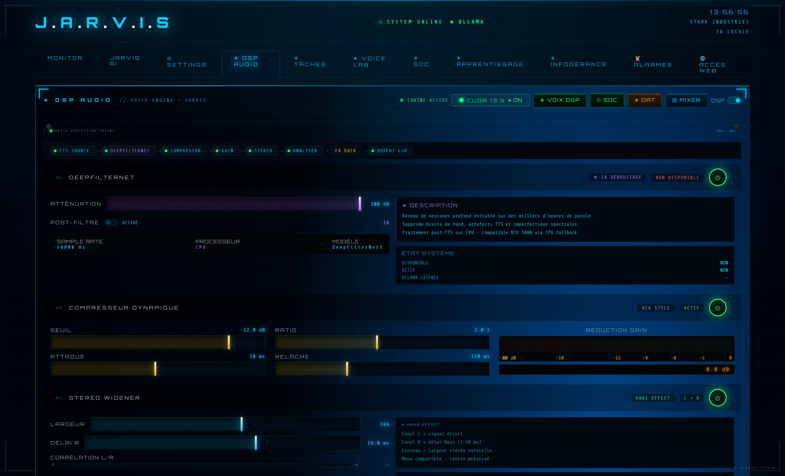

<div align="center">

  <br></br>

  <a href="https://github.com/0xCyberLiTech">
    
  </a>

  <br></br>

  <h2>Assistant IA local · voix · interface holographique · automatisation SOC 24/7</h2>

  <p align="center">
    <a href="https://0xcyberlitech.github.io/">
      
    </a>
    <a href="https://github.com/0xCyberLiTech">
      
    </a>
    <a href="https://github.com/0xCyberLiTech/JARVIS/tags">
      
    </a>
    <a href="https://github.com/0xCyberLiTech/JARVIS/blob/main/CHANGELOG.md">
      
    </a>
    <a href="https://github.com/0xCyberLiTech?tab=repositories">
      
    </a>
    <a href="https://github.com/0xCyberLiTech/JARVIS/graphs/contributors">
      
    </a>
  </p>

</div>

<div align="center">
  
</div>

<div align="center">
  <p>
    <strong>IA 100% locale</strong>  &nbsp;•&nbsp; <strong>Voix naturelle · STT · TTS</strong>  &nbsp;•&nbsp; <strong>Automatisation SOC</strong> 
  </p>
</div>

---
# Audio DSP — Chaîne broadcast

> *Dernière mise à jour : 2026-08-16 (Refactoring modulaire et étanchéité)*

## Objectif
La chaîne audio de JARVIS est inspirée d'un **processeur voix broadcast** (Symetrix 528) :
un *voice channel strip*, une branche d'effets en parallèle, puis un *master bus* qui protège
la sortie.

> ⚠ **Le schéma ci-dessous décrit le rack `Web Audio` du navigateur** — la moitié temps réel de la
> chaîne. La moitié **serveur** (Python/CUDA, appliquée au fichier rendu par le TTS) est décrite
> plus bas et n'a **pas** la même topologie : ne pas lire l'une pour l'autre.

---

## Topologie — le rack Web Audio

```
SOURCE TTS (edge-tts Antoine / Kokoro)
       │
   Analyseur VU · pré-gain
       │
┌─────────────────────────────────────────┐
│  ÉTAGE 1 — VOICE CHANNEL STRIP          │
│  EQ paramétrique (Low · Mid · High · Air)│
│  Compresseur VCA  (seuil · ratio ·      │
│      attaque · relâche : voir ci-dessous)│
│  Makeup gain — restaure le niveau perçu │
│  Limiter voix (brick-wall souple)       │
└──────────────────┬──────────────────────┘
                   │
        ┌──────────┴──────────┐
        ▼                     ▼
   DRY PATH              ÉTAGE 2 — BRANCHE WET
   (cos x-fade)          _fxConvolver (normalize=true)
                         type d'effet sélectionnable
                         Calibration loudness par type
        └──────────┬──────────┘
                   ▼
┌──────────────────────────────────────────┐
│  ÉTAGE 3 — MASTER BUS                    │
│  Sommation dry + wet                     │
│  Limiter final brick-wall                │
└─────────────────┬────────────────────────┘
                  ▼
        audioCtx.destination
```

> ⚠ **Aucun seuil, ratio ni gain n'est recopié dans cette page.** Ces valeurs vivent dans le module
> audio (défauts d'usine côté serveur, réglables en direct depuis le rack) — **une seule source**.
> *(Fait corrigé le 2026-08-11 : cette page publiait un seuil de compresseur, un ratio et un seuil
> de limiter voix qui étaient **périmés** — le code porte encore, en commentaire, les anciennes
> valeurs qu'il a remplacées. C'est exactement ce que produit une constante recopiée : elle ne dérive
> pas bruyamment, elle vieillit en silence.)*
>
> Il n'y a **plus** de bus *send/return* séparé : la branche wet est **parallèle** au dry, et le
> *send* calibré est appliqué directement sur son gain.

<div align="center">
  
  <br/>
  <sub>Le rack DSP en interface : waveform, EQ, compresseur, analyseur de spectre — chaîne voix de type broadcast, entièrement en Web Audio.</sub>
</div>

---

## Chaîne TTS — cascade automatique

| # | Moteur | Mode | Notes |
|---|--------|------|-------|
| 1 | **edge-tts** fr-CA-AntoineNeural | Défaut | Voix naturelle — nécessite internet |
| 2 | **Kokoro** ff_siwis CUDA | Repli local | 100 % local — GPU NVIDIA, fonctionne hors-ligne |

La cascade est automatique : si Edge échoue (hors ligne), Kokoro neural prend le relais sans interruption.

---

## Cache TTS — restitution instantanée

Les phrases récurrentes (confirmations, menu vocal, réponses figées) sont
mémorisées après leur première synthèse et resservies sans re-génération.

| Aspect | Choix de conception |
|--------|--------------------|
| **Clé** | `sha256(texte + voix + moteur + paramètres DSP)` — un changement de voix/DSP invalide l'entrée, jamais d'audio périmé |
| **Robustesse** | Best-effort intégral : tout échec du cache est avalé → repli sur la génération normale, la voix ne casse jamais |
| **Volume** | LRU borné (éviction des plus anciennes par `mtime`) — disque maîtrisé |
| **Priorité** | Interrogé *après* l'anti-double-lecture → la déduplication reste prioritaire |

> Un hit cache se journalise `total=0.00s` contre ~0,5–3 s de synthèse — gain
> net sur les interactions répétées, sans complexité ajoutée au chemin critique.

---

## STT — Transcription vocale

| Paramètre | Valeur |
|-----------|--------|
| Modèle | faster-whisper `large-v3-turbo` |
| Accélération | CUDA float16 (GPU NVIDIA) |
| Langue | Français |
| VAD filter | True (filtre silence) |
| initial_prompt | Vocabulaire SOC spécialisé |

---

## La moitié SERVEUR de la chaîne — Python / CUDA

Avant d'atteindre le navigateur, l'audio rendu par le TTS traverse une chaîne **côté serveur**,
appliquée au fichier entier :

```
WAV/MP3 rendu par le TTS
   │
   ▼  EQ + gain                (numpy/scipy — Nyquist clampé selon le taux d'échantillonnage)
   ▼  DeepFilterNet 3          (débruitage IA — GPU si CUDA disponible)
   ▼  Enrichisseur harmonique
   ▼  FX rack                  (type sélectionnable)
   ▼  Upmix mono → stéréo      (effet Haas, largeur réglable)
   │
   ▼  WAV stéréo servi au navigateur
```

> ⚠ **Les deux moitiés n'ont pas la même topologie.** Il n'y a **ni compresseur ni limiter** dans
> la chaîne serveur : la dynamique et la protection brick-wall sont **entièrement** l'affaire du
> rack Web Audio. Les réglages de compression exposés côté serveur **pilotent le compresseur du
> navigateur** — ils ne traitent pas le fichier serveur.
> *(Précision ajoutée le 2026-08-11 : cette page ne décrivait que le rack navigateur, tout en
> laissant croire qu'elle décrivait « la » chaîne. Un lecteur pouvait en déduire un traitement
> serveur qui n'existe pas.)*

---

## Calibration loudness FX

La convolution avec taps discrets (echo, delay) crée une perception loudness plus élevée
qu'une réverb diffuse à RMS égal. Un trim par type d'effet compense — **extrait**, la table
de calibration réelle vit dans le module et n'est pas recopiée ici :

| Effet | Send gain | dB |
|-------|-----------|-----|
| reverb | 1.00 | 0 dB — référence |
| echo | 0.35 | -9 dB — taps stéréo forts |
| delay | 0.45 | -7 dB — taps mono forts |

> Les types d'effets **non listés** dans cette table tombent sur le repli neutre (cf. « Règles de
> conception » ci-dessous).

---

## Crossfade equal-power (dry/wet)

Évite le creux de -3 dB d'un crossfade linéaire :

```
wet_gain = sin(wet × π/2)
dry_gain = cos(wet × π/2)
→ puissance totale constante quelle que soit la valeur du wet
```

---

## DSP avancé

| Bloc | Rôle |
|------|------|
| **DeepFilterNet 3** | Débruitage IA **actif par défaut** — bypass possible depuis le rack. Chargement paresseux au premier usage ; s'exécute **sur le GPU dès que CUDA est disponible**, sinon repli CPU (le choix du device vient de la bibliothèque, il n'est pas imposé par JARVIS) |
| **Haas stéréo** | Élargissement image (canal R retardé — délai réglable, défaut déclaré côté serveur) |
| **Analyseur FFT** | Plusieurs modes d'affichage (miroir, oscilloscope, piano, split) + goniomètre de phase |

> ⚠ **FAIT CORRIGÉ le 2026-08-11.** Cette page annonçait DeepFilterNet « **désactivé par défaut —
> activer manuellement** ». C'est l'inverse : le défaut d'usine, comme l'état courant, est **activé**.

---

## Règles de conception du rack

| # | Règle | Raison |
|---|-------|--------|
| 1 | Ne jamais reconnecter analyser → analyserL/R | Boucle de rétroaction — sifflement |
| 2 | Tout FX **devrait** avoir son entrée de calibration loudness | Sinon loudness incohérente d'un effet à l'autre |
| 3 | Ne jamais connecter directement à `audioCtx.destination` | Bypass du brick-wall |

> ⚠ **FAIT CORRIGÉ le 2026-08-11 — la règle 2 était énoncée comme un invariant (« règle absolue »),
> alors que rien ne la fait respecter.** Les effets sans entrée de calibration tombent sur un
> **repli neutre** (gain 1.00) : le rendu reste correct, mais la loudness n'est pas compensée pour
> eux. C'est une **convention de conception**, pas une propriété prouvée — et une page publique n'a
> pas le droit d'appeler « absolue » une règle que le produit n'applique pas.

---

**Précédent ←** [03 — Architecture](03-ARCHITECTURE.md) &nbsp;&nbsp; **Suivant →** [06 — MCP Server](06-MCP-SERVER.md)

---

<div align="center">

<table>
<tr>
<td align="center"><b>🖥️ Infrastructure &amp; Sécurité</b></td>
<td align="center"><b>💻 Développement &amp; Web</b></td>
<td align="center"><b>🤖 Intelligence Artificielle</b></td>
</tr>
<tr>
<td align="center">
  <a href="https://www.kernel.org/"></a>
  <a href="https://www.debian.org"></a>
  <a href="https://www.gnu.org/software/bash/"></a>
  <br/>
  <a href="https://nginx.org"></a>
  <a href="https://git-scm.com"></a>
</td>
<td align="center">
  <a href="https://www.python.org"></a>
  <a href="https://flask.palletsprojects.com"></a>
  <a href="https://developer.mozilla.org/docs/Web/HTML"></a>
  <br/>
  <a href="https://developer.mozilla.org/docs/Web/CSS"></a>
  <a href="https://developer.mozilla.org/docs/Web/JavaScript"></a>
  <a href="https://code.visualstudio.com"></a>
</td>
<td align="center">
  <a href="https://ollama.com"></a>
  <br/><br/>
  <a href="https://anthropic.com"></a>
</td>
</tr>
</table>

<br/>

<sub>🔒 Projets proposés par <a href="https://github.com/0xCyberLiTech">0xCyberLiTech</a> · Développés en collaboration avec <a href="https://claude.ai">Claude AI</a> (Anthropic) 🔒</sub>

</div>
