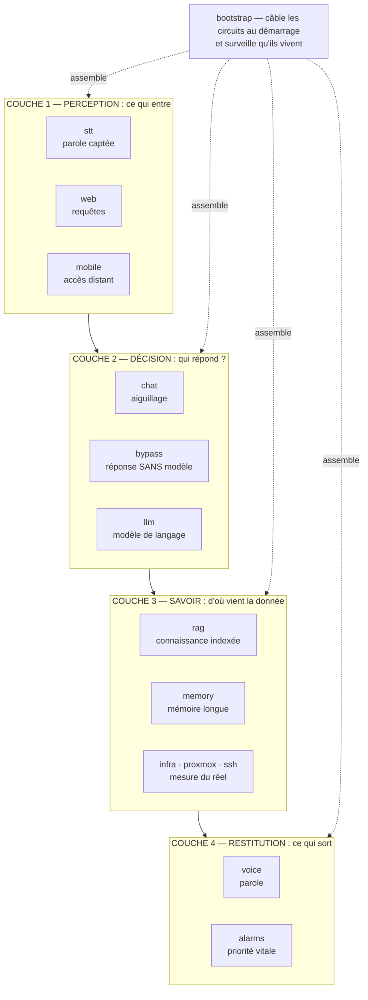
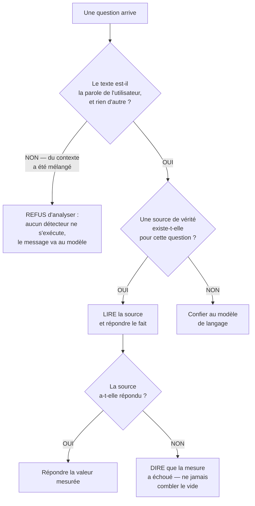
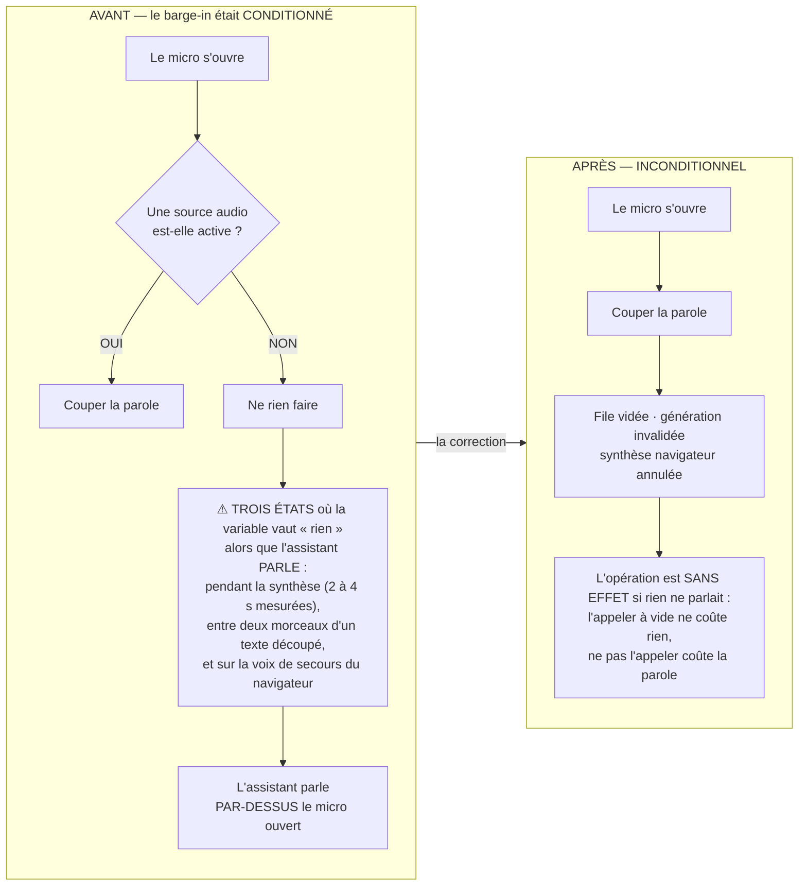
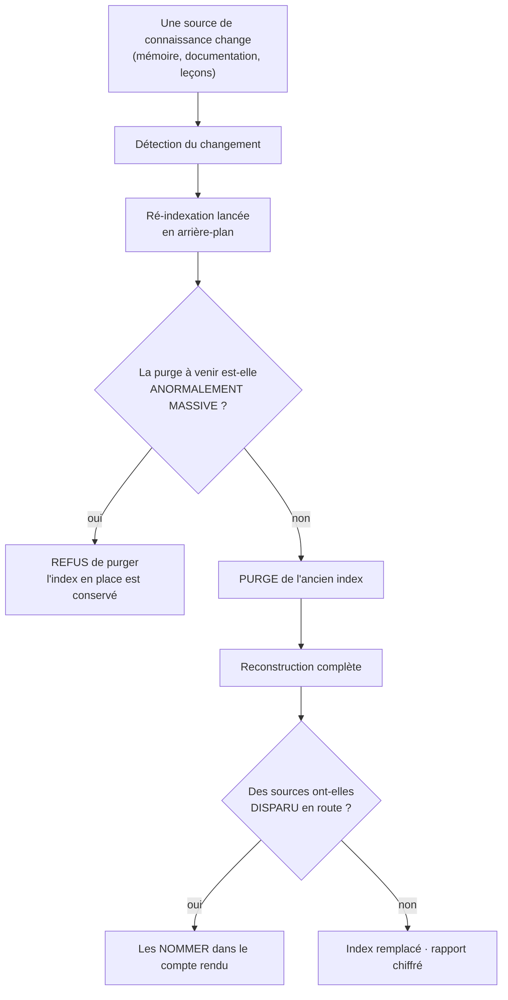
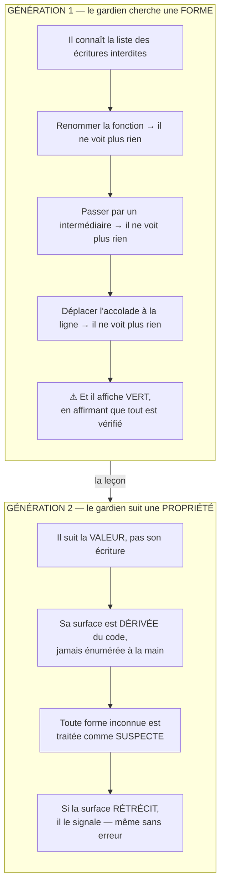
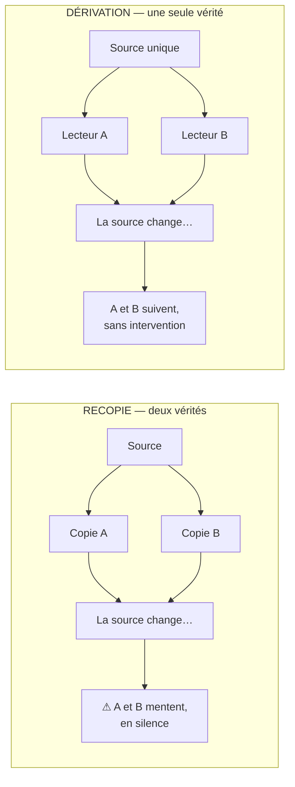
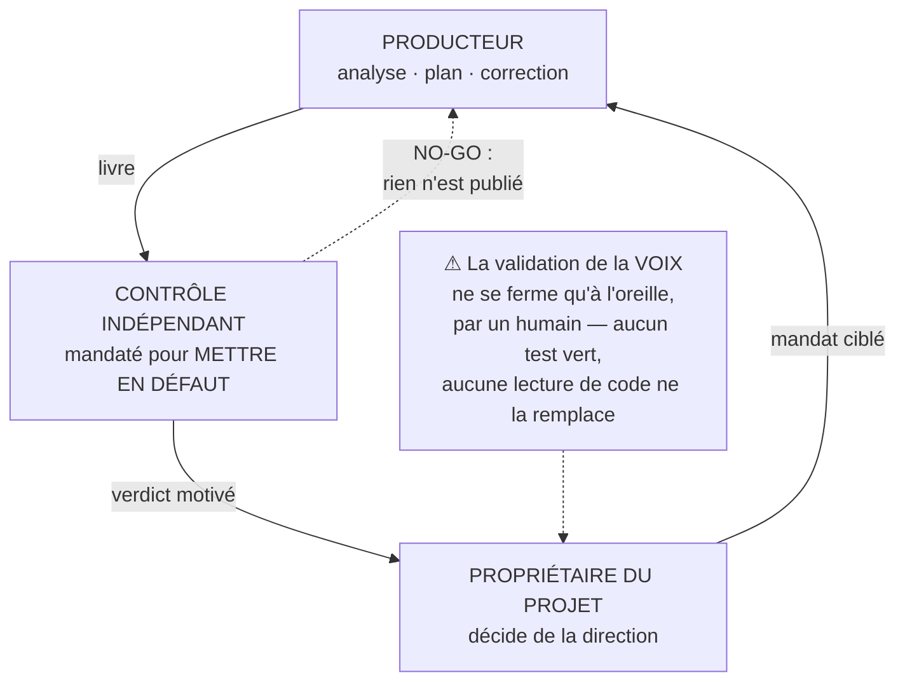

<div align="center">

  <br></br>

  <a href="https://github.com/0xCyberLiTech">
    
  </a>

  <br></br>

  <h2>Assistant IA local · voix · interface holographique · automatisation SOC 24/7</h2>

  <p align="center">
    <a href="https://0xcyberlitech.github.io/">
      
    </a>
    <a href="https://github.com/0xCyberLiTech">
      
    </a>
    <a href="https://github.com/0xCyberLiTech/JARVIS/tags">
      
    </a>
    <a href="https://github.com/0xCyberLiTech/JARVIS/blob/main/CHANGELOG.md">
      
    </a>
    <a href="https://github.com/0xCyberLiTech?tab=repositories">
      
    </a>
    <a href="https://github.com/0xCyberLiTech/JARVIS/graphs/contributors">
      
    </a>
  </p>

</div>

<div align="center">
  
</div>

<div align="center">
  <p>
    <strong>IA 100% locale</strong>  &nbsp;•&nbsp; <strong>Voix naturelle · STT · TTS</strong>  &nbsp;•&nbsp; <strong>Automatisation SOC</strong> 
  </p>
</div>

---
# Anatomie de JARVIS — un système qui prouve, plutôt qu'un système qui marche

> *Dernière mise à jour : 2026-08-19 (première publication — cartographie des circuits, déterminisme, chaîne vocale, garde-fous)*

Un assistant qui « fonctionne » et un assistant qui « prouve qu'il fonctionne » se ressemblent
tant que tout va bien. **Ils divergent le jour de la panne.**

Le premier se tait quand il échoue — ou pire, il répond quand même, de façon plausible. Le
second refuse, et dit pourquoi. Toute l'architecture décrite dans cette page découle de ce seul
choix.

> ⚠ **Comment lire les nombres de cette page.** Aucun inventaire (nombre de circuits, de
> fichiers, de lignes) n'est écrit ici : il **dériverait** au premier commit. À la place, chaque
> section donne **la commande qui le mesure**. Les seuls nombres écrits en toutes lettres sont
> des **relevés DATÉS** d'un incident passé — ils ne prétendent décrire aucun état courant.

---

## 1. L'incident fondateur — pourquoi « refuser » vaut mieux que « répondre »

Le **18/08/2026**, de **06h46 à 19h02** — soit **12 h 16 min** —, l'assistant a annoncé **à voix
haute**, chaque fois qu'on l'interrogeait, qu'il possédait *« N outils de développement locaux
et zéro outil MCP »*.

C'était **faux**. Le chargeur du catalogue rendait une liste vide **en silence**, et rien, dans
la phrase produite, ne distinguait *« il n'y a rien »* de *« je n'ai pas pu lire »*.

Le correctif ne remplit pas le vide : il **interdit la phrase**. Le chargeur lève désormais une
exception porteuse d'une cause **calculée**, et la réponse — écran **et** voix — dit la panne au
lieu de l'inventaire :

```text
⚠ Je ne peux pas lire mon catalogue d'outils au complet. <cause mesurée>.
Je refuse de te répondre « aucun outil » : ce serait faux. À réparer.
```

Un détail de ce même incident vaut pour toute la conception : la branche **écran** avait été
corrigée pour dire la cause réelle, tandis que la branche **voix** récitait encore une cause
**écrite en dur** — et fausse. **Dans ce système, l'interface vocale est primaire : le seul
canal resté faux était donc le seul qui comptait.**

> ### 📏 Loi 1 — sur l'absence de réponse
> **Une liste vide n'est pas une réponse.** Elle doit dire si elle est vide parce qu'il n'y a
> rien, ou parce que la lecture a échoué.

---

## 2. Cartographie — les circuits et les couches

Le code n'est pas organisé par technologie mais par **responsabilité**. Chaque circuit est une
frontière : le circuit vocal ignore tout de la sécurité, le circuit documentaire ignore tout de
la voix.

L'intérêt n'apparaît qu'en cas de panne. Quand la voix a déraillé, la cause tenait dans **un**
circuit — pas dans un fichier de plusieurs milliers de lignes.



**Lecture :** le flux descend de la perception vers la parole. Le `bootstrap` n'est pas *dans*
le flux — il l'**assemble**, en pointillés.

### Le poids réel de chaque circuit — il se demande, il ne se lit pas

Un circuit = un paquet Python du dossier `scripts/`. Ni leur nombre ni leur poids ne sont écrits
ici : voici comment les obtenir sur l'état **du jour**.

```bash
# Combien de circuits ?
find scripts -maxdepth 2 -name '__init__.py' | wc -l

# Le poids de chacun, du plus lourd au plus léger
for d in scripts/*/; do
  [ -f "$d/__init__.py" ] || continue
  printf '%-26s %3s fichiers %7s lignes\n' "${d%/}" \
    "$(find "$d" -maxdepth 1 -name '*.py' | wc -l)" \
    "$(find "$d" -maxdepth 1 -name '*.py' -exec cat {} + | wc -l)"
done | sort -k4 -rn
```

L'**ordre** que cette commande produit, lui, est stable — et il est significatif. C'est la carte
des priorités réelles du projet :

| Rang | Circuit | Ce qu'il porte |
|------|---------|----------------|
| 1 | `bypass` | Répondre **sans** le modèle, avec la donnée réelle |
| 2 | `voice` | Synthèse, écoute, priorité de parole, débruitage |
| 3 | `chat` | Aiguiller : qui doit répondre à ceci ? |
| 4 | `bootstrap` | Câbler au démarrage, surveiller ensuite |
| 5 | `rag` | Indexer et retrouver la connaissance |
| … | `memory`, `mobile`, `infra`, `dr`, `security_whitelists_sub`, `alarms`, `vision`, … | Le reste de la carte — énuméré par la commande ci-dessus, jamais recopié ici |

> Que le circuit **le plus lourd du projet** soit celui qui **court-circuite le modèle** n'est
> pas un accident de croissance : c'est le choix d'architecture central, développé à la section
> suivante.

---

## 3. Déterminisme — le droit de ne pas savoir

Un modèle de langage produit **toujours** une réponse. C'est sa nature, et c'est le danger :
interrogé sur l'état d'une machine, il formulera quelque chose de crédible plutôt que d'admettre
qu'il l'ignore.

D'où le circuit le plus volumineux du système : un ensemble de modules dont le **seul** rôle est
de **court-circuiter le modèle**. L'état des serveurs, les sauvegardes, la météo, le rapport du
matin — tout cela est **lu**, jamais **généré**.



**Le point critique est la première question.** Un contexte injecté qui voyage dans le **même
champ** que la parole devient indiscernable d'elle — et traverse **tous** les détecteurs placés
en amont, y compris ceux qui **écrivent** ou **exécutent**.

### Ce que cette barrière a coûté avant d'exister

> **Relevé daté — 2026-08-11, 14 h 18.** Un outil d'analyse concaténait, dans un **seul** champ
> de message, le contexte de sécurité **live** (**19 462 caractères**) et la question posée.
>
> Le bloc entier partait donc aux détecteurs déterministes. L'un d'eux a mordu sur une tournure
> venue **des données** — pas de la question — et a **écrit une fausse alerte sur le canal
> vocal**, puis rendu sa réponse à la place de l'analyse demandée.
>
> La question, elle, n'a **jamais** atteint le modèle : une garde de ressource l'avait tronquée
> **avec** le contexte (**20 044 → 16 000 caractères**), et c'est la question qui a disparu.

Le correctif n'est **pas** un découpage. Deviner la frontière entre « contexte » et « question »
serait une **denylist**, et une denylist ne peut pas tenir : le contexte contenait lui-même des
lignes vides, donc le découpage laissait encore des milliers de caractères de données dans le
texte réputé « utilisateur ».

La règle appliquée est une **allowlist fail-closed** : seul un message qui n'a **pas déclaré**
porter autre chose que la parole de l'utilisateur gagne le droit d'atteindre les détecteurs. Un
message qui déclare son mélange ne peut plus **commander** — il va au modèle, sa destination
légitime.

> ⚠ **Portée exacte, écrite noir sur blanc.** Cette garde à l'exécution est **déclarative** :
> elle ne relit pas le texte, elle s'appuie sur la déclaration du client. Elle est doublée d'un
> contrôle statique au *pre-push* qui **suit la valeur** chez les clients internes — mais **un
> client externe n'est pas couvert**. Un garde-fou dont on tait les limites promet plus qu'il ne
> tient *(portée détaillée : [02 — Intégration SOC](02-SOC-INTEGRATION.md))*.

> ### 📏 Loi 2 — sur la frontière des entrées
> **Si un détecteur peut mordre sur du texte que l'utilisateur n'a pas tapé, sa surface d'entrée
> n'est plus l'utilisateur.**

---

## 4. Chaîne vocale — le seul canal où l'erreur ne se rattrape pas

Le circuit `voice` porte la synthèse, l'écoute, l'arbitrage de priorité et le débruitage. Sa
densité tient à une asymétrie simple : **un texte erroné se relit, une phrase prononcée est
partie.**

Dans ce système, **la voix est l'interface primaire, pas un confort d'usage** : c'est une
propriété de conception, pas une préférence. Elle a deux conséquences directes, qui se lisent
partout dans le code :

- **une régression vocale est critique par construction** — elle n'est pas « cosmétique », elle
  supprime le canal de sortie ;
- **un échec silencieux est interdit** : ce qui échoue doit s'**entendre**, jamais se deviner.

### Le plancher de parole

Toutes les phrases n'ont pas le même rang. Une alerte de priorité vitale — rappel programmé,
arrêt d'urgence — doit pouvoir **interrompre** une réponse en cours, jamais l'inverse. Un
mécanisme d'arbitrage tranche, et un garde-fou dédié vérifie qu'il n'a pas été contourné.

### Le barge-in — reprendre la parole

Quand l'utilisateur ouvre le micro, l'assistant doit se taire. **Immédiatement, et sans
condition.** C'est ici que se cachait le défaut le plus tenace de la chaîne.



**La leçon générale :** une variable qui indique « il parle » n'était vraie que sur un
**sous-ensemble** des instants où il parlait vraiment. Une condition n'est fiable que si elle
couvre **tous** les états, pas les plus visibles.

Le correctif est verrouillé : un garde-fou dérive la surface à protéger (**toute** fonction qui
démarre une capture micro) et rend **NO-GO** si l'appel de coupure est remis sous condition.
Détail de la chaîne audio : **[04 — Audio DSP](04-AUDIO-DSP.md)**.

---

## 5. Connaissance — le RAG qui se tient à jour tout seul

Le circuit `rag` est séparé **par rôle** : un module écrit l'index, un autre le lit, un autre le
conserve, un autre l'injecte dans le contexte, un dernier orchestre. Cette séparation permet de
répondre à *« qui a corrompu l'index ? »* — question sans réponse dans un module unique.

L'évolution majeure est l'autonomie : la ré-indexation ne se **demande** plus, elle se
**déclenche**.



**Remplacer plutôt qu'empiler.** Un index qui s'**ajoute** conserve des fragments de fichiers
supprimés — et l'assistant répond alors sur du contenu qui n'existe plus. La purge préalable
rend cette dérive impossible.

**Mais une purge est destructive**, donc elle est elle-même gardée : une disparition de masse
non attestée est **refusée**, pas exécutée. Le rapport de fin est chiffré — purgés, ajoutés,
total, disparus, refusés — et **l'égalité des trois premiers est la preuve** que rien n'a été
perdu. Ce rapport se relit à la demande ; il n'est pas recopié dans cette page.

---

## 6. La pile Hermès — les organes qui surveillent le projet lui-même

Ces organes ne rendent **aucun service à l'utilisateur**. Ils veillent sur la **cohérence du
projet** : que la mémoire ne dérive pas, que la documentation publique ne contienne aucune
donnée réelle, que ce qui est publié corresponde à ce qui est écrit.

La liste vivante s'obtient en listant le dossier `scripts/hermes/` — elle n'est pas comptée ici :

| Organe | Ce qu'il refuse de laisser passer |
|---|---|
| `memory-audit` | Une fiche de mémoire hors index — invisible à la recherche |
| `memory-real-drift` | Une mémoire qui contredit le réel mesuré |
| `knowledge-audit` | Une base de connaissance trouée ou incohérente |
| `chat-context-guard` | Du contexte injecté qui voyage avec la parole de l'utilisateur |
| `public-doc-guard` | Une adresse réelle ou un chemin nominatif dans un document publié |
| `published-head-guard` | Un dépôt public qui montre autre chose que ce qui est écrit |
| `commit-guard` | Un enregistrement qui contourne les vérifications |
| `e2e-silence-guard` | Une interface qui échoue **sans rien dire** |
| `e2e-viewport-guard` | Un affichage qui déborde de l'écran |
| `visual-gate` | Une régression visuelle non vue |
| `fixed-float-guard` | Un élément flottant qui recouvre une commande |
| `doc-drift-lint` | Un terme périmé dans la documentation |

### Ce qui a changé dans la nature même des garde-fous

Les premiers cherchaient une **forme** : un nom de fonction, un mot précis. C'est insuffisant, et
la démonstration a été brutale.



> **Relevé daté — 2026-08-18, septième passe de contrôle.** Écrire l'accolade ouvrante **sur sa
> propre ligne** (style Allman) suffisait à rendre un bloc invisible au gardien : le mot-clé
> restait sur la ligne précédente, l'analyseur cherchait son ouvreur à partir du retour à la
> ligne, et trouvait la chaîne vide — qu'il interprétait comme « bloc inconditionnel ».
>
> **Mesuré au portail réel, sur un corpus construit AVANT le correctif : onze des douze formes
> rendaient `exit 0` — GO.** La douzième mordait déjà, mais par un autre chemin : le trou, lui,
> était entier.
>
> **La borne juste était déjà écrite — dans un commentaire, pas dans le code.** Un chemin
> l'appliquait, l'autre non. *Un commentaire oriente ; il ne prouve rien — y compris quand il dit
> vrai.*

Le défaut n'a pas été trouvé par relecture. Il a été trouvé parce qu'un corpus d'attaque a fait
varier la **mise en page**, là où le corpus précédent ne faisait varier que le **vocabulaire**.

> ### 📏 Loi 3 — sur la valeur d'un feu vert
> **Un gardien qu'on n'a jamais essayé de casser ne garde rien.** Un feu vert obtenu sans épreuve
> est une opinion, pas une preuve.

---

## 7. Source unique — une valeur, un seul endroit

Chaque constante — adresse, port, seuil, nom de modèle — vit à **un seul endroit** et se lit
depuis là. Ce n'est pas une préférence de style : **une valeur recopiée devient fausse dès que
l'originale change**, et personne ne s'en aperçoit.



La règle vaut aussi — surtout — pour la **prose**. Un garde-fou dédié interdit qu'un décompte
d'inventaire soit écrit en toutes lettres dans un document de référence, et il traite de la même
façon un commentaire Python et une page publiée : la prose de la documentation est **relue par
l'assistant lui-même** pour répondre aux questions, et un inventaire périmé y devient une
hallucination avec l'accent de l'autorité.

> Il a mordu **trois fois dans la même journée**, dont deux fois sur des phrases écrites une
> heure plus tôt par celui-là même qui l'avait posé — **et une quatrième sur le brouillon de
> cette page**, qui citait un décompte en exemple. C'est la raison d'être de la mise en garde
> placée en tête : **cette page ne contient aucun inventaire, par construction.**

> ### 📏 Loi 4 — sur les nombres dans la prose
> **Un inventaire écrit dans une phrase est faux le lendemain.** Un compte se **demande** au
> système ; il ne se recopie pas.

---

## 8. Gouvernance — personne ne valide son propre travail

La règle la plus structurante de ce projet n'est pas technique. Trois rôles participent au
développement, et **aucun ne juge sa propre production**.



Le contrôle n'est **pas** une relecture : il est mandaté pour **chercher la faille**. Les
questions auxquelles il doit répondre — chacune manquante valant NO-GO — sont toujours les
mêmes :

1. Le NO-GO est-il **fermé**, ou seulement **déplacé** d'un cran ?
2. La preuve par **injection de faute** existe-t-elle, avec des **codes de sortie réels** ?
3. Le gardien a-t-il été **cassé**, pour prouver qu'il n'est pas **aveugle** ?
4. Un **invariant** a-t-il été affaibli — seuil abaissé, test neutralisé, exclusion ajoutée — pour
   obtenir un vert ?
5. Ce que le producteur **dit** correspond-il à ce qui est **sur le disque** ? *(et : qu'est-ce
   qui a bougé **à côté** du périmètre ?)*

> **Ce que ce dispositif a produit en une seule journée :** le producteur a trouvé une erreur du
> contrôle ; le contrôle a trouvé un défaut **nié dans un commentaire** du producteur ; et chacun
> des deux a relevé des fautes de l'orchestrateur. **Aucun n'aurait trouvé cela seul.**
>
> Sur un même lot de garde-fous : cycle 1 **NO-GO** — dont un gardien vert et aveugle ; cycle 2
> **NO-GO** — dont un invariant affaibli **et nié** ; cycle 3, le corpus d'attaque est écrit
> **avant** le correctif. **Chaque réparation en ouvrait une autre** — jusqu'à ce que le mandat
> impose de construire la preuve **avant** d'écrire la solution.

---

## 9. Continuité — un projet qu'on ne peut pas perdre

Toute cette architecture ne vaut rien si le projet disparaît avec un disque. La sauvegarde ne
copie pas seulement des fichiers : elle conserve **l'historique git complet en archives
vérifiées**, les installeurs nécessaires à une réinstallation **sans connexion**, les modèles, et
les voix de secours.

Deux principes s'y appliquent, et ils sont plus importants que l'outil :

- **La vérification est rejouée, pas lue dans un journal.** Une archive n'est réputée bonne que
  parce que sa vérification vient d'être **exécutée** — « la sauvegarde s'est bien passée hier »
  n'est pas une preuve, c'est un souvenir.
- **L'outil refuse de supposer** qu'une branche est sauvegardée **parce qu'un dépôt distant
  existe**. Il vérifie qu'elle y a **réellement** été envoyée — et si ce n'est pas le cas, il
  l'archive quand même, **et il le dit**.

Le second point est le plus coûteux à admettre : une garantie de sauvegarde qui repose sur une
**hypothèse** est exactement le genre de garantie qui tombe le jour où on en a besoin.

---

## 10. Ce qu'il faut retenir — quatre lois, un même principe

| # | La loi | Ce qu'elle interdit |
|---|--------|---------------------|
| 1 | **Une absence doit se déclarer** | Confondre « vide par nature » et « vide par échec » |
| 2 | **Un détecteur ne juge que ce que l'utilisateur a tapé** | Qu'un contexte injecté déclenche une action |
| 3 | **Un feu vert non éprouvé est une opinion** | Valider un garde-fou sans avoir essayé de le casser |
| 4 | **Un nombre écrit dans une phrase est déjà périmé** | Recopier un inventaire au lieu de le demander |

Le fil commun : **préférer un refus honnête à une réponse plausible.** C'est plus lent à
construire, plus exigeant à maintenir — et c'est la seule façon qu'un assistant ne mente pas à
quelqu'un dont la voix est le seul canal de vérification.

---

**Précédent ←** [06 — MCP Server](06-MCP-SERVER.md) &nbsp;&nbsp; **Retour →** [README](../README.md)

---

<div align="center">

<table>
<tr>
<td align="center"><b>🖥️ Infrastructure &amp; Sécurité</b></td>
<td align="center"><b>💻 Développement &amp; Web</b></td>
<td align="center"><b>🤖 Intelligence Artificielle</b></td>
</tr>
<tr>
<td align="center">
  <a href="https://www.kernel.org/"></a>
  <a href="https://www.debian.org"></a>
  <a href="https://www.gnu.org/software/bash/"></a>
  <br/>
  <a href="https://nginx.org"></a>
  <a href="https://git-scm.com"></a>
</td>
<td align="center">
  <a href="https://www.python.org"></a>
  <a href="https://flask.palletsprojects.com"></a>
  <a href="https://developer.mozilla.org/docs/Web/HTML"></a>
  <br/>
  <a href="https://developer.mozilla.org/docs/Web/CSS"></a>
  <a href="https://developer.mozilla.org/docs/Web/JavaScript"></a>
  <a href="https://code.visualstudio.com"></a>
</td>
<td align="center">
  <a href="https://ollama.com"></a>
  <br/><br/>
  <a href="https://anthropic.com"></a>
</td>
</tr>
</table>

<br/>

<sub>🔒 Projets proposés par <a href="https://github.com/0xCyberLiTech">0xCyberLiTech</a> · Développés en collaboration avec <a href="https://claude.ai">Claude AI</a> (Anthropic) 🔒</sub>

</div>
