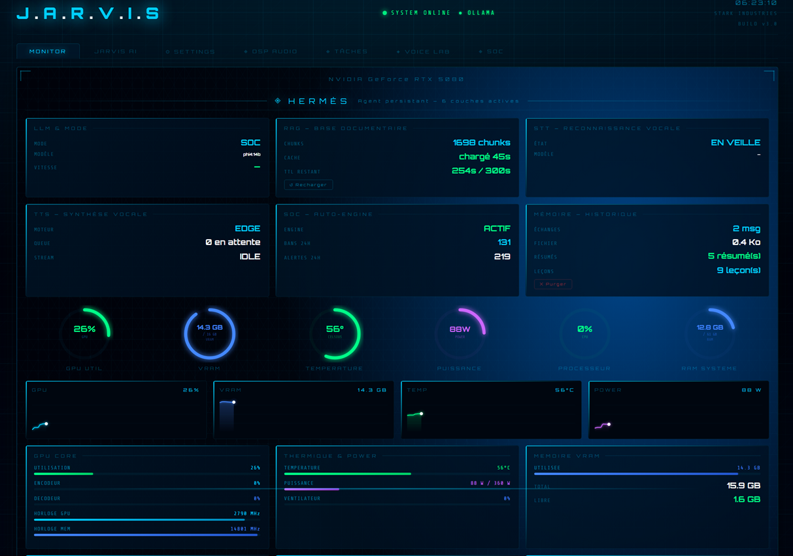

# JARVIS — Agent IA Personnel v3.3

> Pas un chatbot. Un **agent persistant** qui tourne en local, surveille l'infrastructure, mémorise les leçons et parle chaque matin.

> **Créateur** : Marc Sabater (0xcyberlitech) · **Version** : v3.3 · **GPU** : RTX 5080 · **LLM** : Ollama local

---

## ◈ HERMÈS — Agent persistant



Hermès est la couche d'**agentification persistante** de JARVIS — bâtie en **5 briques** sans rupture d'architecture :

| Brique | Ce qu'elle fait |
|--------|----------------|
| **1 — Synoptique** | 6 couches moteur visibles en temps réel : LLM actif, chunks RAG, STT/TTS, auto-engine SOC, mémoire. Tableau de bord vivant de ce que pense JARVIS. |
| **2 — Tuile Mémoire** | État de la mémoire vectorielle : échanges, résumés, leçons apprises. Rechargement RAG et purge depuis l'interface. |
| **3 — Commandes vocales** | Bypass LLM pour les commandes système : *"recharge le RAG"*, *"vide la mémoire"*. Exécution instantanée, déterministe. |
| **4 — Boucle d'apprentissage** | *"Souviens-toi que X"* — la leçon est persistée, indexée dans le RAG, et remonte dans les réponses futures. |
| **5 — Briefing matinal** | *"Bonjour JARVIS"* → briefing vocal complet : niveau menace SOC, état des machines, alertes 24h. Automatisable à heure fixe. |

**Avant Hermès** — JARVIS répondait aux questions. Chaque session commençait à zéro.

**Après Hermès** — JARVIS accumule les leçons, les indexe et les réinjecte automatiquement. Il connaît les règles d'infra, les conventions de code, les préférences — sans re-briefing.

---

## 🚀 Lancement rapide

```bat
start_dashboard.bat
```

Démarre venv + Ollama + ouvre `http://localhost:5000`.

Arrêt : `stop_jarvis.bat` ou raccourci bureau `JARVIS - Arrêt.lnk`.

---

## 🧠 Stack résumée

| Couche | Technologie |
|---|---|
| Backend | Python 3.11 + Flask (port 5000) — **24 tuiles autoportantes** + `blueprints/soc.py` |
| LLM local | Ollama — 5 modèles : phi4:14b (SOC) · gemma4 (GENERAL+vision) · qwen2.5-coder:14b (CODE) · qwen3:8b (CR) · mxbai-embed-large (RAG) |
| TTS chain | edge-tts → Kokoro CUDA → Piper → SAPI5 (fallback auto) |
| STT | faster-whisper `large-v3-turbo` CUDA |
| Frontend | Vanilla JS · 21 modules · Web Audio API · xterm.js · Monaco Editor |
| MCP | 12 outils exposés à Claude Desktop (port 5010) |
| Tests | pytest **1294 pass** · ruff 0 · eslint 0 · coverage **76 %** |

Détails complets : [`DOCUMENTATION/02-ARCHITECTURE/`](DOCUMENTATION/02-ARCHITECTURE/).

---

## 📚 Documentation

> **Toute la documentation projet vit dans [`DOCUMENTATION/`](DOCUMENTATION/00-INDEX.md)** — base documentaire structurée (25 docs, 8 catégories numérotées, frontmatter YAML).

| Pour | Aller à |
|---|---|
| **Vue d'ensemble projet** | [01-PRESENTATION/01-01-VISION-PROJET.md](DOCUMENTATION/01-PRESENTATION/01-01-VISION-PROJET.md) |
| **Architecture technique** | [02-ARCHITECTURE/](DOCUMENTATION/02-ARCHITECTURE/) (7 docs) |
| **Installation / déploiement** | [04-DEPLOIEMENT/04-01-DEPLOIEMENT.md](DOCUMENTATION/04-DEPLOIEMENT/04-01-DEPLOIEMENT.md) |
| **Procédures opérationnelles** | [05-EXPLOITATION/05-01-RUNBOOK.md](DOCUMENTATION/05-EXPLOITATION/05-01-RUNBOOK.md) |
| **État technique actuel** | [06-BILAN-ET-HISTORIQUE/06-01-BILAN-TECHNIQUE.md](DOCUMENTATION/06-BILAN-ET-HISTORIQUE/06-01-BILAN-TECHNIQUE.md) |
| **Index complet** | [`DOCUMENTATION/00-INDEX.md`](DOCUMENTATION/00-INDEX.md) |
| **Briefing IA Claude** | [`CLAUDE.md`](CLAUDE.md) |

---

## 📁 Structure du projet

```
JARVIS/
├── DOCUMENTATION/          ← Base documentaire (25 docs, 8 catégories)
│   ├── 00-INDEX.md
│   ├── 01-PRESENTATION/    ← Vision, présentation, équipe
│   ├── 02-ARCHITECTURE/    ← 7 docs techniques (tuiles, routing, audio, MCP, ...)
│   ├── 03-INTEGRATION-SOC/ ← Circuit SOC ↔ JARVIS
│   ├── 04-DEPLOIEMENT/     ← Installation + recovery
│   ├── 05-EXPLOITATION/    ← Runbook + support + observabilité
│   ├── 06-BILAN-ET-HISTORIQUE/  ← Bilan technique + mémoire + incidents
│   ├── 07-ROADMAP/         ← Évolutions prévues + dette restante
│   └── 08-ANNEXES/         ← Glossaire + conventions code
├── scripts/                ← Code source Python + JS + CSS + templates
│   ├── jarvis.py           ← Ossature Flask (1821 L, register 24 Blueprints)
│   ├── 24 tuiles/          ← Modules autoportants (chat, voice, soc, ...)
│   ├── blueprints/soc.py   ← Blueprint SOC (auto-engine + 24 routes)
│   ├── jarvis_mcp_server.py ← MCP bridge (12 outils Claude Desktop)
│   ├── static/             ← JS (21 modules) + CSS (8 fichiers) + templates HTML (10)
│   ├── jarvis_rag/         ← RAG mxbai-embed-large (599 chunks)
│   ├── *.log               ← jarvis.log + tts.log + tts_perf.log (rotation auto, ~52 MB max)
│   ├── start_dashboard.bat
│   └── stop_jarvis.bat
├── tests/                  ← pytest (1294 tests, 76 % coverage)
├── tools/                  ← profile_tts.py et autres outils dev
├── CLAUDE.md               ← Briefing IA Claude (collaboration développement)
└── README.md               ← Ce fichier
```

---

## 🛡️ Sécurité (règles ABSOLUES)

- **RFC1918 immuable** — 192.168.x / 10.x / 172.16-31.x / 127.x JAMAIS bannies
- **`_BLOCKED_SSH` 29 patterns** — whitelist SSH read-only
- **`_ALLOWED_SOC_RESTART_SVCS`** — source unique, immutable sans validation
- **Injection SOC = 100 % serveur** — JAMAIS dans l'historique chat
- **Auto-engine SOC** — actif UNIQUEMENT en mode `soc`
- **Zéro raw data vers cloud LLM** — JARVIS filtre/agrège en local, escalade rare

Détails : [`DOCUMENTATION/02-ARCHITECTURE/02-05-ROUTING-JARVIS.md`](DOCUMENTATION/02-ARCHITECTURE/02-05-ROUTING-JARVIS.md).

---

## 🔧 Qualité

- **Tests** : pytest 1294 / coverage 76 % (pre-push hook bloquant)
- **Linter Python** : ruff 0 erreur (config `ruff.toml`)
- **Linter JS** : eslint 0 erreur (config `eslint.config.js`)
- **Pre-commit hooks** : ruff + eslint bloquants
- **Pre-push hook** : pytest 1294 tests bloquant
- **Observabilité** : `jarvis.log` persistant 5 MB × 7 + JS-DIAG v2 + try/except enrich + 6 garde-fous idempotence

Score honnête actuel : **95/100** (plafond pratique atteint) — décomposition dans [`DOCUMENTATION/06-BILAN-ET-HISTORIQUE/06-01-BILAN-TECHNIQUE.md`](DOCUMENTATION/06-BILAN-ET-HISTORIQUE/06-01-BILAN-TECHNIQUE.md) §0 (source unique des métriques).

---

## 🤝 Contribuer

Voir [`DOCUMENTATION/08-ANNEXES/08-02-CONVENTIONS-CODE.md`](DOCUMENTATION/08-ANNEXES/08-02-CONVENTIONS-CODE.md) pour les conventions Python/JS/Git.

---

## 📜 License

À définir — candidat MIT pour publication future. Pour l'instant : usage privé Marc Sabater (0xCyberLiTech).
