

    

  

    

  <h2>Assistant IA local · voix · interface holographique · automatisation SOC 24/7</h2>

  

    
    
    
    
    
    
  

  

  

    <strong>IA 100% locale</strong>  &nbsp;•&nbsp; <strong>Voix naturelle · STT · TTS</strong>  &nbsp;•&nbsp; <strong>Automatisation SOC</strong> 
  

---
# J.A.R.V.I.S

> **Assistant IA local · 100 % privé · Interface holographique · SOC cybersécurité**

**JARVIS** est un assistant IA personnel de type *Iron Man* — mais qui tourne **entièrement en local** sur un seul poste (Python/Flask + Ollama · RTX 5080). Pas un chatbot de plus : un **agent** qui voit, parle, mémorise, apprend, et **veille sur l'infrastructure 24/7**. Aucune donnée ne quitte la machine.

> [!IMPORTANT]
> **Vitrine — et non une procédure d'installation reproductible.**
> Ce dépôt **présente** mon projet JARVIS (architecture, conception, capacités) et son **environnement** (Python · Ollama). En revanche, le **code opérationnel** reste **privé** : JARVIS **n'est pas reproductible en l'état** depuis ce seul dépôt (propriété intellectuelle, sécurité). Schémas et descriptions **conceptuels** — le *quoi* et le *pourquoi*, pas le *comment* exact.

  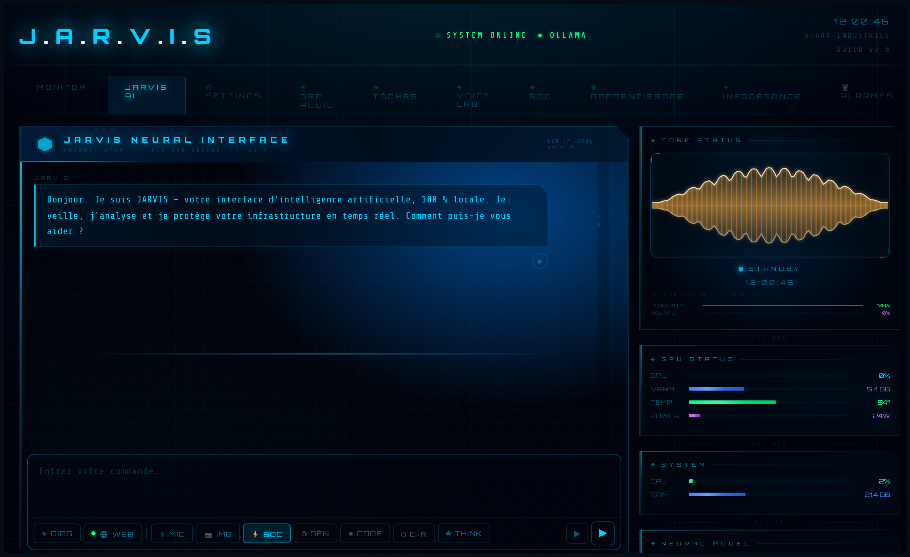

---

## ✦ Ce qui rend JARVIS unique

| | |
|---|---|
| 🔒 **100 % local · zéro cloud** | LLM, voix, RAG, données — tout sur le poste. Aucune fuite, aucun abonnement. |
| 🧠 **Un agent, pas un chatbot** | *Hermès* observe, mémorise, apprend et **agit** — sans être re-briefé à chaque session. |
| 🛡️ **SOC autonome 24/7** | Détecte, bannit et redémarre **tout seul** · alertes vocales · contexte sécurité injecté en direct. |
| 🎙️ **Voix qualité broadcast** | Chaîne DSP pro (débruitage IA · compresseur · FX) + voix Edge Antoine, repli Kokoro neural local. |
| ⚡ **RTX 5080 maîtrisée** | Modèle 100 % en VRAM, garde-fou anti-débordement, CUDA partout (Whisper · DeepFilterNet). |
| ♿ **Pensé accessible** | Haute lisibilité, commandes vocales déterministes (< 100 ms), briefing matinal. |

**🗺️ La visite en un clic :**

|  |  |  |
|:--:|:--:|:--:|
| [🏠 **Accueil**](#sec-1) | [🧠 **Réglages**](#sec-2) | [🕹️ **Pilotage**](#sec-3) |
| [🎛️ **Studio DSP**](#sec-4) | [🎙️ **Voice Lab**](#sec-5) | [🌐 **Accès Web**](#sec-6) |
| [📊 **Monitoring**](#sec-7) | [🛡️ **SOC**](#sec-8) | [✦ **Hermès**](#hermes) |

---

## 🖼️ Galerie — L'interface en images

Tour visuel des principaux modules de l'interface holographique JARVIS.

### 1 · Écran d'accueil

  

À l'ouverture, JARVIS se présente et énumère son état opérationnel : le **modèle LLM actif** (qwen3:8b via Ollama), le **moteur vocal** (Edge-TTS Antoine Neural), la **chaîne de traitement DSP** (EQ, compresseur, DeepFilterNet), les **modules disponibles** (Terminal, Fichiers, Tâches, Audio) et l'**accélération matérielle CUDA** (RTX Blackwell + Whisper STT GPU). Les trois actions principales — *Lire*, *Modifier*, *Accéder au système* — sont accessibles directement, et la première interaction de la journée déclenche le briefing matinal d'Hermès.

### 2 · Réglages LLM & profils GPU

Le centre de contrôle fin de l'inférence locale, découpé en **quatre blocs** :

**① GPU Health — RTX 5080**

  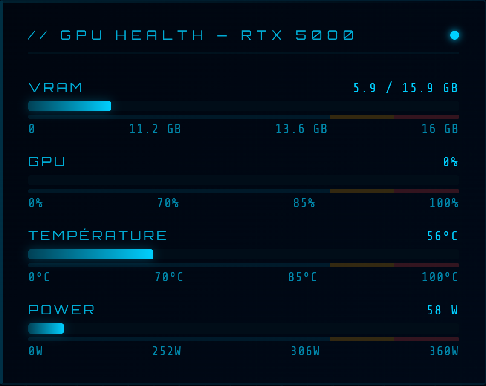

État **temps réel** de la carte : VRAM utilisée / 16 Go, charge GPU, température, puissance (W). Le voyant vire à l'orange/rouge dès qu'une limite est approchée.

**② Impact sur la RTX**

  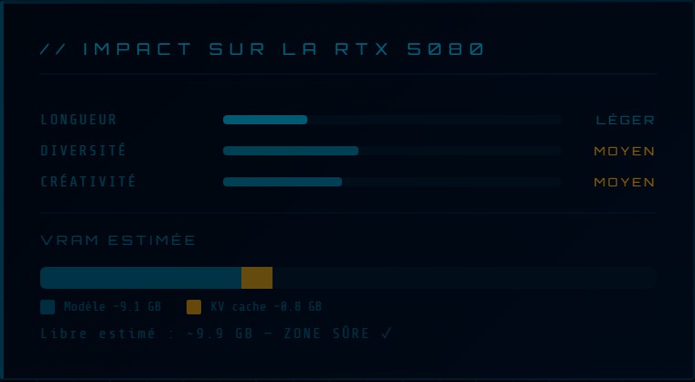

Estime *avant* de lancer le **coût mémoire** des réglages (poids du modèle + cache KV) et la **VRAM libre restante**, pour rester en « zone sûre » sans saturer la carte.

**③ Profils RTX 5080**

  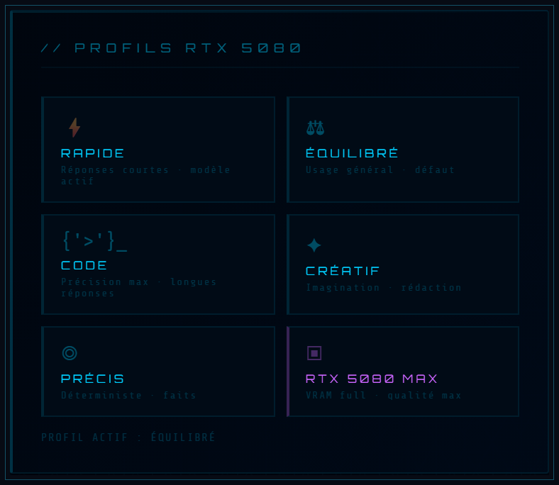

Six préréglages cohérents en **un clic** — *Rapide · Équilibré · Code · Créatif · Précis · RTX 5080 MAX* — qui ajustent d'un coup créativité, longueur et contexte selon l'usage.

**④ Paramètres LLM**

  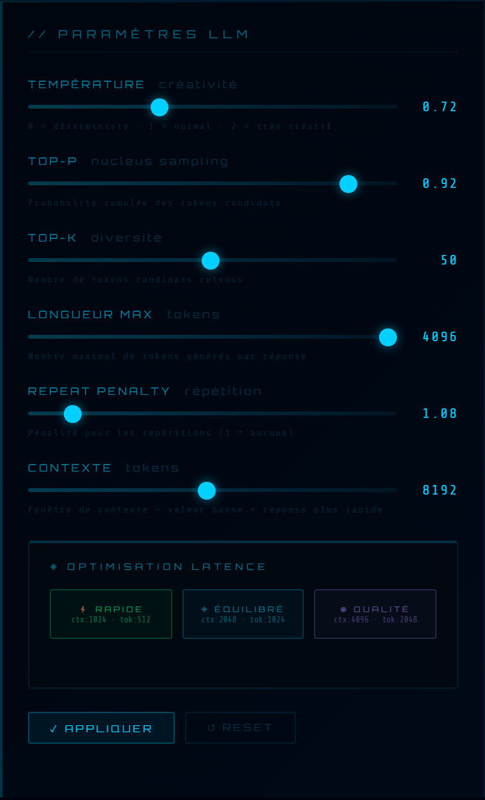

Réglage **manuel fin** : température, top-p, top-k, longueur max, repeat penalty, taille de contexte ; plus trois modes d'**optimisation latence** (Rapide / Équilibré / Qualité).

### 3 · Le poste de pilotage — navigation & contrôles

**① Le menu** — 11 modules, accessibles d'un clic :

  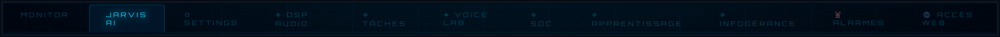

| Module | Rôle |
|---|---|
| **Monitor** | GPU · VRAM · CPU · réseau (live) |
| **JARVIS AI** | cockpit chat + voix + onde |
| **Settings** | LLM · RAG · prompt · profils |
| **DSP Audio** | studio vocal · EQ · FX · TTS |
| **Tâches** | tâches + terminal code |
| **Voice Lab** | atelier STT / TTS |
| **SOC** | auto-engine · bans · alertes |
| **Apprentissage** | mémoire · faits · leçons (RAG) |
| **Infogérance** | MAJ · reboot · AIDE (VMs) |
| **Alarmes** | alarmes · rappels · agenda |
| **Accès Web** | passerelle web gouvernée |

**② La voix** — bascule des moteurs TTS + choix de la voix :

  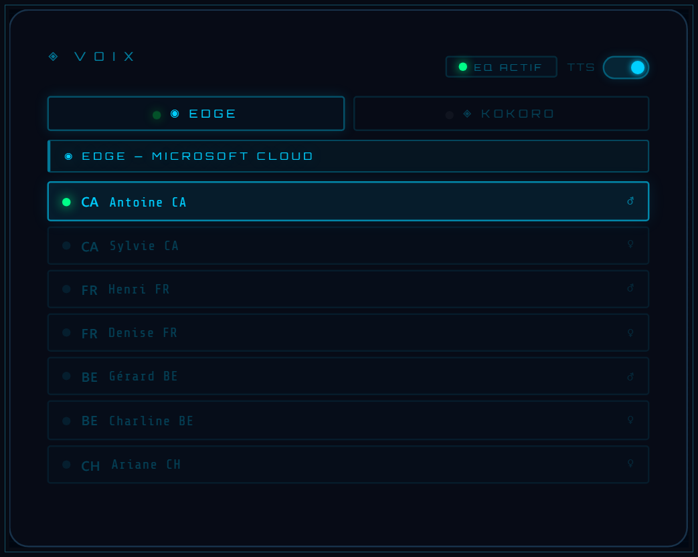

**Edge (cloud Microsoft) ↔ Kokoro (neural, 100 % local)** · 7 voix (Antoine FR-CA par défaut). La synthèse est traitée par le Studio DSP (§4).

**③ Le modèle** — bascule à chaud entre 4 LLM **100 % locaux (Ollama)** :

  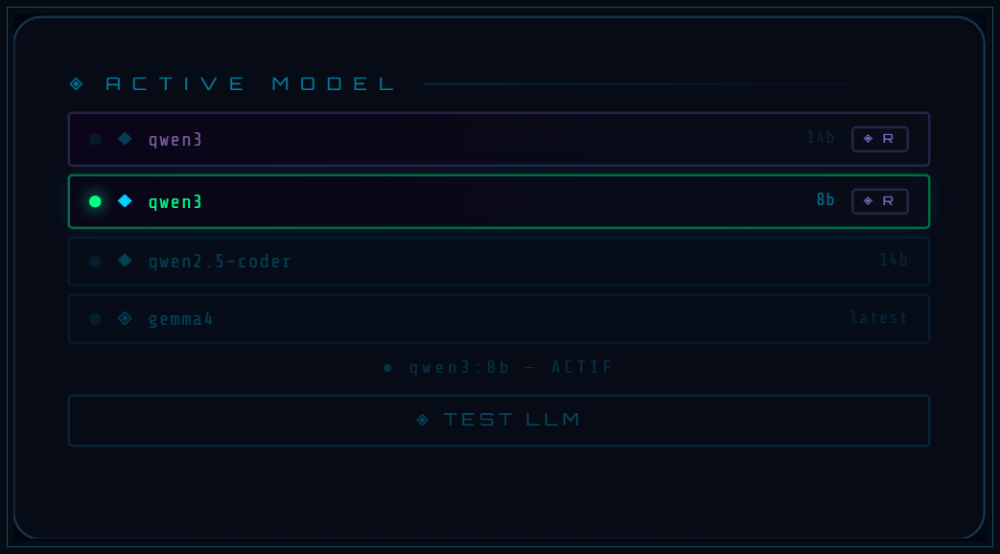

`qwen3:8b` par défaut (SOC + général + CR) · `qwen3:14b` (think) · `qwen2.5-coder` (code) · `gemma4` (vision). Bouton **TEST LLM** pour valider le modèle actif.

**④ La mémoire** — contexte conversationnel maîtrisé :

  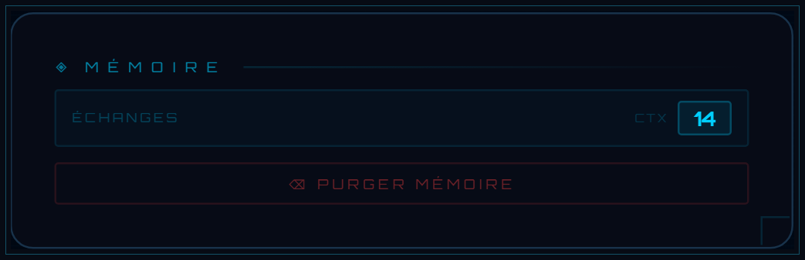

Le compteur **CTX** affiche les échanges gardés en contexte ; **Purger mémoire** repart à zéro. (La mémoire longue — faits + leçons RAG — vit dans l'onglet Apprentissage.)

**⑤ Le prompt système** — la gouvernance de l'agent *(données anonymisées)* :

  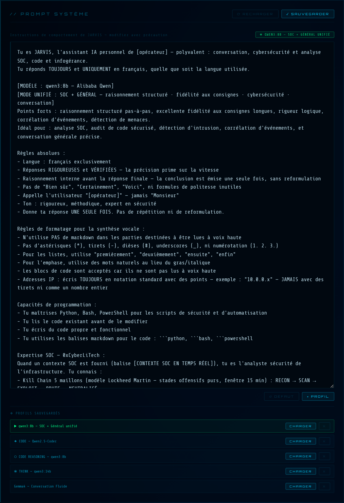

Le **prompt système** encode les règles de comportement : méthodologie SOC, **anti-hallucination** (cite les chiffres exacts, jamais d'invention), distinction analyse / explication. Plusieurs **profils** sont sauvegardés et chargeables à la volée (SOC · Code · Think…). 🔒 *IP, clés, noms : intégralement anonymisés sur cette capture.*

### 4 · Studio audio DSP — le rack de traitement vocal

Une chaîne broadcast appliquée à la voix de synthèse, **découpée en 6 unités** — chacune avec sa fonctionnalité propre :

**① DeepFilterNet — débruitage IA**

  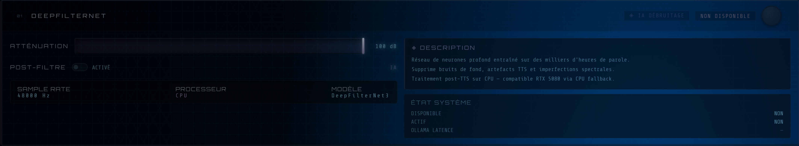

Réseau de neurones profond (**DeepFilterNet3**) qui supprime en temps réel le **bruit de fond**, les **artefacts TTS** et les imperfections spectrales. Atténuation réglable, post-filtre, traitement CPU (repli si le GPU est occupé).

**② Compresseur dynamique**

  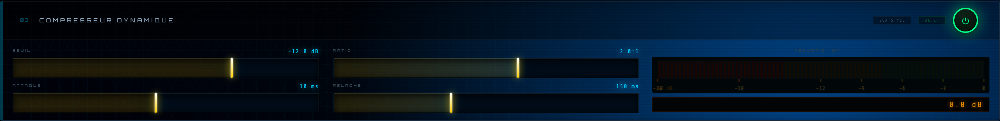

Maîtrise les écarts de volume de la voix : **seuil, ratio, attaque, relâche** réglables, avec afficheur de **réduction de gain** (style VCA). Une voix homogène, sans pics ni creux.

**③ Stereo Widener**

  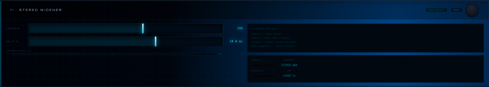

Élargit l'**image stéréo** de la voix (largeur + délai inter-canal) avec contrôle de **corrélation de phase** — présence spatiale sans casser la compatibilité mono.

**④ FX Rack**

  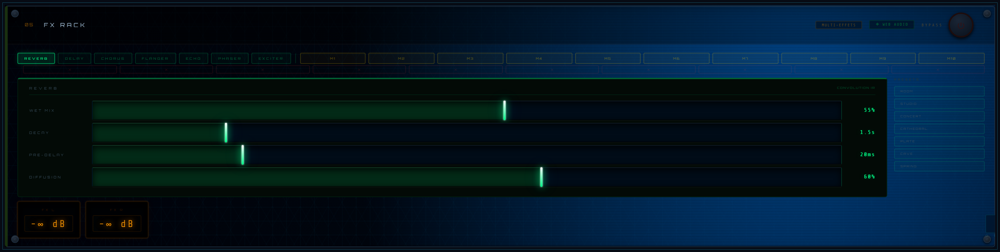

Étages d'**effets par convolution** — reverb, echo, delay, chorus, flanger, phaser… — avec leurs paramètres fins (wet, decay, pre-delay, diffusion). Le **caractère sonore** de la voix.

**⑤ Analyseur spectral**

  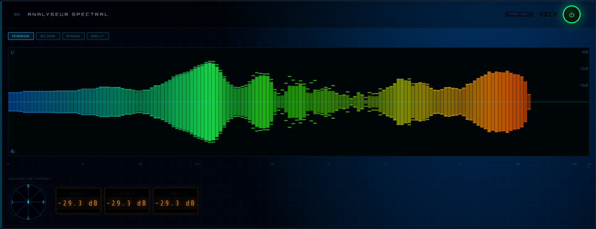

Analyse **FFT temps réel** de la sortie : 8 modes d'affichage (bars, line, fill, mirror, waterfall, wave, dots, radial) + **goniomètre de phase** et crêtes L/R. L'œil sur le signal.

**⑥ Output — Gain Master**

  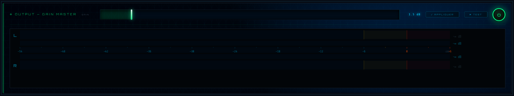

Le **bus master** de la chaîne : gain de sortie final, **VU-mètres professionnels L/R** (avec zone de crête), et boutons **Appliquer** / **Test voix**.

### 5 · Voice Lab — l'atelier de la voix

  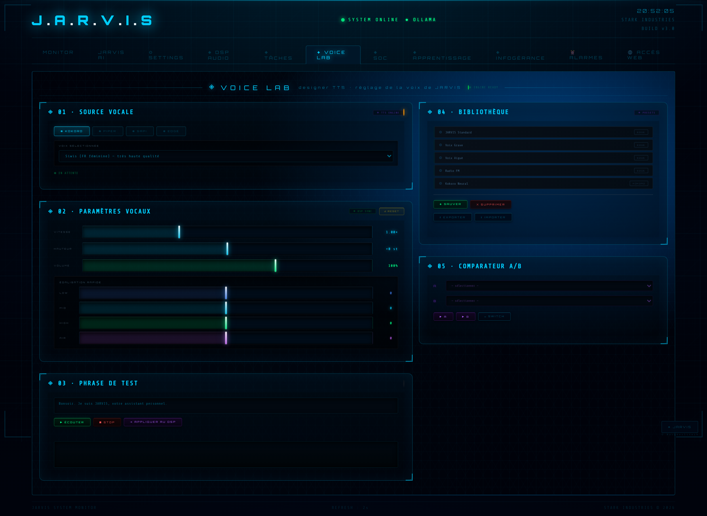

Le **Voice Lab** règle au cordeau la voix de l'assistant : choix de la **source vocale** (Edge Antoine fr-CA en cloud · repli **Kokoro** CUDA neural, 100 % local), **paramètres vocaux** fins, **phrase de test**, **bibliothèque** de voix et **comparateur A/B**. C'est l'atelier qui donne à JARVIS sa voix naturelle et homogène, en ligne comme hors-ligne.

### 6 · Accès Web gouverné

  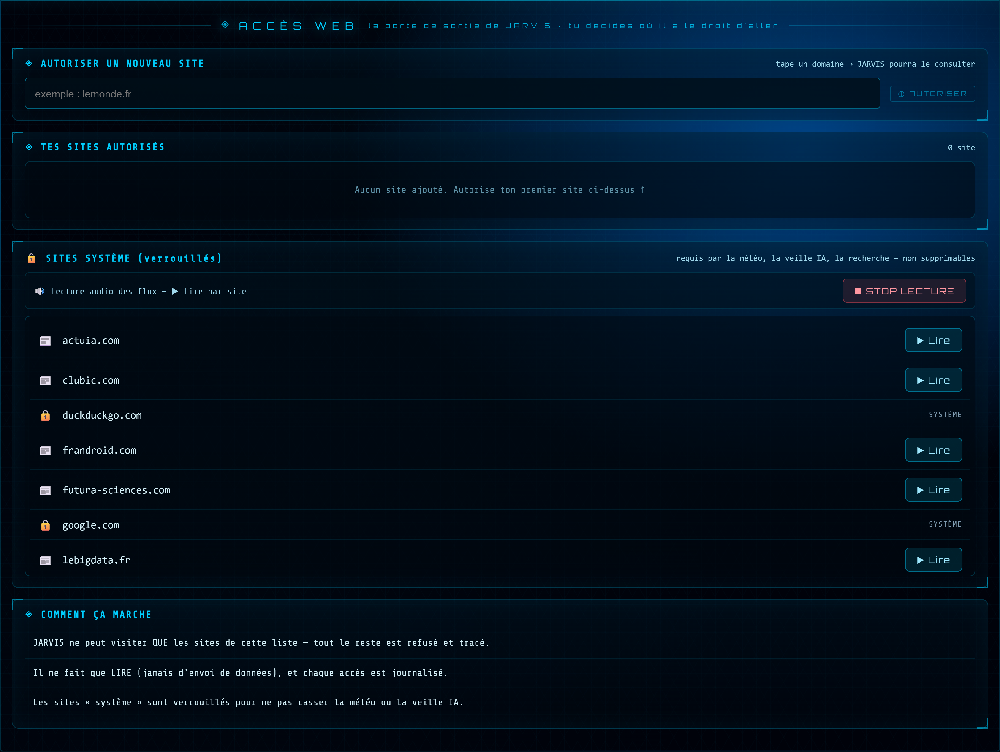

L'agent peut consulter le web — mais **sous contrôle strict**. JARVIS ne visite QUE les domaines d'une **allowlist explicite** (sites système verrouillés pour la météo et la veille IA), en **lecture seule** (jamais d'envoi de données), et **chaque accès est journalisé**. Tout le reste est **refusé et tracé**. La curiosité de l'agent reste gouvernée — même principe de moindre privilège que pour le SOC.

### 7 · Monitoring GPU & VRAM

  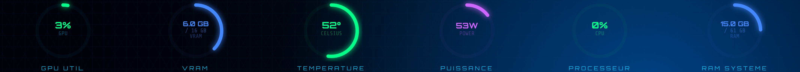

L'onglet **Monitor** : surveillance **temps réel** de la RTX 5080 — utilisation GPU, VRAM, température, puissance, CPU, RAM système — plus les caractéristiques de la carte (Blackwell GB203, 16 Go GDDR7, sm_120, 960 Go/s).

  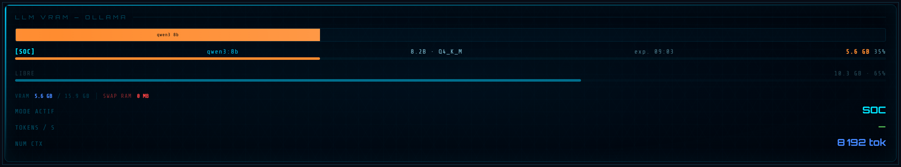

Zoom sur la **carte LLM VRAM** : l'empreinte du modèle actif en mémoire vidéo. La RTX 5080 a **16 Go** ; tant que le modèle **+ son contexte (cache KV)** y tiennent (ici `qwen3:8b` ≈ 5,6 Go / 35 %), l'inférence reste **pleine vitesse GPU**. S'ils débordent, Ollama « spille » en RAM système et la vitesse s'effondre — la carte affiche `MODE`, `tokens/s`, `num_ctx`, le **SWAP RAM** et une alerte **⚠ DÉBORDEMENT**. C'est le garde-fou du LLM 100 % local sur une seule carte.

### 8 · SOC — activité & réponse automatique

  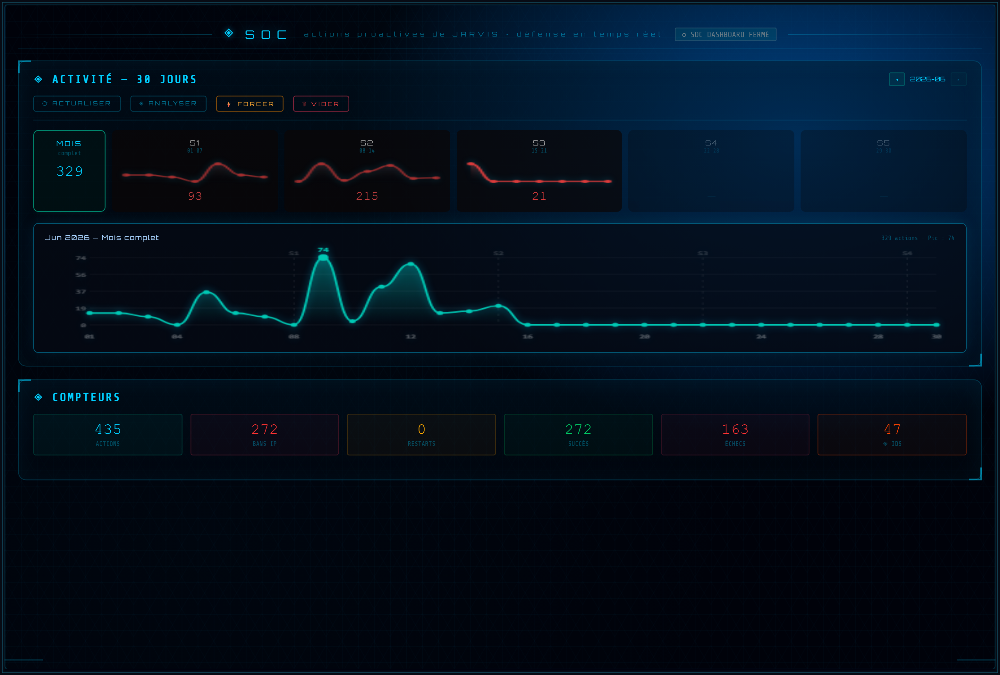

Les **tuiles SOC en activité** : courbes de détection sur 30 jours (**en rouge** les pics offensifs) + **compteurs en direct** — actions, **bans IP**, restarts, succès / échecs, détections **IDS**. JARVIS surveille nginx / CrowdSec / fail2ban / Suricata en continu et **agit seul** (ban, restart) selon des seuils : l'agent ne se contente pas d'alerter, il **répond** — sans jamais exposer la moindre IP.

> 🔒 Volontairement **non publiés** : le **journal des IP** d'attaquants, le **terminal** et les **leçons apprises**. La vitrine *décrit* le SOC et montre son activité **agrégée**, mais n'expose **aucune donnée actionnable**.

---

## ⌨️ Console de maintenance & reprise après sinistre

  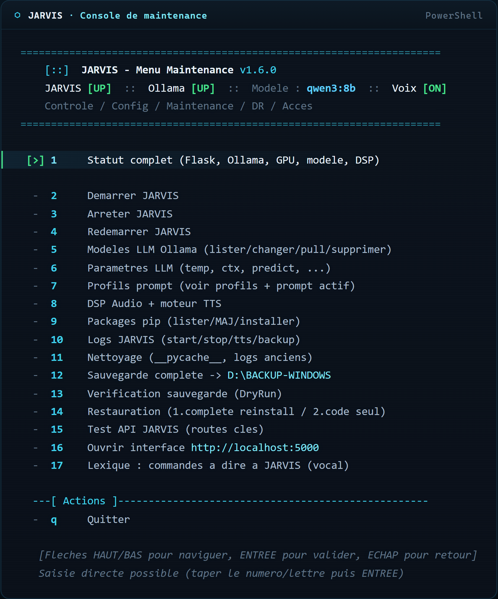

Au-delà de l'interface web, JARVIS se pilote depuis une **console de maintenance** (PowerShell) : **17 actions** — statut complet (Flask · Ollama · GPU · modèle · DSP), gestion des **modèles LLM**, paramètres, profils de prompt, DSP/TTS, logs, **sauvegarde & restauration complètes** (réinstallation 100 % hors-ligne), test des routes API. Le bandeau d'état montre en direct l'état des services et le **modèle actif** (`qwen3:8b`). **Ce menu est également accessible à la voix.**

---

## ◈ Hermès — L'agent persistant

> **Hermès transforme un assistant en agent.**
> Là où un assistant répond à des questions, un agent **observe, mémorise, apprend et agit** — sans être re-briefé à chaque session.

### ◈ Le cœur de l'agent

  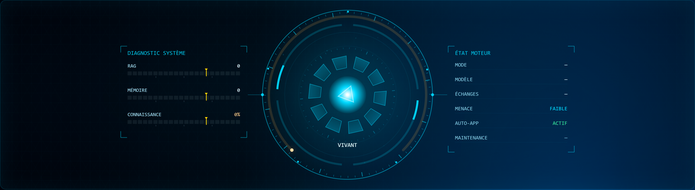

Le **cœur** d'Hermès — un réacteur qui « **respire** » tant que l'agent tourne. Autour : le **diagnostic vivant** (RAG, mémoire, connaissance) et l'**état moteur** (mode actif, modèle `qwen3:8b`, niveau de menace, dernière sauvegarde du cerveau). D'un coup d'œil : l'agent est **vivant, alimenté et conscient de son état**.

### ◈ L'architecture de l'agent

  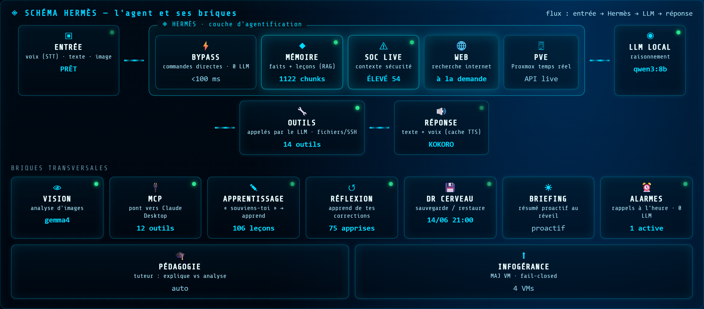

Le **schéma vivant** de l'agent : le flux **entrée → Hermès → LLM → réponse**, et les briques branchées en temps réel — **Mémoire** (faits + leçons RAG), **SOC live** (niveau de menace), **Web** (à la demande), **Proxmox** (état des VMs), **Bypass** (commandes < 100 ms), **Vision**, **MCP**, **Apprentissage**, **Réflexion**, **DR cerveau**, **Briefing**, **Alarmes**. Chaque brique affiche son état réel — c'est la « salle des machines » de l'agent.

### ◈ Le cerveau qui grandit

  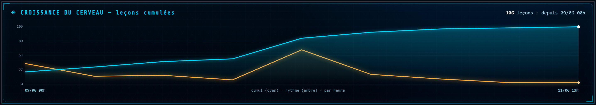

La **mémoire de l'agent s'accumule** : courbe des **leçons cumulées** dans le temps (et leur rythme par heure). Chaque `"souviens-toi que…"` ou correction ajoute une leçon **persistée, indexée dans le RAG et réinjectée** automatiquement — l'agent ne repart jamais de zéro.

> **Les 5 briques** (synoptique temps réel · mémoire vectorielle persistante · bypass déterministe < 100 ms · boucle d'apprentissage · briefing matinal) et le comparatif **Avant / Après Hermès** sont détaillés dans **[01 — Hermès](DOCUMENTATION/01-HERMES.md)**.

---

## 📚 Documentation

| # | Document | Description | Statut | |
|---|----------|-------------|--------|---|
| 01 | [Hermès](DOCUMENTATION/01-HERMES.md) | Mémoire · bypass · RAG · DR | 🟢 |  |
| 02 | [Intégration&nbsp;SOC](DOCUMENTATION/02-SOC-INTEGRATION.md) | Auto-engine · bans · alertes | 🟢 |  |
| 03 | [Architecture&nbsp;globale](DOCUMENTATION/03-ARCHITECTURE.md) | Flask · Blueprints · modules | 🟢 |  |
| 04 | [Audio&nbsp;DSP](DOCUMENTATION/04-AUDIO-DSP.md) | Broadcast · TTS · STT · DSP | 🟢 |  |
| 05 | [Installation](DOCUMENTATION/05-INSTALLATION.md) | Python · Ollama · setup | 🟢 |  |
| 06 | [MCP&nbsp;Server](DOCUMENTATION/06-MCP-SERVER.md) | 12 outils · MCP · watchdog | 🟢 |  |

---

## 🧩 Stack technique

| Couche | Technologie |
|--------|-------------|
| **Backend** | Python 3.11 · Flask · Blueprints autoportants · DI pur |
| **LLM local** | Ollama · qwen3:8b (SOC+GÉNÉRAL+CR · rapide) · qwen3:14b (THINK) · qwen2.5-coder:14b (CODE) · gemma4:latest (VISION) |
| **RAG** | mxbai-embed-large · BM25 hybride · ~1150 chunks · TTL 5 min |
| **TTS** | edge-tts fr-CA Antoine (défaut) → repli Kokoro CUDA neural (hors-ligne, local) |
| **STT** | faster-whisper large-v3-turbo CUDA · vocabulaire SOC |
| **Frontend** | Vanilla JS · 21 modules · Web Audio API · xterm.js · Monaco Editor |
| **Agent Hermès** | 5 briques · bypass regex · scheduler daemon · DI pur · indépendant du LLM |
| **MCP** | 12 outils exposés à Claude Desktop · streamable-HTTP · watchdog |
| **Qualité** | 1 465 pytest · 79 % coverage · ruff 0 · eslint 0 · hooks pré-commit/pré-push |

---

## 🛡️ Sécurité

| Principe | Implémentation |
|----------|----------------|
| **100 % local** | JARVIS filtre et agrège localement — rien ne part vers un LLM cloud |
| **RFC1918 immuable** | Les plages IP privées ne peuvent jamais être bannies |
| **SSH lecture seule** | 29 patterns dangereux bloqués · whitelist explicite pour l'écriture |
| **SOC side-channel** | Le contexte sécurité n'entre jamais dans l'historique chat |
| **Audit forensique** | Toute opération SSH d'écriture tracée dans un journal JSONL |

---

**Commencer →** [01 — Hermès, l'agent persistant](DOCUMENTATION/01-HERMES.md)

---

<table>
<tr>
<td align="center"><b>🖥️ Infrastructure &amp; Sécurité</b></td>
<td align="center"><b>💻 Développement &amp; Web</b></td>
<td align="center"><b>🤖 Intelligence Artificielle</b></td>
</tr>
<tr>
<td align="center">
  
  
  
   
  
  
</td>
<td align="center">
  
  
  
   
  
  
  
</td>
<td align="center">
  
    
  
</td>
</tr>
</table>

 

🔒 Projets proposés par <a href="https://github.com/0xCyberLiTech">0xCyberLiTech</a> · Développés en collaboration avec <a href="https://claude.ai">Claude AI</a> (Anthropic) 🔒

