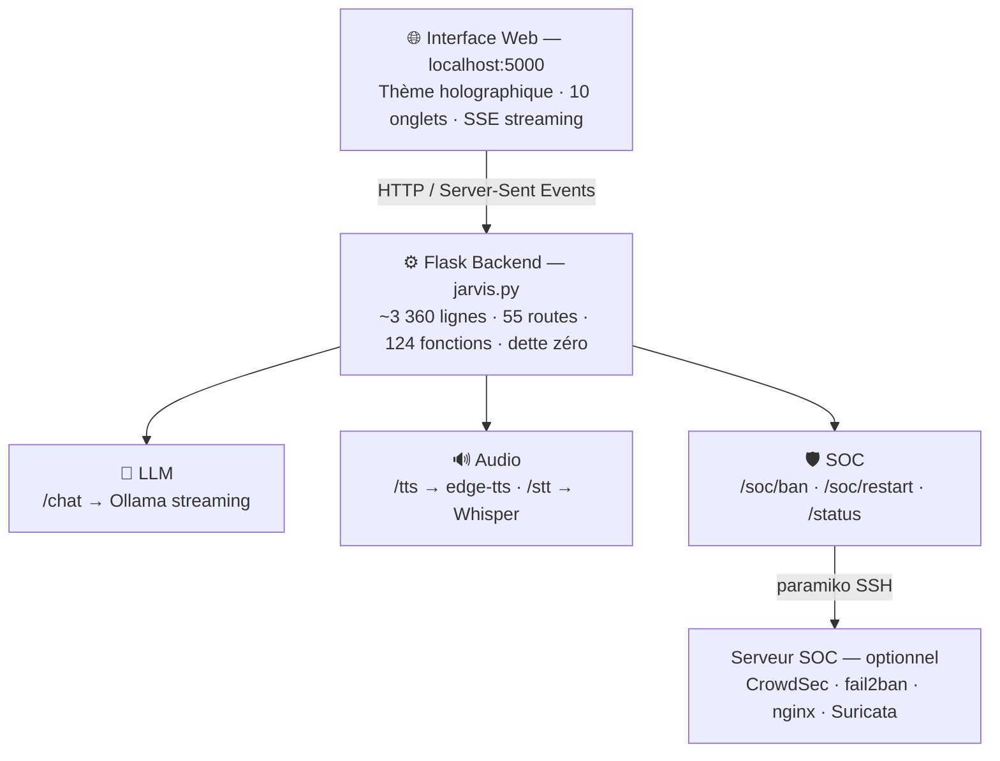

<div align="center">

  <br></br>

  <a href="https://github.com/0xCyberLiTech">
    
  </a>

  <br></br>

  <h2>Assistant IA local · voix · interface holographique · automatisation SOC 24/7</h2>

  <p align="center">
    <a href="https://0xcyberlitech.github.io/">
      
    </a>
    <a href="https://github.com/0xCyberLiTech">
      
    </a>
    <a href="https://github.com/0xCyberLiTech/JARVIS/releases/latest">
      
    </a>
    <a href="https://github.com/0xCyberLiTech/JARVIS/blob/main/CHANGELOG.md">
      
    </a>
    <a href="https://github.com/0xCyberLiTech?tab=repositories">
      
    </a>
    <a href="https://github.com/0xCyberLiTech/JARVIS/graphs/contributors">
      
    </a>
  </p>

</div>

<div align="center">
  
</div>

<div align="center">
  <p>
    <strong>IA 100% locale</strong>  &nbsp;•&nbsp; <strong>Voix naturelle · STT · TTS</strong>  &nbsp;•&nbsp; <strong>Automatisation SOC</strong> 
  </p>
</div>

---

<h2 align="center">Philosophie du projet</h2>

<div align="center">
<table>
<tr>
<td align="center" width="33%">

**🤖 100% local, zéro cloud**

Un assistant IA personnel qui tourne sur ta machine, sous ton contrôle, sans envoyer une seule donnée à l'extérieur. Ollama, Whisper, edge-tts : tout s'exécute localement sur GPU NVIDIA RTX 5080.

</td>
<td align="center" width="33%">

**🛡️ Intelligence défensive intégrée**

JARVIS n'est pas un chatbot. Il surveille l'infrastructure SOC en temps réel, bannit automatiquement les IPs malveillantes, redémarre les services critiques et alerte vocalement sur les menaces.

</td>
<td align="center" width="33%">

**🎯 Production, pas démo**

17 400+ lignes, 10 onglets, pipeline audio complet, audit 10/10. Mis à jour hebdomadairement sur infrastructure réelle exposée à internet 24h/24.

</td>
</tr>
</table>
</div>

---

<h2 align="center">Écran de démarrage</h2>

<div align="center">
  
  <br/><sub>Initialisation du système — statuts des modules, message de bienvenue</sub>
</div>

---

<h2 align="center">Conversation & Monitoring système</h2>

<div align="center">
<table border="0" cellspacing="0" cellpadding="8">
  <tr>
    <td width="60%">
      
      <p align="center"><sub>Onglet <b>JARVIS IA</b> — conversation en temps réel, streaming SSE, sidebar système</sub></p>
    </td>
    <td width="40%">
      
      <p align="center"><sub>Onglet <b>MONITOR</b> — CPU, RAM, GPU, disques, sparklines 24h</sub></p>
    </td>
  </tr>
</table>
</div>

---

<h2 align="center">Paramètres LLM & Gestion des modèles</h2>

<div align="center">
<table border="0" cellspacing="0" cellpadding="8">
  <tr>
    <td width="35%">
      
      <p align="center"><sub>Onglet <b>SETTINGS</b> — GPU RTX Health, profils CUDA, sliders LLM</sub></p>
    </td>
    <td width="65%">
      
      <p align="center"><sub>Onglet <b>JARVIS IA</b> — profils prédéfinis (SOC, Code, Conversation, Raisonnement...)</sub></p>
    </td>
  </tr>
</table>
</div>

---

<h2 align="center">Pipeline audio — DSP & Voice Lab</h2>

<div align="center">
<table border="0" cellspacing="0" cellpadding="8">
  <tr>
    <td width="40%">
      
      <p align="center"><sub>Onglet <b>DSP AUDIO</b> — égaliseur multi-bandes, compresseur, filtres, visualisation temps réel</sub></p>
    </td>
    <td width="60%">
      
      <p align="center"><sub>Onglet <b>VOICE LAB</b> — source vocale, paramètres fins, bibliothèque de voix, comparateur A/B</sub></p>
    </td>
  </tr>
</table>
</div>

---

<h2 align="center">Intégration SOC — Actions proactives</h2>

<div align="center">
  
  <br/><sub>Onglet <b>SOC</b> — compteurs de bans/alertes, graphique d'activité 24h, journal horodaté des actions proactives</sub>
</div>

---

<h2 align="center">Construction par phases</h2>

| # | Phase | Ce qui a été construit | Pourquoi ce choix |
|---|-------|----------------------|-------------------|
| 1 | **Backend Flask + streaming** | jarvis.py · 55 routes · SSE token par token · API Ollama | Base unifiée avant tout — toutes les fonctionnalités s'appuient sur ce serveur |
| 2 | **Pipeline audio** | TTS edge-tts Neural · STT Whisper turbo CUDA · DeepFilterNet NR | L'interaction vocale est le cœur de l'expérience JARVIS — sans ça, c'est juste une web app |
| 3 | **Interface holographique** | 10 onglets · glassmorphism · 17 400+ lignes · zéro framework | Chaque fonctionnalité mérite sa propre surface — pas de compromis sur l'ergonomie |
| 4 | **Intégration SOC** | ban-ip · restart-service · alertes vocales · journal horodaté | JARVIS doit pouvoir agir, pas seulement informer — SSH + CrowdSec + fail2ban |
| 5 | **Auto-engine défensif** | _soc_monitor_loop() · kill chain · exploit gap · ban auto 60s | Le SOC se défend seul même quand l'interface est fermée — JARVIS amplifie quand disponible |
| 6 | **DSP Audio avancé** | EQ 5 bandes · compresseur · analyseur spectral · TASCAM DAT | Qualité audio professionnelle — la voix de JARVIS doit être claire et agréable |
| 7 | **Audit 10/10** | 90 passes NDT · 144 corrections · 0 dette technique · AST validé | Un système en production doit être maintenu comme tel — aucun raccourci |

---

<h2 align="center">Points forts</h2>

| | Capacité | Détail |
|--|----------|--------|
| 🤖 | **Conversation LLM locale** | Ollama streaming token par token · 6 modèles · changement à chaud · profils liés par modèle |
| 🔊 | **Pipeline audio complet** | TTS Neural · STT Whisper CUDA · DeepFilterNet NR · EQ DSP · VU-mètres temps réel |
| 🛡️ | **Auto-engine SOC** | Surveillance 60s · kill chain · exploit gap · ban auto via CrowdSec SSH · restart services |
| 🎙️ | **Alertes vocales** | TTS automatique sur ÉLEVÉ/CRITIQUE · seuils configurables · cooldowns anti-spam |
| 🎯 | **Interface holographique** | 10 onglets · glassmorphism · 17 400+ lignes · zéro framework CSS/JS |
| 📊 | **Monitoring temps réel** | CPU · RAM · GPU RTX 5080 · disques · réseau · sparklines 24h |
| 🔒 | **Sécurité loopback** | Bind 127.0.0.1 · validation IP stricte · whitelist services · zéro credential dans le code |
| ✅ | **Audit 10/10** | Zéro dette technique · 90 passes · 144 NDT corrigés · AST validé |

---

<h2 align="center">Stack technique</h2>

```
OS          Windows 11 Pro
GPU         NVIDIA RTX 5080 — 16 GB GDDR7 · CUDA 12
LLM         Ollama (local) — phi4-reasoning:plus · deepseek-r1:14b · phi4:14b · qwen2.5:14b
TTS         edge-tts Neural — fr-CA-AntoineNeural
STT         faster-whisper turbo FR — CUDA float16
NR          DeepFilterNet — réduction bruit micro temps réel
DSP         numpy/scipy — EQ biquad 5 bandes · compresseur · analyseur spectral
Backend     Python 3.11 — Flask · SSE streaming · ~3 360 lignes · 55 routes · dette zéro
Frontend    Vanilla JS + HTML5 — 17 400+ lignes · 10 onglets · zéro dépendance NPM
SSH         paramiko — actions SOC à distance (ban · restart · monitoring)
Intégration SOC — CrowdSec · fail2ban · nginx · Suricata
```

---

<h2 align="center">Architecture</h2>



---

<h2 align="center">Par où commencer ?</h2>

| Objectif | Point d'entrée |
|----------|---------------|
| 📖 **Comprendre l'architecture** et le pipeline LLM + audio | [01-PREREQUIS.md](./docs/01-PREREQUIS.md) → [05-INTEGRATION-SOC.md](./docs/05-INTEGRATION-SOC.md) |
| ⚙️ **Installer les dépendances** Python + Ollama + CUDA | [Installation rapide](#installation-rapide) ci-dessous |
| 🔊 **Configurer le pipeline audio** TTS · STT · DeepFilterNet | [03-PIPELINE-AUDIO.md](./docs/03-PIPELINE-AUDIO.md) |
| 🛡️ **Connecter JARVIS au SOC** pour les actions proactives | [05-INTEGRATION-SOC.md](./docs/05-INTEGRATION-SOC.md) |

> **Ce dépôt met à disposition :**
> Code source complet · 5 documents techniques · guide d'installation · configurations exemples
>
> 🔒 Les scripts opérationnels SOC, les clés SSH et les configurations d'infrastructure restent privés — connaissance construite, pas redistribuée.

---

<h2 align="center">Installation rapide</h2>

```bash
# 1. Cloner le dépôt
git clone https://github.com/0xCyberLiTech/JARVIS.git
cd JARVIS

# 2. Installer les dépendances Python
pip install -r scripts/requirements.txt

# 3. Installer Ollama + un modèle
#    → https://ollama.com
ollama pull phi4

# 4. Configurer (copier les templates)
cp config/jarvis_model.json.example      scripts/jarvis_model.json
cp config/jarvis_llm_params.json.example scripts/jarvis_llm_params.json

# 5. Lancer JARVIS
cd scripts && python jarvis.py
```

```
✔  JARVIS disponible sur  →  http://localhost:5000
```

---

<h2 align="center">Documentation</h2>

| # | Document | Description |
|---|----------|-------------|
| 01 | [PREREQUIS.md](./docs/01-PREREQUIS.md) | Python 3.11, Ollama, CUDA, dépendances système |
| 02 | [LLM-OLLAMA.md](./docs/02-LLM-OLLAMA.md) | LLM local, API Ollama, streaming SSE, gestion modèles |
| 03 | [PIPELINE-AUDIO.md](./docs/03-PIPELINE-AUDIO.md) | TTS edge-tts, file d'attente, STT Whisper VAD, DeepFilterNet NR |
| 04 | [BACKEND-FLASK.md](./docs/04-BACKEND-FLASK.md) | Serveur Flask, routes, Server-Sent Events, modèles à chaud |
| 05 | [INTEGRATION-SOC.md](./docs/05-INTEGRATION-SOC.md) | Intégration SOC, ban/unban IP via SSH, alertes proactives auto |

---

<h2 align="center">Modèles LLM</h2>

| Modèle | VRAM | Points forts |
|--------|------|-------------|
| `phi4-reasoning:plus` | 14 Go | ⭐ **Actif** — SOC, raisonnement, chain-of-thought |
| `phi4:14b` | 10 Go | Polyvalent, rapide, conversation |
| `deepseek-r1:14b` | 14 Go | Raisonnement avancé, analyse complexe |
| `qwen2.5:14b` | 14 Go | Code et analyse technique |
| `gemma4:latest` | 10 Go | Généraliste, créatif |
| `llava-phi3:latest` | 8 Go | Vision — analyse d'images |

---

<h2 align="center">Intégration SOC</h2>

JARVIS se connecte au [dashboard SOC](https://github.com/0xCyberLiTech/SOC) pour :

- **Surveiller** les métriques de sécurité (CrowdSec, fail2ban, Suricata) toutes les 30s
- **Bannir automatiquement** les IPs en cas de pic d'attaque (via CrowdSec SSH)
- **Redémarrer** les services critiques si détectés DOWN
- **Alerter vocalement** si le score de menace dépasse les seuils configurés
- **Journaliser** chaque action dans l'onglet SOC avec horodatage

---

<h2 align="center">Sécurité</h2>

```
✔  Bind 127.0.0.1 — non exposé sur le réseau
✔  Liste blanche des services autorisés (SSH)
✔  Validation des IPs avant toute action
✔  Aucun credential dans le code source
✔  Aucune donnée envoyée vers des services tiers
```

---

<div align="center">

<table>
<tr>
<td align="center"><b>🖥️ Infrastructure &amp; Sécurité</b></td>
<td align="center"><b>💻 Développement &amp; Web</b></td>
<td align="center"><b>🤖 Intelligence Artificielle</b></td>
</tr>
<tr>
<td align="center">
  <a href="https://www.kernel.org/"></a>
  <a href="https://www.debian.org"></a>
  <a href="https://www.gnu.org/software/bash/"></a>
  <br/>
  <a href="https://nginx.org"></a>
  <a href="https://git-scm.com"></a>
</td>
<td align="center">
  <a href="https://www.python.org"></a>
  <a href="https://flask.palletsprojects.com"></a>
  <a href="https://developer.mozilla.org/docs/Web/HTML"></a>
  <br/>
  <a href="https://developer.mozilla.org/docs/Web/CSS"></a>
  <a href="https://developer.mozilla.org/docs/Web/JavaScript"></a>
  <a href="https://code.visualstudio.com"></a>
</td>
<td align="center">
  <a href="https://ollama.com"></a>
  <br/><br/>
  <a href="https://anthropic.com"></a>
</td>
</tr>
</table>

<br/>

<sub>🔒 Projets proposés par <a href="https://github.com/0xCyberLiTech">0xCyberLiTech</a> · Développés en collaboration avec <a href="https://claude.ai">Claude AI</a> (Anthropic) 🔒</sub>

</div>
