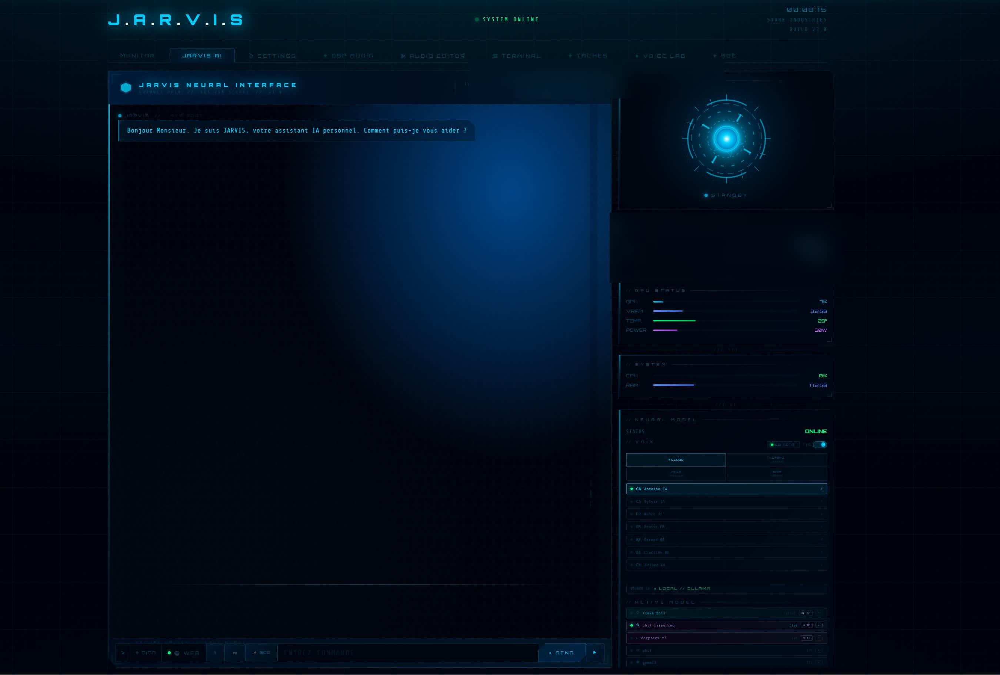
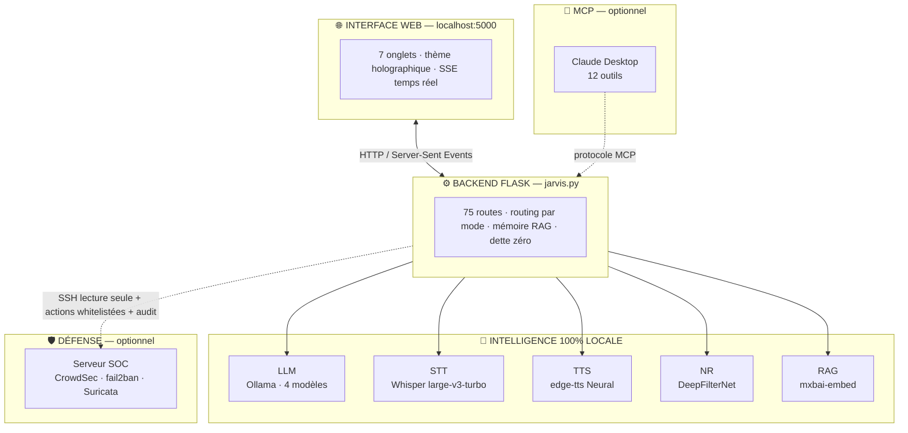
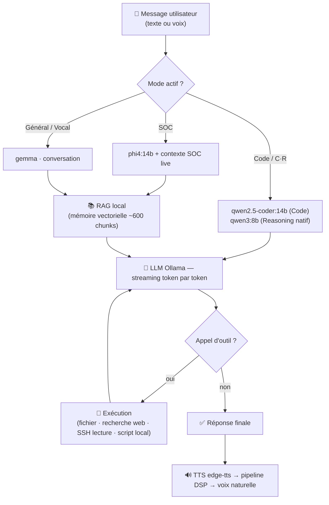
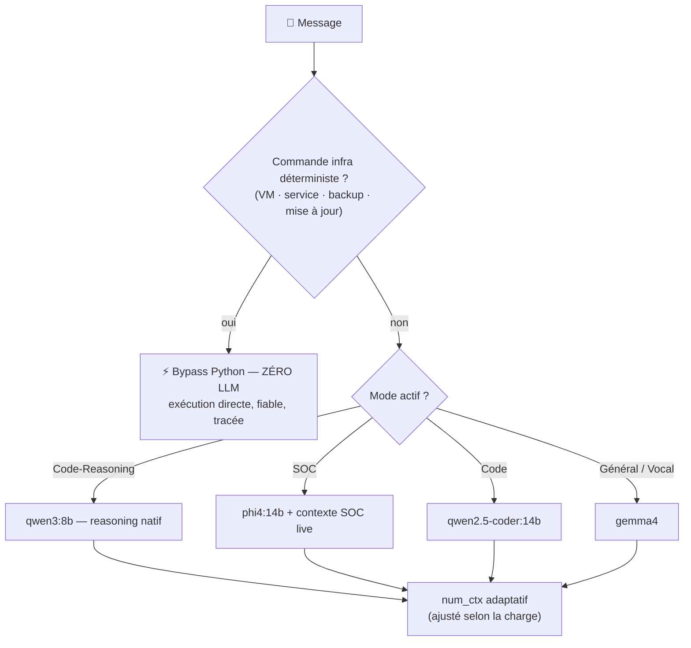
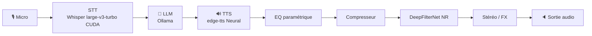
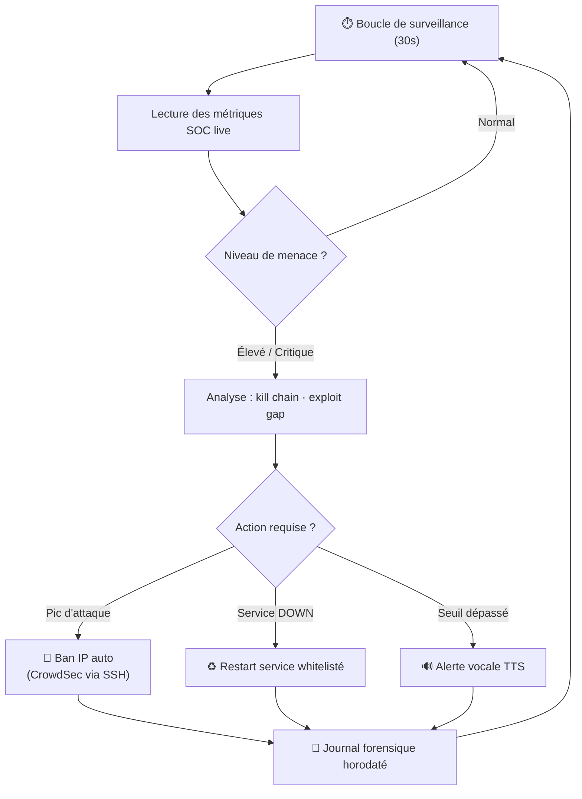
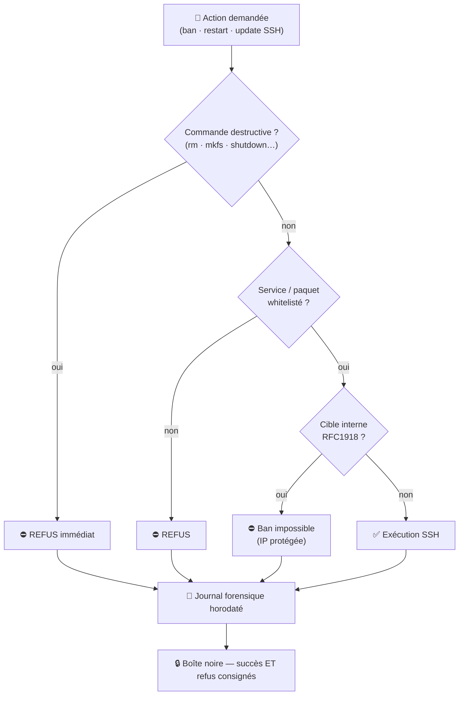

<div align="center">

  <br></br>

  <a href="https://github.com/0xCyberLiTech">
    
  </a>

  <br></br>

  <h2>Assistant IA 100 % local · voix naturelle · interface holographique · défense SOC autonome 24/7</h2>

  <p align="center">
    <a href="https://0xcyberlitech.github.io/">
      
    </a>
    <a href="https://github.com/0xCyberLiTech">
      
    </a>
    <a href="https://github.com/0xCyberLiTech/JARVIS/releases/latest">
      
    </a>
    <a href="https://github.com/0xCyberLiTech/JARVIS/blob/main/CHANGELOG.md">
      
    </a>
    <a href="https://github.com/0xCyberLiTech?tab=repositories">
      
    </a>
  </p>

  <br/>

  

  <br/>
  <sub><i>« Bonjour Monsieur. Je suis JARVIS, votre assistant IA personnel. Comment puis-je vous aider ? »</i></sub>

</div>

---

<h2 align="center">Qui est JARVIS ?</h2>

<div align="center">
  <p>
    <b>JARVIS</b> est un assistant à intelligence artificielle <b>entièrement local</b> qui vit sur une machine, sous le contrôle de son propriétaire — <b>zéro cloud, zéro donnée envoyée à l'extérieur</b>.<br/>
    Il <b>parle</b> avec une voix naturelle, <b>écoute</b>, <b>raisonne</b> sur quatre modèles spécialisés, <b>se souvient</b> (mémoire vectorielle locale),<br/>
    et surtout : il <b>défend une infrastructure de sécurité en temps réel</b> — il ne se contente pas d'informer, <b>il agit</b>.
  </p>
</div>

<div align="center">

| | |
|--|--|
| 🗣️ **Voix-first** | Conversation naturelle parlée — STT Whisper + TTS Neural, pilotage à la voix |
| 🧠 **4 modes de raisonnement** | SOC · Général · Code · Code-Reasoning — chacun son modèle, son prompt, son contexte |
| 🛡️ **Défense autonome** | Surveille un SOC réel, bannit les attaquants, redémarre les services, alerte vocalement |
| 📓 **Traçabilité forensique** | Chaque action d'écriture est consignée dans un journal horodaté inviolable |
| 🔒 **100 % local** | Ollama · Whisper · edge-tts — tout tourne sur GPU NVIDIA RTX 5080 |

</div>

---

<h2 align="center">JARVIS, l'orchestrateur</h2>

<div align="center"><sub>Sous l'interface, un seul chef d'orchestre — <code>jarvis.py</code> — coordonne une dizaine de sous-systèmes spécialisés. Ce n'est pas un chatbot : c'est un <b>orchestrateur</b>.</sub></div>

<div align="center">

| `jarvis.py` orchestre… | |
|------------------------|--|
| 🧠 **4 modèles LLM** | Ollama — sélection automatique selon l'intention + changement à chaud |
| 🎙️ **Chaîne vocale** | STT Whisper → LLM → TTS Antoine *(rollback Kokoro)* → pipeline DSP |
| 📚 **Mémoire RAG** | embeddings locaux · injection contextuelle · `num_ctx` adaptatif |
| ⚡ **Bypass déterministe** | commandes infra exécutées **sans LLM** (fiable, tracé) |
| 🛡️ **Actions SOC** | SSH whitelisté · ban / restart / update · audit forensique |
| 🔌 **Pont MCP** | 12 outils exposés à Claude Desktop |
| 🗂️ **Services** | tâches planifiées · recherche web · mémoire persistante |

</div>

<div align="center"><sub>Un orchestrateur Flask de <b>75 routes</b> qui fait dialoguer <b>~13 000 lignes</b> de sous-systèmes — chacun isolé dans son module.</sub></div>

---

<h2 align="center">Philosophie du projet</h2>

<div align="center">
<table>
<tr>
<td align="center" width="33%">

**🤖 100 % local, zéro cloud**

Un assistant IA personnel qui tourne sur ta machine, sous ton contrôle, sans envoyer une seule donnée à l'extérieur. Ollama, Whisper, edge-tts : tout s'exécute localement sur GPU NVIDIA RTX 5080.

</td>
<td align="center" width="33%">

**🛡️ Intelligence défensive intégrée**

JARVIS n'est pas un chatbot. Il surveille l'infrastructure SOC en temps réel, bannit automatiquement les IP malveillantes, redémarre les services critiques et alerte vocalement sur les menaces.

</td>
<td align="center" width="33%">

**🎯 Un homelab, une discipline sérieuse**

Ce n'est « qu'un » homelab personnel — mais maintenu comme un vrai logiciel : ~18 000 lignes de front, ~13 000 de back, 7 onglets, dette de code à zéro, tests, refactoring continu. Sur infrastructure réelle, 24h/24.

</td>
</tr>
</table>
</div>

---

<h2 align="center">Architecture du système</h2>

<div align="center"><sub>L'interface web pilote un backend Flask qui orchestre l'IA locale (LLM, voix, mémoire) et, en option, la défense de l'infrastructure.</sub></div>



---

<h2 align="center">Les 4 modes de JARVIS</h2>

<div align="center"><sub>Un seul assistant, quatre cerveaux — JARVIS choisit le bon modèle selon l'intention, automatiquement.</sub></div>

<div align="center">

| Mode | Modèle local | Pour quoi |
|------|--------------|-----------|
| 🛡️ **SOC** *(défaut)* | `phi4:14b` | Cybersécurité, analyse de menaces, raisonnement défensif — avec contexte SOC live injecté |
| 💬 **Général / Vocal** | `gemma4:latest` | Conversation fluide, vulgarisation, assistance du quotidien, vision |
| 💻 **Code** | `qwen2.5-coder:14b` | Génération de code, scripts, projets multi-fichiers |
| ⬡ **Code-Reasoning** | raisonnement *chain-of-thought* | Refactoring complexe, audit de code, correction de bugs subtils |

</div>

---

<h2 align="center">Les pôles d'exploitation de JARVIS</h2>

<div align="center"><sub>Un seul assistant, sept domaines d'action — c'est là sa vraie force : la polyvalence maîtrisée.</sub></div>

<div align="center">

| Pôle | Ce que JARVIS y fait |
|------|----------------------|
| 🗣️ **Assistant vocal &amp; conversation** | Dialogue naturel parlé, pilotage à la voix, **analyse d'images** (vision), vulgarisation |
| 🛡️ **Centre de défense SOC** | Surveillance temps réel, **Kill Chain 5 stades**, ban automatique, **IoC post-compromission** (6 signaux), alertes vocales |
| 💻 **Atelier de développement** | Génération de code, scripts, projets multi-fichiers, refactoring &amp; audit (Code-Reasoning) |
| 📊 **Supervision matérielle &amp; infra** | GPU RTX 5080, CPU, RAM, disques, réseau, état des VM et des services |
| 🎚️ **Studio audio &amp; voix** | Pipeline DSP complet, EQ paramétrique, Voice Lab, empreinte vocale, TTS Antoine + rollback Kokoro |
| 🧠 **Mémoire &amp; connaissance (RAG)** | RAG **hybride** (vectoriel + BM25) · RAG **live** sur les logs SOC en temps réel · mémoire persistante — sans rien envoyer dehors |
| 🔌 **Interopérabilité (MCP)** | 12 outils exposés à Claude Desktop — statut SOC, historique IP 30j, défense 24h |

</div>

<div align="center"><sub>👉 Du <b>dialogue</b> à la <b>défense active</b>, du <b>code</b> à l'<b>audio</b> : un assistant unique, plusieurs métiers.</sub></div>

---

<h2 align="center">Logigramme — flux d'une conversation</h2>

<div align="center"><sub>Du message (texte ou voix) jusqu'à la réponse parlée — routing par mode, mémoire vectorielle, appels d'outils, synthèse vocale.</sub></div>



---

<h2 align="center">Routing LLM &amp; gestion de la VRAM</h2>

<div align="center"><sub>16 Go de VRAM, des modèles de 9 à 10 Go : JARVIS choisit le bon cerveau <b>et</b> orchestre la mémoire GPU — sans jamais saturer.</sub></div>



<div align="center"><sub>Les commandes critiques (mise à jour, redémarrage…) passent par un <b>bypass déterministe sans LLM</b> : pas d'hallucination possible, et une trace forensique à coup sûr.</sub></div>

<br/>

<div align="center"><b>🎛️ Map VRAM — NVIDIA RTX 5080 · 16 Go GDDR7</b></div>

<div align="center">

| Modèle | VRAM | Stratégie de chargement |
|--------|------|-------------------------|
| `phi4:14b` | ~9 Go | **Préchargé au boot** — modèle SOC par défaut |
| `qwen2.5-coder:14b` | ~9 Go | À la demande (mode Code) |
| `qwen3:8b` | ~5 Go | À la demande (Code-Reasoning — *reasoning* natif, thinking masqué) |
| `gemma4:latest` | ~10 Go | À la demande (Général / Vision) |
| `mxbai-embed-large` | ~0,7 Go | Résident léger — RAG, `keep_alive` court |

</div>

<div align="center"><sub>Ollama charge / décharge à la volée : <b>un seul gros modèle en VRAM à la fois</b> + l'embed RAG. Budget GPU maîtrisé, jamais de saturation — la VRAM de chaque modèle est visible en direct dans l'onglet Monitor.</sub></div>

---

<h2 align="center">L'interface — 7 onglets</h2>

<div align="center">

| Onglet | Rôle |
|--------|------|
| 🖥️ **Monitor** | Supervision GPU / CPU / RAM / réseau temps réel + sparklines 24h |
| 💬 **JARVIS AI** | Chat IA · envoi vocal (STT Whisper) · **analyse d'images** (vision) |
| ⚙️ **Settings** | Paramètres LLM · profils de prompt · mémoire · état RAG |
| 🎚️ **DSP Audio** | Chaîne audio · EQ · reverb · rack FX · moteurs TTS · enregistrement |
| 🗓️ **Tâches** | Planificateur *cron-like* · suggestions IA · monitoring d'exécution |
| ✦ **Voice Lab** | Analyse acoustique · voice prints · **classification vocale** · EQ auto |
| 🛡️ **SOC** | Défense proactive · heatmap 30j · journal d'actions · IoC |

</div>

---

<h2 align="center">Onglet MONITOR — supervision matérielle</h2>

<div align="center">
  
  <br/><sub>NVIDIA RTX 5080 (Blackwell GB203) · GPU, VRAM, température, puissance · CPU, réseau, disque · VRAM des modèles LLM · sparklines 24h</sub>
</div>

---

<h2 align="center">Pipeline audio — la voix au cœur de JARVIS</h2>

<div align="center"><sub>La voix est le cœur de l'expérience JARVIS : un rack audio complet, de la capture à la synthèse, entièrement local.</sub></div>



<div align="center">
<table border="0" cellspacing="0" cellpadding="8">
  <tr>
    <td width="50%">
      
      <p align="center"><sub><b>DSP AUDIO</b> — lecteur type TASCAM, VU-mètres, égaliseur multi-bandes</sub></p>
    </td>
    <td width="50%">
      
      <p align="center"><sub><b>ANALYSEUR SPECTRAL</b> — spectre L/R temps réel, gain master</sub></p>
    </td>
  </tr>
  <tr>
    <td width="50%">
      
      <p align="center"><sub><b>VOICE LAB</b> — EQ paramétrique dédié à la voix (presets Studio, Radio, Présence…)</sub></p>
    </td>
    <td width="50%">
      
      <p align="center"><sub><b>MOTEUR VOCAL &amp; VOICE PRINT</b> — voix Antoine / Kokoro, empreinte vocale, analyse</sub></p>
    </td>
  </tr>
</table>
</div>

<div align="center">
  
  <br/><sub><b>RACK DSP</b> — DeepFilterNet (réduction de bruit IA · CUDA), compresseur dynamique, stéréo widener (Haas), et un rack FX complet : <b>reverb (7 presets) · delay · chorus · phaser · flanger · exciter</b></sub>
</div>

---

<h2 align="center">Logigramme — auto-engine défensif SOC</h2>

<div align="center"><sub>JARVIS ne fait pas qu'informer : il agit. Boucle de surveillance autonome qui amplifie la défense du SOC, même interface fermée.</sub></div>



---

<h2 align="center">Sécurité &amp; traçabilité — by design</h2>

<div align="center"><sub>JARVIS a des pouvoirs <b>réels</b> sur l'infrastructure : bannir une IP, redémarrer un service, lancer une mise à jour en SSH. La règle est simple — <b>chaque pouvoir est clôturé, validé et tracé. Sans exception.</b></sub></div>

<div align="center"><sub>La chaîne de garde-fous d'une action d'écriture — un refus est tracé tout autant qu'une exécution :</sub></div>



<div align="center">

| Garde-fou | Mécanisme |
|-----------|-----------|
| 🔒 **Loopback only** | Bind `127.0.0.1` — l'interface n'est jamais exposée sur le réseau |
| 🧱 **Actions whitelistées** | Liste blanche stricte des services redémarrables et des paquets installables via SSH |
| 🚫 **IP internes protégées** | Les plages RFC1918 ne peuvent JAMAIS être bannies — source de vérité unique |
| 📓 **Audit forensique** | Toute opération d'écriture SSH (ban, restart, mise à jour) écrit une ligne JSON horodatée dans un journal dédié — sur succès **comme** sur refus, peu importe le chemin emprunté |
| 🔐 **Zéro secret en clair** | Aucun credential, aucune clé, aucune IP d'infrastructure dans le code source |
| ☁️ **Zéro fuite** | Aucune donnée envoyée vers un service tiers — l'IA est 100 % locale |

</div>

<div align="center">
  
  &nbsp;&nbsp;
  
  <br/><sub>Panneau du modèle neuronal (LLM actif, voix, mémoire) · barre de commande (DIAG, WEB, MIC, IMG, SOC, CODE, C·R)</sub>
</div>

---

<h2 align="center">Construction par phases</h2>

| # | Phase | Ce qui a été construit | Pourquoi ce choix |
|---|-------|----------------------|-------------------|
| 1 | **Backend Flask + streaming** | jarvis.py · 75 routes · SSE token par token · API Ollama | Base unifiée avant tout — toutes les fonctionnalités s'appuient sur ce serveur |
| 2 | **Pipeline audio** | TTS edge-tts Neural · STT Whisper large-v3-turbo CUDA · DeepFilterNet NR | L'interaction vocale est le cœur de l'expérience JARVIS — sans ça, c'est juste une web app |
| 3 | **Interface holographique** | 7 onglets · glassmorphism · ~18 000 lignes · zéro framework | Chaque fonctionnalité mérite sa propre surface — pas de compromis sur l'ergonomie |
| 4 | **Routing multi-modèles** | SOC · Général · Code · Code-Reasoning · changement de modèle à chaud | Le bon cerveau pour la bonne tâche — phi4 défend, qwen code, gemma converse |
| 5 | **Mémoire vectorielle (RAG)** | ~600 chunks · embeddings mxbai locaux · injection contextuelle | JARVIS se souvient du projet et du contexte sans rien envoyer dehors |
| 6 | **Intégration & auto-engine SOC** | ban-ip · restart · alertes vocales · surveillance 30s · journal forensique | JARVIS doit pouvoir agir, pas seulement informer — et tracer chacun de ses actes |
| 7 | **MCP — pont vers Claude Desktop** | 12 outils exposés (statut SOC, historique IP, défense 24h…) | JARVIS devient une source d'outils pour d'autres agents, en lecture maîtrisée |
| 8 | **Qualité &amp; honnêteté** | dette de code à zéro (NDT) · 1300+ tests · dette structurelle **assumée et documentée** | Un système de production se maintient comme tel — et se note sans se mentir |

---

<h2 align="center">Points forts</h2>

| | Capacité | Détail |
|--|----------|--------|
| 🗣️ | **Pilotage à la voix** | Conversation parlée naturelle · STT Whisper CUDA · TTS Neural · pipeline DSP temps réel |
| 🤖 | **4 modèles, 1 assistant** | phi4 (SOC) · gemma4 (général/vision) · qwen2.5-coder (code) · raisonnement C·R — changement à chaud |
| 📚 | **Mémoire locale (RAG)** | RAG hybride (vectoriel + BM25) · RAG live sur logs SOC · embeddings mxbai · zéro fuite |
| 🛡️ | **Auto-engine SOC** | Surveillance 30s · Kill Chain 5 stades · threat score 5 niveaux · ban auto CrowdSec · IoC post-compromission |
| 🖼️ | **Vision** | Analyse d'images en local (gemma4 multimodal) — description, lecture, contexte |
| 🖥️ | **Terminal SSH intégré** | Accès terminal *xterm* temps réel aux hôtes — barre de réponse JARVIS en ligne |
| 📓 | **Audit forensique** | Chaque action d'écriture tracée et horodatée — boîte noire inviolable |
| 🔌 | **Serveur MCP** | 12 outils exposés à Claude Desktop · historique IP 30j · défense 24h |
| 🎯 | **Interface holographique** | 7 onglets · glassmorphism · ~18 000 lignes · zéro framework CSS/JS |
| 📊 | **Monitoring temps réel** | CPU · RAM · GPU RTX 5080 · disques · réseau · sparklines 24h |

---

<h2 align="center">Qualité d'ingénierie — la discipline derrière le homelab</h2>

<div align="center"><sub>Ce n'est qu'un homelab — mais il est traité comme un logiciel de production : modulaire, testé, refactoré en continu, et noté en toute honnêteté.</sub></div>

<div align="center">

| Pilier | La réalité, sans esbroufe |
|--------|---------------------------|
| 🧩 **Architecture modulaire** | Backend découpé en blueprints + modules spécialisés (chat, bypass, commands, ssh, fichiers, mémoire, sécurité…) · front en 25 modules JS · responsabilités séparées |
| 🔁 **Refactoring continu** | Extractions successives de l'orchestrateur · source de vérité unique · zéro hardcode · zéro duplication |
| 🧪 **Tests &amp; qualité automatisée** | Suite pytest (1300+ tests) · ruff · eslint · hooks pre-commit bloquants |
| 🧼 **Dette de code à zéro** | Zéro style inline, zéro magic-number, palette &amp; typo centralisées — vérifié à chaque passe |
| 📏 **Notation honnête** | La dette **structurelle** assumée sur quelques gros modules cohésifs est **comptée, jamais masquée** · scores figés « dans le marbre », revus à la hausse uniquement par une action concrète |
| 🛠️ **Outillage maison** | Outils de pré-commit développés sur mesure (lint, audit de santé, pré-check de refactoring) pour garantir la régularité |
| 🧯 **Résilience** | Circuit breaker Ollama · cache &amp; déduplication TTS · diagnostics embarqués · alerte vocale sur panne de service |

</div>

<div align="center"><sub>👉 Pas de score gonflé : un homelab construit avec soin, dont on assume et documente les limites.</sub></div>

---

<h2 align="center">Stack technique</h2>

```
OS          Windows 11 Pro
GPU         NVIDIA RTX 5080 — 16 GB GDDR7 · CUDA 12 · Blackwell GB203
LLM         Ollama (local) — phi4:14b · gemma4 · qwen2.5-coder:14b · qwen3:8b (reasoning) · mxbai-embed-large (RAG)
TTS         edge-tts Neural — fr-CA-AntoineNeural (défaut) · rollback Kokoro local (CUDA)
STT         faster-whisper large-v3-turbo FR — CUDA float16 · vocabulaire SOC
NR          DeepFilterNet — réduction bruit micro temps réel (CUDA)
DSP         numpy/scipy — EQ biquad multi-bandes · compresseur · analyseur spectral
Backend     Python 3.11 — Flask · SSE streaming · ~13 000 lignes · 75 routes · dette zéro
Frontend    Vanilla JS + HTML5 — ~18 000 lignes · 25 modules · 7 onglets · zéro NPM
Mémoire     RAG local — embeddings mxbai · ~600 chunks
Pont        MCP — 12 outils exposés à Claude Desktop
Défense     SSH lecture seule + actions whitelistées + audit · CrowdSec · fail2ban · Suricata
```

---

<h2 align="center">Modèles LLM</h2>

| Modèle | VRAM | Rôle |
|--------|------|------|
| `phi4:14b` | ~9 Go | ⭐ **Actif par défaut** — SOC, raisonnement, analyse de menaces |
| `qwen2.5-coder:14b` | ~9 Go | Code, scripts, projets multi-fichiers |
| `qwen3:8b` | ~5 Go | Code-Reasoning — raisonnement natif, audit de code profond |
| `gemma4:latest` | ~10 Go | Général, conversation, **vision** (analyse d'images) |
| `mxbai-embed-large` | ~0,7 Go | Mémoire vectorielle (RAG) — embeddings |

---

<h2 align="center">Par où commencer ?</h2>

| Objectif | Point d'entrée |
|----------|---------------|
| 📖 **Comprendre l'architecture** et le pipeline LLM + audio | [01-PREREQUIS.md](./docs/01-PREREQUIS.md) → [05-INTEGRATION-SOC.md](./docs/05-INTEGRATION-SOC.md) |
| ⚙️ **Prérequis** Python + Ollama + CUDA | [01-PREREQUIS.md](./docs/01-PREREQUIS.md) |
| 🔊 **Configurer le pipeline audio** TTS · STT · DeepFilterNet | [03-PIPELINE-AUDIO.md](./docs/03-PIPELINE-AUDIO.md) |
| 🛡️ **Connecter JARVIS au SOC** pour les actions proactives | [05-INTEGRATION-SOC.md](./docs/05-INTEGRATION-SOC.md) |

> **Ce dépôt est une vitrine technique :**
> architecture, diagrammes et concepts — pour montrer ce que JARVIS fait et comment il est pensé.
>
> 🔒 **Le code opérationnel reste volontairement privé** : `jarvis.py` et ses ~13 000 lignes, les scripts SOC, les clés SSH, les configurations d'infrastructure. Ce dépôt n'est **pas reproductible tel quel** — le savoir-faire est protégé, pas redistribué.

---

<h2 align="center">Documentation</h2>

| # | Document | Description |
|---|----------|-------------|
| 01 | [PREREQUIS.md](./docs/01-PREREQUIS.md) | Python 3.11, Ollama, CUDA, dépendances système |
| 02 | [LLM-OLLAMA.md](./docs/02-LLM-OLLAMA.md) | LLM local, API Ollama, streaming SSE, gestion des modèles |
| 03 | [PIPELINE-AUDIO.md](./docs/03-PIPELINE-AUDIO.md) | TTS edge-tts, file d'attente, STT Whisper VAD, DeepFilterNet NR |
| 04 | [BACKEND-FLASK.md](./docs/04-BACKEND-FLASK.md) | Serveur Flask, routes, Server-Sent Events, modèles à chaud |
| 05 | [INTEGRATION-SOC.md](./docs/05-INTEGRATION-SOC.md) | Intégration SOC, ban/unban IP via SSH, alertes proactives, audit |

---

<h2 align="center">Sécurité</h2>

```
✔  Bind 127.0.0.1 — non exposé sur le réseau
✔  Liste blanche des services et paquets autorisés (SSH)
✔  IP internes (RFC1918) jamais bannissables — source de vérité unique
✔  Audit forensique horodaté de toute action d'écriture
✔  Aucun credential dans le code source
✔  Aucune donnée envoyée vers des services tiers
```

---

<div align="center">

<table>
<tr>
<td align="center"><b>🖥️ Infrastructure &amp; Sécurité</b></td>
<td align="center"><b>💻 Développement &amp; Web</b></td>
<td align="center"><b>🤖 Intelligence Artificielle</b></td>
</tr>
<tr>
<td align="center">
  <a href="https://www.kernel.org/"></a>
  <a href="https://www.debian.org"></a>
  <a href="https://www.gnu.org/software/bash/"></a>
  <br/>
  <a href="https://nginx.org"></a>
  <a href="https://git-scm.com"></a>
</td>
<td align="center">
  <a href="https://www.python.org"></a>
  <a href="https://flask.palletsprojects.com"></a>
  <a href="https://developer.mozilla.org/docs/Web/HTML"></a>
  <br/>
  <a href="https://developer.mozilla.org/docs/Web/CSS"></a>
  <a href="https://developer.mozilla.org/docs/Web/JavaScript"></a>
  <a href="https://code.visualstudio.com"></a>
</td>
<td align="center">
  <a href="https://ollama.com"></a>
  <br/><br/>
  <a href="https://anthropic.com"></a>
</td>
</tr>
</table>

<br/>

<sub>🔒 Projets proposés par <a href="https://github.com/0xCyberLiTech">0xCyberLiTech</a> · Développés en collaboration avec <a href="https://claude.ai">Claude AI</a> (Anthropic) 🔒</sub>

</div>
