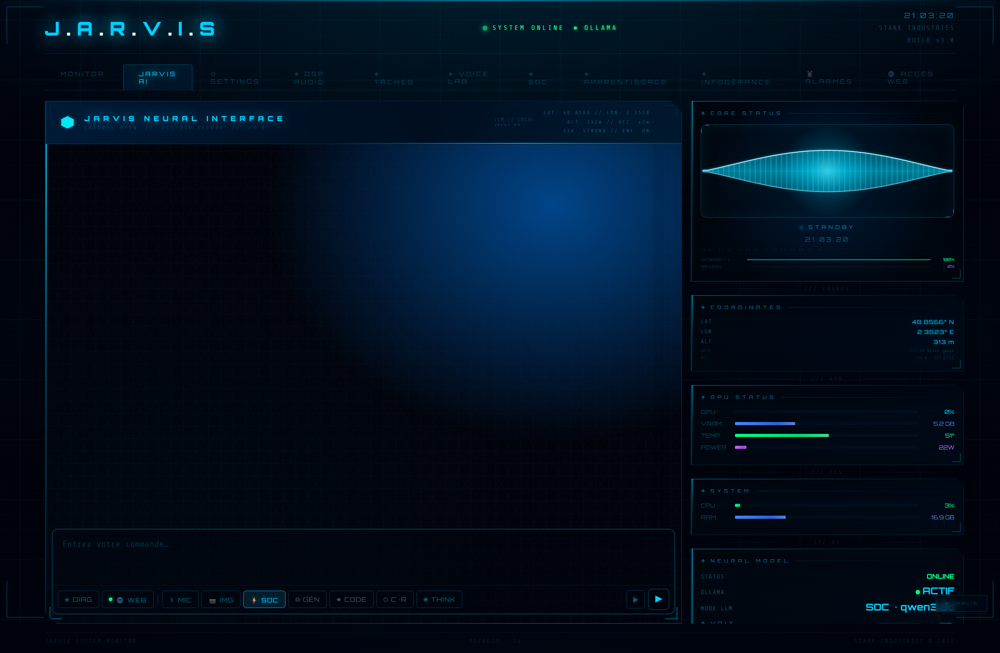

    

  

    

  <h2>Assistant IA local · voix · interface holographique · automatisation SOC 24/7</h2>

  

    
    
    
    
    
    
  

  

  

    <strong>IA 100% locale</strong>  &nbsp;•&nbsp; <strong>Voix naturelle · STT · TTS</strong>  &nbsp;•&nbsp; <strong>Automatisation SOC</strong> 
  

---
# J.A.R.V.I.S

> **Assistant IA local · 100 % privé · Interface holographique · SOC cybersécurité**

JARVIS est un assistant IA personnel de type Iron Man construit sur Python/Flask + Ollama.
Tout tourne en local — aucune donnée ne quitte la machine.

  

---

## Hermès — L'agent persistant

  

 

> **Hermès transforme un assistant en agent.**
> Là où un assistant répond à des questions, un agent **observe, mémorise, apprend et agit** — sans être re-briefé à chaque session.

| Brique | Rôle |
|--------|------|
| **Synoptique temps réel** | 6 couches moteur visibles dans l'interface : LLM actif, RAG, STT/TTS, auto-engine SOC, état mémoire |
| **Tuile Mémoire** | Mémoire vectorielle persistante — échanges, résumés, leçons apprises — rechargeable sans redémarrage |
| **Bypass déterministe** | Commandes critiques interceptées avant le LLM : exécution instantanée < 100 ms, 0 hallucination |
| **Boucle d'apprentissage** | `"Souviens-toi que X"` → leçon persistée, indexée, réinjectée automatiquement dans les futures réponses |
| **Briefing matinal** | `"Bonjour JARVIS"` → niveau de menace SOC, état des machines, alertes des 24 dernières heures |

| Avant Hermès | Après Hermès |
|--------------|--------------|
| Chaque session recommence à zéro | Contexte conservé entre les sessions |
| Le contexte disparaît au redémarrage | Leçons et conventions indexées dans le RAG |
| L'assistant répond seulement | L'agent surveille, alerte et agit |
| Toutes les commandes passent par le LLM | Bypass déterministe pour les commandes critiques |

---

## À propos & Objectifs

| Objectif | Description |
|----------|-------------|
| **100 % local** | LLM, STT, TTS, RAG, données — tout sur le poste de travail (GPU NVIDIA CUDA) |
| **Agentification** | Hermès — mémoire longue durée, apprentissage inter-sessions, briefing automatique |
| **SOC cybersécurité** | Auto-engine de détection, ban automatique, alertes vocales, injection contexte sécurité live |
| **Accessibilité** | Interface haute lisibilité, alertes vocales TTS, commandes vocales à bypass déterministe |
| **Qualité** | 1 465 tests · 79 % coverage · ruff 0 · eslint 0 · hooks bloquants |

---

## Sommaire

| # | Document | Description | Statut | |
|---|----------|-------------|--------|---|
| 01 | [Hermès — Agent persistant](DOCUMENTATION/01-HERMES.md) | 5 briques · bypass déterministe · boucle apprentissage · briefing matinal | 🟢 |  |
| 02 | [Intégration SOC](DOCUMENTATION/02-SOC-INTEGRATION.md) | Auto-engine · ban/unban · alertes vocales · injection contexte sécurité | 🟢 |  |
| 03 | [Architecture globale](DOCUMENTATION/03-ARCHITECTURE.md) | 5 zones · Flask · Blueprints · modules · polling | 🟢 |  |
| 04 | [Audio DSP](DOCUMENTATION/04-AUDIO-DSP.md) | Chaîne broadcast · TTS 4 moteurs · STT faster-whisper · DSP 3 étages | 🟢 |  |
| 05 | [Installation](DOCUMENTATION/05-INSTALLATION.md) | Pré-requis matériel · Python · Ollama · lancement · vérification | 🟢 |  |
| 06 | [MCP Server](DOCUMENTATION/06-MCP-SERVER.md) | 12 outils · Claude Desktop · watchdog · principe de séparation | 🟢 |  |

---

## Stack technique

| Couche | Technologie |
|--------|-------------|
| **Backend** | Python 3.11 · Flask · Blueprints autoportants · DI pur |
| **LLM local** | Ollama · phi4:14b (SOC) · gemma4:latest (GÉNÉRAL + vision) · qwen2.5-coder:14b (CODE) |
| **RAG** | mxbai-embed-large · BM25 hybride · ~600 chunks · TTL 5 min |
| **TTS** | edge-tts fr-CA Antoine → Kokoro CUDA → SAPI5 (cascade automatique) |
| **STT** | faster-whisper large-v3-turbo CUDA · vocabulaire SOC |
| **Frontend** | Vanilla JS · 21 modules · Web Audio API · xterm.js · Monaco Editor |
| **Agent Hermès** | 5 briques · bypass regex · scheduler daemon · DI pur · indépendant du LLM |
| **MCP** | 12 outils exposés à Claude Desktop · streamable-HTTP · watchdog |
| **Qualité** | 1 465 pytest · 79 % coverage · ruff 0 · eslint 0 · hooks pré-commit/pré-push |

---

## Sécurité

| Principe | Implémentation |
|----------|----------------|
| **100 % local** | JARVIS filtre et agrège localement — rien ne part vers un LLM cloud |
| **RFC1918 immuable** | Les plages IP privées ne peuvent jamais être bannies |
| **SSH lecture seule** | 29 patterns dangereux bloqués · whitelist explicite pour l'écriture |
| **SOC side-channel** | Le contexte sécurité n'entre jamais dans l'historique chat |
| **Audit forensique** | Toute opération SSH d'écriture tracée dans un journal JSONL |

---

**Commencer →** [01 — Hermès, l'agent persistant](DOCUMENTATION/01-HERMES.md)

---

<table>
<tr>
<td align="center"><b>🖥️ Infrastructure &amp; Sécurité</b></td>
<td align="center"><b>💻 Développement &amp; Web</b></td>
<td align="center"><b>🤖 Intelligence Artificielle</b></td>
</tr>
<tr>
<td align="center">
  
  
  
   
  
  
</td>
<td align="center">
  
  
  
   
  
  
  
</td>
<td align="center">
  
    
  
</td>
</tr>
</table>

 

🔒 Projets proposés par <a href="https://github.com/0xCyberLiTech">0xCyberLiTech</a> · Développés en collaboration avec <a href="https://claude.ai">Claude AI</a> (Anthropic) 🔒

