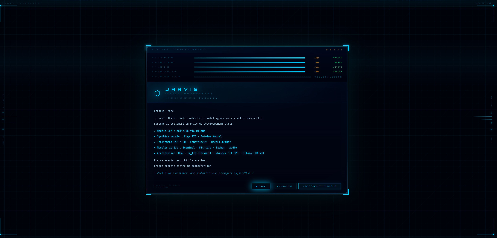
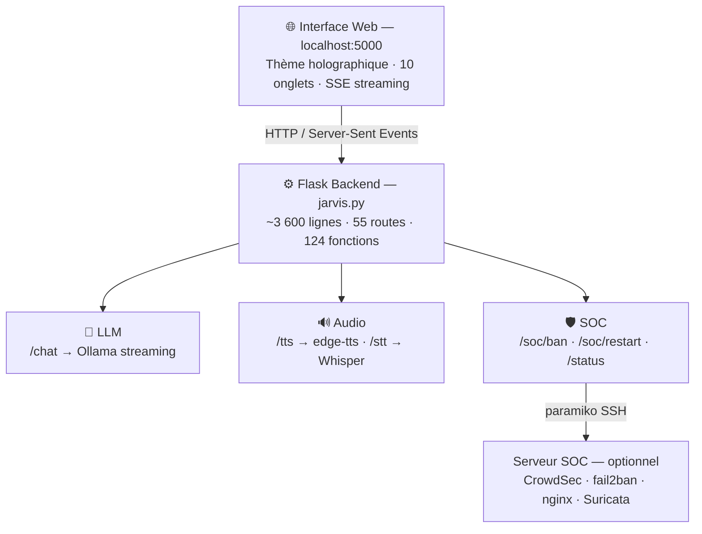
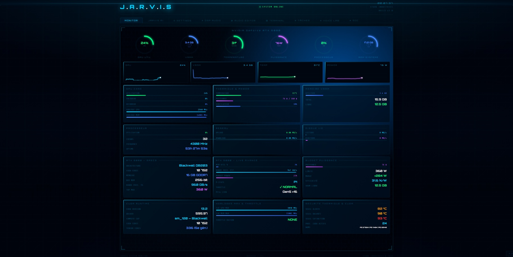
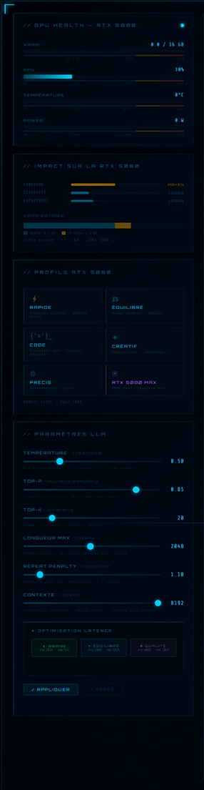
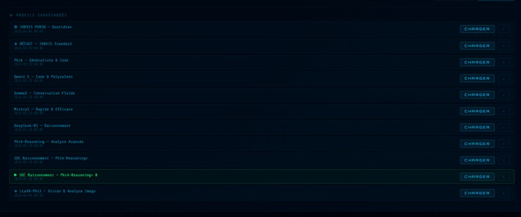
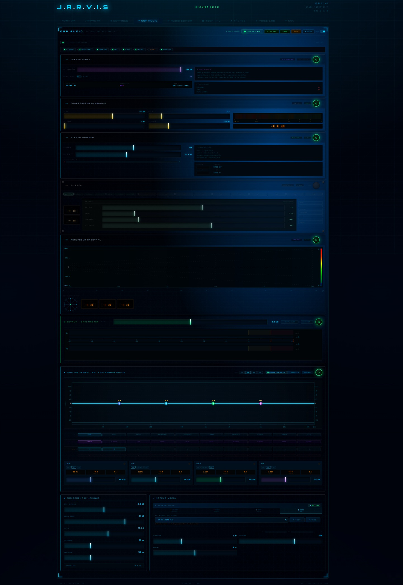
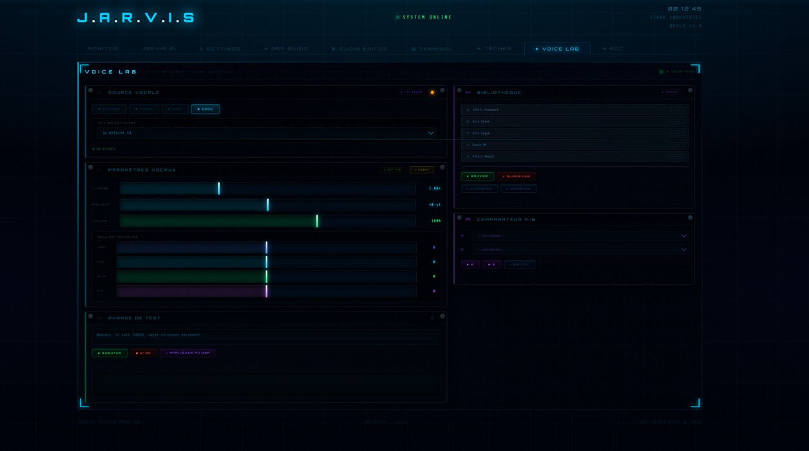
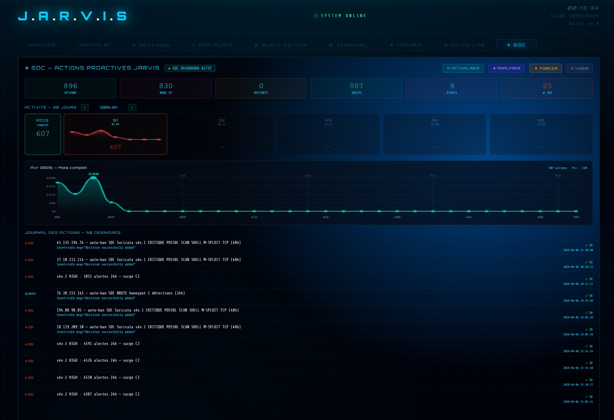

<div align="center">

  <br></br>

  <a href="https://github.com/0xCyberLiTech">
    
  </a>

  <br></br>

  <h2>Laboratoire numérique pour la cybersécurité, Linux & IT.</h2>

  <p align="center">
    <a href="https://0xcyberlitech.github.io/">
      
    </a>
    <a href="https://github.com/0xCyberLiTech">
      
    </a>
    <a href="https://github.com/0xCyberLiTech/JARVIS/releases/latest">
      
    </a>
    <a href="https://github.com/0xCyberLiTech/JARVIS/blob/main/CHANGELOG.md">
      
    </a>
    <a href="https://github.com/0xCyberLiTech?tab=repositories">
      
    </a>
  </p>

</div>

<div align="center">
  
</div>

<div align="center">
  <p>
    <strong>Cybersécurité</strong>  • <strong>Linux Debian</strong>  • <strong>Sécurité informatique</strong> 
  </p>
</div>

<div align="center">
  <br/>
  
</div>

---

<div align="center">

## À propos & Objectifs.

</div>

Passionné d'intelligence artificielle locale et de cybersécurité, j'ai construit JARVIS avec une conviction simple : **un assistant IA personnel doit rester sous ton contrôle, sur ta machine, sans aucun cloud**.

Inspiré de l'univers Iron Man, JARVIS est un assistant opérationnel 24/7 — voix naturelle, écoute continue, interface holographique — qui tourne entièrement en local grâce à **Ollama** sur un GPU **NVIDIA RTX 5080**. Il surveille mon infrastructure SOC en temps réel, répond à mes questions vocalement, analyse des logs de sécurité, et peut bannir une IP malveillante sur simple commande naturelle.

Avec **17 400+ lignes de code**, 10 onglets, un pipeline audio complet (TTS Neural · STT Whisper · DeepFilterNet), et une intégration SOC avec actions proactives automatiques — ce n'est pas un proof-of-concept. C'est un système en production, mis à jour hebdomadairement.

> **Ce projet a été conçu et développé en collaboration avec [Claude AI](https://claude.ai) (Anthropic) — Claude Code.**
> L'ironie n'est pas perdue : un assistant IA local construit avec l'aide d'une IA. Mais c'est exactement là la force de cette approche — utiliser Claude Code pour architécter, déboguer et itérer rapidement sur un projet ambitieux. De la gestion du pipeline audio au système de ban automatique SOC, Claude AI a été un véritable co-développeur tout au long du projet.

Le contenu est structuré pour répondre aux besoins de :
- 🤖 **Passionnés d'IA locale** — déployer un assistant LLM sans cloud, 100% privé
- 🛡️ **Professionnels IT & SOC** — automatiser les réponses aux incidents de sécurité
- 🎓 **Étudiants & développeurs** — comprendre Flask, SSE, Whisper, edge-tts en pratique
- 🚀 **Explorateurs GPU** — exploiter CUDA pour l'inférence LLM + DSP audio en temps réel

---

## Sommaire

<div align="center">
<table border="0" width="600">
  <tr>
    <td align="center" width="150"><a href="#vue-densemble">Vue d'ensemble</a></td>
    <td align="center" width="150"><a href="#architecture">Architecture</a></td>
    <td align="center" width="150"><a href="#screenshots">Screenshots</a></td>
    <td align="center" width="150"><a href="#installation-rapide">Installation</a></td>
  </tr>
  <tr>
    <td align="center"><a href="#guide-dinstallation--étape-par-étape">Guide complet</a></td>
    <td align="center"><a href="#modèles-llm">Modèles LLM</a></td>
    <td align="center"><a href="#stack-technique">Stack technique</a></td>
    <td align="center"><a href="#intégration-soc">Intégration SOC</a></td>
  </tr>
</table>
</div>

---

## Vue d'ensemble

**J.A.R.V.I.S** est un assistant IA personnel complet, opérationnel en production 24/7.  

<div align="center">

| Capacité | Détail |
|----------|--------|
| **Conversation** | LLM Ollama local — streaming token par token, contexte persistant |
| **Voix** | TTS Neural (edge-tts) + STT Whisper + réduction de bruit DeepFilterNet |
| **Monitoring** | Suivi CPU / RAM / GPU / disques / réseau en temps réel |
| **SOC** | Ban-IP automatique, restart services, alertes vocales sur menaces |
| **Multi-modèles** | Changement de LLM à chaud sans redémarrage |
| **Interface** | 10 onglets — thème holographique sombre — 17 400+ lignes |

</div>

---

## Architecture



---

## Screenshots

### Écran de démarrage

<div align="center">
  
  <br/><sub>Initialisation du système — statuts des modules, message de bienvenue</sub>
</div>

<br/>

### Interface de conversation & Monitoring système

<div align="center">
<table border="0" cellspacing="0" cellpadding="8">
  <tr>
    <td width="60%">
      
      <p align="center"><sub>Onglet <b>JARVIS IA</b> — conversation en temps réel, streaming SSE, sidebar système</sub></p>
    </td>
    <td width="40%">
      
      <p align="center"><sub>Onglet <b>MONITOR</b> — CPU, RAM, GPU, disques, sparklines 24h</sub></p>
    </td>
  </tr>
</table>
</div>

### Paramètres LLM & Gestion des modèles

<div align="center">
<table border="0" cellspacing="0" cellpadding="8">
  <tr>
    <td width="35%">
      
      <p align="center"><sub>Onglet <b>SETTINGS</b> — GPU RTX Health, profils CUDA, sliders LLM</sub></p>
    </td>
    <td width="65%">
      
      <p align="center"><sub>Onglet <b>JARVIS IA</b> — profils prédéfinis (SOC, Code, Conversation, Raisonnement...)</sub></p>
    </td>
  </tr>
</table>
</div>

### Pipeline audio — DSP & Voice Lab

<div align="center">
<table border="0" cellspacing="0" cellpadding="8">
  <tr>
    <td width="40%">
      
      <p align="center"><sub>Onglet <b>DSP AUDIO</b> — égaliseur multi-bandes, compresseur, filtres, visualisation temps réel</sub></p>
    </td>
    <td width="60%">
      
      <p align="center"><sub>Onglet <b>VOICE LAB</b> — source vocale, paramètres fins, bibliothèque de voix, comparateur A/B</sub></p>
    </td>
  </tr>
</table>
</div>

### Intégration SOC — Actions proactives

<div align="center">
  
  <br/><sub>Onglet <b>SOC</b> — compteurs de bans/alertes, graphique d'activité 24h, journal horodaté des actions proactives</sub>
</div>

---

## Guide d'installation — étape par étape

<div align="center">
<table>
  <tr>
    <th>Étape</th>
    <th>Description</th>
    <th>Guide</th>
  </tr>
  <tr>
    <td align="center"><b>01</b></td>
    <td>Python 3.11, Ollama, CUDA, dépendances</td>
    <td><a href="./docs/01-PREREQUIS.md">→ Prérequis</a></td>
  </tr>
  <tr>
    <td align="center"><b>02</b></td>
    <td>LLM local, API Ollama, streaming SSE, gestion modèles</td>
    <td><a href="./docs/02-LLM-OLLAMA.md">→ LLM Ollama</a></td>
  </tr>
  <tr>
    <td align="center"><b>03</b></td>
    <td>TTS edge-tts, file d'attente, STT Whisper VAD, DeepFilterNet NR</td>
    <td><a href="./docs/03-PIPELINE-AUDIO.md">→ Pipeline Audio</a></td>
  </tr>
  <tr>
    <td align="center"><b>04</b></td>
    <td>Serveur Flask, routes, Server-Sent Events, modèles à chaud</td>
    <td><a href="./docs/04-BACKEND-FLASK.md">→ Backend Flask</a></td>
  </tr>
  <tr>
    <td align="center"><b>05</b></td>
    <td>Intégration SOC, ban/unban IP via SSH, alertes proactives auto</td>
    <td><a href="./docs/05-INTEGRATION-SOC.md">→ Intégration SOC</a></td>
  </tr>
</table>
</div>

---

## Installation rapide

```bash
# 1. Cloner le dépôt
git clone https://github.com/0xCyberLiTech/JARVIS.git
cd JARVIS

# 2. Installer les dépendances Python
pip install -r scripts/requirements.txt

# 3. Installer Ollama + un modèle
#    → https://ollama.com
ollama pull phi4

# 4. Configurer (copier les templates)
cp config/jarvis_model.json.example      scripts/jarvis_model.json
cp config/jarvis_llm_params.json.example scripts/jarvis_llm_params.json

# 5. Lancer JARVIS
cd scripts && python jarvis.py
```

```
✔  JARVIS disponible sur  →  http://localhost:5000
```

---

## Modèles LLM

<div align="center">

| Modèle | RAM | Points forts |
|--------|-----|-------------|
| `phi4` | 8 Go | ⭐ Recommandé — polyvalent, rapide |
| `mistral:7b` | 6 Go | Léger — idéal faible RAM |
| `phi4-reasoning` | 12 Go | Analyse complexe, SOC |
| `deepseek-r1:14b` | 14 Go | Raisonnement avancé |
| `qwen2.5:14b` | 14 Go | Code et analyse |

</div>

---

## Stack technique

<div align="center">

| Couche | Technologie | Rôle |
|--------|------------|------|
| LLM | Ollama (local) | Génération de texte — aucun cloud |
| TTS | edge-tts Neural | Synthèse vocale naturelle (fr-CA-AntoineNeural) |
| STT | faster-whisper | Transcription vocale — modèle small FR, CUDA |
| NR  | DeepFilterNet | Réduction de bruit micro temps réel |
| Backend | Flask + CORS | API REST + SSE streaming |
| SSH | paramiko | Actions SOC à distance (ban, restart) |
| GPU | CUDA 12 | Accélération STT + NR + inférence LLM |

</div>

---

## Intégration SOC

JARVIS se connecte au [dashboard SOC](https://github.com/0xCyberLiTech/SOC) pour :

- **Surveiller** les métriques de sécurité (CrowdSec, fail2ban, Suricata) toutes les 30s
- **Bannir automatiquement** les IPs en cas de pic d'attaque (via CrowdSec SSH)
- **Redémarrer** les services critiques si détectés DOWN
- **Alerter vocalement** si le score de menace dépasse les seuils configurés
- **Journaliser** chaque action dans l'onglet SOC avec horodatage

---

## Sécurité

```
✔  Bind 127.0.0.1 — non exposé sur le réseau
✔  Liste blanche des services autorisés (SSH)
✔  Validation des IPs avant toute action
✔  Aucun credential dans le code source
✔  Aucune donnée envoyée vers des services tiers
```

---

<div align="center">

<table>
<tr>
<td align="center"><b>🖥️ Infrastructure &amp; Sécurité</b></td>
<td align="center"><b>💻 Développement &amp; Web</b></td>
<td align="center"><b>🤖 Intelligence Artificielle</b></td>
</tr>
<tr>
<td align="center">
  <a href="https://www.kernel.org/"></a>
  <a href="https://www.debian.org"></a>
  <a href="https://www.gnu.org/software/bash/"></a>
  <br/>
  <a href="https://nginx.org"></a>
  <a href="https://www.docker.com"></a>
  <a href="https://git-scm.com"></a>
</td>
<td align="center">
  <a href="https://www.python.org"></a>
  <a href="https://flask.palletsprojects.com"></a>
  <a href="https://developer.mozilla.org/docs/Web/HTML"></a>
  <br/>
  <a href="https://developer.mozilla.org/docs/Web/CSS"></a>
  <a href="https://developer.mozilla.org/docs/Web/JavaScript"></a>
  <a href="https://code.visualstudio.com"></a>
</td>
<td align="center">
  <a href="https://pytorch.org"></a>
  <a href="https://www.tensorflow.org"></a>
  <a href="https://www.raspberrypi.com"></a>
  <br/><br/>
  <a href="https://ollama.com"></a>
  &nbsp;
  <a href="https://anthropic.com"></a>
</td>
</tr>
</table>

<br/>

<b>🔒 Un projet proposé par <a href="https://github.com/0xCyberLiTech">0xCyberLiTech</a> • Développé en collaboration avec <a href="https://claude.ai">Claude AI</a> (Anthropic) 🔒</b>

</div>
