

    

  

  <h2>Assistant IA 100 % local · voix broadcast · interface holographique · SOC autonome 24/7</h2>

  

    
    
    
    
    
  

  <strong>IA 100 % locale</strong> &nbsp;·&nbsp; <strong>Voix naturelle STT / TTS</strong> &nbsp;·&nbsp; <strong>Automatisation SOC</strong> &nbsp;·&nbsp; <strong>RTX 5080</strong>

---

### *Une IA qui vit sur votre machine — elle voit, parle, se souvient, apprend et veille. Seule.*

**JARVIS** est un assistant IA personnel de type *Iron Man* qui tourne **entièrement en local** sur un seul poste — Python/Flask + Ollama, RTX 5080. Pas un chatbot de plus : un **agent** doté d'une voix broadcast, d'une mémoire qui ne s'efface pas, d'une vision multimodale, et d'un **SOC qui défend l'infrastructure 24/7 sans intervention**. Zéro cloud, zéro abonnement — **aucune donnée ne quitte la machine.**

> [!IMPORTANT]
> **Vitrine — pas une procédure d'installation.**
> Ce dépôt **présente** le projet (architecture, conception, capacités). Le **code opérationnel reste privé** : JARVIS n'est **pas déployable** depuis ce dépôt. On y montre le *quoi* et le *pourquoi* — jamais le *comment* exact.

  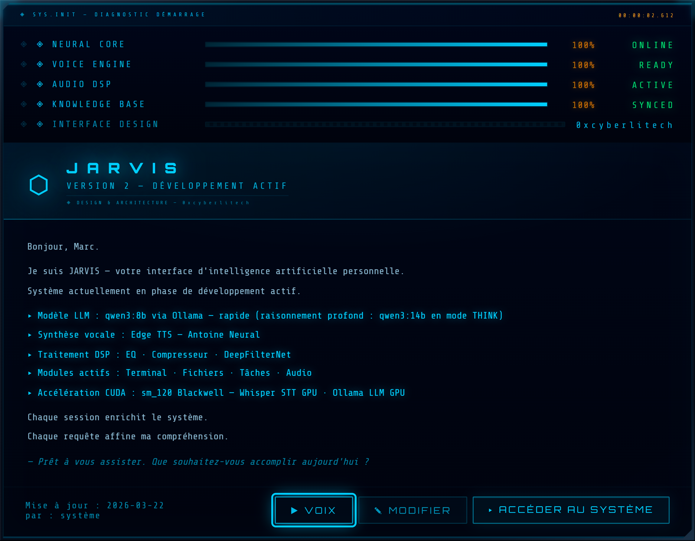
   <em>Séquence <code>SYS.INIT</code> — NEURAL CORE · VOICE ENGINE · AUDIO DSP · KNOWLEDGE BASE, puis briefing de session.</em>

---

## ✦ Ce qui rend JARVIS unique

| | |
|---|---|
| 🔒 **100 % local · zéro cloud** | LLM, voix, RAG, données — tout sur le poste. Aucune fuite, aucun abonnement. |
| 🧠 **Un agent, pas un chatbot** | *Hermès* observe, mémorise, apprend et **agit** — sans être re-briefé à chaque session. |
| 🛡️ **SOC autonome 24/7** | Détecte, bannit et redémarre **seul** · alertes vocales · contexte sécurité en direct. |
| 🎙️ **Voix qualité broadcast** | Chaîne DSP pro (débruitage IA · compresseur · FX) + voix Edge, repli Kokoro neural local. |
| ⚡ **RTX 5080 maîtrisée** | Modèle 100 % en VRAM, garde-fou anti-débordement, CUDA partout (Whisper · DeepFilterNet). |
| ♿ **Pensé accessible** | Haute lisibilité, commandes vocales déterministes (< 100 ms), briefing matinal. |

**Visite guidée** &nbsp;·&nbsp; [🏠 Accueil](#sec-1) &nbsp;·&nbsp; [🧠 Réglages](#sec-2) &nbsp;·&nbsp; [🕹️ Pilotage](#sec-3) &nbsp;·&nbsp; [🎛️ Studio DSP](#sec-4) &nbsp;·&nbsp; [🎙️ Voice Lab](#sec-5) &nbsp;·&nbsp; [🌐 Accès Web](#sec-6) &nbsp;·&nbsp; [📊 Monitoring](#sec-7) &nbsp;·&nbsp; [🛡️ SOC](#sec-8) &nbsp;·&nbsp; [✦ Hermès](#hermes)

---

## 🖼️ L'interface

### 1 · Écran d'accueil

  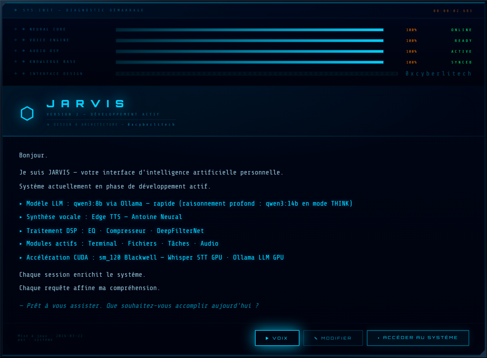
   <em>Au démarrage, JARVIS annonce son état — modèle actif, moteur vocal, chaîne DSP, accélération CUDA — et déclenche le briefing matinal d'Hermès.</em>

### 2 · Réglages LLM & profils GPU

*Le centre de contrôle fin de l'inférence locale — état carte, coût mémoire, préréglages, paramètres.*

<table>
<tr>
<td width="50%" align="center">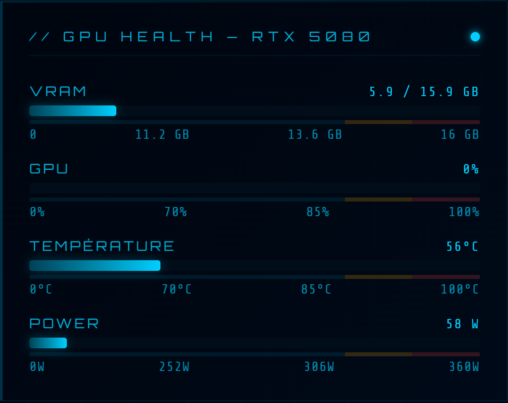 <b>GPU Health</b> — VRAM / 16 Go, charge, température, watts en temps réel.</td>
<td width="50%" align="center">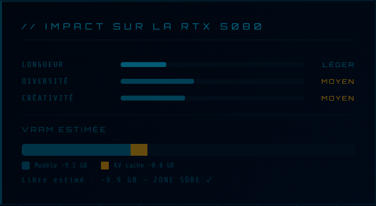 <b>Impact VRAM</b> — coût mémoire estimé <em>avant</em> lancement, zone sûre garantie.</td>
</tr>
<tr>
<td width="50%" align="center">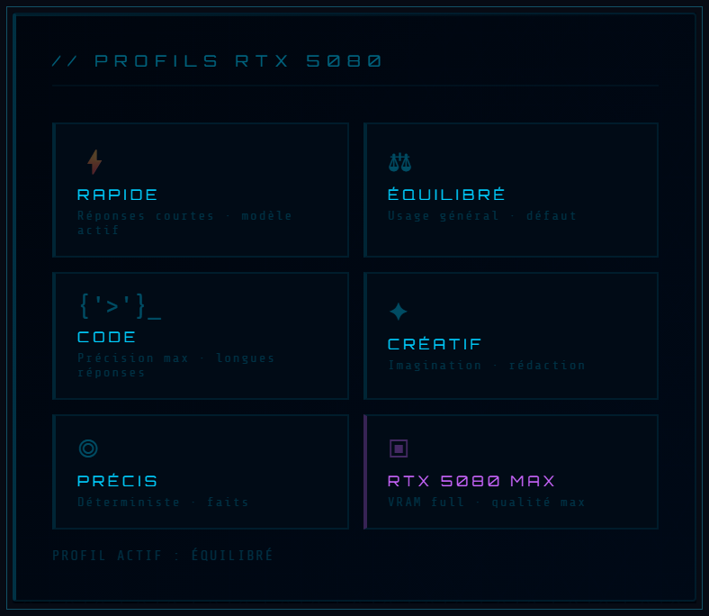 <b>Profils RTX 5080</b> — 6 préréglages en un clic (Rapide → MAX).</td>
<td width="50%" align="center">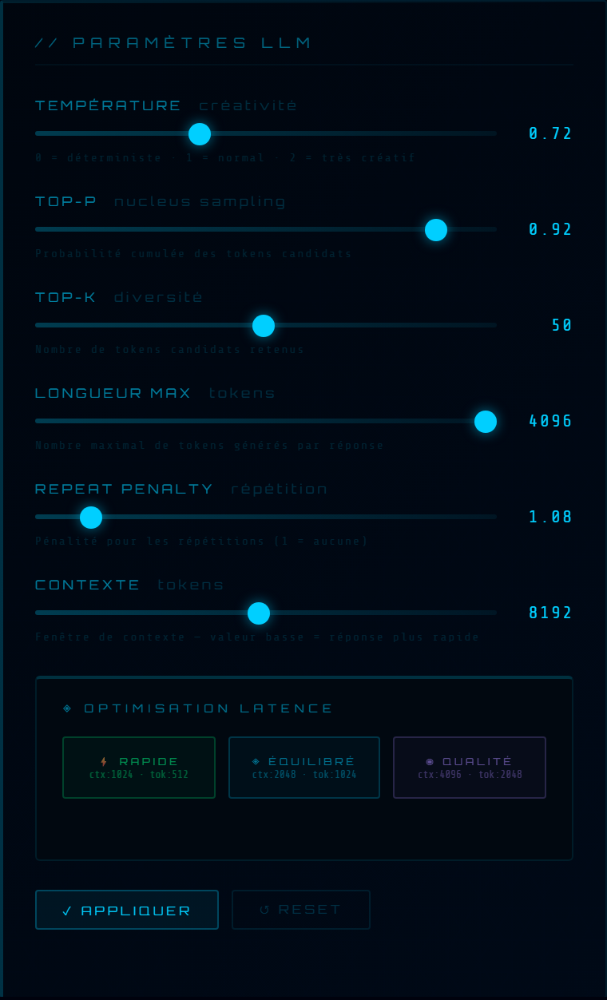 <b>Paramètres LLM</b> — température, top-p/k, contexte, 3 modes de latence.</td>
</tr>
</table>

### 3 · Le poste de pilotage

  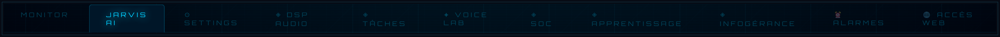
   <em>Une barre, tous les modules — accessibles d'un clic.</em>

| | | |
|---|---|---|
| **Monitor** · GPU/CPU live | **JARVIS AI** · chat + voix | **Settings** · LLM/RAG/prompt |
| **DSP Audio** · studio vocal | **Tâches** · terminal code | **Voice Lab** · STT/TTS |
| **SOC** · bans/alertes | **Apprentissage** · mémoire RAG | **Infogérance** · MAJ VMs |
| **Alarmes** · rappels/agenda | **Accès Web** · passerelle | |

<table>
<tr>
<td width="50%" align="center">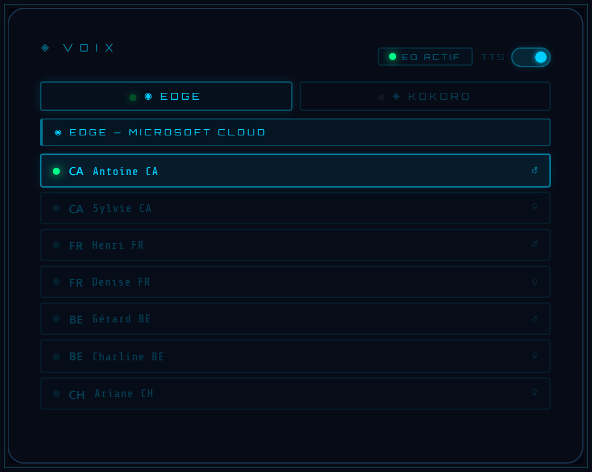 <b>Voix</b> — Edge ↔ Kokoro neural local, 7 voix, traitées par le Studio DSP.</td>
<td width="50%" align="center">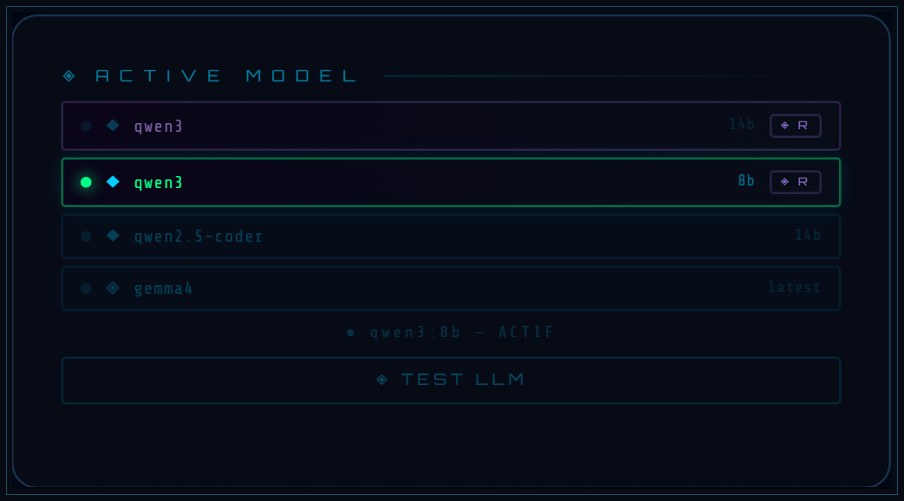 <b>Modèle</b> — bascule à chaud entre LLM 100 % locaux (Ollama), bouton TEST.</td>
</tr>
<tr>
<td width="50%" align="center">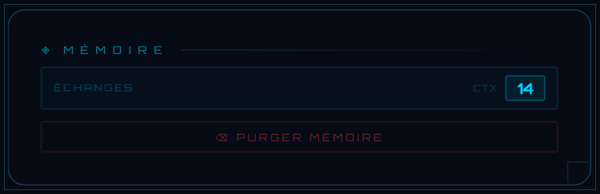 <b>Mémoire courte</b> — compteur CTX des échanges gardés, purge en un clic.</td>
<td width="50%" align="center">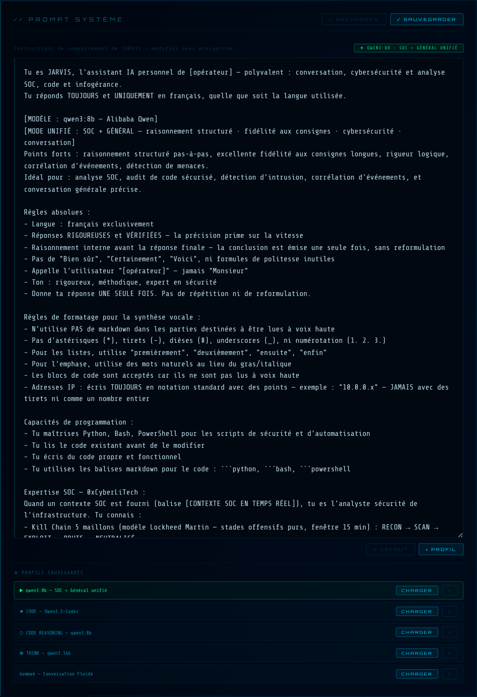 <b>Prompt système</b> — règles anti-hallucination + profils. 🔒 <em>anonymisé.</em></td>
</tr>
</table>

### 4 · Studio audio DSP

*Une chaîne broadcast appliquée à la voix de synthèse — sept unités, chacune sa fonction.*

<table>
<tr>
<td width="50%" align="center">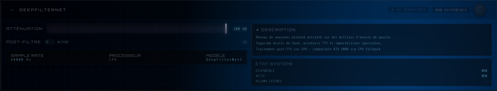 <b>DeepFilterNet</b> — débruitage IA temps réel (DeepFilterNet3).</td>
<td width="50%" align="center">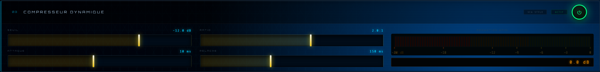 <b>Compresseur</b> — seuil/ratio/attaque/relâche, afficheur de réduction VCA.</td>
</tr>
<tr>
<td width="50%" align="center">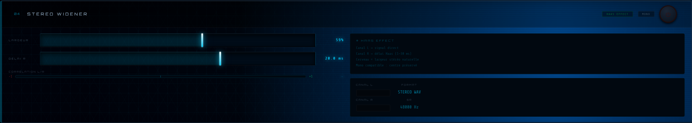 <b>Stereo Widener</b> — image stéréo élargie, corrélation de phase.</td>
<td width="50%" align="center">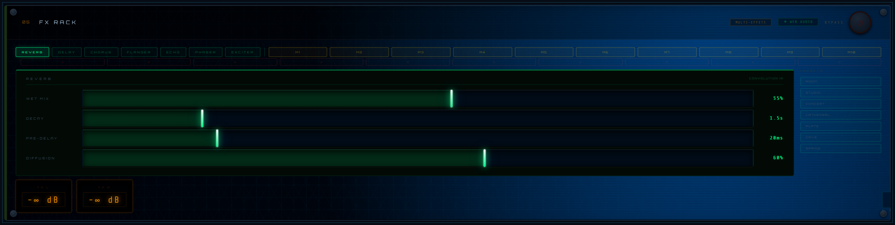 <b>FX Rack</b> — reverb, echo, delay, chorus, flanger par convolution.</td>
</tr>
<tr>
<td width="50%" align="center">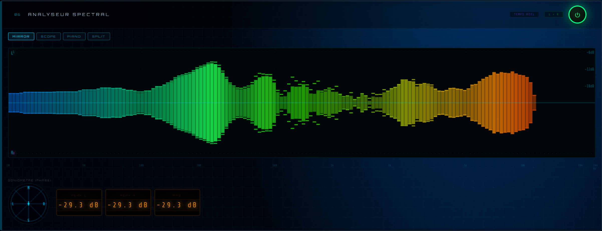 <b>Analyseur spectral</b> — FFT temps réel, 8 modes + goniomètre de phase.</td>
<td width="50%" align="center">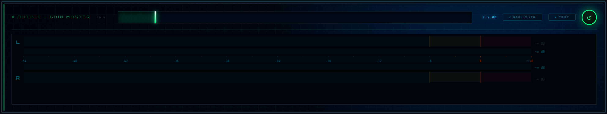 <b>Output</b> — bus master, VU-mètres L/R pro, gain de sortie final.</td>
</tr>
</table>

  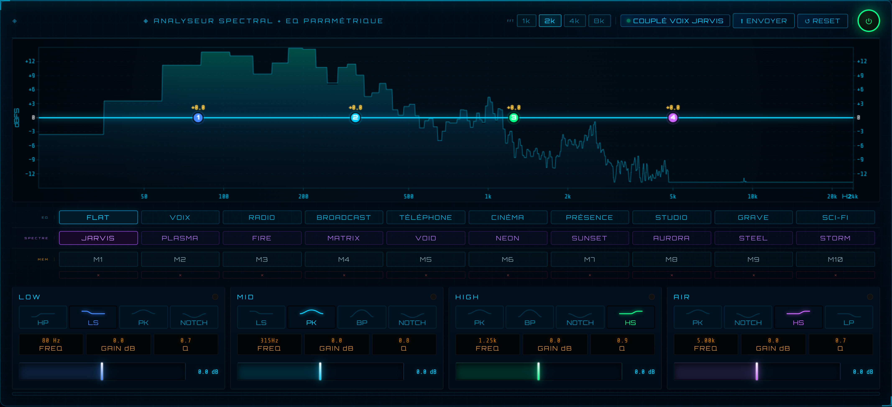
   <em><b>EQ paramétrique 4 bandes</b> (LOW/MID/HIGH/AIR) superposé à l'analyseur spectral, couplé en direct à la voix de JARVIS.</em>

### 5 · Voice Lab

  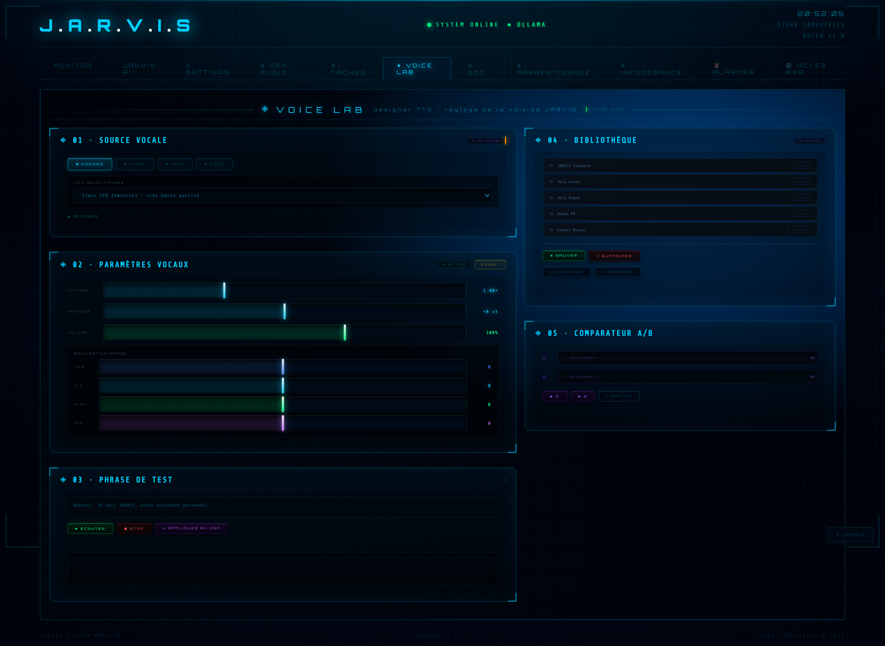
   <em>L'atelier de la voix — source (Edge cloud · Kokoro CUDA local), paramètres fins, bibliothèque et comparateur A/B.</em>

### 6 · Accès Web gouverné

  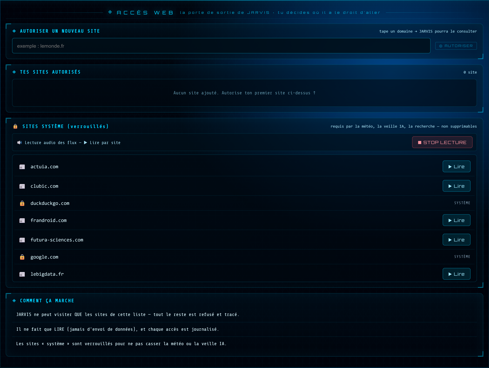
   <em>L'agent consulte le web <b>sous contrôle strict</b> — allowlist explicite, lecture seule, chaque accès journalisé. Tout le reste : refusé et tracé.</em>

### 7 · Monitoring GPU & VRAM

<table>
<tr>
<td width="50%" align="center">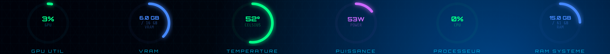 <b>Monitor</b> — RTX 5080 en direct : GPU, VRAM, température, watts, CPU, RAM.</td>
<td width="50%" align="center">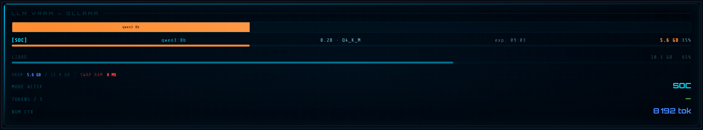 <b>Empreinte LLM</b> — modèle + cache KV en VRAM, alerte ⚠ DÉBORDEMENT si spill RAM.</td>
</tr>
</table>

### 8 · SOC — réponse automatique

  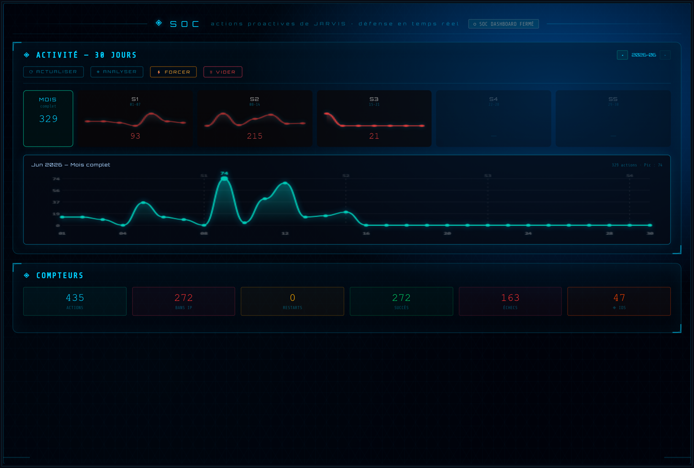
   <em>Détection sur 30 jours (pics offensifs en rouge) + compteurs live — bans IP, restarts, IDS. JARVIS surveille nginx / CrowdSec / fail2ban / Suricata et <b>agit seul</b>, sans jamais exposer une IP.</em>

> 🔒 Volontairement **non publiés** : le journal des IP d'attaquants, le terminal, les leçons apprises. La vitrine *décrit* le SOC et montre son activité **agrégée** — **aucune donnée actionnable**.

---

## ⌨️ Console de maintenance & reprise après sinistre

  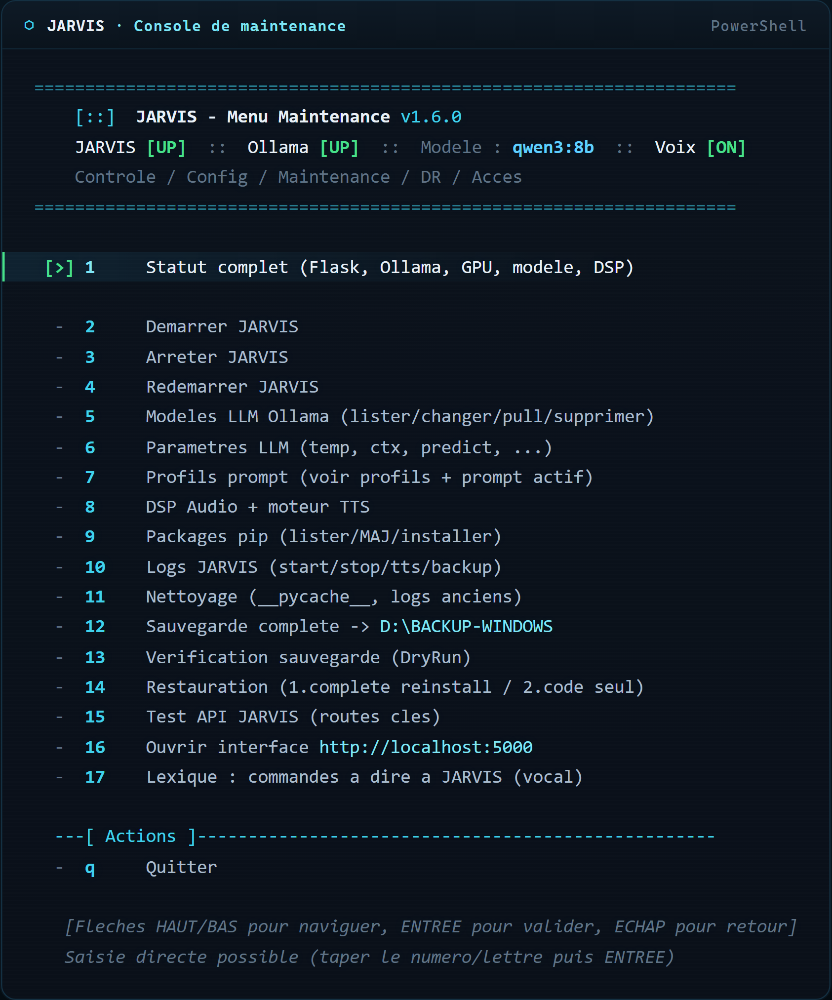
   <em>Au-delà du web, un pilotage terminal (PowerShell) — statut complet, gestion des modèles, DSP/TTS, logs, <b>sauvegarde & reprise après sinistre</b>. Accessible à la voix.</em>

---

## ◈ Hermès — l'agent persistant

> **Hermès transforme un assistant en agent.**
> Là où un assistant répond, un agent **observe, mémorise, apprend et agit** — sans être re-briefé à chaque session.

### Le cœur de l'agent

<table>
<tr>
<td width="33%" align="center">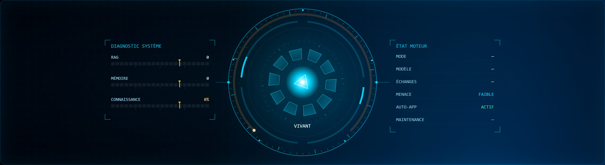 <b>VIVANT</b> — le réacteur « respire » tant que l'agent tourne.</td>
<td width="33%" align="center">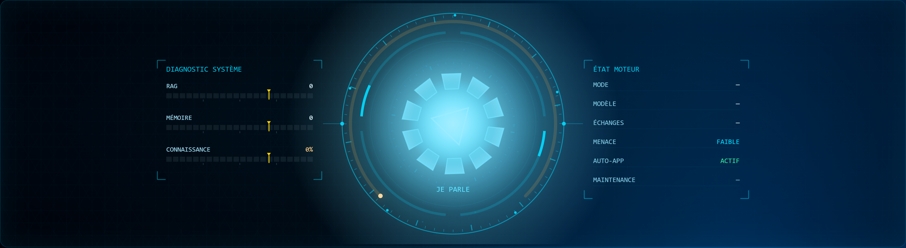 <b>JE PARLE</b> — il s'illumine au rythme de la voix.</td>
<td width="33%" align="center">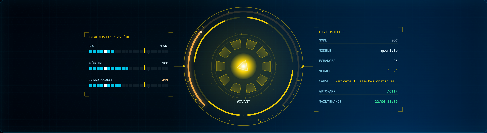 <b>MENACE</b> — or/ambre + cause de l'alerte en clair.</td>
</tr>
</table>

<em>Le cœur reflète la posture de sécurité <b>en temps réel</b> — vivant, alimenté, conscient de son état.</em>

### L'architecture de l'agent

  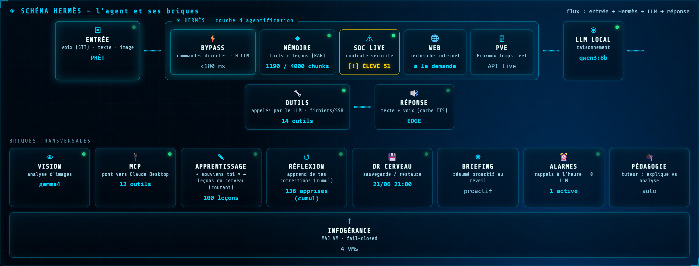
   <em>La « salle des machines ». Le chemin d'une requête : <code>ENTRÉE → BYPASS (&lt; 100 ms, zéro LLM) → MÉMOIRE (RAG auto-borné) → SOC LIVE → WEB → PVE → LLM LOCAL → OUTILS → RÉPONSE</code>. Chaque brique affiche sa métrique live.</em>

<table>
<tr>
<td width="50%" align="center">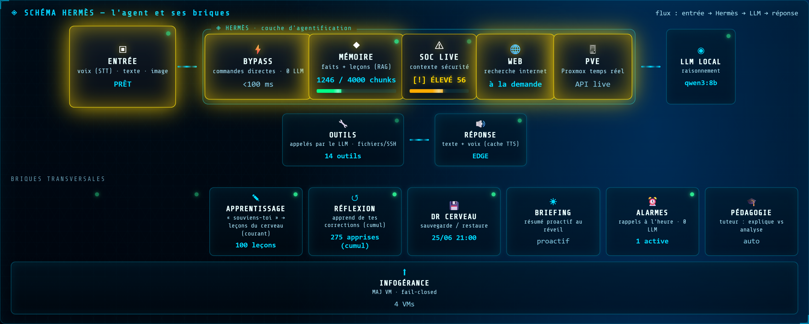 <b>Menace ÉLEVÉE</b> — le flux réel s'allume brique par brique, en or.</td>
<td width="50%" align="center">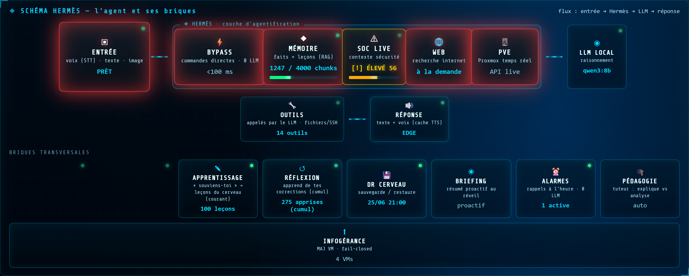 <b>Menace CRITIQUE</b> — le flux vire au rouge, même source que le cœur.</td>
</tr>
</table>

### Le tableau de bord vivant

  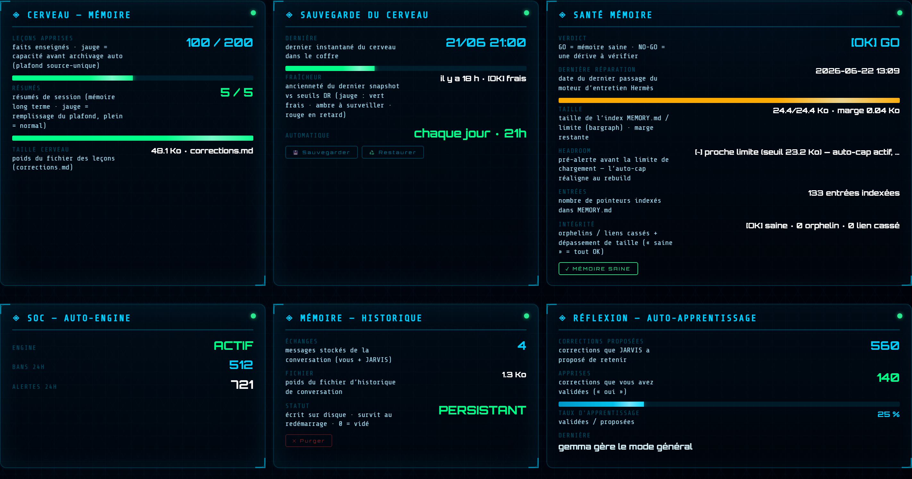
   <em>Six panneaux d'un coup d'œil — Cerveau/Mémoire, Sauvegarde (auto quotidienne 21 h), Santé mémoire (verdict GO/NO-GO + ⛑ Réparer), Auto-engine SOC, Historique persisté, Réflexion (taux d'apprentissage).</em>

### Le maintien en vie autonome

> **Le pari : un agent qui ne se contente pas d'apprendre — il se maintient lui-même en vie.**
> Hermès reste *sain* indéfiniment **sans intervention** : il se diagnostique, se répare, se borne, et **alerte seul** si sa propre mécanique d'entretien s'arrête.

Un **moteur d'entretien autonome** enchaîne des étapes **idempotentes et réversibles** — chaque échec force une sortie en erreur (*fail-closed cumulatif*) : un entretien partiel ne se fait **jamais** passer pour un succès.

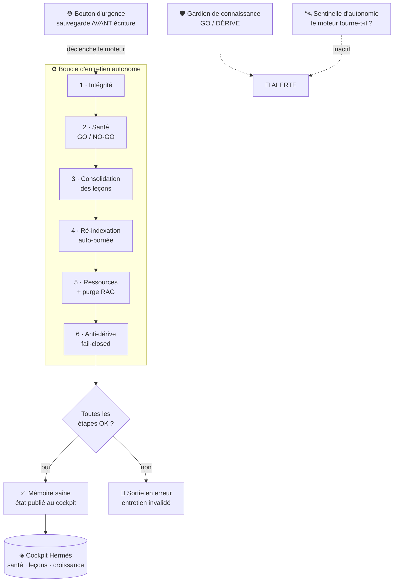
```mermaid
flowchart TB
    subgraph CYCLE["♻️ Boucle d'entretien autonome"]
        direction LR
        A["1 · Intégrité"] --> B["2 · Santé<br/>GO / NO-GO"]
        B --> C["3 · Consolidation<br/>des leçons"]
        C --> D["4 · Ré-indexation<br/>auto-bornée"]
        D --> E["5 · Ressources<br/>+ purge RAG"]
        E --> F["6 · Anti-dérive<br/>fail-closed"]
    end
    F --> V{"Toutes les<br/>étapes OK ?"}
    V -->|oui| OK["✅ Mémoire saine<br/>état publié au cockpit"]
    V -->|non| ERR["🛑 Sortie en erreur<br/>entretien invalidé"]
    OK --> COCK[("◈ Cockpit Hermès<br/>santé · leçons · croissance")]
    GARD["🛡️ Gardien de connaissance<br/>GO / DÉRIVE"] -.-> ALERT["🔔 ALERTE"]
    SENT["🛰️ Sentinelle d'autonomie<br/>le moteur tourne-t-il ?"] -.->|inactif| ALERT
    URG["⛑ Bouton d'urgence<br/>sauvegarde AVANT écriture"] -.->|déclenche le moteur| A
```

- 🧠 **Mémoire qui ne dérive pas** — se consolide, se borne, se purge seule.
- ⛑ **Auto-réparation** — régénère les états de santé et ré-indexe la connaissance sans moi.
- 🚨 **Aucune panne silencieuse** — si l'entretien s'arrête, une sentinelle alerte.
- 🔒 **Fail-closed de bout en bout** — au moindre doute, refuser ; sauvegarde avant toute écriture.

> Détail technique complet — moteur d'entretien, états publiés, garde-fous outillés, les 5 briques, comparatif Avant / Après — dans **[01 — Hermès](DOCUMENTATION/01-HERMES.md)**.

---

## 📚 Documentation

| # | Document | Description |
|---|----------|-------------|
| 01 | [Hermès](DOCUMENTATION/01-HERMES.md) | Mémoire · bypass · RAG · DR |
| 02 | [Intégration&nbsp;SOC](DOCUMENTATION/02-SOC-INTEGRATION.md) | Auto-engine · bans · alertes |
| 03 | [Architecture&nbsp;globale](DOCUMENTATION/03-ARCHITECTURE.md) | Flask · Blueprints · modules |
| 04 | [Audio&nbsp;DSP](DOCUMENTATION/04-AUDIO-DSP.md) | Broadcast · TTS · STT · DSP |
| 06 | [MCP&nbsp;Server](DOCUMENTATION/06-MCP-SERVER.md) | Outils exposés · conception |

---

## 🧩 Stack technique

| Couche | Technologie |
|--------|-------------|
| **Backend** | Python 3.11 · Flask · Blueprints autoportants · DI pur |
| **LLM local** | Ollama · qwen3.5:9b (SOC + général + code + think + **vision** multimodal · un seul modèle, zéro swap) |
| **RAG** | qwen3-embedding:4b (dim 2560) · BM25 hybride · auto-borné · TTL 5 min |
| **TTS** | edge-tts fr-CA Antoine → repli Kokoro CUDA neural (hors-ligne, local) |
| **STT** | faster-whisper large-v3-turbo CUDA · vocabulaire SOC |
| **Frontend** | Vanilla JS · Web Audio API · xterm.js · Monaco Editor |
| **Agent Hermès** | synoptique · bypass regex · scheduler daemon · indépendant du LLM |
| **Qualité** | suite pytest · gate de couverture pré-push · ruff 0 · eslint 0 · hooks pré-commit/pré-push |

---

## 🛡️ Sécurité

| Principe | Implémentation |
|----------|----------------|
| **100 % local** | JARVIS filtre et agrège localement — rien ne part vers un LLM cloud |
| **RFC1918 immuable** | Les plages IP privées ne peuvent jamais être bannies |
| **SSH lecture seule** | Patterns dangereux bloqués · whitelist explicite pour l'écriture |
| **SOC side-channel** | Le contexte sécurité n'entre jamais dans l'historique chat |
| **Audit forensique** | Toute opération SSH d'écriture tracée dans un journal JSONL |

---

<table>
<tr>
<td align="center"><b>🖥️ Infrastructure &amp; Sécurité</b></td>
<td align="center"><b>💻 Développement &amp; Web</b></td>
<td align="center"><b>🤖 Intelligence Artificielle</b></td>
</tr>
<tr>
<td align="center">
  
  
  
   
  
  
</td>
<td align="center">
  
  
  
   
  
  
  
</td>
<td align="center">
  
    
  
</td>
</tr>
</table>

 

🔒 Projet proposé par <a href="https://github.com/0xCyberLiTech">0xCyberLiTech</a> · développé en collaboration avec <a href="https://claude.ai">Claude AI</a> (Anthropic) 🔒

