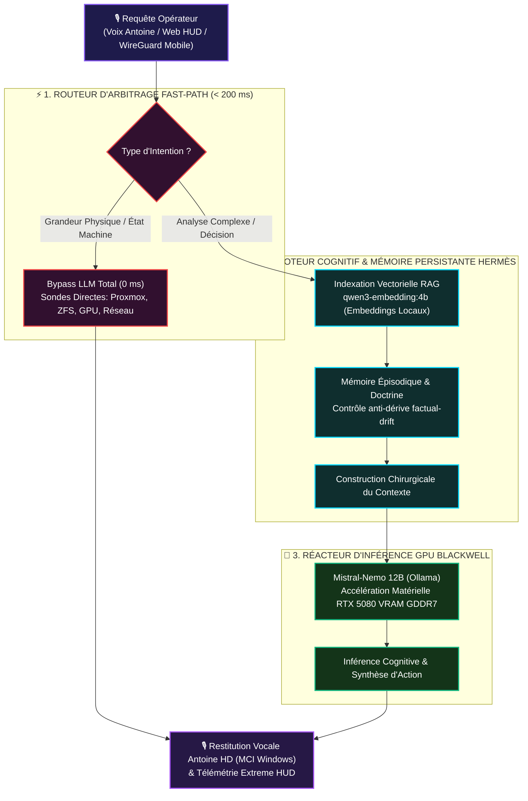
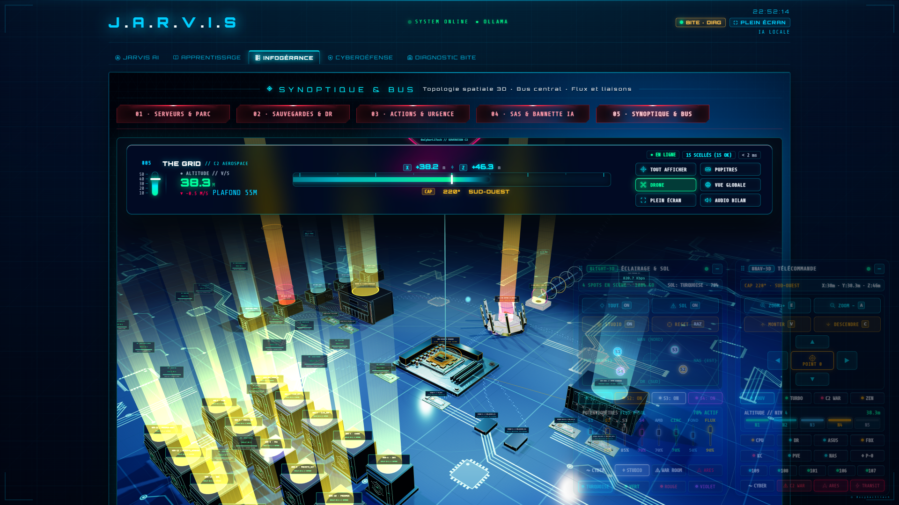
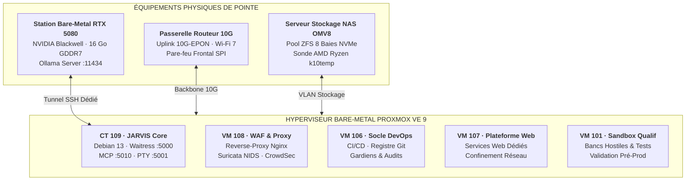
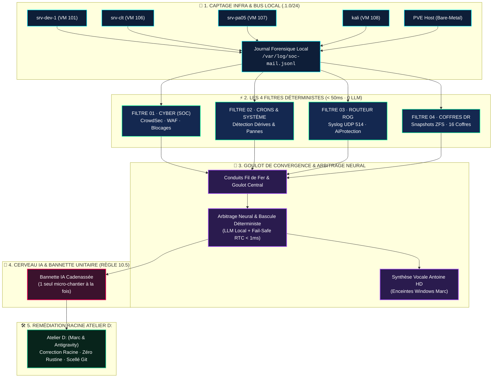
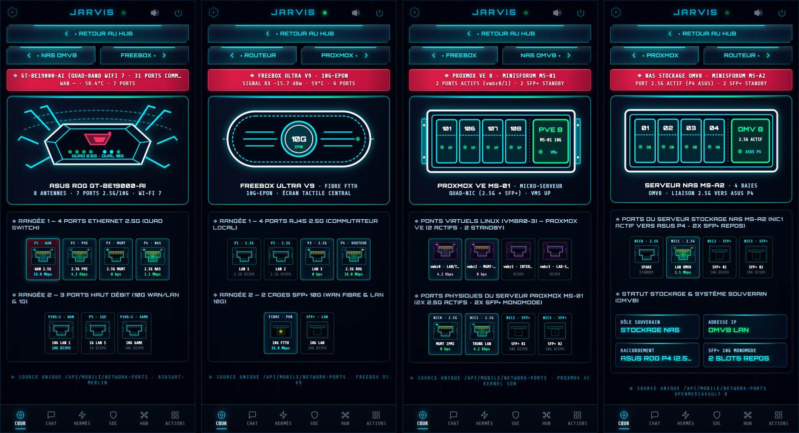
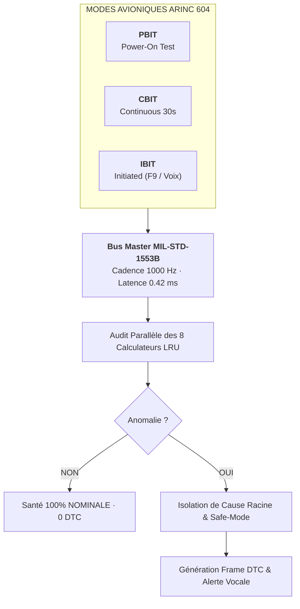

    

  

    

  <h2>Système d'IA Souverain · Cœur Réacteur Autonome · Mémoire Hermès · Multi-GPU Ready · Proxmox VE</h2>

  

    
    
    
    
    
    
  

  

  

    <strong>Agent IA Autonome Serveur</strong>  &nbsp;•&nbsp; <strong>Mémoire Long-Terme Hermès</strong>  &nbsp;•&nbsp; <strong>Réacteur GPU & Déterminisme Proxmox</strong> 
  

> [!IMPORTANT]
> **Vitrine Technologique : Architecture & Démonstration d'Ingénierie**  
> Ce dépôt présente le système d'intelligence artificielle locale **JARVIS** conçu par Marc (0xCyberLiTech). Il expose la doctrine d'ingénierie cognitive, les schémas d'intégration et les interfaces opérationnelles.  
> 📚 **Référentiel d'Ingénierie Maître :** L'intégralité des spécifications d'ingénierie, schémas d'intégration et guides opérationnels des 3 Piliers est exposée en détail ci-dessous.  
> 🔒 **Propriété Intellectuelle & Sécurité Opérationnelle** : Les modèles personnalisés, la base vectorielle interne, les clés privées et les automatisations d'infogérance matérielle restent **strictement confinés** au sein de l'Atelier souverain 0xCyberLiTech.

---

### ⚡ LE POSTE DE COMMANDEMENT COGNITIF — INTERFACE & CŒUR RÉACTEUR

*Console opérationnelle JARVIS en production réelle : onde neurale dynamique, sélection des 6 modes d'inférence, bus de télémétrie sub-seconde et passerelle vocale Antoine HD.*

  
  
  
  
  

---

## 🗺️ Sommaire Pédagogique

- 🎯 [1. Introduction, Genèse & Atouts Serveur : De l'Expérimentation Sonore à l'Agent Autonome Déterministe](#section-1)
- 🧠 [2. L'Agent Cognitif vs Simple Chatbot : La Pile Hermès & Mémoire Persistante](#section-2)
- ⚡ [3. Le Déterminisme Absolu & le Fast-Path Machine (< 200 ms)](#section-3)
- 🌐 [4. La Matrice 3D The Grid & le Blason Cyber (Silicon Metropolis)](#section-4)
- 🤖 [5. La Dualité des Modèles LLM & les Modes d'Inférence Spécialisés](#section-5)
- 🖥️ [6. L'Infogérance Active : Surveillance Proxmox VE, Flotte de VMs & Réseaux](#section-6)
- 🚀 [7. Le Réacteur d'Inférence GPU : RTX 5080 Blackwell & Scalabilité Multi-GPU](#section-7)
- 📱 [8. L'Accessibilité Mobile Nomade via Tunnel Sécurisé WireGuard](#section-8)
- 🎙️ [9. La Voix Souveraine Antoine HD & la Passerelle Native Windows MCI](#section-9)
- 🧪 [10. L'Armure Qualité : Station BITE Avionique, Tests Unitaires & Gardiens](#section-10)
- 📐 [11. Dette Technique Zéro : La Règle d'Or du Plafond des 400 Lignes](#section-11)
- 🔄 [12. Résilience & Sauvegardes DR des Coffres](#section-12)

---

## 1. 🎯 Introduction, Genèse & Atouts Serveur : De l'Expérimentation Sonore à l'Agent Autonome Déterministe

Dans le paysage contemporain de l'intelligence artificielle, l'écrasante majorité des assistants se résume à des clients web connectés à des API distantes (*ChatGPT, Claude, Copilot*). Ces solutions sont par nature tributaires du cloud, aveugles à la topologie des serveurs physiques locaux, et incapables de garantir l'absence d'hallucination lorsqu'il s'agit de gérer une infrastructure réseau ou des données souveraines.

**Ce projet propose une rupture d'ingénierie totale : concevoir un agent cognitif véritablement autonome, ancré dans un serveur dédié Proxmox VE, résolument déterministe et accéléré par des accélérateurs GPU physiques de dernière génération.**

### 🏛️ La Genèse & la Mutation des 2 Derniers Mois

À l'origine de son développement, JARVIS embarquait une suite expérimentale complexe dédiée au traitement du signal sonore (studios DSP, égaliseurs graphiques, compresseurs multibandes, filtres vocaux). Bien qu'instructive, cette surcharge fonctionnelle dispersait l'attention et introduisait une dette technique importante avec beaucoup trop de fonctionnalités hétéroclites.

**Au cours des deux derniers mois, une refonte stratégique majeure a été opérée par Marc et Antigravity : purger intégralement le laboratoire sonore pour recentrer 100 % des ressources et du code sur ce qui constitue son véritable cœur de métier — l'Intelligence Artificielle Souveraine (JARVIS IA).**

### 📊 Matrice d'Évolution : 2 Mois de Transformation Radicale

| Dimension | ⏳ Il y a 2 mois (Labo Audio & Dispersion DSP) | ⚡ Aujourd'hui (Cœur Réacteur JARVIS IA) |
|:---|:---|:---|
| **Cœur de Mission** | Traitement du signal sonore, égaliseurs DSP, multiplicité d'outils audio | **Agent Cognitif IA Dédié** : arbitrage souverain, cyberdéfense & infogérance |
| **Périmètre Applicatif** | Surcharge fonctionnelle, prolifération de modules hétéroclites | **Recentrage chirurgical** : chaque ligne de code sert l'intelligence machine |
| **Gestion Cognitive** | Pas de mémoire structurée, requêtes éphémères isolées | **Pile Hermès & RAG Vectoriel** : apprentissage continu et mémoire long-terme |
| **Vitesse d'Exécution** | Temps de réponse aléatoires, latences de traitement | **Fast-Path Déterministe** : résolution machine en **< 200 ms** (0 hallucination) |
| **Supervision Système** | Supervision passive ou cloisonnée | **Infogérance vivante** : pilotage Proxmox VE, VMs, passerelles et matrice 3D |
| **Accélération Matérielle** | Sollicitation CPU dispersée | **Inférence Tensor/CUDA** : exploitation directe du GPU NVIDIA RTX 5080 |
| **Architecture Code** | Fichiers volumineux avec dette technique résiduelle | **Dette Zéro** : règle d'or inviolable des $\le 400$ lignes par module |

### 🖥️ Les Atouts Déterminants du Déploiement en Mode Serveur Autonome

JARVIS n'est pas un script exécuté ponctuellement dans une session utilisateur : **c'est un service d'infrastructure autonome 24h/24**.
1. **Socle Bare-Metal Proxmox VE 9 (CT 109) :** Hébergé sur un conteneur Debian 13 dédié, propulsé par le serveur WSGI multithreadé haute performance `Waitress`, JARVIS maintient son écoute et sa supervision en permanence, même lorsque tous les postes clients de l'opérateur sont éteints.
2. **Déterminisme Strict Sans Hallucination (< 200 ms) :** Pour les grandeurs réelles (CPU %, thermie, volumes ZFS, flux réseau, bannières), le modèle LLM a **interdiction formelle d'intervenir**. Les requêtes sont traitées par le Fast-Path déterministe en code machine pur à la milliseconde.
3. **Réacteur GPU Présent & Conception Native Multi-GPU :**
   - Actuellement accéléré par un GPU physique de dernière génération **NVIDIA GeForce RTX 5080 (16 Go GDDR7 architecture Blackwell)**.
   - **Multi-GPU Ready dès l'Origine :** L'architecture du gestionnaire d'inférence sépare les canaux d'embeddings vectoriels (`Qwen3-Embedding 4B`) et de génération textuelle (`Mistral-Nemo 12B`). Elle est d'ores et déjà modélisée pour répartir dynamiquement la charge sur **un pool de plusieurs GPU physiques ou vGPU virtualisés** au fur et à mesure de l'expansion du cluster.
4. **Accessibilité Universelle Bi-Frontière :**
   - **Poste Grand Écran :** Cockpit Extreme HUD avec onde neurale vivante et matrice 3D The Grid.
   - **Mobilité Nomade :** Application PWA tactile dédiée (`/m`) avec réacteur Arc Reactor actif sous tunnel chiffré VPN WireGuard.

| Axe d'Évaluation | Chatbot Générique Ordinaire | Agent Serveur Autonome JARVIS |
|:-----------------|:----------------------------|:------------------------------|
| **Mémoire Conversationnelle** | Éphémère, réinitialisée à chaque session | **Persistante (Pile Hermès)** : capitalisation continue des faits et retours |
| **Exécution & Faits** | Hallucinations fréquentes, estimations vagues | **Fast-Path Déterministe** : 0 LLM sur les états matériels et chiffrés |
| **Périmètre Opérationnel** | Confiné dans une boîte de texte isolée | **Infogérance vivante** : lecture continue de Proxmox VE, VMs et pare-feux |
| **Mode d'Exécution** | Déclenché manuellement sur une session client | **Démon Serveur Autonome 24h/24** hébergé sur conteneur PVE 9 |
| **Accélération Matérielle** | Dépendant d'une API tierce distante | **Local GPU RTX 5080 Blackwell** & architecture **Multi-GPU Ready** |
| **Souveraineté des Données** | Dépendance totale aux serveurs distants | **100 % Local & Déconnectable** : 0 octet expédié dans un cloud tiers |
| **Accessibilité Opérateur** | Interface web bureautique unique | **Bi-frontière** : Cockpit Extreme HUD grand écran et interface mobile VPN |

---

## 2. 🧠 L'Agent Cognitif vs Simple Chatbot : La Pile Hermès & Mémoire Persistante

Ce qui sépare fondamentalement JARVIS d'un modèle de langage standard, c'est son architecture cognitive articulée autour de la **Pile Hermès** :

```mermaid
flowchart TD
    classDef client fill:#1e1b4b,stroke:#8b5cf6,stroke-width:2px,color:#fff;
    classDef fastpath fill:#31102f,stroke:#ef4444,stroke-width:2px,color:#fff;
    classDef rag fill:#0f2e2e,stroke:#00d9ff,stroke-width:2px,color:#fff;
    classDef gpu fill:#143419,stroke:#10b981,stroke-width:2px,color:#fff;
    classDef output fill:#261845,stroke:#a855f7,stroke-width:2px,color:#fff;

    REQ["🎙️ Requête Opérateur<br/>(Voix Antoine / Web HUD / WireGuard Mobile)"]:::client

    subgraph FastPath["⚡ 1. ROUTEUR D'ARBITRAGE FAST-PATH (< 200 ms)"]
        FP_DECIDE{"Type d'Intention ?"}:::fastpath
        FP_FACT["Bypass LLM Total (0 ms)<br/>Sondes Directes: Proxmox, ZFS, GPU, Réseau"]:::fastpath
    end

    subgraph Cognitive["🧠 2. MOTEUR COGNITIF & MÉMOIRE PERSISTANTE HERMÈS"]
        RAG_VEC["Indexation Vectorielle RAG<br/>qwen3-embedding:4b (Embeddings Locaux)"]:::rag
        HERMES_MEM["Mémoire Épisodique & Doctrine<br/>Contrôle anti-dérive factual-drift"]:::rag
        CTX_BUILD["Construction Chirurgicale du Contexte"]:::rag
    end

    subgraph Reacteur["🚀 3. RÉACTEUR D'INFÉRENCE GPU BLACKWELL"]
        LLM_GPU["Mistral-Nemo 12B (Ollama)<br/>Accélération Matérielle RTX 5080 VRAM GDDR7"]:::gpu
        REASON["Inférence Cognitive & Synthèse d'Action"]:::gpu
    end

    OUT["🎙️ Restitution Vocale Antoine HD (MCI Windows)<br/>& Télémétrie Extreme HUD"]:::output

    REQ --> FP_DECIDE
    FP_DECIDE -->|Grandeur Physique / État Machine| FP_FACT
    FP_FACT --> OUT
    FP_DECIDE -->|Analyse Complexe / Décision| RAG_VEC
    RAG_VEC --> HERMES_MEM
    HERMES_MEM --> CTX_BUILD
    CTX_BUILD --> LLM_GPU
    LLM_GPU --> REASON
    REASON --> OUT
```

*Console d'apprentissage Hermès : monitoring du cœur d'activité cognitive, graphes de croissance vectorielle, distribution des connaissances et pulse RAG en direct.*

### Les Capacités Maîtresses d'Hermès :
* **Apprentissage Incrémental Continu :** Chaque directive, correction ou fait d'infrastructure validé par Marc est scellé dans la mémoire persistante d'Hermès. JARVIS ne perd jamais son contexte entre deux sessions.
* **Audit Déterministe de Mémoire :** Un gardien dédié (`jarvis-knowledge-audit.py`) vérifie en continu l'absence de dérive, de contradiction ou de factual drift entre la mémoire stockée et la réalité machine.

---

## 3. ⚡ Le Déterminisme Absolu & le Fast-Path Machine (< 200 ms)

Dans un centre de commandement, l'erreur ou l'approximation n'est pas tolérée. Si l'opérateur interroge JARVIS sur l'état de l'onduleur, la mémoire vive libre sur Proxmox ou le statut des sauvegardes nocturnes, **le modèle de langage a interdiction formelle d'intervenir**.

* **Le Principe du Fast-Path Déterministe :**
  Les requêtes portant sur des grandeurs physiques ou des états machine sont interceptées dès l'entrée par des parseurs déterministes. Le système interroge directement les APIs internes, les sockets Unix et les sondes matérielles, formulant une réponse certifiée en **moins de 200 millisecondes**.
* **Zéro Hallucination Garantie :**
  En séparant strictement les tâches de calcul factuel (code direct) et les tâches de raisonnement sémantique (LLM), JARVIS élimine à la racine 100 % des hallucinations propres aux intelligences génératives.

---

## 4. 🌐 La Matrice 3D The Grid & le Blason Cyber (Silicon Metropolis)

Pour piloter l'architecture complexe du homelab d'un seul regard, JARVIS intègre **The Grid**, une matrice topologique tridimensionnelle développée en **Three.js pur** :

*The Grid (Silicon Metropolis) : modélisation spatiale 3D interactive de l'infrastructure homelab, Central Switch virtuel, 4 anneaux VLANs, nœud hyperviseur et Blason Cyber souverain.*

### Les Composants de la Scène 3D :
* **Le Central Switch & les 4 Anneaux VLANs :** Représentation volumétrique des flux réseau isolant le réseau de gestion, la zone DMZ publique, le segment de stockage sécurisé et le réseau d'inférence IA.
* **Le Blason Protecteur Souverain :** Bouclier holographique central matérialisant l'état de défense active du homelab. Sa pulsation chromatique réagit instantanément aux alertes de sécurité et aux blocages de flux hostiles.
* **Contrôles de Vol & Pupitres Flottants :** Navigation orbitale fluide à 60 FPS, gestion dynamique des éclairages de scène (spots de zone, contraste au sol) et cadrage automatique sur les équipements en alerte.

---

## 5. 🤖 La Dualité des Modèles LLM & les Modes d'Inférence Spécialisés

Loin d'imposer un modèle unique et rigide pour l'ensemble des cas d'usage, JARVIS orchestre une flotte de modèles d'inférence spécialisés :

* **Mode Raisonnement Approfondi (Mistral-Nemo 12B) :** Modèle d'élite quantifié, déployé sur le GPU local avec un contexte de travail étendu. Il dissèque les requêtes d'ingénierie, les plans de refactoring et les logs forensiques complexes.
* **Mode Embeddings Haute Densité (Qwen3-Embedding 4B) :** Moteur vectoriel dédié au calcul de similarité cosinus et à l'indexation sémantique des documents de doctrine de l'Atelier.
* **Les 6 Modes Opérationnels au Bouton :**
  1. *Mode SOC :* Corrélation de menaces, analyse de signatures et support aux contre-mesures.
  2. *Mode Infogérance :* Diagnostic d'équipements, santé système et aide à la remédiation.
  3. *Mode Général :* Échanges interactifs, gestion des tâches et synthèse vocale.
  4. *Mode Code :* Refactoring strict $\le 400$ lignes, revue de syntaxe et respect des linters.
  5. *Mode Think :* Raisonnement pas-à-pas avec réflexion explicite (*chain-of-thought*).
  6. *Mode Web :* Moissonnage documentaire sécurisé et veille technologique en circuit fermé.

---

## 6. 🖥️ L'Infogérance Active : Surveillance Proxmox VE, Flotte de VMs & Réseaux

JARVIS agit comme un copilote d'exploitation vigilant pour l'ensemble du homelab de Marc :

```mermaid
flowchart TB
    subgraph PVE["HYPERVISEUR BARE-METAL PROXMOX VE 9"]
        CT109["<b>CT 109 · JARVIS Core</b><br/>Debian 13 · Waitress :5000<br/>MCP :5010 · PTY :5001"]
        VM108["<b>VM 108 · WAF & Proxy</b><br/>Reverse-Proxy Nginx<br/>Suricata NIDS · CrowdSec"]
        VM106["<b>VM 106 · Socle DevOps</b><br/>CI/CD · Registre Git<br/>Gardiens & Audits"]
        VM107["<b>VM 107 · Plateforme Web</b><br/>Services Web Dédiés<br/>Confinement Réseau"]
        VM101["<b>VM 101 · Sandbox Qualif</b><br/>Bancs Hostiles & Tests<br/>Validation Pré-Prod"]
    end

    subgraph PHYSICAL["ÉQUIPEMENTS PHYSIQUES DE POINTE"]
        ROUTER["<b>Passerelle Routeur 10G</b><br/>Uplink 10G-EPON · Wi-Fi 7<br/>Pare-feu Frontal SPI"]
        NAS["<b>Serveur Stockage NAS OMV8</b><br/>Pool ZFS 8 Baies NVMe<br/>Sonde AMD Ryzen k10temp"]
        GPU_HOST["<b>Station Bare-Metal RTX 5080</b><br/>NVIDIA Blackwell · 16 Go GDDR7<br/>Ollama Server :11434"]
    end

    ROUTER <-->|Backbone 10G| PVE
    NAS <-->|VLAN Stockage| PVE
    GPU_HOST <-->|Tunnel SSH Dédié| CT109
```

* **Supervision Directe de l'Hyperviseur :** Auscultation continue des charges CPU, allocation RAM et état de santé du nœud bare-metal Proxmox VE.
* **Flotte de VMs Confinées :** Suivi individualisé du Reverse Proxy Nginx, de la Sandbox de qualification, du conteneur d'inférence et des passerelles réseau.

   
  
   
  <em>Pupitre de Convergence // Sas & Triage IA : Sanctuarisation de la boîte personnelle de Marc (0 SMTP sortant), Goulot des 4 filtres déterministes (< 50ms), Bannette unitaire anti-fatigue et registre de remédiation Atelier D:.</em>
    

### 🏛️ Pupitre de Convergence & Sas Forensique : L'Analyse Brique par Brique

L'une des plus grandes innovations d'ingénierie de JARVIS réside dans sa capacité à **sanctuariser la boîte personnelle de l'opérateur** en dérivant 100% des signaux d'alertes des serveurs et crons vers un bus local souverain.

```mermaid
flowchart TD
    classDef capt fill:#0e1e38,stroke:#00f0ff,stroke-width:1.5px,color:#fff;
    classDef filtre fill:#142850,stroke:#00ff9d,stroke-width:1.5px,color:#fff;
    classDef goulot fill:#2a1b4e,stroke:#a855f7,stroke-width:2px,color:#fff;
    classDef ia fill:#3b122d,stroke:#ff0055,stroke-width:2px,color:#fff;
    classDef atelier fill:#08241b,stroke:#10b981,stroke-width:2px,color:#fff;

    subgraph CAPTAGE["📡 1. CAPTAGE INFRA & BUS LOCAL (.1.0/24)"]
        S1["srv-dev-1 (VM 101)"]:::capt
        S2["srv-clt (VM 106)"]:::capt
        S3["srv-pa05 (VM 107)"]:::capt
        S4["kali (VM 108)"]:::capt
        S5["PVE Host (Bare-Metal)"]:::capt
        LOGS["Journal Forensique Local<br/><code>/var/log/soc-mail.jsonl</code>"]:::capt
    end

    subgraph FILTRES["⚡ 2. LES 4 FILTRES DÉTERMINISTES (< 50ms · 0 LLM)"]
        F1["FILTRE 01 · CYBER (SOC)<br/>CrowdSec · WAF · Blocages"]:::filtre
        F2["FILTRE 02 · CRONS & SYSTÈME<br/>Détection Dérives & Pannes"]:::filtre
        F3["FILTRE 03 · ROUTEUR ROG<br/>Syslog UDP 514 · AiProtection"]:::filtre
        F4["FILTRE 04 · COFFRES DR<br/>Snapshots ZFS · 16 Coffres"]:::filtre
    end

    subgraph CONVERGENCE["🔀 3. GOULOT DE CONVERGENCE & ARBITRAGE NEURAL"]
        PIPE["Conduits Fil de Fer & Goulot Central"]:::goulot
        ARBITRE["Arbitrage Neural & Bascule Déterministe<br/>(LLM Local + Fail-Safe RTC < 1ms)"]:::goulot
        VOIX["Synthèse Vocale Antoine HD<br/>(Enceintes Windows Marc)"]:::goulot
    end

    subgraph GOUVERNANCE["🧠 4. CERVEAU IA & BANNETTE UNITAIRE (RÈGLE 10.5)"]
        BANNETTE["Bannette IA Cadenassée<br/>(1 seul micro-chantier à la fois)"]:::ia
    end

    subgraph REMEDIATION["🛠️ 5. REMÉDIATION RACINE ATELIER D:"]
        ATELIER["Atelier D: (Marc & Antigravity)<br/>Correction Racine · Zéro Rustine · Scellé Git"]:::atelier
    end

    S1 & S2 & S3 & S4 & S5 --> LOGS
    LOGS --> F1 & F2 & F3 & F4
    F1 & F2 & F3 & F4 --> PIPE
    PIPE --> ARBITRE
    ARBITRE --> VOIX
    ARBITRE --> BANNETTE
    BANNETTE --> ATELIER
```

#### 1. Brique #INF-07 · Pupitre de Convergence & Compteurs Étalons
* **908 Mails Épargnés (28j) :** Volume réel de courriels d'exploitation interceptés et neutralisés localement (zéro fuite vers la messagerie personnelle).
* **4 577 Signaux Absorbés Bus :** Télémétrie brute captée par le bus local et analysée sans saturation réseau.
* **0 En Cours & 100% Fiabilisation Racine :** Garantie qu'aucune anomalie n'est laissée avec une rustine temporaire.

#### 2. Brique #INF-10 · Goulot de Convergence & 4 Filtres Déterministes (< 50 ms)
Le code machine direct évalue les états en **moins de 50 ms sans solliciter le LLM** :
* **Filtre 01 · Cyber (SOC) :** Corrélation en direct avec la Kill Chain et CrowdSec (270 événements, 0 fuite SMTP).
* **Filtre 02 · Crons & Système :** Surveillance des tâches planifiées des VMs Linux et de l'hyperviseur (3 638 événements filtrés, élimination des faux positifs récurrents).
* **Filtre 03 · Routeur ROG :** Trames Syslog UDP 514 issues du routeur central Wi-Fi 7 et des modules de sécurité AiProtection Trend Micro (133 événements).
* **Filtre 04 · Coffres DR :** Contrôle de fraîcheur et de cohérence des 16 coffres souverains de sauvegarde PVE & NAS OMV8 (39 signaux, 100% GO).

#### 3. Conduits Fil de Fer & Arbitrage Neural Fail-Safe (< 1 ms)
* **Esthétique Vectorielle Fil de Fer :** Héritée des coffres-forts DR de haute précision, matérialisant les flux d'ingestion sous forme de conduits convergents.
* **Double Circuit :** Le moteur dispose d'un basculement immédiat (RTC swap < 1ms) : le modèle neural est encadré par des gardiens déterministes inviolables. Les alertes critiques sont synthétisées vocalement par **Antoine HD** sur les enceintes de l'opérateur via le moteur MCI Windows sans dépendance de navigateur.

#### 4. Brique #INF-01 · Captage Infra & Bus Local (.1.0/24)
Auscultation passive continue des 5 machines clés du réseau (`srv-dev-1`, `srv-clt`, `srv-pa05`, `kali`, `PVE Host`) dérivée vers le journal forensique `/var/log/soc-mail.jsonl`.

#### 5. Brique #INF-08 · Cerveau IA & Bannette Unitaire (Règle 10.5)
* **Principe de l'Alimentation Mesurée :** Pour préserver la clarté d'esprit de l'opérateur et éviter toute fatigue décisionnelle, la Bannette IA ne présente **qu'un seul micro-chantier prioritaire à la fois**. Quand le homelab est sain, la file est 100% vidée.

#### 6. Brique #INF-09 · Remédiation Atelier D: (Règle 14)
* **Mandat Exclusif Atelier D: :** JARVIS reste confiné en lecture seule. L'infogérance active (remédiations, modifications système) est opérée exclusivement dans l'Atelier `D:\0xCyberLiTech` avec preuve machine et scellement Git.
* **Registre Workflow Immuable :** Chaque action exécutée est horodatée UTC avec sa commande et sa preuve déterministe.

#### 7. Sas Forensique Temps Réel (`/var/log/soc-mail.jsonl`)
Un terminal déroulant en bas de page permet d'examiner en direct les événements bruts Jsonl pour une traçabilité forensic absolue.

---

## 7. 🚀 Le Réacteur d'Inférence GPU : RTX 5080 Blackwell & Scalabilité Multi-GPU

Pour garantir une disponibilité totale et prévenir tout goulot d'étranglement matériel lors des sessions d'inférence lourdes, JARVIS intègre un module de monitoring matériel et d'orchestration GPU de haute précision :

*Monitoring haute précision du réacteur matériel : consommation énergétique, thermie des cœurs Tensor, remplissage VRAM GDDR7 et oscilloscopes de charge en temps réel.*

* **Surveillance VRAM Dédiée :** Mesure instantanée de l'empreinte mémoire des modèles chargés sous Ollama (éliminant tout risque d'éviction ou de débordement vers la mémoire système).
* **Oscilloscopes de Puissance & Fréquence :** Visualisation continue des variations de wattage et de température du GPU NVIDIA RTX 5080 (architecture Blackwell).
* **Architecture Conçue pour le Multi-GPU (Multi-GPU Ready) :**
  L'abstraction du réacteur d'inférence isole la couche de calcul du reste du système. Elle est d'ores et déjà prête à orchestrer un cluster de plusieurs accélérateurs GPU physiques ou instances vGPU :
  - **GPU Primaire :** Modèle de raisonnement cognitif approfondi (`Mistral-Nemo 12B` ou modèles de réflexion profonds).
  - **GPU Secondaire / Cluster :** Vectorisation continue à haut débit (`Qwen3-Embedding 4B`) et indexation RAG en tâche de fond sans ralentir la conversation active.

---

## 8. 📱 L'Accessibilité Mobile Nomade via Tunnel Sécurisé WireGuard

Parce qu'un centre de commande doit rester joignable en toute circonstance, JARVIS propose une **interface mobile native et responsive** (`/m`), conçue pour le confort tactile et utilisable en déplacement :

 <em>Interface tactile mobile JARVIS : ergonomie pensée pour le pouce, Cœur Réacteur Arc Reactor vivant, sélection instantanée des modes et dialogue vocal chiffré via VPN WireGuard.</em>

  

 <em>Télémétrie & Borniers Réseau Vectoriels en Temps Réel : Routeur ASUS ROG GT-BE19000-AI, Freebox Ultra v9 (10G-EPON), Hyperviseur Proxmox VE MS-01 et Serveur NAS MS-A2 (OMV8). Diodes IEEE 802.3 animées au débit physique réel.</em>

* **Connexion Chiffrée de Bout en Bout :** L'accès mobile s'effectue exclusivement au travers d'un tunnel VPN souverain (WireGuard privé), sans aucune exposition de port direct sur Internet.
* **Ergonomie Pensée pour le Pouce :** Vue compactée, accès rapide aux synthèses de santé, déclenchement vocal mobile et bascule instantanée entre les modes opérationnels.

---

## 9. 🎙️ La Voix Souveraine Antoine HD & la Passerelle Native Windows MCI

L'accessibilité étant une priorité cardinale (l'ergonomie étant spécialement conçue pour un confort auditif et un retour vocal immédiat de l'opérateur), JARVIS privilégie le **canal audio direct** comme vecteur d'information prioritaire :

* **Synthèse Vocale Haute Fidélité :** Voix naturelle d'Antoine HD générée localement et relayée instantanément.
* **Moteur Natif Windows MCI :** La diffusion sonore s'effectue directement au niveau du système d'exploitation de la station hôte via l'API multimédia MCI de Windows, sans dépendre du navigateur ni nécessiter qu'un onglet web reste actif au premier plan.
* **Hiérarchie Vocale d'Urgence :** Les alertes critiques coupent immédiatement les annonces de statut standard pour transmettre l'information de défense prioritaire.

---

## 10. 🧪 L'Armure Qualité : Station BITE Avionique, Tests Unitaires & Gardiens

Inspirée directement de l'ingénierie aéronautique et spatiale (**ARINC 604 & MIL-STD-1553B**), la **Station BITE MK-IX** (*Built-In Test Equipment*) est le calculateur central de diagnostic autonome de JARVIS :

```mermaid
flowchart TD
    subgraph MODES["MODES AVIONIQUES ARINC 604"]
        PBIT["<b>PBIT</b><br/>Power-On Test"]
        CBIT["<b>CBIT</b><br/>Continuous 30s"]
        IBIT["<b>IBIT</b><br/>Initiated (F9 / Voix)"]
    end

    MODES --> BUS["<b>Bus Master MIL-STD-1553B</b><br/>Cadence 1000 Hz · Latence 0.42 ms"]
    BUS --> AUDIT["Audit Parallèle des 8 Calculateurs LRU"]
    
    AUDIT --> VERDICT{"Anomalie ?"}
    VERDICT -- NON --> NOMINAL["Santé 100% NOMINALE · 0 DTC"]
    VERDICT -- OUI --> ISOLATE["Isolation de Cause Racine & Safe-Mode"]
    ISOLATE --> DTC["Génération Frame DTC & Alerte Vocale"]
```

### Les 3 Sous-Interfaces Maîtresses de la Station BITE :

#### 🧰 Sous-Page 01 · Le Pupitre des 8 Calculateurs LRU
Auscultation temps réel des 8 boîtiers électroniques d'infrastructure avec cabochons LED 3D et jauges segmentées :

*Sous-Page 01 : Pupitre des 8 calculateurs LRU avec statut télémétrique haute fidélité.*

#### ⚡ Sous-Page 02 · Le Synoptique Vectoriel SVG (MIL-STD-1553B)
Schéma de bord vectoriel cadencé à 1000 Hz visualisant le bus principal 10 Gbps (CAN-A) et le canal de secours redondant 1 Gbps (CAN-B) :

*Sous-Page 02 : Synoptique vectoriel SVG du double magistral MIL-STD-1553B et des 8 calculateurs LRU reliés au Bus Master central.*

#### 🔬 Sous-Page 03 · Le Banc d'Épreuve Didactique & Matrice DTC
Laboratoire de simulation d'avaries réelles (Fibre WAN, WAF Nginx, GPU Blackwell, Sonde NAS), Annunciator Lamp Test et registre officiel des codes défauts normalisés :

*Sous-Page 03 : Banc d'épreuve de pannes injectées en direct et visualisation matricielle DTC.*

| Gardien / Banc d'Épreuve | Rôle & Périmètre de Validation | Statut Requis |
|:-------------------------|:-------------------------------|:-------------:|
| **BITE Système (Banc 109)** | Vérification au démarrage de l'ensemble des modules (GPU, LLM, TTS, Sockets) | **100 % VERT** |
| **Gardiens Anti-Fuite Publication** | Scan cryptographique interdisant la fuite d'adresses IP privées ou d'identités | **0 violation** |
| **Gardien de Plafond 400L** | Contrôle statique interdisant tout fichier excédant 400 lignes de code | **100 % conforme** |
| **Linters & Typage Strict** | Validation de la syntaxe et des contrats d'interface (Ruff, PSScriptAnalyzer) | **0 warning** |
| **Tests Unitaires Automatisés** | Batterie de tests de non-régression sur le pipeline Hermès et les connecteurs | **100 % succès** |

---

## 11. 📐 Dette Technique Zéro : La Règle d'Or du Plafond des 400 Lignes

À l'instar du SOC, le socle applicatif de JARVIS obéit scrupuleusement à la **Règle 14.7 de la Doctrine Universelle de l'Atelier 0xCyberLiTech** :

* **Plafond Inviolable de 400 Lignes :** Aucun script, composant JavaScript ou module Python ne dépasse 400 lignes.
* **Modularité Découplée :** Les responsabilités sont isolées dans des micro-modules dédiés (`*_state.js`, `*_render.js`, `*_controls.js`, `*_topo.js`), garantissant une lisibilité absolue, une maintenance simplifiée et l'élimination définitive de tout code spaghetti.

---

## 12. 🔄 Résilience & Sauvegardes DR des Coffres

Le système d'IA et son historique de connaissances sont protégés par une stratégie de sauvegarde souveraine :

* **Coffres DR Scellés :** Sauvegardes automatisées quotidiennes de la base de connaissances Hermès vers le stockage central sécurisé.
* **Reprise d'Activité Immédiate :** Capacité de redémarrage à chaud du conteneur IA et restauration instantanée des index vectoriels en cas de panne matérielle.

---

<table>
<tr>
<td align="center"><b>🖥️ Infrastructure &amp; Sécurité</b></td>
<td align="center"><b>💻 Développement &amp; Web</b></td>
<td align="center"><b>🤖 Intelligence Artificielle</b></td>
</tr>
<tr>
<td align="center">
  
  
  
   
  
  
</td>
<td align="center">
  
  
  
   
  
  
  
</td>
<td align="center">
  
    
  
</td>
</tr>
</table>

 

🔒 Conçu et maintenu par <a href="https://github.com/0xCyberLiTech">Marc (0xCyberLiTech)</a> · Ingénierie souveraine & Pair-Programming IA d'élite 🔒

