

    

  

  <h2>Assistant IA 100 % local · voix broadcast · interface holographique · SOC autonome 24/7</h2>

  

    
    
    
    
    
  

  <strong>IA 100 % locale</strong> &nbsp;·&nbsp; <strong>Voix naturelle STT / TTS</strong> &nbsp;·&nbsp; <strong>Automatisation SOC</strong> &nbsp;·&nbsp; <strong>RTX 5080</strong>

---

### *Une IA qui vit sur votre machine — elle voit, parle, se souvient, apprend et veille. Seule.*

**JARVIS** est un assistant IA personnel de type *Iron Man* qui tourne **entièrement en local** sur un seul poste — Python/Flask + Ollama, RTX 5080. Pas un chatbot de plus : un **agent** doté d'une voix broadcast, d'une mémoire qui ne s'efface pas, d'une vision multimodale, et d'un **SOC qui défend l'infrastructure 24/7 sans intervention**. Zéro cloud, zéro abonnement — **aucune donnée ne quitte la machine.**

> [!IMPORTANT]
> **Vitrine — pas une procédure d'installation.**
> Ce dépôt **présente** le projet (architecture, conception, capacités). Le **code opérationnel reste privé** : JARVIS n'est **pas déployable** depuis ce dépôt. On y montre le *quoi* et le *pourquoi* — jamais le *comment* exact.

  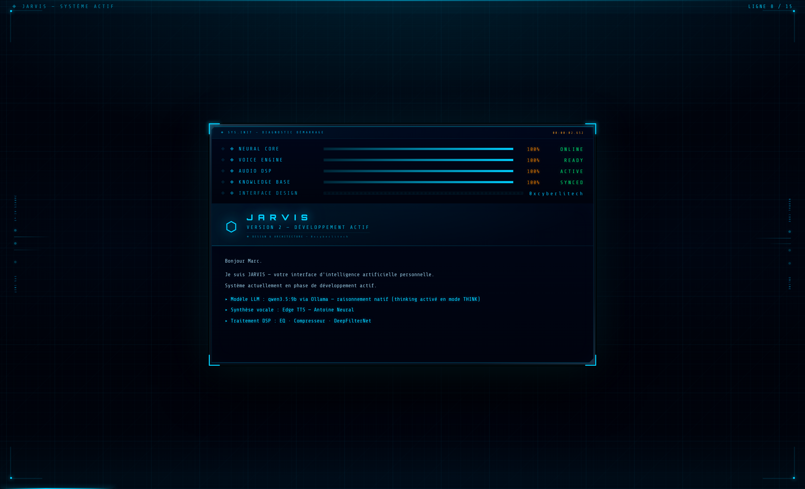
   <em>Au démarrage, JARVIS s'auto-diagnostique — <b>NEURAL CORE · VOICE ENGINE · AUDIO DSP · KNOWLEDGE BASE</b> à 100 % — puis annonce son état : modèle <code>qwen3.5:9b</code> via Ollama, voix Edge Antoine, DSP (EQ · compresseur · DeepFilterNet), accélération CUDA sm_120 Blackwell.</em>

---

## ✦ Ce qui rend JARVIS unique

| | |
|---|---|
| 🔒 **100 % local · zéro cloud** | LLM, voix, RAG, données — tout sur le poste. Aucune fuite, aucun abonnement. |
| 🧠 **Un agent, pas un chatbot** | *Hermès* observe, mémorise, apprend et **agit** — sans être re-briefé à chaque session. |
| 🛡️ **SOC autonome 24/7** | Détecte, bannit et redémarre **seul** · alertes vocales · contexte sécurité en direct. |
| 🎙️ **Voix qualité broadcast** | Chaîne DSP pro (débruitage IA · compresseur · FX) + voix Edge, repli Kokoro neural local. |
| ⚡ **RTX 5080 maîtrisée** | Modèle 100 % en VRAM, garde-fou anti-débordement, CUDA partout (Whisper · DeepFilterNet). |
| ♿ **Pensé accessible** | Haute lisibilité, commandes vocales déterministes (< 100 ms), briefing matinal. |

**Visite guidée** &nbsp;·&nbsp; [🕹️ Cockpit](#sec-1) &nbsp;·&nbsp; [🧠 Réglages](#sec-2) &nbsp;·&nbsp; [📊 Monitoring](#sec-3) &nbsp;·&nbsp; [🎛️ Studio DSP](#sec-4) &nbsp;·&nbsp; [🎙️ Voice Lab](#sec-5) &nbsp;·&nbsp; [🌐 Accès Web](#sec-6) &nbsp;·&nbsp; [🛡️ SOC](#sec-7) &nbsp;·&nbsp; [✦ Hermès](#hermes)

---

## 🖼️ L'interface en action

### 1 · Le cockpit

  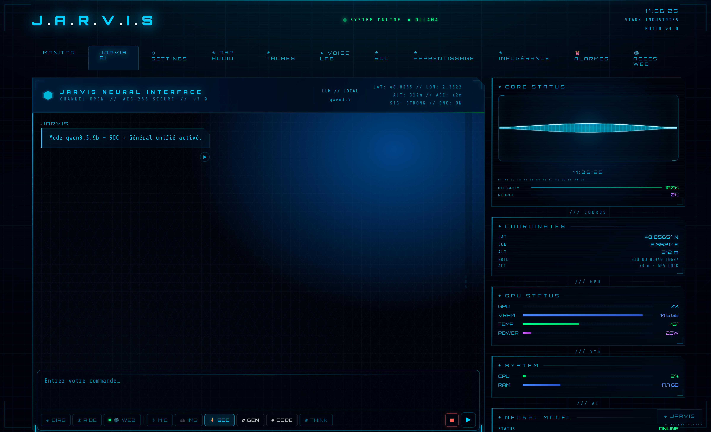

Le poste de pilotage complet. À gauche, **l'interface neurale** (canal chiffré AES-256) et la barre de commande avec ses **modes de routage** — `SOC · GÉN · CODE · THINK` + entrées `MIC`, `IMG` (vision), `WEB`, `AIDE` — qui orientent chaque requête vers le bon comportement, **un seul modèle `qwen3.5:9b`, zéro swap**. À droite, la **télémétrie temps réel** : cœur d'intégrité, coordonnées, **GPU** (VRAM, température, watts), système et modèle neural. Onze modules accessibles d'un clic depuis la barre du haut.

### 2 · Réglages LLM & profils GPU

*Le centre de contrôle fin de l'inférence locale — chaque carte pilote un aspect de la RTX 5080 et du modèle.*

<table>
<tr>
<td width="50%" align="center">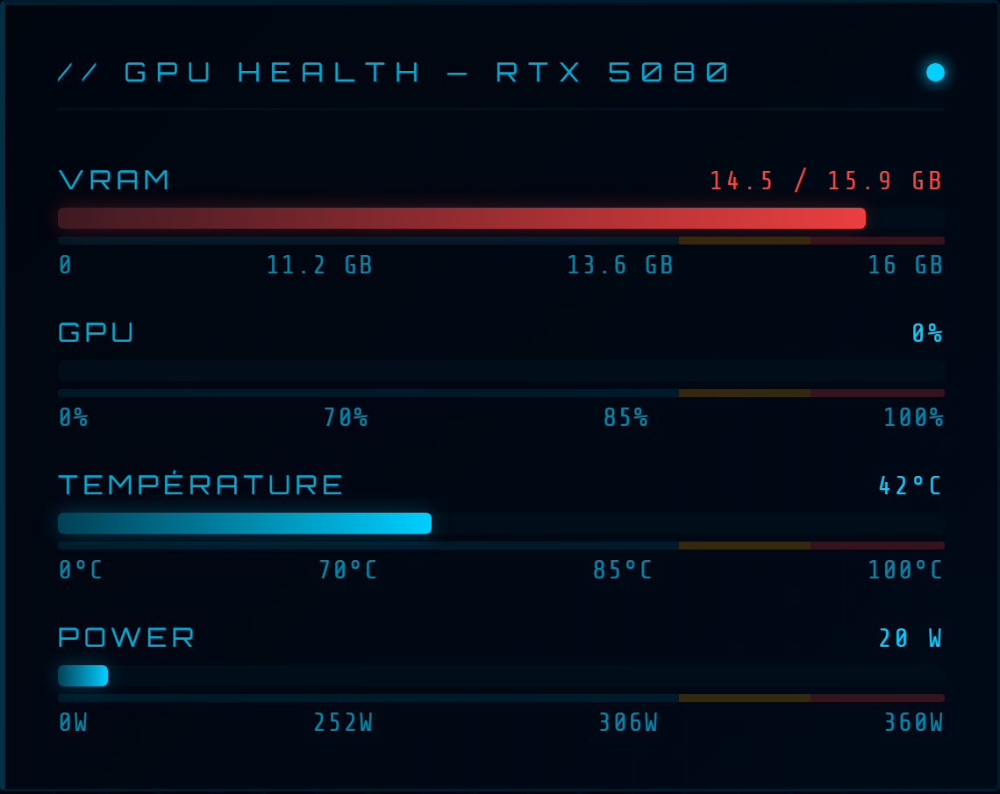 <b>GPU Health</b> — VRAM / 16 Go, charge, température et puissance de la RTX 5080, en direct.</td>
<td width="50%" align="center">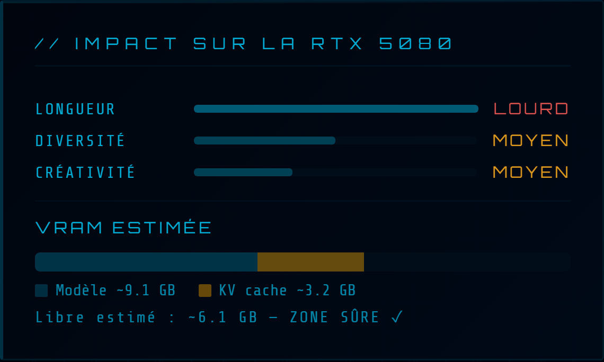 <b>Impact VRAM</b> — coût mémoire estimé <em>avant</em> lancement (modèle ~9 Go + cache KV), garde la « zone sûre ».</td>
</tr>
<tr>
<td width="50%" align="center">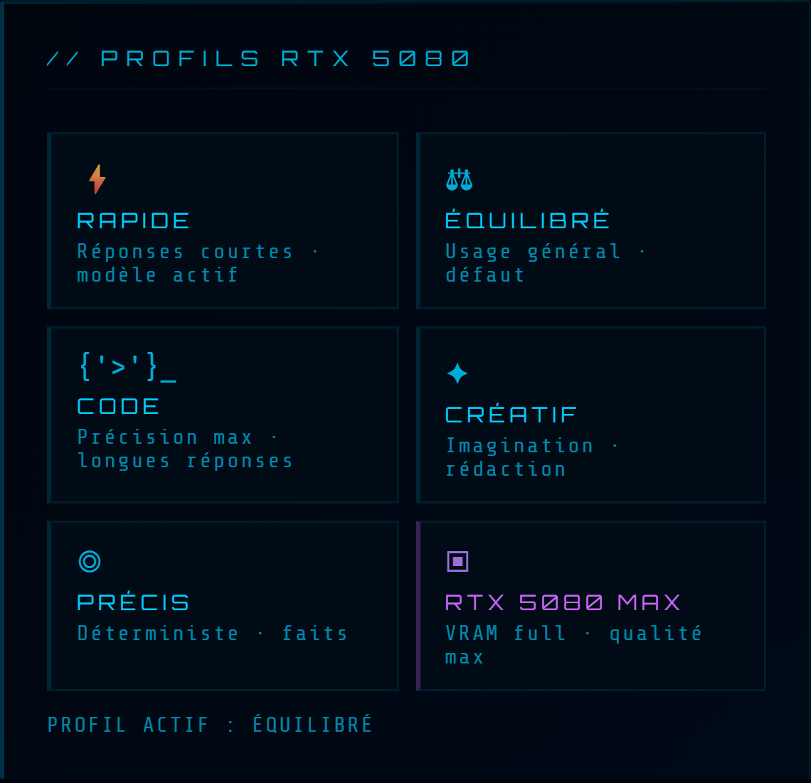 <b>Profils RTX 5080</b> — 6 préréglages en un clic : Rapide · Équilibré · Code · Créatif · Précis · MAX.</td>
<td width="50%" align="center">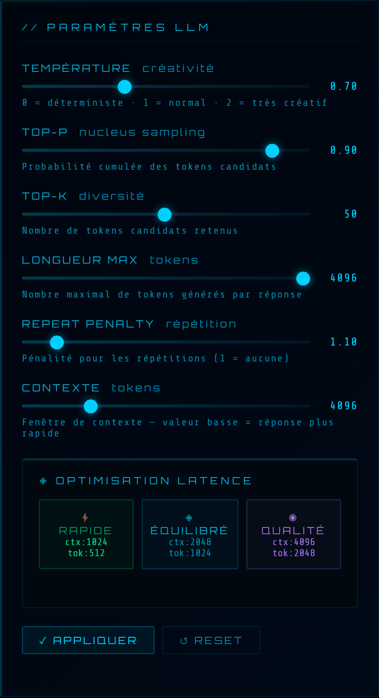 <b>Paramètres LLM</b> — température, top-p/k, contexte, repeat penalty + 3 modes d'optimisation latence.</td>
</tr>
</table>

> Le **prompt système gouverné** (anti-hallucination, méthodologie SOC, profils sauvegardés) vit dans le même onglet — volontairement non exposé ici (il contient des références internes).

### 3 · Monitoring GPU · CPU · VRAM

  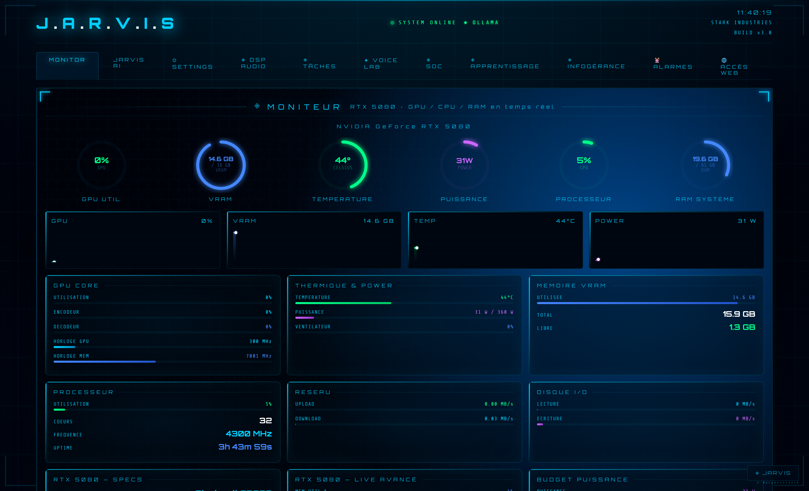

Surveillance **temps réel** de toute la machine : six jauges (GPU, VRAM / 16 Go, température, puissance, CPU, RAM) puis le détail — **GPU Core** (horloges, encodeur/décodeur), **thermique & puissance**, **mémoire VRAM** (utilisée / libre), processeur (32 cœurs, fréquence, uptime), réseau et disque I/O.

  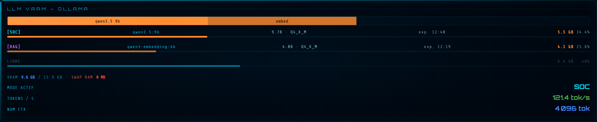
   <em><b>Empreinte LLM en VRAM</b> — le modèle <code>qwen3.5:9b</code> (~5,5 Go) et l'embedding RAG <code>qwen3-embedding:4b</code> (~4,1 Go) cohabitent dans les 16 Go, ~40 % libre. Débit live (tok/s), <code>num_ctx</code> et <b>SWAP RAM = 0</b> : tout tient sur la carte, pleine vitesse.</em>

C'est le garde-fou du LLM 100 % local : tant que le modèle **+ son cache KV** tiennent dans les 16 Go, l'inférence reste **pleine vitesse GPU** ; s'ils débordent, Ollama « spille » en RAM et la vitesse s'effondre — d'où la surveillance de l'empreinte.

### 4 · Studio audio DSP — le rack broadcast

Une **chaîne broadcast complète** appliquée à la voix de synthèse, accélérée **CUDA** :
`TTS → DeepFilterNet → Compresseur → Stereo → Analyseur → FX → EQ → Output`. **Huit étages**, chacun sa fonction — tout en Web Audio, temps réel, en local.

<table>
<tr>
<td width="50%" align="center">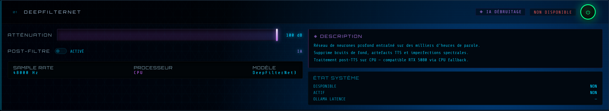 <b>① DeepFilterNet</b> — débruitage IA (DeepFilterNet3) : supprime bruit de fond et artefacts TTS.</td>
<td width="50%" align="center">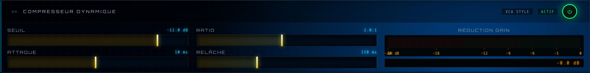 <b>② Compresseur</b> — dynamique VCA (seuil · ratio · attaque · relâche) : voix homogène, sans pics.</td>
</tr>
<tr>
<td width="50%" align="center">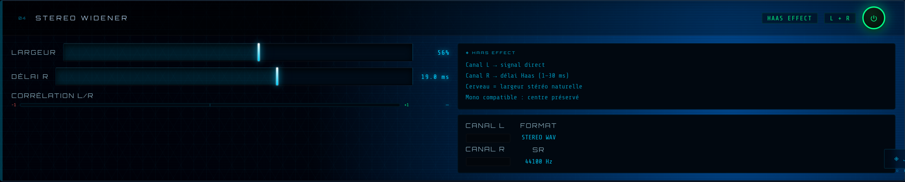 <b>③ Stereo Widener</b> — effet Haas : élargit l'image stéréo, compatibilité mono préservée.</td>
<td width="50%" align="center">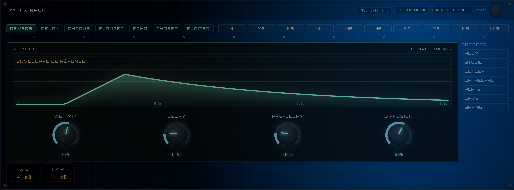 <b>④ FX Rack</b> — reverb · echo · delay · chorus · flanger par convolution : le caractère sonore.</td>
</tr>
<tr>
<td width="50%" align="center">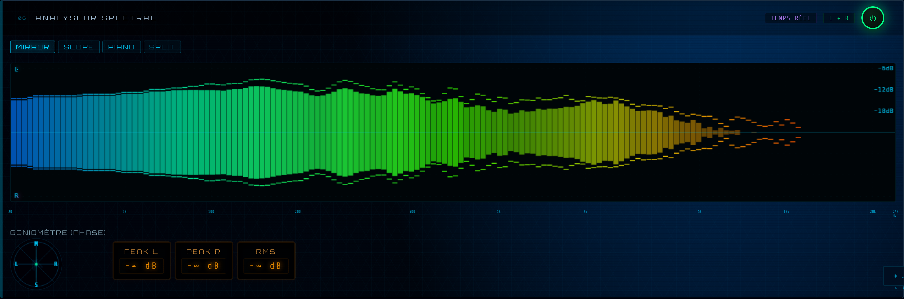 <b>⑤ Analyseur spectral</b> — FFT temps réel, plusieurs modes d'affichage + goniomètre de phase.</td>
<td width="50%" align="center">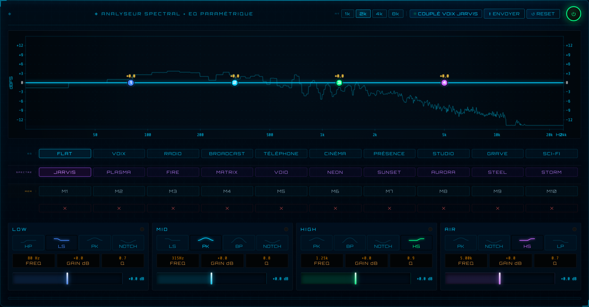 <b>⑥ EQ paramétrique</b> — 4 bandes (LOW/MID/HIGH/AIR) couplées à la voix, avec presets.</td>
</tr>
<tr>
<td width="50%" align="center">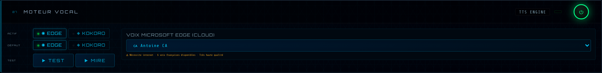 <b>⑦ Moteur vocal</b> — bascule Edge (cloud) ↔ Kokoro (neural local), voix Antoine CA, test à la volée.</td>
<td width="50%" align="center">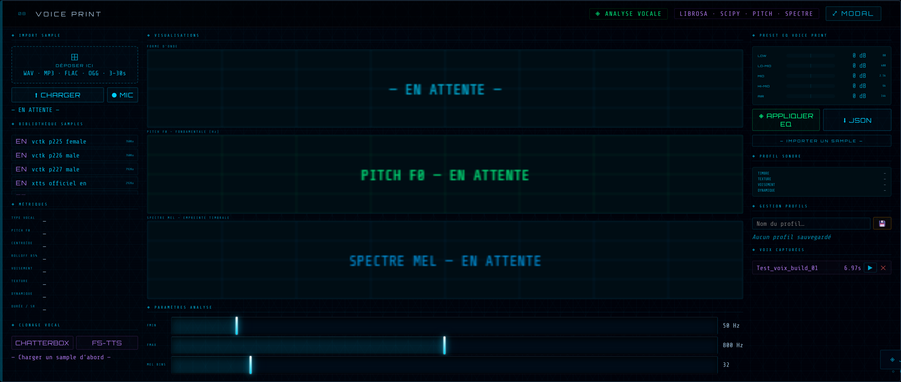 <b>⑧ Voice Print</b> — analyse vocale (librosa/scipy) : forme d'onde, pitch F0, spectre Mel + clonage vocal.</td>
</tr>
</table>

#### Schéma logique du circuit — état des étages & CUDA

*Le signal vocal traverse une chaîne de circuits : un étage **CUDA (GPU)** pour le débruitage IA, le reste en **Web Audio** temps réel dans le navigateur.*

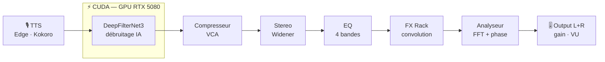
```mermaid
flowchart LR
    TTS["🎙️ TTS<br/>Edge · Kokoro"] --> DFN
    subgraph CUDA["⚡ CUDA — GPU RTX 5080"]
        DFN["DeepFilterNet3<br/>débruitage IA"]
    end
    DFN --> CMP["Compresseur<br/>VCA"] --> STE["Stereo<br/>Widener"] --> EQ["EQ<br/>4 bandes"] --> FX["FX Rack<br/>convolution"] --> AN["Analyseur<br/>FFT + phase"] --> OUT["🎚️ Output L+R<br/>gain · VU"]
```

| Étage | Rôle logique | Circuit |
|---|---|---|
| **TTS** | synthèse vocale — Edge Antoine / Kokoro neural local | source |
| **DeepFilterNet3** | débruitage IA — retire bruit de fond + artefacts TTS | **⚡ CUDA (GPU)** |
| **Compresseur** | homogénéise le volume (seuil · ratio · attaque · relâche, VCA) | Web Audio |
| **Stereo Widener** | élargit l'image stéréo (effet Haas), compatibilité mono | Web Audio |
| **EQ** | modelage du timbre — bandes LOW · MID · HIGH · AIR | Web Audio |
| **FX Rack** | reverb · echo · delay · chorus (convolution) | Web Audio |
| **Analyseur** | FFT temps réel + goniomètre de phase | Web Audio |
| **Output L+R** | bus master : gain de sortie + VU-mètres | Web Audio |

> Côté **entrée**, la reconnaissance vocale (STT `faster-whisper large-v3-turbo`) est elle aussi **accélérée CUDA** — le GPU couvre toute la chaîne voix.

### 5 · Voice Lab

  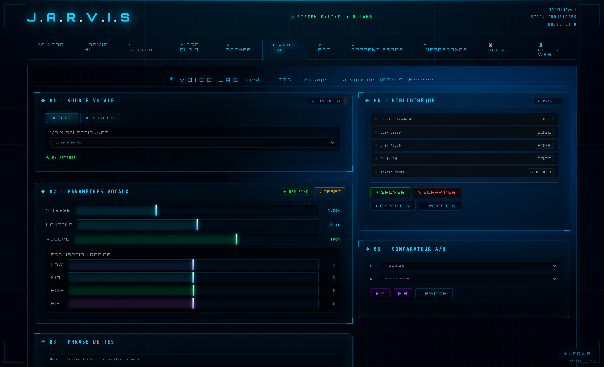

L'atelier de la voix de l'assistant. **Source** commutable — **Edge** (Antoine fr-CA) ↔ **Kokoro** neural CUDA, 100 % local hors-ligne — puis **paramètres vocaux** fins (vitesse, hauteur, volume + égalisation LOW/MID/HIGH/AIR synchronisée au DSP), une **bibliothèque** de voix (JARVIS Standard, Grave, Aiguë, Radio FM, Kokoro Neural) et un **comparateur A/B** pour trancher à l'oreille. C'est ce qui donne à JARVIS une voix naturelle et homogène, en ligne comme hors-ligne.

### 6 · Accès Web gouverné

  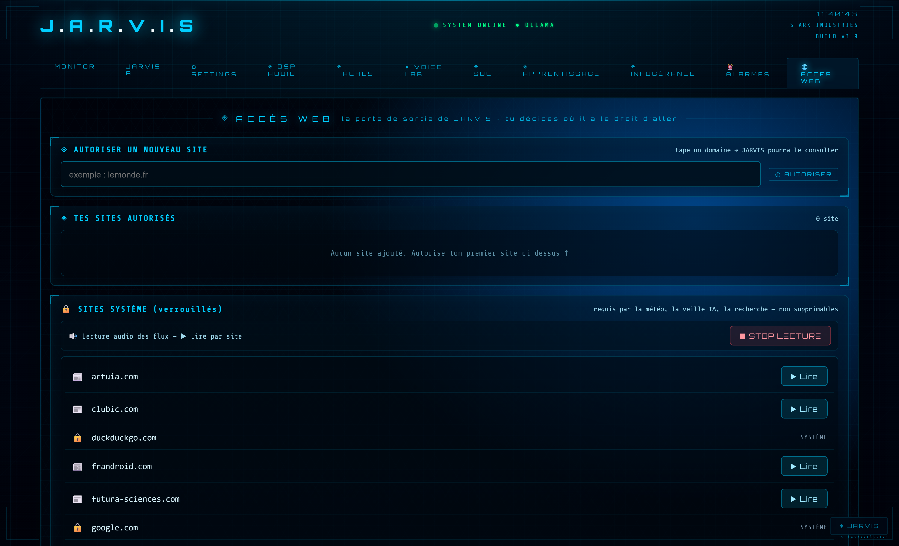

L'agent peut consulter le web — mais **sous contrôle strict**. JARVIS ne visite QUE les domaines d'une **allowlist explicite** : des **sites système verrouillés** (météo, veille IA, recherche — non supprimables) plus ceux que *tu* autorises nommément. Tout est en **lecture seule**, **chaque accès est journalisé**, et tout le reste est **refusé**. Même principe de moindre privilège que pour le SOC : la curiosité de l'agent reste gouvernée.

### 7 · SOC — réponse automatique

  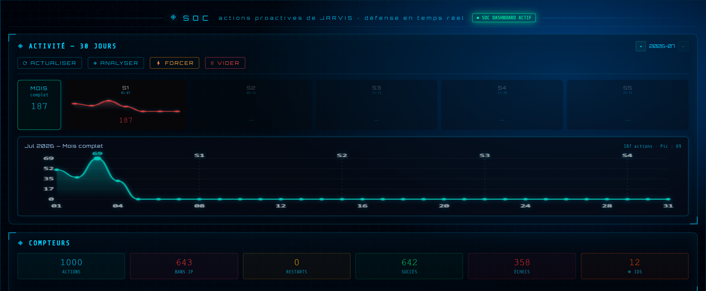

Le **centre de défense** de JARVIS. Courbe d'**activité sur 30 jours** (pics offensifs) et **compteurs en direct** — actions, **bans IP**, restarts, succès / échecs, détections **IDS**. JARVIS surveille nginx / CrowdSec / fail2ban / Suricata en continu et **agit seul** (ban, restart) selon des seuils : l'agent ne se contente pas d'alerter, il **répond**.

> 🔒 Volontairement **non publiés** : le journal des IP d'attaquants, le terminal, les leçons apprises. La vitrine *décrit* le SOC et montre son activité **agrégée** — **aucune donnée actionnable, aucune IP**.

---

## ◈ Hermès — l'agent persistant

> **Hermès transforme un assistant en agent.**
> Là où un assistant répond, un agent **observe, mémorise, apprend et agit** — sans être re-briefé à chaque session.

  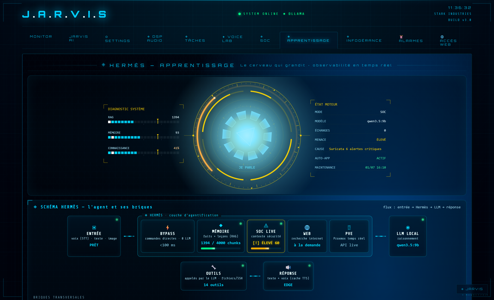

Le tableau de bord vivant de l'agent. Au centre, le **cœur** qui « respire » tant que JARVIS tourne — il **s'illumine** quand il parle (*JE PARLE*), vire à l'**or/ambre** quand la menace monte. Autour, le **diagnostic** (RAG, mémoire, connaissance) et l'**état moteur** (mode, modèle `qwen3.5:9b`, niveau de menace + sa cause). En bas, le **pipeline temps réel** : `ENTRÉE → BYPASS (< 100 ms, zéro LLM) → MÉMOIRE (RAG auto-borné à 4 000 chunks) → SOC LIVE → WEB → PVE → LLM LOCAL → OUTILS → RÉPONSE` — **chaque brique affiche sa métrique live**. L'agentification rendue visible.

### Schéma logique de la pile — le rôle de chaque tuile

*Le chemin d'une requête à travers les circuits de l'agent — chaque tuile a un rôle précis et affiche sa métrique en direct.*

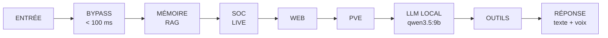
```mermaid
flowchart LR
    IN["ENTRÉE"] --> BY["BYPASS<br/>&lt; 100 ms"] --> MEM["MÉMOIRE<br/>RAG"] --> SOC["SOC<br/>LIVE"] --> WEB["WEB"] --> PVE["PVE"] --> LLM["LLM LOCAL<br/>qwen3.5:9b"] --> TL["OUTILS"] --> OUT["RÉPONSE<br/>texte + voix"]
```

| Tuile du flux | Rôle logique |
|---|---|
| **ENTRÉE** | voix (STT Whisper) · texte · image (vision multimodale) |
| **BYPASS** | commandes directes **déterministes**, < 100 ms, **zéro LLM** |
| **MÉMOIRE** | faits + leçons **RAG**, auto-borné à 4 000 chunks |
| **SOC LIVE** | injecte le **contexte sécurité** temps réel |
| **WEB** | recherche **gouvernée** (allowlist, lecture seule) |
| **PVE** | état **Proxmox** temps réel |
| **LLM LOCAL** | raisonnement `qwen3.5:9b` — **100 % local** |
| **OUTILS** | fichiers / SSH — **appelés par le LLM** |
| **RÉPONSE** | texte + voix (cache TTS) |

Autour du flux, les **briques transversales** (enrichissent · protègent · agissent), chacune une tuile d'état :

| Brique transversale | Rôle logique |
|---|---|
| **VISION** | analyse d'images (`qwen3.5:9b` multimodal natif) |
| **MCP** | pont gouverné vers Claude Desktop (outils exposés) |
| **APPRENTISSAGE** | mémorise les leçons (« souviens-toi… ») |
| **RÉFLEXION** | apprend de tes corrections (proposées → validées) |
| **DR CERVEAU** | sauvegarde / restauration de la mémoire |
| **BRIEFING** | résumé proactif au réveil |
| **ALARMES** | rappels à l'heure |
| **PÉDAGOGIE** | explique vs analyse (mode tuteur) |
| **INFOGÉRANCE** | mise à jour des VMs, fail-closed |

### Les capacités de l'agent

  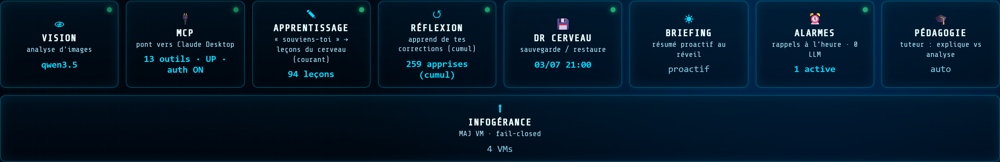
   <em>Les <b>briques transversales</b> qui enrichissent, protègent et prolongent l'agent — <b>Vision</b> (analyse d'images), <b>MCP</b> (pont gouverné vers Claude Desktop), <b>Apprentissage</b>, <b>Réflexion</b>, <b>DR Cerveau</b> (sauvegarde/restauration), <b>Briefing</b> matinal proactif, <b>Alarmes</b>, <b>Pédagogie</b> (explique vs analyse), <b>Infogérance</b> (MAJ des VMs, fail-closed). Chacune affiche sa métrique live.</em>

### Le tableau de bord vivant

  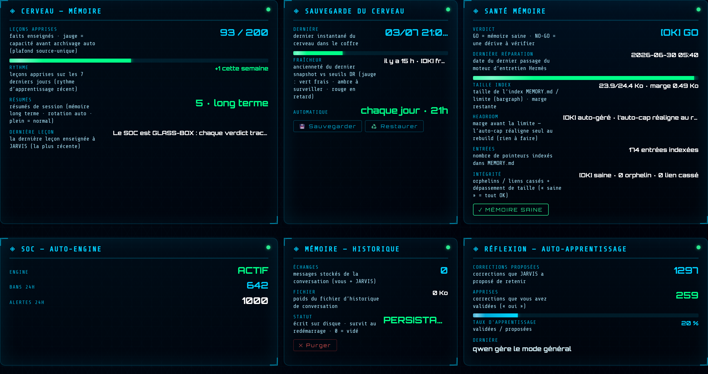
   <em>Six panneaux d'auto-diagnostic d'un coup d'œil — <b>Cerveau/Mémoire</b> (leçons apprises, rythme), <b>Sauvegarde</b> (instantané + auto quotidien 21 h), <b>Santé mémoire</b> (verdict GO/NO-GO, intégrité : 0 orphelin, 0 lien cassé), <b>SOC Auto-engine</b>, <b>Historique</b> persisté, <b>Réflexion</b> (corrections proposées vs apprises, taux d'apprentissage).</em>

<table>
<tr>
<td width="50%" align="center">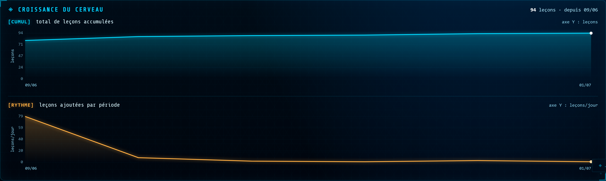 <b>Croissance du cerveau</b> — cumul des leçons + rythme d'apprentissage : la mémoire s'accumule, persistée et réinjectée, jamais repartie de zéro.</td>
<td width="50%" align="center">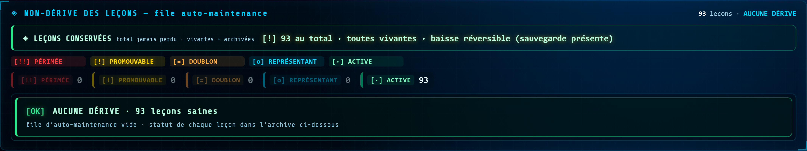 <b>Non-dérive</b> — chaque leçon porte un statut (active · promouvable · doublon · périmée) ; corpus sain → bandeau <b>« AUCUNE DÉRIVE »</b>.</td>
</tr>
</table>

### Le maintien en vie autonome

> **Le pari : un agent qui ne se contente pas d'apprendre — il se maintient lui-même en vie.**
> Hermès reste *sain* indéfiniment **sans intervention** : il se diagnostique, se répare, se borne, et **alerte seul** si sa propre mécanique d'entretien s'arrête.

Un **moteur d'entretien autonome** enchaîne des étapes **idempotentes et réversibles** — chaque échec force une sortie en erreur (*fail-closed cumulatif*) : un entretien partiel ne se fait **jamais** passer pour un succès.

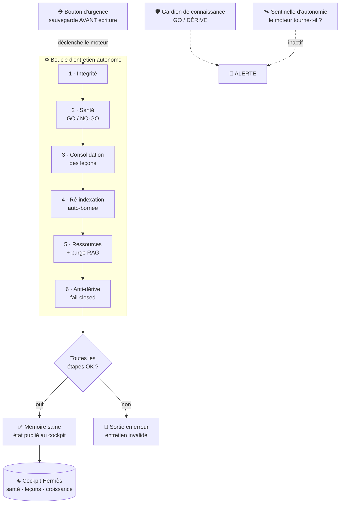
```mermaid
flowchart TB
    subgraph CYCLE["♻️ Boucle d'entretien autonome"]
        direction LR
        A["1 · Intégrité"] --> B["2 · Santé<br/>GO / NO-GO"]
        B --> C["3 · Consolidation<br/>des leçons"]
        C --> D["4 · Ré-indexation<br/>auto-bornée"]
        D --> E["5 · Ressources<br/>+ purge RAG"]
        E --> F["6 · Anti-dérive<br/>fail-closed"]
    end
    F --> V{"Toutes les<br/>étapes OK ?"}
    V -->|oui| OK["✅ Mémoire saine<br/>état publié au cockpit"]
    V -->|non| ERR["🛑 Sortie en erreur<br/>entretien invalidé"]
    OK --> COCK[("◈ Cockpit Hermès<br/>santé · leçons · croissance")]
    GARD["🛡️ Gardien de connaissance<br/>GO / DÉRIVE"] -.-> ALERT["🔔 ALERTE"]
    SENT["🛰️ Sentinelle d'autonomie<br/>le moteur tourne-t-il ?"] -.->|inactif| ALERT
    URG["⛑ Bouton d'urgence<br/>sauvegarde AVANT écriture"] -.->|déclenche le moteur| A
```

- 🧠 **Mémoire qui ne dérive pas** — se consolide, se borne, se purge seule.
- ⛑ **Auto-réparation** — régénère les états de santé et ré-indexe la connaissance sans moi.
- 🚨 **Aucune panne silencieuse** — si l'entretien s'arrête, une sentinelle alerte.
- 🔒 **Fail-closed de bout en bout** — au moindre doute, refuser ; sauvegarde avant toute écriture.

> Détail technique complet — moteur d'entretien, états publiés, garde-fous outillés, les 5 briques, comparatif Avant / Après — dans **[01 — Hermès](DOCUMENTATION/01-HERMES.md)**.

---

## 📚 Documentation

| # | Document | Description |
|---|----------|-------------|
| 01 | [Hermès](DOCUMENTATION/01-HERMES.md) | Mémoire · bypass · RAG · DR |
| 02 | [Intégration&nbsp;SOC](DOCUMENTATION/02-SOC-INTEGRATION.md) | Auto-engine · bans · alertes |
| 03 | [Architecture&nbsp;globale](DOCUMENTATION/03-ARCHITECTURE.md) | Flask · Blueprints · modules |
| 04 | [Audio&nbsp;DSP](DOCUMENTATION/04-AUDIO-DSP.md) | Broadcast · TTS · STT · DSP |
| 06 | [MCP&nbsp;Server](DOCUMENTATION/06-MCP-SERVER.md) | Outils exposés · conception |

---

## 🧩 Stack technique

| Couche | Technologie |
|--------|-------------|
| **Backend** | Python 3.11 · Flask · Blueprints autoportants · DI pur |
| **LLM local** | Ollama · qwen3.5:9b (SOC + général + code + think + **vision** multimodal · un seul modèle, zéro swap) |
| **RAG** | qwen3-embedding:4b (dim 2560) · BM25 hybride · auto-borné · TTL 5 min |
| **TTS** | edge-tts fr-CA Antoine → repli Kokoro CUDA neural (hors-ligne, local) |
| **STT** | faster-whisper large-v3-turbo CUDA · vocabulaire SOC |
| **Frontend** | Vanilla JS · Web Audio API · xterm.js · Monaco Editor |
| **Agent Hermès** | synoptique · bypass regex · scheduler daemon · indépendant du LLM |
| **Qualité** | suite pytest · gate de couverture pré-push · ruff 0 · eslint 0 · hooks pré-commit/pré-push |

---

## 🛡️ Sécurité

| Principe | Implémentation |
|----------|----------------|
| **100 % local** | JARVIS filtre et agrège localement — rien ne part vers un LLM cloud |
| **RFC1918 immuable** | Les plages IP privées ne peuvent jamais être bannies |
| **SSH lecture seule** | Patterns dangereux bloqués · whitelist explicite pour l'écriture |
| **SOC side-channel** | Le contexte sécurité n'entre jamais dans l'historique chat |
| **Audit forensique** | Toute opération SSH d'écriture tracée dans un journal JSONL |

---

<table>
<tr>
<td align="center"><b>🖥️ Infrastructure &amp; Sécurité</b></td>
<td align="center"><b>💻 Développement &amp; Web</b></td>
<td align="center"><b>🤖 Intelligence Artificielle</b></td>
</tr>
<tr>
<td align="center">
  
  
  
   
  
  
</td>
<td align="center">
  
  
  
   
  
  
  
</td>
<td align="center">
  
    
  
</td>
</tr>
</table>

 

🔒 Projet proposé par <a href="https://github.com/0xCyberLiTech">0xCyberLiTech</a> · développé en collaboration avec <a href="https://claude.ai">Claude AI</a> (Anthropic) 🔒

