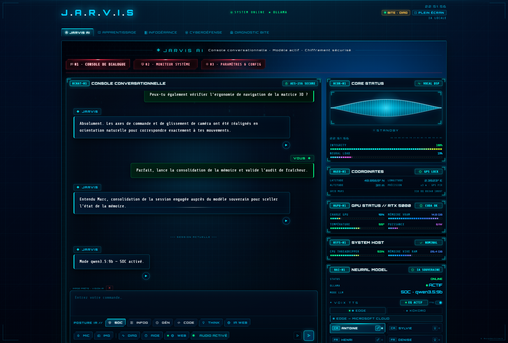
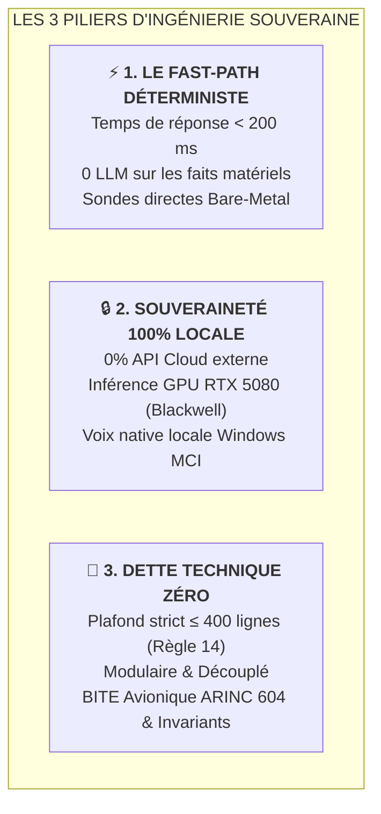

    

  

    

  <h2>Agent IA Souverain · Mémoire Persistante Hermès · Matrice 3D · Fast-Path Déterministe · RTX 5080</h2>

  

    
    
    
    
    
    
  

  

  

    <strong>IA 100 % Locale</strong>  &nbsp;•&nbsp; <strong>Mémoire Long-Terme Hermès</strong>  &nbsp;•&nbsp; <strong>Infogérance Proxmox</strong>  &nbsp;•&nbsp; <strong>Voix Native Windows MCI</strong> 
  

> [!IMPORTANT]
> **Vitrine Technologique : Architecture & Démonstration d'Ingénierie**  
> Ce dépôt présente le système d'intelligence artificielle locale **JARVIS** conçu par Marc (0xCyberLiTech). Il expose la doctrine d'ingénierie cognitive, les schémas d'intégration et les interfaces opérationnelles.  
> 🔒 **Propriété Intellectuelle & Sécurité Opérationnelle** : Les modèles personnalisés, la base vectorielle interne, les clés privées et les automatisations d'infogérance matérielle restent **strictement confinés** au sein de l'Atelier souverain 0xCyberLiTech.

> [!NOTE]
> ### 🔄 La Grande Mutation des 2 Derniers Mois : Du Banc d'Essais Audio à l'IA Agentique Pure
> À l'origine de son développement, JARVIS accumulait une multitude d'outils et de modules expérimentaux axés sur le traitement du signal sonore et les studios DSP audio. Cette surcharge fonctionnelle créait une dispersion technique inutile avec beaucoup trop de fonctionnalités hétéroclites.
> 
> **Le tournant stratégique majeur opéré ces deux derniers mois par l'Atelier 0xCyberLiTech :**
> - ❌ **Élimination de la dispersion sonore** : Purge intégrale de la suite DSP audio, des égaliseurs et des expérimentations sonores périphériques.
> - 🎯 **Concentration exclusive sur l'IA Souveraine** : Recentrage à 100 % sur **JARVIS IA** — l'Agent Cognitif Souverain, la mémoire persistante Hermès, le Fast-Path déterministe (< 200 ms), la matrice topologique 3D (The Grid), l'infogérance active de l'infrastructure Proxmox, et la station de diagnostic aéronautique BITE MK-IX.

---

### ⚡ LE POSTE DE COMMANDEMENT COGNITIF — INTERFACE & CŒUR RÉACTEUR

*Console opérationnelle JARVIS en production réelle : onde neurale dynamique, sélection des 6 modes d'inférence, bus de télémétrie sub-seconde et passerelle vocale Antoine HD.*

  
  
  
  
  

---

## 🧭 Le Grand Dossier d'Ingénierie · Les 6 Sous-Systèmes

Pour préserver la clarté architecturale sans imposer une page monolithique interminable, la documentation de JARVIS est structurée en **6 dossiers techniques dédiés**, enrichis de captures haute fidélité en pleine hauteur :

| Sous-Système | Objet Technique & Captures Dédiées | Documentation Complète |
|:---:|:---|:---:|
|  **01 · Hermès & RAG** | **Pile Cognitive & Cœur Arc Reactor** 5 couches, Qwen3-Embedding, base ChromaDB 4469 chunks, Arc Reactor vivant. | [Consulter la Fiche 01 ➔](docs/01-PILE-HERMES-ET-RAG.md) |
|  **02 · GPU RTX 5080** | **Monitoring Matériel & Inférence Blackwell** VRAM GDDR7 16 Go, oscilloscopes live, puissance, thermie, mode hybride. | [Consulter la Fiche 02 ➔](docs/02-MONITORING-GPU-ET-SYSTEME.md) |
|  **03 · The Grid 3D** | **Matrice Spatiale Three.js (Silicon Metropolis)** Switch central 3D, 4 VLANs volumétriques, Blason Cyber souverain. | [Consulter la Fiche 03 ➔](docs/03-THE-GRID-3D-SYNOPTIQUE.md) |
|  **04 · Infogérance PVE** | **Supervision Proxmox VE, VMs & Passerelles** Topologie réseau sécurisée, flux SDN, isolation des 4 VMs et CT 109. | [Consulter la Fiche 04 ➔](docs/04-INFOGERANCE-PARC-ET-VMS.md) |
|  **05 · Station BITE** | **Autodiagnostic Avionique MK-IX & Simulation** Pupitre 8 LRU, double bus MIL-STD-1553B, simulateur d'avaries & matrice DTC. | [Consulter la Fiche 05 ➔](docs/05-BITE-DIAGNOSTIC-STATION.md) |
|  **06 · Mobile & Voix** | **Accès Nomade WireGuard & Voix Native Windows MCI** Interface responsive PWA, passerelle vocale Antoine HD locale (< 100 ms). | [Consulter la Fiche 06 ➔](docs/06-MOBILE-ET-VOIX-SOUVERAINE.md) |

---

## 🎯 1. Manifeste : De la Dispersion Audio à l'IA Agentique Pure

À l'origine de son développement, JARVIS embarquait une suite expérimentale complexe dédiée au traitement du signal sonore (studios DSP, égaliseurs graphiques, compresseurs multibandes, filtres vocaux). Bien qu'instructive, cette prolifération d'outils hétéroclites surchargeait le socle applicatif, dispersait l'attention et introduisait une dette technique résiduelle.

**Au cours des deux derniers mois, une décision stratégique et un refactoring en profondeur ont été menés par Marc et Antigravity : purger l'intégralité du laboratoire sonore pour recentrer 100 % des ressources et du code sur ce qui fait l'âme et la puissance du projet — l'Intelligence Artificielle Souveraine (JARVIS IA).**

### 📊 Matrice d'Évolution : 2 Mois de Transformation Radicale

| Dimension | ⏳ Il y a 2 mois (Labo Audio & Dispersion DSP) | ⚡ Aujourd'hui (Cœur Réacteur JARVIS IA) |
|:---|:---|:---|
| **Cœur de Mission** | Traitement du signal sonore, égaliseurs DSP, multiplicité d'outils audio | **Agent Cognitif IA Dédié** : arbitrage souverain, cyberdéfense & infogérance |
| **Périmètre Applicatif** | Surcharge fonctionnelle, prolifération de modules hétéroclites | **Recentrage chirurgical** : chaque ligne de code sert l'intelligence machine |
| **Gestion Cognitive** | Pas de mémoire structurée, requêtes éphémères isolées | **Pile Hermès & RAG Vectoriel** : apprentissage continu et mémoire long-terme |
| **Vitesse d'Exécution** | Temps de réponse aléatoires, latences de traitement | **Fast-Path Déterministe** : résolution machine en **< 200 ms** (0 hallucination) |
| **Supervision Système** | Supervision passive ou cloisonnée | **Infogérance vivante** : pilotage Proxmox VE, VMs, passerelles et matrice 3D |
| **Accélération Matérielle** | Sollicitation CPU dispersée | **Inférence Tensor/CUDA** : exploitation directe du GPU NVIDIA RTX 5080 |
| **Architecture Code** | Fichiers volumineux avec dette technique résiduelle | **Dette Zéro** : règle d'or inviolable des $\le 400$ lignes par module |

---

## 🏛️ 2. Les Trois Piliers Fondateurs de JARVIS

```mermaid
flowchart TD
    subgraph PILIERS["LES 3 PILIERS D'INGÉNIERIE SOUVERAINE"]
        P1["⚡ <b>1. LE FAST-PATH DÉTERMINISTE</b><br/>Temps de réponse < 200 ms<br/>0 LLM sur les faits matériels<br/>Sondes directes Bare-Metal"]
        P2["🔒 <b>2. SOUVERAINETÉ 100% LOCALE</b><br/>0% API Cloud externe<br/>Inférence GPU RTX 5080 (Blackwell)<br/>Voix native locale Windows MCI"]
        P3["📐 <b>3. DETTE TECHNIQUE ZÉRO</b><br/>Plafond strict ≤ 400 lignes (Règle 14)<br/>Modulaire & Découplé<br/>BITE Avionique ARINC 604 & Invariants"]
    end
```

### 1. Le Fast-Path Déterministe (< 200 ms)
Dans un centre de commandement, l'erreur ou l'approximation n'est pas tolérée. Si l'opérateur interroge JARVIS sur l'état de l'onduleur, la mémoire vive libre sur Proxmox ou le statut des sauvegardes nocturnes, **le modèle de langage a interdiction formelle d'intervenir** :
* Les requêtes portant sur des grandeurs physiques sont interceptées dès l'entrée par des parseurs lexicaux stricts.
* Le système interroge directement les APIs internes, les sockets Unix et les sondes matérielles.
* Réponse certifiée par la télémétrie réelle en moins de 200 ms, éliminant 100 % des hallucinations.

### 2. Souveraineté & Confinement 100 % Local
* **Zéro Dépendance Cloud :** Aucun flux de conversation, aucune télémétrie d'infrastructure ni aucun document ne transite par des serveurs tiers.
* **Inférence GPU Haute Performance :** Modèles d'élite déployés localement sur GPU NVIDIA RTX 5080 (16 Go VRAM GDDR7) avec accélération CUDA.
* **Voix Native Windows MCI :** Restitution audio par Antoine HD directement au niveau de l'OS hôte, indépendante des processus de navigation.

### 3. Dette Technique Zéro & Règle des 400 Lignes
* **Plafond Inviolable :** Conformément à la Règle 14 de l'Atelier, aucun module applicatif ne dépasse 400 lignes.
* **Architecture Modulaire :** Séparation stricte de l'état (`*_state.js`), du rendu (`*_render.js`) et des contrôleurs (`*_controls.js`).
* **Assurance Qualité BITE :** Tests unitaires, linters au vert absolu (`ruff`, `eslint`, `PSScriptAnalyzer`) et gardiens d'invariants exécutés en pré-commit.

---

## 🛠️ 3. Stack Technologique & Écosystème

<table>
<tr>
<td align="center" width="25%"><b>🖥️ Infrastructure &amp; Virtualisation</b></td>
<td align="center" width="25%"><b>💻 Développement &amp; Moteur</b></td>
<td align="center" width="25%"><b>🤖 Intelligence Artificielle</b></td>
<td align="center" width="25%"><b>🎨 Interface &amp; 3D</b></td>
</tr>
<tr>
<td align="center" valign="top">
    
  <b>Proxmox VE 9</b> 
  Nœud bare-metal Minisforum MS-01 
  4 VMs Debian &amp; CT 109 
  ZFS Pool &amp; NAS OMV8
</td>
<td align="center" valign="top">
    
  <b>Python 3.12 / Flask</b> 
  Serveur WSGI Waitress (:5000) 
  Superviseur MCP (:5010) 
  Terminal PTY WebSocket (:5001)
</td>
<td align="center" valign="top">
   
    
  <b>Mistral-Nemo 12B</b> (Inférence) 
  <b>Qwen3-Embedding 4B</b> (RAG) 
  <b>RTX 5080</b> (16 Go GDDR7)
</td>
<td align="center" valign="top">
    
  <b>Extreme HUD Master</b> 
  Vanilla JS pur (Zéro NPM) 
  Three.js Silicon Metropolis 
  SVG Avionique MIL-STD-1553B
</td>
</tr>
</table>

---

## 🔒 4. Gouvernance & Sécurité de l'Atelier

1. **Double Circuit Sanctuarisé :**
   * `D:\0xCyberLiTech` = L'Atelier & le Lab de R&D (conception, refactoring, tests adverses).
   * `C:\Users\...\Documents` = La Production stable, alimentée en flux unidirectionnel exclusif `D:` ➔ `C:`.
2. **Filet de Sauvegarde Permanent :**
   * À chaque étape validée, les coffres de secours (`BACKUP-*`) et les bundles Git sont rafraîchis.
   * Procédure de reprise après sinistre opérationnelle en moins de 5 minutes.
3. **Protection des Données & Anonymisation Publique :**
   * Un gardien cryptographique dédié (`jarvis-public-doc-guard.py`) audite chaque document public avant publication afin d'interdire formellement toute fuite d'adresses IP réelles, d'identifiants ou de clés privées.

---

🔒 Conçu et maintenu avec passion par <a href="https://github.com/0xCyberLiTech">Marc (0xCyberLiTech)</a> · Ingénierie souveraine & Pair-Programming IA d'élite 🔒

