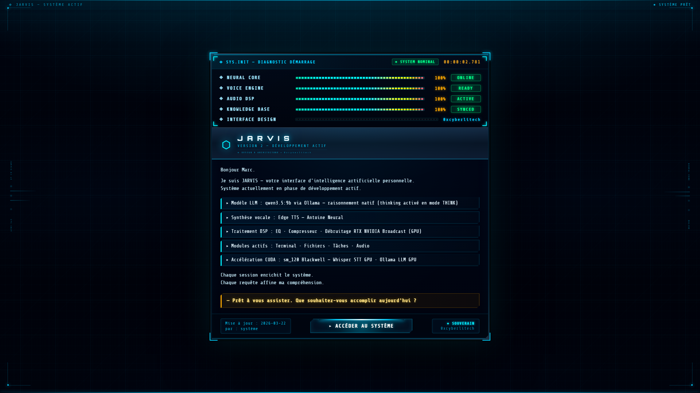

<div align="center">

  <br></br>

  <a href="https://github.com/0xCyberLiTech">
    
  </a>

  <br></br>

  <h2>Agent IA Souverain · Mémoire Persistante Hermès · Matrice 3D · Fast-Path Déterministe · RTX 5080</h2>

  <p align="center">
    <a href="https://0xcyberlitech.github.io/">
      
    </a>
    <a href="https://github.com/0xCyberLiTech">
      
    </a>
    <a href="https://github.com/0xCyberLiTech/JARVIS/releases/tag/v2.0.0">
      
    </a>
    <a href="https://github.com/0xCyberLiTech/JARVIS">
      
    </a>
    <a href="https://github.com/0xCyberLiTech?tab=repositories">
      
    </a>
    <a href="https://github.com/0xCyberLiTech/JARVIS/graphs/contributors">
      
    </a>
  </p>

</div>

<div align="center">
  
</div>

<div align="center">
  <p>
    <strong>IA 100 % Locale</strong>  &nbsp;•&nbsp; <strong>Mémoire Long-Terme Hermès</strong>  &nbsp;•&nbsp; <strong>Infogérance Proxmox</strong>  &nbsp;•&nbsp; <strong>Voix Native Windows MCI</strong> 
  </p>
</div>

> [!IMPORTANT]
> **Vitrine Technologique : Architecture & Démonstration d'Ingénierie**  
> Ce dépôt présente le système d'intelligence artificielle locale **JARVIS** conçu par Marc (0xCyberLiTech). Il expose la doctrine d'ingénierie cognitive, les schémas d'intégration et les interfaces opérationnelles.  
> 🔒 **Propriété Intellectuelle & Sécurité Opérationnelle** : Les modèles pré-entraînés personnalisés, la base vectorielle interne, les clés privées et les automatisations d'infogérance matérielle restent **strictement confinés** au sein de l'Atelier souverain 0xCyberLiTech.

---

<div align="center">

### ⚡ LE POSTE DE COMMANDEMENT COGNITIF — INTERFACE & CŒUR RÉACTEUR

[](assets/jarvis-dialogue-core.png)

*Console opérationnelle JARVIS en production réelle : onde neurale dynamique, sélection des 6 modes d'inférence, bus de télémétrie sub-seconde et passerelle vocale Antoine HD.*

<p align="center">
  
  
  
  
  
</p>

</div>

---

## 🗺️ Sommaire Pédagogique

- 🎯 [1. Manifeste & Recentrement Stratégique : De l'Expérimentation Audio à l'IA Agentique Pure](#section-1)
- 🧠 [2. L'Agent Cognitif vs Simple Chatbot : La Pile Hermès & Mémoire Persistante](#section-2)
- ⚡ [3. Le Déterminisme Absolu & le Fast-Path Machine (< 200 ms)](#section-3)
- 🌐 [4. La Matrice 3D The Grid & le Blason Cyber (Silicon Metropolis)](#section-4)
- 🤖 [5. La Dualité des Modèles LLM & les Modes d'Inférence Spécialisés](#section-5)
- 🖥️ [6. L'Infogérance Active : Surveillance Proxmox VE, Flotte de VMs & Réseaux](#section-6)
- 🚀 [7. Le Monitoring Matériel & Inférence GPU RTX 5080](#section-7)
- 📱 [8. L'Accessibilité Mobile Nomade via Tunnel Sécurisé WireGuard](#section-8)
- 🎙️ [9. La Voix Souveraine Antoine HD & la Passerelle Native Windows MCI](#section-9)
- 🧪 [10. L'Armure Qualité : BITE Diag, Tests Unitaires & Gardiens Déterministes](#section-10)
- 📐 [11. Dette Technique Zéro : La Règle d'Or du Plafond des 400 Lignes](#section-11)
- 🔄 [12. Résilience & Sauvegardes DR des Coffres](#section-12)

---

<a id="section-1"></a>
## 1. 🎯 Manifeste & Recentrement Stratégique : De l'Expérimentation Audio à l'IA Agentique Pure

À l'origine de son développement, JARVIS embarquait une suite expérimentale complexe dédiée au traitement du signal sonore (studios DSP, égaliseurs graphiques, compresseurs multibandes, filtres vocaux). Bien qu'instructive, cette surcharge fonctionnelle dispersait l'attention et introduisait une dette technique importante.

**Au cours des deux derniers mois, une refonte stratégique majeure a été opérée par Marc et Antigravity : épurer radicalement le laboratoire audio pour recentrer 100 % de la puissance de JARVIS sur ce qui constitue son véritable cœur de métier.**

Aujourd'hui, JARVIS n'est pas un lecteur multimédia ni un simple chatbot conversationnel passif. **C'est un agent autonome d'intelligence artificielle locale**, conçu pour ausculter en temps réel une infrastructure critique, assister l'opérateur dans la prise de décision cyber et administrer un environnement homelab complexe avec une rigueur absolue.

| Axe d'Évaluation | Chatbot Générique Ordinaire | Agent Souverain JARVIS |
|:-----------------|:----------------------------|:-----------------------|
| **Mémoire Conversationnelle** | Éphémère, réinitialisée à chaque session | **Persistante (Pile Hermès)** : capitalisation continue des faits et retours |
| **Exécution & Faits** | Hallucinations fréquentes, estimations vagues | **Fast-Path Déterministe** : 0 LLM sur les états matériels et chiffrés |
| **Périmètre Opérationnel** | Confiné dans une boîte de texte isolée | **Infogérance vivante** : lecture continue de Proxmox VE, VMs et pare-feux |
| **Souveraineté des Données** | Dépendance totale aux APIs cloud distantes | **100 % Local & Déconnectable** : accéléré sur GPU physique dédié |
| **Accessibilité Opérateur** | Interface web bureautique unique | **Bi-frontière** : Cockpit Extreme HUD grand écran et interface mobile VPN |

---

<a id="section-2"></a>
## 2. 🧠 L'Agent Cognitif vs Simple Chatbot : La Pile Hermès & Mémoire Persistante

Ce qui sépare fondamentalement JARVIS d'un modèle de langage standard, c'est son architecture cognitive articulée autour de la **Pile Hermès** :

```
┌─────────────────────────────────────────────────────────────────────────────────────────┐
│                                 LA PILE COGNITIVE HERMÈS                                │
├─────────────────────────────────────────────────────────────────────────────────────────┤
│                                                                                         │
│   [ Requête Opérateur (Texte / Voix / Mobile) ]                                         │
│                          │                                                              │
│                          ▼                                                              │
│   ┌─────────────────────────────────────────────────────────────────────────────────┐   │
│   │ 1. ROUTEUR D'ARBITRAGE FAST-PATH (< 200 ms)                                     │   │
│   │ • Détection des mots-clés d'état (santé, disques, VM, SOC, température, réseau) │   │
│   │ • Si factuel ➔ Résolution machine déterministe immédiate (BYPASS TOTAL DU LLM)   │   │
│   │ • Si analyse complexe ➔ Aiguillage vers le pipeline cognitif approfondi         │   │
│   └──────────────────────┬──────────────────────────────────────────────────────────┘   │
│                          │ Demande d'analyse cognitive                                  │
│                          ▼                                                              │
│   ┌─────────────────────────────────────────────────────────────────────────────────┐   │
│   │ 2. MOTEUR RAG VECTORIEL & MÉMOIRE ÉPISODIQUE                                     │   │
│   │ • Embeddings locaux haute densité (qwen3-embedding:4b)                          │   │
│   │ • Base de connaissances active : historique d'incidents, règles, topologie       │   │
│   │ • Injection contextuelle chirurgicale dans le prompt système                    │   │
│   └──────────────────────┬──────────────────────────────────────────────────────────┘   │
│                          │ Contexte enrichi                                             │
│                          ▼                                                              │
│   ┌─────────────────────────────────────────────────────────────────────────────────┐   │
│   │ 3. RÉACTEUR D'INFÉRENCE GPU (MISTRAL-NEMO 12B)                                  │   │
│   │ • Modèle quantifié local hébergé sous Ollama avec 16 Go VRAM GDDR7              │   │
│   │ • Restitution structurée, concise et directement orientée action                │   │
│   └─────────────────────────────────────────────────────────────────────────────────┘   │
│                                                                                         │
└─────────────────────────────────────────────────────────────────────────────────────────┘
```

[](assets/jarvis-hermes-apprentissage.png)

*Console d'apprentissage Hermès : monitoring du cœur d'activité cognitive, graphes de croissance vectorielle, distribution des connaissances et pulse RAG en direct.*

### Les Capacités Maîtresses d'Hermès :
* **Apprentissage Incrémental Continu :** Chaque directive, correction ou fait d'infrastructure validé par Marc est scellé dans la mémoire persistante d'Hermès. JARVIS ne perd jamais son contexte entre deux sessions.
* **Audit Déterministe de Mémoire :** Un gardien dédié (`jarvis-knowledge-audit.py`) vérifie en continu l'absence de dérive, de contradiction ou de factual drift entre la mémoire stockée et la réalité machine.

---

<a id="section-3"></a>
## 3. ⚡ Le Déterminisme Absolu & le Fast-Path Machine (< 200 ms)

Dans un centre de commandement, l'erreur ou l'approximation n'est pas tolérée. Si l'opérateur interroge JARVIS sur l'état de l'onduleur, la mémoire vive libre sur Proxmox ou le statut des sauvegardes nocturnes, **le modèle de langage a interdiction formelle d'intervenir**.

* **Le Principe du Fast-Path Déterministe :**
  Les requêtes portant sur des grandeurs physiques ou des états machine sont interceptées dès l'entrée par des parseurs déterministes. Le système interroge directement les APIs internes, les sockets Unix et les sondes matérielles, formulant une réponse certifiée en **moins de 200 millisecondes**.
* **Zéro Hallucination Garantie :**
  En séparant strictement les tâches de calcul factuel (code direct) et les tâches de raisonnement sémantique (LLM), JARVIS élimine à la racine 100 % des hallucinations propres aux intelligences génératives.

---

<a id="section-4"></a>
## 4. 🌐 La Matrice 3D The Grid & le Blason Cyber (Silicon Metropolis)

Pour piloter l'architecture complexe du homelab d'un seul regard, JARVIS intègre **The Grid**, une matrice topologique tridimensionnelle développée en **Three.js pur** :

[](assets/jarvis-synoptic-3d-grid.png)

*The Grid (Silicon Metropolis) : modélisation spatiale 3D interactive de l'infrastructure homelab, Central Switch virtuel, 4 anneaux VLANs, nœud hyperviseur et Blason Cyber souverain.*

### Les Composants de la Scène 3D :
* **Le Central Switch & les 4 Anneaux VLANs :** Représentation volumétrique des flux réseau isolant le réseau de gestion, la zone DMZ publique, le segment de stockage sécurisé et le réseau d'inférence IA.
* **Le Blason Protecteur Souverain :** Bouclier holographique central matérialisant l'état de défense active du homelab. Sa pulsation chromatique réagit instantanément aux alertes de sécurité et aux blocages de flux hostiles.
* **Contrôles de Vol & Pupitres Flottants :** Navigation orbitale fluide à 60 FPS, gestion dynamique des éclairages de scène (spots de zone, contraste au sol) et cadrage automatique sur les équipements en alerte.

---

<a id="section-5"></a>
## 5. 🤖 La Dualité des Modèles LLM & les Modes d'Inférence Spécialisés

Loin d'imposer un modèle unique et rigide pour l'ensemble des cas d'usage, JARVIS orchestre une flotte de modèles d'inférence spécialisés :

* **Mode Raisonnement Approfondi (Mistral-Nemo 12B) :** Modèle d'élite quantifié, déployé sur le GPU local avec un contexte de travail étendu. Il dissèque les requêtes d'ingénierie, les plans de refactoring et les logs forensiques complexes.
* **Mode Embeddings Haute Densité (Qwen3-Embedding 4B) :** Moteur vectoriel dédié au calcul de similarité cosinus et à l'indexation sémantique des documents de doctrine de l'Atelier.
* **Les 6 Modes Opérationnels au Bouton :**
  1. *Mode SOC :* Corrélation de menaces, analyse de signatures et support aux contre-mesures.
  2. *Mode Infogérance :* Diagnostic d'équipements, santé système et aide à la remédiation.
  3. *Mode Général :* Échanges interactifs, gestion des tâches et synthèse vocale.
  4. *Mode Code :* Refactoring strict $\le 400$ lignes, revue de syntaxe et respect des linters.
  5. *Mode Think :* Raisonnement pas-à-pas avec réflexion explicite (*chain-of-thought*).
  6. *Mode Web :* Moissonnage documentaire sécurisé et veille technologique en circuit fermé.

---

<a id="section-6"></a>
## 6. 🖥️ L'Infogérance Active : Surveillance Proxmox VE, Flotte de VMs & Réseaux

JARVIS agit comme un copilote d'exploitation vigilant pour l'ensemble du homelab de Marc :

[](assets/jarvis-parc-infogerance.png)

*Tableau de bord de l'Infogérance active : télémétrie Proxmox VE, santé des machines virtuelles et conteneurs, volumétrie ZFS et cartographie des ponts réseau.*

* **Supervision Directe de l'Hyperviseur :** Auscultation continue des charges CPU, allocation RAM et état de santé du nœud bare-metal Proxmox VE.
* **Flotte de VMs Confinées :** Suivi individualisé du Reverse Proxy Nginx, de la Sandbox de qualification, du conteneur d'inférence et des passerelles réseau.
* **Sas des Alertes & Remédiation Découplée :** Si une anomalie ou un cron en échec est détecté, JARVIS centralise l'événement sans saturer l'opérateur, préparant le diagnostic pour les sessions d'infogérance active.

---

<a id="section-7"></a>
## 7. 🚀 Le Monitoring Matériel & Inférence GPU RTX 5080

Pour garantir une disponibilité totale et prévenir toute surchauffe matérielle lors des sessions d'inférence lourdes, JARVIS intègre un module de monitoring matériel de précision :

[](assets/jarvis-monitoring-gpu.png)

*Monitoring haute précision du réacteur matériel : consommation énergétique, thermie des cœurs Tensor, remplissage VRAM GDDR7 et oscilloscopes de charge en temps réel.*

* **Surveillance VRAM Dédiée :** Mesure instantanée de l'empreinte mémoire des modèles chargés sous Ollama (éliminant tout risque de débordement vers la mémoire système lente).
* **Oscilloscopes de Puissance & Fréquence :** Visualisation continue des variations de wattage et de température du GPU NVIDIA RTX 5080 (architecture Blackwell).

---

<a id="section-8"></a>
## 8. 📱 L'Accessibilité Mobile Nomade via Tunnel Sécurisé WireGuard

Parce qu'un centre de commande doit rester joignable en toute circonstance, JARVIS propose une **interface mobile native et responsive**, utilisable en toute sécurité en déplacement :

<div align="center">


<br/><sub><em>Interface mobile JARVIS : ergonomie tactile Extreme HUD, consultation des alertes en direct et interaction vocale via VPN chiffré WireGuard.</em></sub>

</div>

* **Connexion Chiffrée de Bout en Bout :** L'accès mobile s'effectue exclusivement au travers d'un tunnel VPN souverain (WireGuard / Tailscale privé), sans aucune exposition de port direct sur Internet.
* **Ergonomie Pensée pour le Pouce :** Vue compactée, accès rapide aux synthèses de santé, déclenchement vocal mobile et bascule instantanée entre les modes opérationnels.

---

<a id="section-9"></a>
## 9. 🎙️ La Voix Souveraine Antoine HD & la Passerelle Native Windows MCI

L'accessibilité étant une priorité cardinale (l'ergonomie étant spécialement conçue pour un confort auditif et un retour vocal immédiat de l'opérateur), JARVIS privilégie le **canal audio direct** comme vecteur d'information prioritaire :

* **Synthèse Vocale Haute Fidélité :** Voix naturelle d'Antoine HD générée localement et relayée instantanément.
* **Moteur Natif Windows MCI :** La diffusion sonore s'effectue directement au niveau du système d'exploitation de la station hôte via l'API multimédia MCI de Windows, sans dépendre du navigateur ni nécessiter qu'un onglet web reste actif au premier plan.
* **Hiérarchie Vocale d'Urgence :** Les alertes critiques coupent immédiatement les annonces de statut standard pour transmettre l'information de défense prioritaire.

---

<a id="section-10"></a>
## 10. 🧪 L'Armure Qualité : BITE Diag, Tests Unitaires & Gardiens Déterministes

La fiabilité de JARVIS repose sur une chaîne d'assurance qualité industrielle inspirée de l'aéronautique :

[](assets/jarvis-bite-health.png)

*Console BITE (Built-In Test Equipment) : audit automatique des sous-systèmes, tests de cohérence matérielle, intégrité des ponts réseau et verdict unifié.*

| Gardien / Banc d'Épreuve | Rôle & Périmètre de Validation | Statut Requis |
|:-------------------------|:-------------------------------|:-------------:|
| **BITE Système (Banc 109)** | Vérification au démarrage de l'ensemble des modules (GPU, LLM, TTS, Sockets) | **100 % VERT** |
| **Gardiens Anti-Fuite Publication** | Scan cryptographique interdisant la fuite d'adresses IP privées ou d'identités | **0 violation** |
| **Gardien de Plafond 400L** | Contrôle statique interdisant tout fichier excédant 400 lignes de code | **100 % conforme** |
| **Linters & Typage Strict** | Validation de la syntaxe et des contrats d'interface (Ruff, PSScriptAnalyzer) | **0 warning** |
| **Tests Unitaires Automatisés** | Batterie de tests de non-régression sur le pipeline Hermès et les connecteurs | **100 % succès** |

---

<a id="section-11"></a>
## 11. 📐 Dette Technique Zéro : La Règle d'Or du Plafond des 400 Lignes

À l'instar du SOC, le socle applicatif de JARVIS obéit scrupuleusement à la **Règle 14.7 de la Doctrine Universelle de l'Atelier 0xCyberLiTech** :

* **Plafond Inviolable de 400 Lignes :** Aucun script, composant JavaScript ou module Python ne dépasse 400 lignes.
* **Modularité Découplée :** Les responsabilités sont isolées dans des micro-modules dédiés (`*_state.js`, `*_render.js`, `*_controls.js`, `*_topo.js`), garantissant une lisibilité absolue, une maintenance simplifiée et l'élimination définitive de tout code spaghetti.

---

<a id="section-12"></a>
## 12. 🔄 Résilience & Sauvegardes DR des Coffres

Le système d'IA et son historique de connaissances sont protégés par une stratégie de sauvegarde souveraine :

* **Coffres DR Scellés :** Sauvegardes automatisées quotidiennes de la base de connaissances Hermès vers le stockage central sécurisé.
* **Reprise d'Activité Immédiate :** Capacité de redémarrage à chaud du conteneur IA et restauration instantanée des index vectoriels en cas de panne matérielle.

---

<div align="center">

<table>
<tr>
<td align="center"><b>🖥️ Infrastructure &amp; Sécurité</b></td>
<td align="center"><b>💻 Développement &amp; Web</b></td>
<td align="center"><b>🤖 Intelligence Artificielle</b></td>
</tr>
<tr>
<td align="center">
  <a href="https://www.kernel.org/"></a>
  <a href="https://www.debian.org"></a>
  <a href="https://www.gnu.org/software/bash/"></a>
  <br/>
  <a href="https://nginx.org"></a>
  <a href="https://git-scm.com"></a>
</td>
<td align="center">
  <a href="https://www.python.org"></a>
  <a href="https://flask.palletsprojects.com"></a>
  <a href="https://developer.mozilla.org/docs/Web/HTML"></a>
  <br/>
  <a href="https://developer.mozilla.org/docs/Web/CSS"></a>
  <a href="https://developer.mozilla.org/docs/Web/JavaScript"></a>
  <a href="https://threejs.org/"></a>
</td>
<td align="center">
  <a href="https://ollama.com"></a>
  <br/><br/>
  <a href="https://developer.nvidia.com/cuda-zone"></a>
</td>
</tr>
</table>

<br/>

<sub>🔒 Conçu et maintenu par <a href="https://github.com/0xCyberLiTech">Marc (0xCyberLiTech)</a> · Ingénierie souveraine & Pair-Programming IA d'élite 🔒</sub>

</div>
