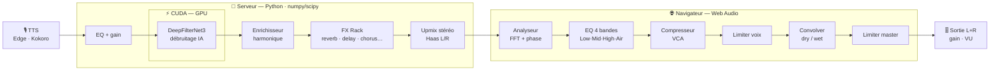
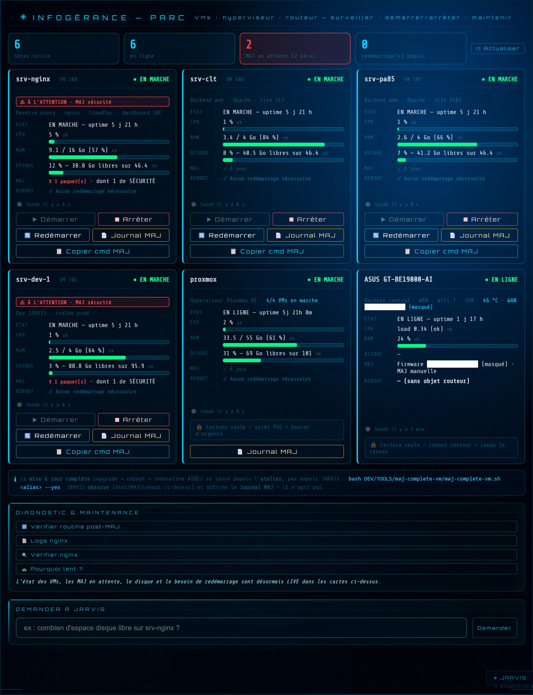
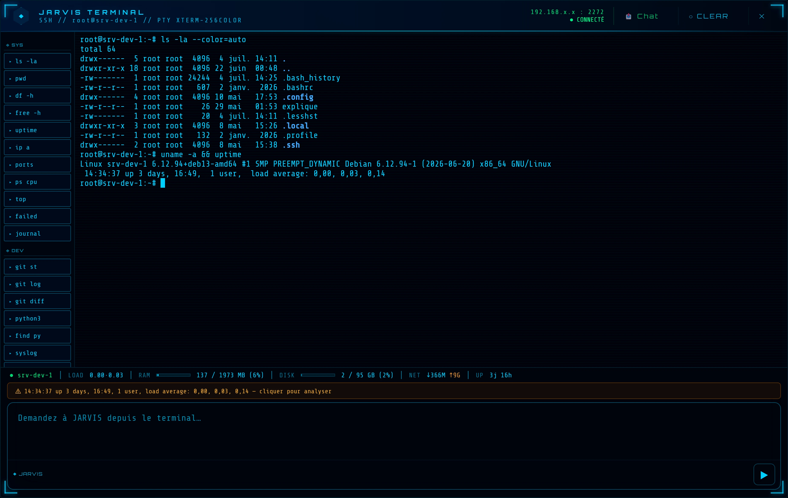
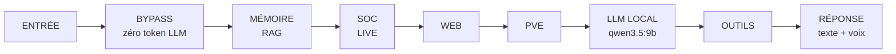
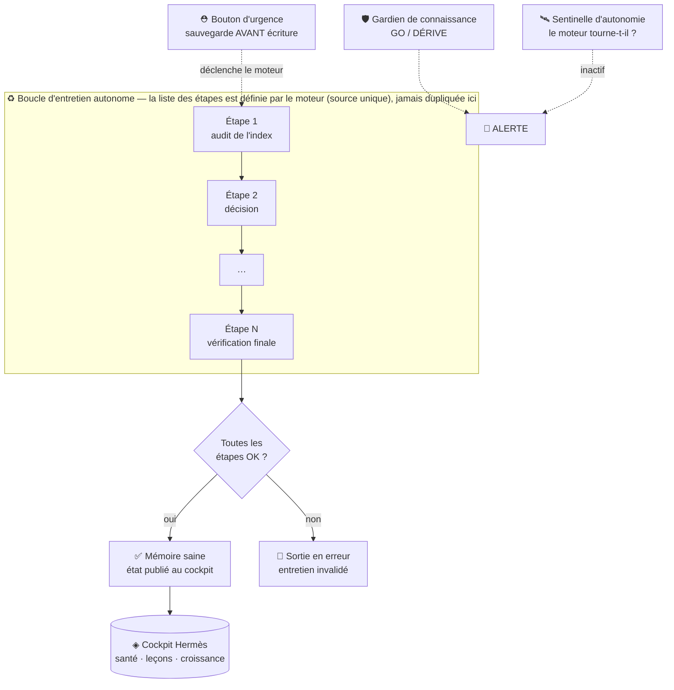

    

  

  <h2>Assistant IA 100 % local · voix broadcast · interface holographique · SOC autonome 24/7</h2>

  

    
    
    
    
    
    
  

  <strong>IA 100 % locale</strong> &nbsp;·&nbsp; <strong>Voix naturelle STT / TTS</strong> &nbsp;·&nbsp; <strong>Automatisation SOC</strong> &nbsp;·&nbsp; <strong>RTX 5080</strong>

---

### *Une IA qui vit sur votre machine — elle voit, parle, se souvient, apprend et veille. Seule.*

**JARVIS** est un assistant IA personnel de type *Iron Man* qui tourne **entièrement en local** sur un seul poste — Python/Flask + Ollama, RTX 5080. Pas un chatbot de plus : un **agent** doté d'une voix broadcast, d'une mémoire qui ne s'efface pas, d'une vision multimodale, et d'un **SOC qui défend l'infrastructure 24/7 sans intervention**. Zéro LLM cloud, zéro abonnement — **le raisonnement, la mémoire et les données restent sur le poste** *(voix edge-tts en ligne au choix, repli Kokoro neural local hors-ligne)*.

> [!IMPORTANT]
> **Vitrine — pas une procédure d'installation.**
> Ce dépôt **présente** le projet (architecture, conception, capacités). Le **code opérationnel reste privé** : JARVIS n'est **pas déployable** depuis ce dépôt. On y montre le *quoi* et le *pourquoi* — jamais le *comment* exact.

  
   <em>Au démarrage, JARVIS s'auto-diagnostique — <b>NEURAL CORE · VOICE ENGINE · AUDIO DSP · KNOWLEDGE BASE</b> à 100 % — puis annonce son état : modèle <code>qwen3.5:9b</code> via Ollama, voix Edge Antoine, DSP (EQ · compresseur · DeepFilterNet), accélération CUDA sm_120 Blackwell.</em>

---

<h2 align="center">✦ Ce qui rend JARVIS unique</h2>

<table align="center">
<tr><td>🔒 <b>IA 100 % locale</b></td><td>LLM, RAG, mémoire, données sur le poste — zéro LLM cloud, zéro abonnement. Voix edge-tts en ligne (repli Kokoro local).</td></tr>
<tr><td>🧠 <b>Un agent, pas un chatbot</b></td><td><em>Hermès</em> observe, mémorise, apprend et <b>agit</b> — sans être re-briefé à chaque session.</td></tr>
<tr><td>🛡️ <b>SOC autonome 24/7</b></td><td>Détecte, bannit et redémarre <b>seul</b> · alertes vocales · contexte sécurité en direct.</td></tr>
<tr><td>🎙️ <b>Voix qualité broadcast</b></td><td>Chaîne DSP pro (débruitage IA · compresseur · FX) + voix Edge, repli Kokoro neural local.</td></tr>
<tr><td>⚡ <b>RTX 5080 maîtrisée</b></td><td>Modèle 100 % en VRAM, garde-fou anti-débordement, CUDA partout (Whisper · DeepFilterNet).</td></tr>
<tr><td>♿ <b>Pensé accessible</b></td><td>Haute lisibilité, commandes vocales <b>déterministes</b> (zéro token LLM · budget de conception &lt; 100 ms pour les bypass <b>purement locaux</b>, jamais un relevé), briefing matinal.</td></tr>
</table>

**Visite guidée** &nbsp;·&nbsp; [🕹️ Cockpit](#sec-1) &nbsp;·&nbsp; [🧠 Réglages](#sec-2) &nbsp;·&nbsp; [📊 Monitoring](#sec-3) &nbsp;·&nbsp; [🎛️ Studio DSP](#sec-4) &nbsp;·&nbsp; [🎙️ Voice Lab](#sec-5) &nbsp;·&nbsp; [🌐 Accès Web](#sec-6) &nbsp;·&nbsp; [🛡️ SOC](#sec-7) &nbsp;·&nbsp; [◈ Infogérance](#sec-8) &nbsp;·&nbsp; [✦ Hermès](#hermes)

---

<h2 align="center">🖼️ L'interface en action</h2>

<h3 align="center">1 · Le cockpit</h3>

  

Le poste de pilotage complet. À gauche, **l'interface neurale** et la barre de commande avec ses **modes de routage** — `SOC · GÉN · CODE · THINK` + entrées `MIC`, `IMG` (vision), `WEB`, `AIDE` — qui orientent chaque requête vers le bon comportement, **un seul modèle `qwen3.5:9b`, zéro swap**. À droite, la **télémétrie temps réel** : cœur d'intégrité, coordonnées, **GPU** (VRAM, température, watts), système et modèle neural. Les modules sont accessibles d'un clic depuis la barre du haut — leur nombre n'est pas figé ici : c'est celui des onglets réellement déclarés dans l'interface.

> 🔒 **Comment cette interface est servie — le périmètre réseau réel.**
> JARVIS écoute sur **deux points d'entrée**, pas un seul :
> 1. **Accès local** — HTTP sur la **boucle locale** (`127.0.0.1`), **sans login** : c'est l'usage nominal, au poste.
> 2. **Accès réseau LAN/VPN** — **HTTPS sur toutes les interfaces**, où **toute** requête qui ne vient pas de la boucle locale exige une **session authentifiée**. Aucune configuration d'identifiants, ou authentification réseau non activée ⇒ **refus** (*fail-closed*) ; seule la page de connexion reste joignable.
>
> Par-dessus ces deux portes, une **seconde barrière** : les **actions privilégiées** (exécution, SSH, tâches, réglages, infrastructure, mémoire) restent **strictement loopback**. Le contrôle est ancré sur le **socket** de la requête — pas seulement sur l'en-tête `Origin`, falsifiable par omission — de sorte qu'un client réseau, **même authentifié**, ne les atteint pas : il n'obtient que le **conversationnel** (chat, voix). S'y ajoutent une allowlist d'en-tête `Host` (**anti-DNS-rebinding**) et un refus des origines tierces **y compris en loopback** (anti-CSRF/XSS).
>
> Le **terminal PTY**, lui, est bien **loopback-only** au sens strict (voir plus bas) : il n'est servi que sur `127.0.0.1`.

<h3 align="center">2 · Réglages LLM & profils GPU</h3>

*Le centre de contrôle fin de l'inférence locale — chaque carte pilote un aspect de la RTX 5080 et du modèle.*

<table>
<tr>
<td width="50%" align="center"> <b>GPU Health</b> — VRAM / 16 Go, charge, température et puissance de la RTX 5080, en direct.</td>
<td width="50%" align="center"> <b>Impact VRAM</b> — coût mémoire estimé <em>avant</em> lancement : empreinte du modèle (lue dans le registre source-unique) + cache KV dérivé de <code>num_predict</code>, avec verdict « zone sûre ».</td>
</tr>
<tr>
<td width="50%" align="center"> <b>Profils RTX 5080</b> — 6 préréglages en un clic : Rapide · Équilibré · Code · Créatif · Précis · MAX.</td>
<td width="50%" align="center"> <b>Paramètres LLM</b> — température, top-p/k, contexte, repeat penalty + 3 modes d'optimisation latence.</td>
</tr>
</table>

> Le **prompt système gouverné** (anti-hallucination, méthodologie SOC, profils sauvegardés) vit dans le même onglet — volontairement non exposé ici (il contient des références internes).

<h3 align="center">3 · Monitoring GPU · CPU · VRAM</h3>

  

Surveillance **temps réel** de toute la machine : six jauges (GPU, VRAM / 16 Go, température, puissance, CPU, RAM) puis le détail — **GPU Core** (horloges, encodeur/décodeur), **thermique & puissance**, **mémoire VRAM** (utilisée / libre), processeur (cœurs, fréquence, uptime), réseau et disque I/O.

  
   <em><b>Empreinte LLM en VRAM</b> — le modèle <code>qwen3.5:9b</code> et l'embedding RAG <code>qwen3-embedding:4b</code> cohabitent dans les 16 Go ; la VRAM restante est affichée en clair. ⚠ Les gigaoctets lus sur cette capture sont l'empreinte <b>réellement chargée, mesurée à l'instant du cliché</b> — à ne pas confondre avec l'empreinte <b>déclarée</b> de chaque modèle, qui vit dans le registre source-unique et sert au calcul <b>a priori</b> de la carte « Impact VRAM » ci-dessus. Deux grandeurs différentes, jamais recopiées l'une de l'autre. Débit live (tok/s), <code>num_ctx</code> et <b>SWAP RAM = 0</b> : tout tient sur la carte, pleine vitesse.</em>

C'est le garde-fou du LLM 100 % local : tant que le modèle **+ son cache KV** tiennent dans les 16 Go, l'inférence reste **pleine vitesse GPU** ; s'ils débordent, Ollama « spille » en RAM et la vitesse s'effondre — d'où la surveillance de l'empreinte.

<h3 align="center">4 · Studio audio DSP — le rack broadcast</h3>

Une **chaîne broadcast complète** appliquée à la voix de synthèse, en deux temps : un **traitement serveur** en Python/CUDA sur l'audio rendu par le TTS, puis un **rack Web Audio** temps réel dans le navigateur. Le studio expose une carte par fonction — chacune pilote un étage réel de l'une ou l'autre moitié.

<table>
<tr>
<td width="50%" align="center"> <b>① DeepFilterNet</b> — débruitage IA (DeepFilterNet3) : supprime bruit de fond et artefacts TTS.</td>
<td width="50%" align="center"> <b>② Compresseur</b> — dynamique VCA (seuil · ratio · attaque · relâche) : voix homogène, sans pics.</td>
</tr>
<tr>
<td width="50%" align="center"> <b>③ Stereo Widener</b> — effet Haas : élargit l'image stéréo, compatibilité mono préservée.</td>
<td width="50%" align="center"> <b>④ FX Rack</b> — reverb · echo · delay · chorus · flanger par convolution : le caractère sonore.</td>
</tr>
<tr>
<td width="50%" align="center"> <b>⑤ Analyseur spectral</b> — FFT temps réel, plusieurs modes d'affichage + goniomètre de phase.</td>
<td width="50%" align="center"> <b>⑥ EQ paramétrique</b> — 4 bandes (LOW/MID/HIGH/AIR) couplées à la voix, avec presets.</td>
</tr>
<tr>
<td width="50%" align="center"> <b>⑦ Moteur vocal</b> — bascule Edge (cloud) ↔ Kokoro (neural local), voix Antoine CA, test à la volée.</td>
<td width="50%" align="center"> <b>⑧ Voice Print</b> — analyse vocale (librosa/scipy) : forme d'onde, pitch F0, spectre Mel.</td>
</tr>
</table>

<h4 align="center">Schéma logique du circuit — état des étages & CUDA</h4>

*Le signal vocal traverse **deux moitiés** : d'abord le **traitement serveur** (Python/numpy, dont un étage **CUDA** pour le débruitage IA), qui rend un WAV stéréo ; puis le **rack Web Audio** temps réel dans le navigateur.*

```mermaid
flowchart LR
    TTS["🎙️ TTS<br/>Edge · Kokoro"] --> SEQ
    subgraph SRV["🐍 Serveur — Python · numpy/scipy"]
        SEQ["EQ + gain"] --> DFN
        subgraph CUDA["⚡ CUDA — GPU"]
            DFN["DeepFilterNet3<br/>débruitage IA"]
        end
        DFN --> ENR["Enrichisseur<br/>harmonique"] --> SFX["FX Rack<br/>reverb · delay · chorus…"] --> HAAS["Upmix stéréo<br/>Haas L/R"]
    end
    HAAS --> AN
    subgraph WA["🌐 Navigateur — Web Audio"]
        AN["Analyseur<br/>FFT + phase"] --> EQ["EQ 4 bandes<br/>Low·Mid·High·Air"] --> CMP["Compresseur<br/>VCA"] --> LIM["Limiter voix"] --> CONV["Convolver<br/>dry / wet"] --> MST["Limiter master"]
    end
    MST --> OUT["🎚️ Sortie L+R<br/>gain · VU"]
```

<table align="center">
<tr><th>Étage</th><th>Rôle logique</th><th>Circuit</th></tr>
<tr><td><b>TTS</b></td><td>synthèse vocale — Edge Antoine / Kokoro neural local</td><td>source</td></tr>
<tr><td><b>EQ + gain</b></td><td>modelage du timbre à la source — bandes LOW · MID · HIGH · AIR</td><td>serveur (Python)</td></tr>
<tr><td><b>DeepFilterNet3</b></td><td>débruitage IA — retire bruit de fond + artefacts TTS</td><td><b>⚡ CUDA (GPU)</b></td></tr>
<tr><td><b>Enrichisseur</b></td><td>enrichissement harmonique de la voix</td><td>serveur (Python)</td></tr>
<tr><td><b>FX Rack</b></td><td>reverb · echo · delay · chorus · flanger · exciter</td><td>serveur (Python)</td></tr>
<tr><td><b>Stereo Widener</b></td><td>upmix mono → stéréo (effet Haas), largeur réglable jusqu'au mono</td><td>serveur (Python)</td></tr>
<tr><td><b>Analyseur</b></td><td>FFT temps réel + goniomètre de phase</td><td>Web Audio</td></tr>
<tr><td><b>EQ 4 bandes</b></td><td>correction finale à l'écoute — LOW · MID · HIGH · AIR</td><td>Web Audio</td></tr>
<tr><td><b>Compresseur</b></td><td>homogénéise le volume (seuil · ratio · attaque · relâche, VCA)</td><td>Web Audio</td></tr>
<tr><td><b>Convolver dry/wet</b></td><td>réverbération par convolution, dosée dry/wet</td><td>Web Audio</td></tr>
<tr><td><b>Sortie L+R</b></td><td>bus master : limiteur brick-wall, gain de sortie + VU-mètres</td><td>Web Audio</td></tr>
</table>

> Côté **entrée**, la reconnaissance vocale (STT `faster-whisper large-v3-turbo`) est elle aussi **accélérée CUDA** — le GPU couvre toute la chaîne voix.

<h3 align="center">5 · Voice Lab</h3>

  

L'atelier de la voix de l'assistant. **Source** commutable — **Edge** (Antoine fr-CA) ↔ **Kokoro** neural CUDA, 100 % local hors-ligne — puis **paramètres vocaux** fins (vitesse, hauteur, volume + égalisation LOW/MID/HIGH/AIR synchronisée au DSP), une **bibliothèque** de voix (JARVIS Standard, Grave, Aiguë, Radio FM, Kokoro Neural) et un **comparateur A/B** pour trancher à l'oreille. C'est ce qui donne à JARVIS une voix naturelle et homogène, en ligne comme hors-ligne.

<h3 align="center">6 · Accès Web gouverné</h3>

  

L'agent peut consulter le web — mais **sous contrôle strict**. JARVIS ne visite QUE les domaines d'une **allowlist explicite** : des **sites système verrouillés** (météo, veille IA, recherche — non supprimables) plus ceux que *tu* autorises nommément. Tout est en **lecture seule**, **chaque accès est journalisé**, et tout le reste est **refusé**. Même principe de moindre privilège que pour le SOC : la curiosité de l'agent reste gouvernée.

<h3 align="center">7 · SOC — réponse automatique</h3>

  

Le **centre de défense** de JARVIS. Courbe d'**activité sur 30 jours** (pics offensifs) et **compteurs en direct** — actions, **bans IP**, restarts, succès / échecs, détections **IDS**. JARVIS surveille nginx / CrowdSec / fail2ban / Suricata en continu et **agit seul** (ban, restart) selon des seuils : l'agent ne se contente pas d'alerter, il **répond**.

> 🔒 Volontairement **non publiés** : le journal des IP d'attaquants, le terminal d'actions SOC, les leçons apprises. La vitrine *décrit* le SOC et montre son activité **agrégée** — **aucune donnée actionnable, aucune IP**.

<h3 align="center">8 · Infogérance — le parc en direct</h3>

  
   <em>Le <b>parc entier sur un seul écran</b> : quatre compteurs <b>comptés en direct</b> (hôtes suivis · en ligne · MAJ en attente · redémarrages requis), puis <b>une carte par hôte</b> — toutes au <b>même gabarit</b> (ÉTAT · CPU · RAM · DISQUE · MAJ · REBOOT), pour qu'une ligne manquante se <em>voie</em>. Chaque carte <b>date sa sonde</b> (« Sondé il y a … », et <b>« ⚠ SONDE PÉRIMÉE »</b> au-delà de 10 min) et lève une pastille <b>« ⚠ À L'ATTENTION »</b> <b>en toutes lettres</b>, jamais un simple code couleur. <b>IP WAN et version de firmware caviardées</b> par un aplat opaque appliqué <em>avant</em> la capture.</em>

**JARVIS observe, il n'agit pas.** JARVIS ne déclenche pas la mise à jour complète d'une VM : elle se lance **hors de JARVIS**, dans une console. Le bandeau le **dit en toutes lettres** et renvoie au bouton **« Copier cmd MAJ »** — qui reste le **seul** endroit où la commande existe, pour qu'un chemin ne puisse pas dériver entre deux textes. JARVIS, lui, en affiche l'**état** puis le **journal**. Une valeur qu'il ne sait pas vérifier — index de paquets périmé, sonde en échec — est **dite** (« ⚠ Non vérifiable », avec sa raison) et **jamais** repeinte en « ✓ à jour » : un total n'additionne que ce qui est connu, et compte à part ce qui ne l'est pas.

<table align="center">
<tr><th>Bouton</th><th>Ce qu'il fait — vraiment</th></tr>
<tr><td><b>▶ Démarrer</b></td><td>Demande d'abord une <b>confirmation</b> dans l'onglet, puis démarre la VM sur l'hyperviseur (<code>qm start</code>) par une commande <b>déterministe, sans LLM</b>. JARVIS <b>attend ensuite le retour de la machine</b> (jusqu'à ~2 min de sondage SSH) et <b>vérifie service par service</b> ce qui doit tourner sur cet hôte précis, puis annonce le verdict <b>à la voix</b>. Inactif si la VM tourne déjà.</td></tr>
<tr><td><b>⏹ Arrêter</b></td><td>Même chemin en <code>qm stop</code>, avec <b>deux verrous</b> : l'arrêt passe par une <b>clé SSH d'administration dédiée</b> — la clé courante est bridée côté hyperviseur et <b>refuse</b> stop / shutdown / reset —, et une <b>liste noire de VMs qu'on n'arrête jamais</b> protège le pare-feu réseau. Inactif si la VM est déjà arrêtée.</td></tr>
<tr><td><b>🔄 Redémarrer</b></td><td>Volontairement <b>pas</b> un <code>qm reboot</code> : le verbe « redémarre » est <b>exclu</b> de la détection VM, la demande part donc sur le redémarrage <b>du système invité</b> en SSH — et exige une <b>seconde confirmation</b> dans la conversation (« oui » / « non »). Une seule phrase ne peut jamais redémarrer une machine. Sur l'hyperviseur, c'est un <b>refus net</b> : le redémarrer couperait toutes les VMs, ça passe par le menu et sa triple confirmation.</td></tr>
<tr><td><b>📄 Journal MAJ</b></td><td><b>Lecture seule.</b> Affiche les dernières étapes de la mise à jour complète de cet hôte (✅ / ❌ + détail). Le journal vit <b>hors de l'atelier</b> — il survit donc à une restauration — et sa lecture est <b>bornée en mémoire</b> : un fichier qui grossit ne peut pas faire enfler JARVIS. Le nombre d'étapes est <b>annoncé au lecteur d'écran</b>. Présent sur toutes les cartes sauf le routeur.</td></tr>
<tr><td><b>📋 Copier cmd MAJ</b></td><td><b>Copie, n'exécute rien.</b> Place dans le presse-papiers la commande de mise à jour complète de cet hôte, à coller dans une console <b>hors de JARVIS</b>. C'est le <b>seul</b> endroit où cette commande est écrite — le bandeau y renvoie au lieu de la recopier, pour qu'un chemin ne puisse pas dériver entre deux textes. La route HTTP qui <em>lançait</em> la mise à jour a été <b>retirée</b> : le produit ne déclenche plus un outil de développement. Délibérément <b>absent sur l'hyperviseur</b> — la routine post-MAJ le refuse, et un raccourci aurait contourné ce garde-fou.</td></tr>
<tr><td><b>⟳ Actualiser</b></td><td>Relit <b>tout le parc en un seul appel</b> et repeint. Anti-clignotement : les cartes ne sont re-rendues que si l'<b>état réel</b> a changé — l'âge de la sonde est exclu de la signature —, pour ne pas remettre à zéro le focus ni le défilement toutes les <b>25 s</b>, cadence à laquelle l'onglet se rafraîchit seul tant qu'il est visible.</td></tr>
</table>

> 🔒 **Deux cartes n'ont aucun bouton d'action** — et le **disent en toutes lettres** au lieu de griser un bouton : l'hyperviseur (« Lecture seule — arrêt PVE = bouton d'urgence ») et le routeur (« Lecture seule — reboot routeur = coupe le réseau »). La raison est **lisible et audible** ; elle ne se devine pas à une couleur.

En bas de l'onglet, quatre **raccourcis de diagnostic** (vérifier la routine post-MAJ, logs nginx, état de nginx, « pourquoi un serveur peut-il être lent ? ») et une **question libre** adressent la demande à l'agent, qui répond dans la zone de réponse — et à la voix.

---

<h2 align="center">⌨️ Terminal SSH intégré (mode Code)</h2>

  

Un **vrai terminal SSH interactif** (PTY `xterm-256color`) intégré à JARVIS — pour piloter le serveur de dev **sans quitter l'interface**. À gauche, des **raccourcis en un clic** (SYS : `ls`, `df`, `uptime`, `ports`, `ps`, `top`… · DEV : `git`, `python3`, `find`, `syslog`…). En bas, un **HUD ressources en direct** (load · RAM · disque · réseau · uptime) et une barre **« Demandez à JARVIS depuis le terminal »** : l'agent lit la sortie et propose la commande suivante. Sortie **couleur** complète, redimensionnement à chaud.

> 🔒 **Gouverné** : le PTY est **loopback-only** — bind `127.0.0.1` + contrôle d'origine WebSocket + anti-DNS-rebinding, jamais exposé hors la machine. L'IP réelle est masquée sur cette capture (`192.168.x.x`).

---

<h2 align="center">◈ Hermès — l'agent persistant</h2>

> **Hermès transforme un assistant en agent.**
> Là où un assistant répond, un agent **observe, mémorise, apprend et agit** — sans être re-briefé à chaque session.

  

Le tableau de bord vivant de l'agent. Au centre, le **cœur** qui « respire » tant que JARVIS tourne — il **s'illumine** quand il parle (*JE PARLE*), vire à l'**or/ambre** quand la menace monte. Autour, le **diagnostic** (RAG, mémoire, connaissance) et l'**état moteur** (mode, modèle `qwen3.5:9b`, niveau de menace + sa cause). En bas, le **pipeline temps réel** : `ENTRÉE → BYPASS (zéro token LLM) → MÉMOIRE (RAG borné — plafond ET plancher) → SOC LIVE → WEB → PVE → LLM LOCAL → OUTILS → RÉPONSE` — **chaque brique affiche sa métrique en direct**, à une exception assumée : le **budget de latence du bypass** est une **valeur de référence, pas une mesure** — elle porte donc un style distinct des métriques live, pour qu'on ne la lise jamais comme un relevé, et elle ne vaut que pour les bypass **purement locaux**. L'agentification rendue visible.

<h3 align="center">Schéma logique de la pile — le rôle de chaque tuile</h3>

*Le chemin d'une requête à travers les circuits de l'agent — chaque tuile a un rôle précis et affiche sa métrique en direct.*

```mermaid
flowchart LR
    IN["ENTRÉE"] --> BY["BYPASS<br/>zéro token LLM"] --> MEM["MÉMOIRE<br/>RAG"] --> SOC["SOC<br/>LIVE"] --> WEB["WEB"] --> PVE["PVE"] --> LLM["LLM LOCAL<br/>qwen3.5:9b"] --> TL["OUTILS"] --> OUT["RÉPONSE<br/>texte + voix"]
```

<table align="center">
<tr><th>Tuile du flux</th><th>Rôle logique</th></tr>
<tr><td><b>ENTRÉE</b></td><td>voix (STT Whisper) · texte · image (vision multimodale)</td></tr>
<tr><td><b>BYPASS</b></td><td>commandes directes <b>déterministes</b> — <b>zéro token LLM</b>, donc zéro hallucination possible. Le « &lt; 100 ms » est un <b>budget de conception, pas un relevé</b>, et il ne vaut que pour les bypass <b>purement locaux</b> : ceux qui sortent de la machine (SSH, sauvegardes, mises à jour) sont bornés par des délais d'attente bien plus longs (<a href="DOCUMENTATION/01-HERMES.md">détail</a>)</td></tr>
<tr><td><b>MÉMOIRE</b></td><td>faits + leçons <b>RAG</b> — corpus borné des <b>deux côtés</b> : un plafond (dérive) <em>et</em> un plancher (index éventré). Les deux seuils viennent d'une seule constante de référence, jamais d'un chiffre recopié</td></tr>
<tr><td><b>SOC LIVE</b></td><td>injecte le <b>contexte sécurité</b> temps réel</td></tr>
<tr><td><b>WEB</b></td><td>recherche <b>gouvernée</b> (allowlist, lecture seule)</td></tr>
<tr><td><b>PVE</b></td><td>état <b>Proxmox</b> temps réel</td></tr>
<tr><td><b>LLM LOCAL</b></td><td>raisonnement <code>qwen3.5:9b</code> — <b>100 % local</b></td></tr>
<tr><td><b>OUTILS</b></td><td>fichiers / SSH — <b>appelés par le LLM</b></td></tr>
<tr><td><b>RÉPONSE</b></td><td>texte + voix (cache TTS)</td></tr>
</table>

Autour du flux, les **briques transversales** (enrichissent · protègent · agissent), chacune une tuile d'état :

<table align="center">
<tr><th>Brique transversale</th><th>Rôle logique</th></tr>
<tr><td><b>VISION</b></td><td>analyse d'images (<code>qwen3.5:9b</code> multimodal natif)</td></tr>
<tr><td><b>MCP</b></td><td>pont gouverné vers un client compatible MCP — outils exposés en <b>boucle locale</b></td></tr>
<tr><td><b>APPRENTISSAGE</b></td><td>mémorise les leçons (« souviens-toi… »)</td></tr>
<tr><td><b>RÉFLEXION</b></td><td>apprend de tes corrections (proposées → validées)</td></tr>
<tr><td><b>DR CERVEAU</b></td><td>sauvegarde / restauration de la mémoire</td></tr>
<tr><td><b>BRIEFING</b></td><td>résumé proactif au réveil</td></tr>
<tr><td><b>ALARMES</b></td><td>rappels à l'heure</td></tr>
<tr><td><b>PÉDAGOGIE</b></td><td>explique vs analyse (mode tuteur)</td></tr>
<tr><td><b>INFOGÉRANCE</b></td><td>parc unifié <b>VMs · hyperviseur · routeur</b> : état, CPU/RAM/disque, MAJ et redémarrage requis en direct · démarrer / arrêter / redémarrer sous <b>double confirmation</b>, journal des MAJ, <b>lecture seule</b> là où l'arrêt est critique · <b>fail-closed</b> : une valeur non vérifiable se <em>dit</em>, elle ne se déguise pas en « à jour » (<a href="#sec-8">détail</a>)</td></tr>
</table>

<h3 align="center">Les capacités de l'agent</h3>

  
   <em>Les <b>briques transversales</b> qui enrichissent, protègent et prolongent l'agent — <b>Vision</b> (analyse d'images), <b>MCP</b> (pont gouverné vers un client MCP), <b>Apprentissage</b>, <b>Réflexion</b>, <b>DR Cerveau</b> (sauvegarde/restauration), <b>Briefing</b> matinal proactif, <b>Alarmes</b>, <b>Pédagogie</b> (explique vs analyse), <b>Infogérance</b> (état du parc + <b>journal</b> des MAJ, fail-closed — JARVIS ne lance pas la MAJ). Chacune porte un <b>état</b> ; la plupart affichent en plus une <b>métrique en direct</b> (outils MCP joignables, leçons, corrections apprises, date de sauvegarde, alarmes actives). Les rares briques dont la valeur ne se mesure pas affichent une <b>valeur de référence</b> dans un style distinct — jamais présentée comme un relevé.</em>

<h3 align="center">Le tableau de bord vivant</h3>

  
   <em>Six panneaux d'auto-diagnostic d'un coup d'œil — <b>Cerveau/Mémoire</b> (leçons apprises, rythme), <b>Sauvegarde</b> (instantané + auto quotidien 21 h), <b>Santé mémoire</b> (verdict GO/NO-GO, puis l'<b>intégrité chiffrée</b> : nombre de fiches orphelines, de liens cassés, dépassement de taille — « saine » n'est écrit que si <b>tout</b> est à zéro, sinon les compteurs réels sont affichés en toutes lettres), <b>SOC Auto-engine</b>, <b>Historique</b> persisté, <b>Réflexion</b> (corrections proposées vs apprises, taux d'apprentissage).</em>

<table>
<tr>
<td width="50%" align="center"> <b>Croissance du cerveau</b> — cumul des leçons + rythme d'apprentissage : la mémoire s'accumule, persistée et réinjectée, jamais repartie de zéro.</td>
<td width="50%" align="center"> <b>Non-dérive</b> — chaque leçon porte un statut (active · promouvable · doublon · périmée) ; corpus sain → bandeau <b>« AUCUNE DÉRIVE »</b>.</td>
</tr>
</table>

<h3 align="center">Le maintien en vie autonome</h3>

> **Le pari : un agent qui ne se contente pas d'apprendre — il se maintient lui-même en vie.**
> Hermès reste *sain* indéfiniment **sans intervention** : il se diagnostique, se répare, se borne, et **alerte seul** si sa propre mécanique d'entretien s'arrête.

Un **moteur d'entretien autonome** enchaîne des étapes **idempotentes et réversibles** — chaque échec force une sortie en erreur (*fail-closed cumulatif*) : un entretien partiel ne se fait **jamais** passer pour un succès. Il audite notamment l'index de la mémoire, décide des purges, vérifie la structure et les ressources, consolide les leçons, contrôle les sources de vérité, la dérive mémoire ↔ réel et les termes périmés.

> ⚠ **Le nombre et le nom des étapes ne sont pas recopiés ici** — ils viennent du moteur lui-même, qui **trace chaque étape nommément** (`nom` + succès) dans le rapport machine qu'il émet à chaque passage. Les figer dans cette page garantirait qu'elles dérivent à la première évolution.

```mermaid
flowchart TB
    subgraph CYCLE["♻️ Boucle d'entretien autonome — la liste des étapes est définie par le moteur (source unique), jamais dupliquée ici"]
        direction LR
        A["Étape 1<br/>audit de l'index"] --> B["Étape 2<br/>décision"]
        B --> C["…"]
        C --> N["Étape N<br/>vérification finale"]
    end
    N --> V{"Toutes les<br/>étapes OK ?"}
    V -->|oui| OK["✅ Mémoire saine<br/>état publié au cockpit"]
    V -->|non| ERR["🛑 Sortie en erreur<br/>entretien invalidé"]
    OK --> COCK[("◈ Cockpit Hermès<br/>santé · leçons · croissance")]
    GARD["🛡️ Gardien de connaissance<br/>GO / DÉRIVE"] -.-> ALERT["🔔 ALERTE"]
    SENT["🛰️ Sentinelle d'autonomie<br/>le moteur tourne-t-il ?"] -.->|inactif| ALERT
    URG["⛑ Bouton d'urgence<br/>sauvegarde AVANT écriture"] -.->|déclenche le moteur| A
```

- 🧠 **Mémoire qui ne dérive pas** — se consolide, se borne, se purge seule.
- ⛑ **Auto-réparation** — régénère les états de santé et ré-indexe la connaissance sans moi.
- 🚨 **Aucune panne silencieuse** — si l'entretien s'arrête, une sentinelle alerte.
- 🔒 **Fail-closed de bout en bout** — au moindre doute, refuser ; sauvegarde avant toute écriture.

<h3 align="center">Où vivent ces organes — la frontière du produit</h3>

> **Un outil de développement peut dépendre du produit. Le produit ne doit jamais dépendre des outils de développement.**

Ce n'est pas une préférence de rangement, c'est une **condition de survie**. Les organes qui maintiennent Hermès en vie — moteur d'entretien de la mémoire, moteur de réparation, audit de la connaissance, contrôle du rendu réel des écrans — vivaient dans l'**atelier de développement**. Conséquence prouvée : restaurer le seul coffre de JARVIS après un sinistre ressuscitait l'assistant… **avec toute sa pile d'entretien morte**, sans une erreur, sans un log.

Ils ont donc **déménagé dans le produit** — ils n'existent plus qu'à **un seul endroit**, sauvegardé avec lui :

- **Une seule copie** — l'atelier n'en garde aucune : zéro duplication, donc zéro dérive entre deux versions.
- **Une seule source pour leurs chemins** — les modules de production qui les lancent lisent tous la même déclaration, jamais leur propre variante.
- **Fail-closed** — un organe manquant est **dit** (log + voix), jamais sauté en silence.
- **Vérifié par la machine** — un garde-fou refuse tout chemin de production qui pointerait vers l'atelier, et un contrôle jumeau exige que tout chemin externe atteint à l'exécution soit couvert par le coffre.

> ✅ **Le test qui compte : restaurer le seul coffre suffit à faire revivre la pile.**

> Détail technique complet — moteur d'entretien, briques détaillées, inventaire live, comparatif Avant / Après — dans **[01 — Hermès](DOCUMENTATION/01-HERMES.md)**.

---

<h2 align="center">📚 Documentation</h2>

<table align="center">
<tr><th>#</th><th>Document</th><th>Description</th></tr>
<tr><td>01</td><td><a href="DOCUMENTATION/01-HERMES.md">Hermès</a></td><td>Mémoire · bypass · RAG · DR</td></tr>
<tr><td>02</td><td><a href="DOCUMENTATION/02-SOC-INTEGRATION.md">Intégration&nbsp;SOC</a></td><td>Auto-engine · bans · alertes</td></tr>
<tr><td>03</td><td><a href="DOCUMENTATION/03-ARCHITECTURE.md">Architecture&nbsp;globale</a></td><td>Flask · 9 pôles logiques · modules</td></tr>
<tr><td>04</td><td><a href="DOCUMENTATION/04-AUDIO-DSP.md">Audio&nbsp;DSP</a></td><td>Broadcast · TTS · STT · DSP</td></tr>
<tr><td>06</td><td><a href="DOCUMENTATION/06-MCP-SERVER.md">MCP&nbsp;Server</a></td><td>Outils exposés · conception</td></tr>
<tr><td>07</td><td><a href="DOCUMENTATION/07-ANATOMIE.md">Anatomie</a></td><td>Circuits · déterminisme · garde-fous</td></tr>
<tr><td>🗺️</td><td><a href="CARTOGRAPHIE_CIRCUITS_LOGIQUES.md">Cartographie</a></td><td>Architecture modulaire multi-circuits</td></tr>
</table>

---

<h2 align="center">🧩 Stack technique</h2>

<table align="center">
<tr><th>Couche</th><th>Technologie</th></tr>
<tr><td><b>Backend</b></td><td>Python 3.11 · Flask · Blueprints autoportants · DI pur</td></tr>
<tr><td><b>LLM local</b></td><td>Ollama · qwen3.5:9b (SOC + général + code + think + <b>vision</b> multimodal · un seul modèle, zéro swap)</td></tr>
<tr><td><b>RAG</b></td><td>qwen3-embedding:4b (dim 2560) · BM25 hybride · auto-borné · TTL 5 min</td></tr>
<tr><td><b>TTS</b></td><td>edge-tts fr-CA Antoine → repli Kokoro CUDA neural (hors-ligne, local)</td></tr>
<tr><td><b>STT</b></td><td>faster-whisper large-v3-turbo CUDA · vocabulaire SOC</td></tr>
<tr><td><b>Frontend</b></td><td>Vanilla JS · Web Audio API · xterm.js · Monaco Editor <em>(éditeur de code chargé depuis un CDN — seule dépendance réseau externe du front, en dégradation gracieuse hors ligne)</em></td></tr>
<tr><td><b>Agent Hermès</b></td><td>synoptique · bypass regex · scheduler daemon · indépendant du LLM</td></tr>
<tr><td><b>Qualité</b></td><td>suite pytest · gate de couverture pré-push · ruff 0 · eslint 0 · hooks pré-commit/pré-push</td></tr>
</table>

---

<h2 align="center">🛡️ Sécurité</h2>

<table align="center">
<tr><th>Principe</th><th>Implémentation</th></tr>
<tr><td><b>100 % local</b></td><td>JARVIS filtre et agrège localement — rien ne part vers un LLM cloud</td></tr>
<tr><td><b>RFC1918 immuable</b></td><td>Les plages IP privées ne peuvent jamais être bannies</td></tr>
<tr><td><b>SSH lecture seule</b></td><td>Patterns dangereux bloqués · whitelist explicite pour l'écriture</td></tr>
<tr><td><b>SOC en canal latéral</b></td><td>Le contexte sécurité est posé dans le <em>prompt système</em> par le serveur — il n'entre jamais dans l'historique de conversation, et ne peut donc pas être confondu avec une commande de l'utilisateur. Vérifié au <em>pre-push</em> par un garde-fou dédié (<a href="DOCUMENTATION/02-SOC-INTEGRATION.md">détail et portée exacte</a>)</td></tr>
<tr><td><b>Audit forensique</b></td><td>Toute opération SSH d'écriture tracée dans un journal JSONL</td></tr>
</table>

---

<table>
<tr>
<td align="center"><b>🖥️ Infrastructure &amp; Sécurité</b></td>
<td align="center"><b>💻 Développement &amp; Web</b></td>
<td align="center"><b>🤖 Intelligence Artificielle</b></td>
</tr>
<tr>
<td align="center">
  
  
  
   
  
  
</td>
<td align="center">
  
  
  
   
  
  
  
</td>
<td align="center">
  
    
  
</td>
</tr>
</table>

 

🔒 Projet proposé par <a href="https://github.com/0xCyberLiTech">0xCyberLiTech</a> · développé en collaboration avec <a href="https://claude.ai">Claude AI</a> (Anthropic) 🔒

