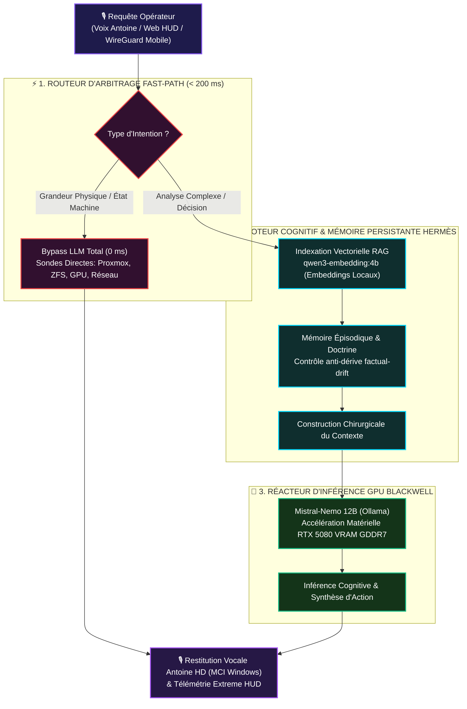

    

  

    

  <h2>Fiche 01 · La Pile Cognitive Hermès & Moteur RAG Vectoriel</h2>

  

    
    
    
    
    
    
    
  

  

  

    <strong>Mémoire Long-Terme Anti-Dérive</strong> &nbsp;•&nbsp; <strong>Fast-Path Déterministe (< 200 ms)</strong> &nbsp;•&nbsp; <strong>Indexation Vectorielle Locale</strong>
  

> [!IMPORTANT]
> **Vitrine Technologique : Architecture & Démonstration d'Ingénierie**  
> Ce document technique détaille l'architecture de la **Pile Cognitive Hermès** et du moteur vectoriel RAG de JARVIS.  
> 🔒 **Propriété Intellectuelle & Sécurité Opérationnelle** : Les scripts d'automatisation interne, clés privées et configurations physiques restent **strictement confinés** au sein de l'Atelier souverain 0xCyberLiTech.

---

## 🎯 Introduction & Rôle Opérationnel

La **Pile Cognitive Hermès** constitue le cerveau central de JARVIS. Elle assure la transition fondamentale entre un grand modèle de langage passif et un **agent autonome souverain** capable de raisonner, d'apprendre au fil des semaines et de piloter une infrastructure critique en temps réel.

Contrairement aux chatbots conventionnels qui oublient tout à la fermeture de session ou inventent des réponses approximatives, Hermès combine :
1. Un **Cœur Arc Reactor** animé en direct, visualisant l'état de conscience et le rythme cardiaque de l'IA (~1.05s LUB-DUB).
2. Un **Fast-Path déterministe (< 200 ms)** qui élimine 100 % des hallucinations sur les faits machine.
3. Une **Mémoire Épisodique & Vectorielle** scellée contre le *factual drift* par des gardiens d'intégrité automatiques.

---

## ⚡ Le Cœur Réacteur Vivant (Stark Arc Reactor)

Le pupitre supérieur d'Hermès est dominé par l'**Arc Reactor MK-VII**, une modélisation dynamique haute précision rendue sur canvas WebGL :

*Scène du Cœur Arc Reactor en production : réacteur central animé à anneaux contra-rotatifs, bobines magnétiques, graduations d'azimut et pods télémétriques latéraux.*

### 📊 Les Pods de Télémétrie Cognitive :

* **Moteur Cognitif :** Indique le modèle d'inférence actuellement chargé en VRAM (par défaut `Mistral-Nemo 12B` ou `Qwen3.5:9B`).
* **Posture Active :** Mode d'arbitrage en cours (`AUTONOME`, `SOC`, `INFOGÉRANCE`, `CODE`, `THINK`).
* **Battement Cœur (~1.05s LUB-DUB) :** Pulsation cyclique modélisant le cycle interne de veille et de rafraîchissement d'état.
* **Canal Micro (STT) :** Détection d'activité vocale temps réel avec VU-mètre à LED orange lors de la prise de parole.
* **Connaissances & Leçons :** Compteur en direct des chunks vectoriels indexés et des leçons doctrinales gravées en mémoire.
* **Intégrité Hermès (100 % Nominale) :** Contrôle continu de non-corruption de la base vectorielle.

---

## 🔬 Architecture Système des 5 Couches Hermès

Le pipeline cognitif d'Hermès est structuré en 5 couches étanches sans interdépendance circulaire :

---

## 🛠️ Description Détaillée des Mécanismes Techniques

### 1. Le Fast-Path Déterministe (< 200 ms)
* **Zéro LLM sur les faits :** Conformément à la Règle 13.2 de la Doctrine Universelle, aucun modèle de langage n'est autorisé à deviner ou extrapoler une métrique matérielle.
* **Résolution réflexe :** Les requêtes portant sur les charges CPU, la RAM, l'état ZFS, les adresses IP, les règles pare-feu ou le statut d'une VM sont interceptées en amont et résolues par appel direct aux APIs internes (< 200 ms).

### 2. Le Moteur RAG Vectoriel Hybride (`qwen3-embedding:4b`)
* **100 % Local :** Tous les calculs de plongement sémantique (*embeddings*) s'exécutent localement sans aucune dépendance cloud.
* **Filtrage cosinus adaptatif :** Seuls les passages de documentation ou d'incidents passés dont la similarité vectorielle dépasse le seuil de confiance sont injectés dans le prompt système.

### 3. La Mémoire Épisodique & Le Gardien Anti-Dérive
* **Capitalisation des retours :** Chaque consigne validée par l'opérateur est enregistrée avec son horodatage et son contexte d'exécution.
* **Gardien `jarvis-knowledge-audit.py` :** Script d'audit automatique qui compare périodiquement la mémoire textuelle stockée avec l'état réel de l'infrastructure pour interdire tout désalignement cognitif.

### 4. Le Réacteur d'Inférence GPU Blackwell
* **Modèle d'élite :** `Mistral-Nemo 12B` quantifié, offrant une précision de raisonnement optimale pour l'aide à la décision cyber et l'analyse de code.
* **Circuit Breaker :** Coupe-circuit logiciel surveillant la charge du serveur Ollama pour prévenir tout blocage.

---

## 📸 L'Interface Complète du Laboratoire d'Apprentissage

*Console complète d'Apprentissage Hermès (1920x2102) : scène du réacteur, schéma du pipeline cognitif, et matrice des 9 services transversaux souverains.*

---

| [← 🏠 Retour au Hub Principal](../README.md) | [🖥️ Page Suivante : Fiche 02 · Moniteur GPU RTX 5080 ➔](02-MONITORING-GPU-ET-SYSTEME.md) |
|:---|---:|

 

<table>
<tr>
<td align="center"><b>🖥️ Infrastructure &amp; Sécurité</b></td>
<td align="center"><b>💻 Développement &amp; Web</b></td>
<td align="center"><b>🤖 Intelligence Artificielle</b></td>
</tr>
<tr>
<td align="center">
  
  
  
   
  
  
</td>
<td align="center">
  
  
  
   
  
  
  
</td>
<td align="center">
  
    
  
</td>
</tr>
</table>

 

🔒 Conçu et maintenu par <a href="https://github.com/0xCyberLiTech">Marc (0xCyberLiTech)</a> · Ingénierie souveraine & Pair-Programming IA d'élite 🔒

