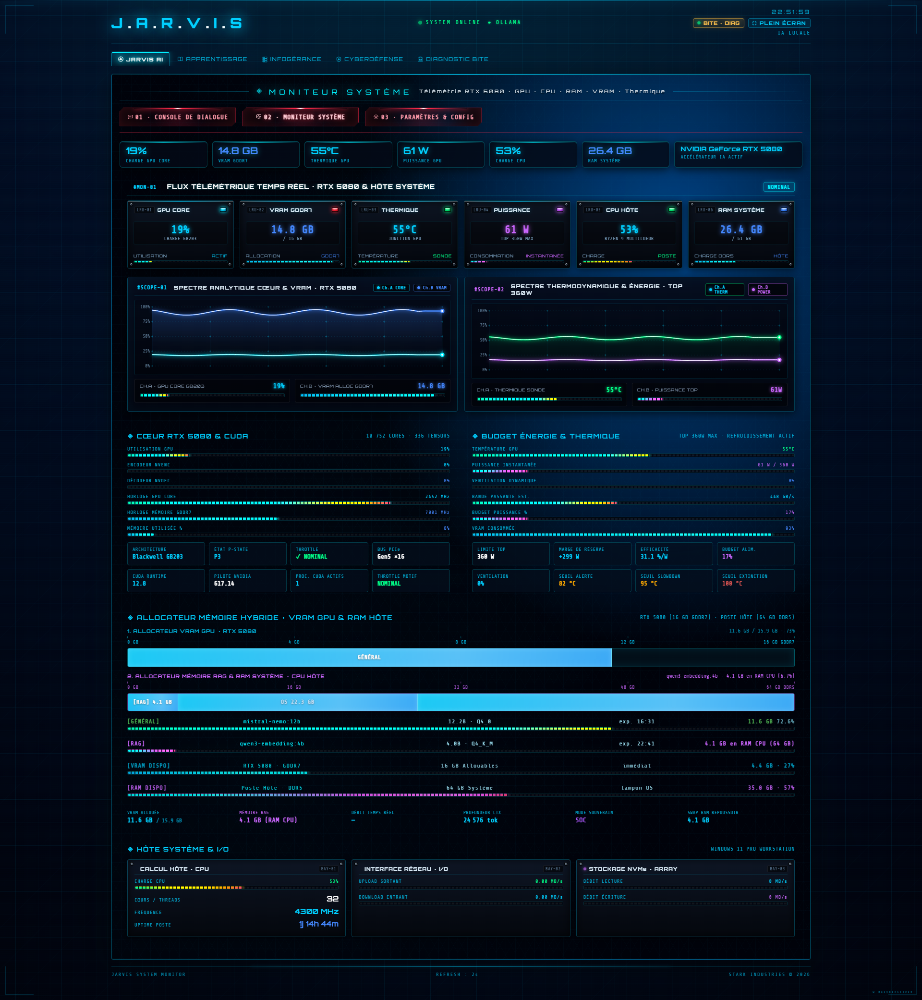

  

# 🖥️ Fiche 02 · Moniteur Système & Inférence GPU RTX 5080
### Télémétrie Sub-Seconde · Oscilloscopes Double Canal · Allocation Mémoire Hybride

---

## 🎯 Introduction & Rôle Opérationnel

L'exécution locale de modèles de langage à grande échelle (12B paramètres) et de moteurs vectoriels impose une surveillance thermique et matérielle sans compromis. L'interface **Moniteur Système** de JARVIS constitue le tableau de bord d'avionique du réacteur physique de la station hôte.

Déployé sur une architecture de dernière génération **NVIDIA GeForce RTX 5080 (Blackwell GB203)** équipée de **16 Go de VRAM GDDR7**, ce module assure :
1. La visualisation en temps réel de la charge des cœurs Tensor et CUDA.
2. L'auscultation continue des oscilloscopes thermodynamiques et énergétiques.
3. La régulation stricte de l'allocateur hybride évitant tout débordement mémoire (*swap thrashing*).

---

## 📸 L'Interface Complète du Moniteur Système

*Console complète du Moniteur Système (1920x2082) : télémétrie instantanée, oscilloscopes double canal, cœurs Tensor/CUDA, allocateur hybride et I/O hôte.*

---

## 🔬 Décomposition Technique des 5 Niveaux de Surveillance

### Tier 1 · Le Bus de Télémétrie Instantanée
* **GPU Core :** Mesure de la charge instantanée du processeur graphique Blackwell GB203.
* **VRAM GDDR7 :** Occupation précise de la mémoire vidéo (ex: 14.8 Go / 16 Go).
* **Thermique Jonction :** Température directe de la puce silicium (55 °C nominal sous charge).
* **Puissance (Watts) :** Consommation instantanée du GPU face à son budget enveloppe (TDP 360W).
* **CPU Hôte & RAM Système :** Charge globale du processeur multicœur hôte et remplissage des 64 Go de RAM DDR5.

### Tier 2 · Les Oscilloscopes Haute Résolution (Scopes Bi-Canaux)
* **#SCOPE-01 · Spectre Analytique Cœur & VRAM :**
  Oscilloscope temps réel traçant en canal double l'activité de calcul des cœurs (Channel A) et la courbe d'allocation de la VRAM vidéo (Channel B).
* **#SCOPE-02 · Spectre Thermodynamique & Énergie :**
  Tracé simultané de l'évolution de la température de jonction face à la courbe de puissance en Watts, permettant d'anticiper tout phénomène d'emballement thermique.

### Tier 3 · Cœur RTX 5080 & Accélération CUDA
* **Ressources matérielles mobilisées :** 10 752 cœurs CUDA et 336 cœurs Tensor de 5e génération.
* **Moteurs multimédias :** Surveillance des encodeurs/décodeurs matériels NVENC/NVDEC dédiés au transcodage de flux et au traitement visuel.
* **Horloges dynamiques :** Fréquence d'horloge GPU Core et mémoire GDDR7 en mégahertz réels.

### Tier 4 · L'Allocateur de Mémoire Hybride (VRAM GPU vs RAM Hôte)
JARVIS orchestre dynamiquement deux classes de modèles sans concurrence d'accès :
* **Modèle de Raisonnement (`Mistral-Nemo 12B`) :** Sanctuarisé à 100 % en VRAM GDDR7 (11.6 Go alloués) pour une vitesse de génération maximale.
* **Modèle d'Embeddings Vectoriels (`Qwen3-Embedding 4B`) :** Déployé en mémoire vive système CPU (4.1 Go alloués) pour décharger la carte graphique et préserver le budget VRAM des contextes longs.

### Tier 5 · Métriques Système Hôte & I/O
* **Calcul Multicœur :** Fréquence d'horloge stabilisée à 4300 MHz et temps de fonctionnement (*uptime*).
* **Bande Passante Réseau :** Débits entrants/sortants sur l'interface réseau haut débit.
* **Stockage NVMe Array :** Vitesse de lecture et d'écriture sur le volume ultra-rapide hébergeant la base vectorielle.

---

| [← 🧠 Page Précédente : Pile Hermès](01-PILE-HERMES-ET-RAG.md) | [🏠 Hub Principal](../README.md) | [🌐 Page Suivante : The Grid 3D ➔](03-THE-GRID-3D-SYNOPTIQUE.md) |
|:---|:---:|---:|

