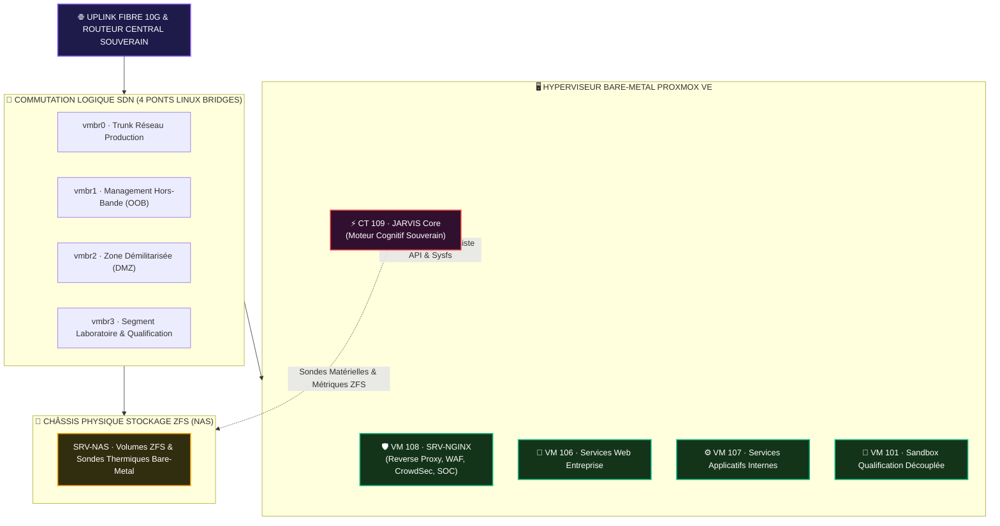

    

  

    

  <h2>Fiche 04 · Infogérance Active Proxmox VE & Flotte de VMs</h2>

  

    
    
    
    
    
    
    
  

  

  

    <strong>Démon Serveur Autonome 24/7</strong> &nbsp;•&nbsp; <strong>Supervision Déterministe PVE</strong> &nbsp;•&nbsp; <strong>Bannette IA & Sas Forensique</strong>
  

> [!IMPORTANT]
> **Vitrine Technologique : Architecture & Démonstration d'Ingénierie**  
> Ce document technique détaille le sous-système d'**Infogérance Active** sous Proxmox VE 9 et l'orchestration déterministe de la flotte de VMs.  
> 🔒 **Propriété Intellectuelle & Sécurité Opérationnelle** : Les scripts d'automatisation interne, clés privées et configurations physiques restent **strictement confinés** au sein de l'Atelier souverain 0xCyberLiTech.

---

## 🎯 Introduction & Rôle Opérationnel

L'exploitation d'une infrastructure privée exige une vigilance continue et un découpage strict des responsabilités. Le module **Infogérance Active** de JARVIS assure l'auscultation en direct de l'hyperviseur bare-metal, la santé des machines virtuelles et la surveillance thermique des équipements réseau.

Conformément à la doctrine de l'Atelier 0xCyberLiTech, **JARVIS observe en temps réel mais n'exécute aucune action destructive sans arbitrage** :
1. **Mesure factuelle directe :** Aucune métrique n'est inventée ou estimée ; tout provient des sockets Unix et de l'API Proxmox.
2. **Sas Forensique Découplé :** Les alertes systèmes sont centralisées dans un journal d'ingestion sans saturer l'opérateur.
3. **Bannette IA à Rythme Unitaire :** Traitement unitaire des micro-chantiers pour éteindre le bruit technique à la racine.

---

## 🏗️ Schéma Directeur de l'Infogérance & Topologie Hyperviseur

Afin de préserver la sanctuarisation de l'infrastructure physique tout en exposant l'ingénierie sous-jacente, la topologie de supervision est modélisée par l'architecture ci-dessous :

---

## 🔬 Les Blocs Fonctionnels du Parc Matériel

### 1. Passerelle WAN & Routeur 10G
* **Passerelle Fibre 10G :** Télémétrie optique du module SFP+ (puissance reçue, atténuation dBm, débits instantanés symétriques).
* **Routeur 10G Frontal :** Surveillance du processeur multicœur 2.6 GHz, moteur DPI matériel, et statut du tunnel VPN privé WireGuard.

### 2. Le Rack Central des Machines (Homelab 6U)
Chaque instance fait l'objet d'un suivi individualisé avec bargraphes segmentés LED étalons :
* **CT 109 · Moteur JARVIS :** Conteneur LXC Debian 13 hébergeant le moteur cognitif souverain.
* **VM 108 · Passerelle Sécurité :** Reverse Proxy frontal, pare-feu applicatif WAF, moteur CrowdSec et tableau de bord SOC.
* **VM 106 · Plateforme Web :** Serveur d'applications web d'entreprise.
* **VM 107 · Services Internes :** Serveur applicatif dédié aux services internes.
* **VM 101 · Sandbox Qualif :** Environnement confiné et isolé pour le développement et la qualification adverse.

### 3. Les Châssis Physiques Bare-Metal
* **Châssis NAS :** Serveur de stockage physique 8 baies ZFS, sonde thermique matérielle et volumétrie des pools de disques.
* **Nœud Proxmox VE :** Hyperviseur principal, surveillance de la charge CPU globale, allocation RAM et détection des paquets système à mettre à jour.

### 4. Commutation Logique Hôte (4 Ponts Virtuels SDN)
Visualisation de l'interconnexion réseau isolant les segments :
* `vmbr0` : Trunk Réseau Production.
* `vmbr1` : Segment Administration Hors-Bande (OOB / MGMT).
* `vmbr2` : Zone Démilitarisée (DMZ).
* `vmbr3` : Segment Laboratoire & Tests.

### 5. Sas Forensique & Bannette IA à Traitement Unitaire
* **Sas d'Ingestion Centralisé :** Capture automatique des rapports cron, alertes SMART et notifications de sécurité.
* **Principe de l'Alimentation Mesurée (Règle 10.5) :** Afin de prévenir toute fatigue décisionnelle, les anomalies sont traitées une par une à leur cause racine dans l'Atelier D:, garantissant un homelab sain et silencieux.

---

| [← 🌐 Page Précédente : The Grid 3D](03-THE-GRID-3D-SYNOPTIQUE.md) | [🏠 Hub Principal](../README.md) | [🧪 Page Suivante : Station BITE ➔](05-BITE-DIAGNOSTIC-STATION.md) |
|:---|:---:|---:|

 

<table>
<tr>
<td align="center"><b>🖥️ Infrastructure &amp; Sécurité</b></td>
<td align="center"><b>💻 Développement &amp; Web</b></td>
<td align="center"><b>🤖 Intelligence Artificielle</b></td>
</tr>
<tr>
<td align="center">
  
  
  
   
  
  
</td>
<td align="center">
  
  
  
   
  
  
  
</td>
<td align="center">
  
    
  
</td>
</tr>
</table>

 

🔒 Conçu et maintenu par <a href="https://github.com/0xCyberLiTech">Marc (0xCyberLiTech)</a> · Ingénierie souveraine & Pair-Programming IA d'élite 🔒

