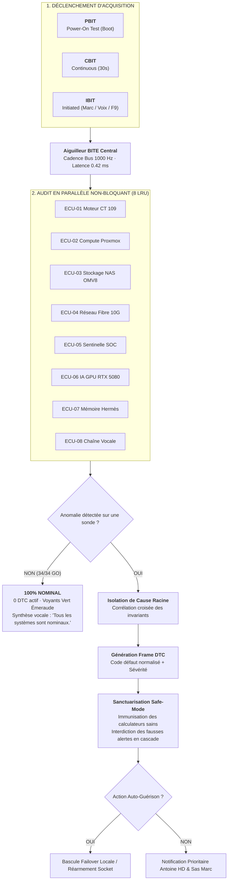
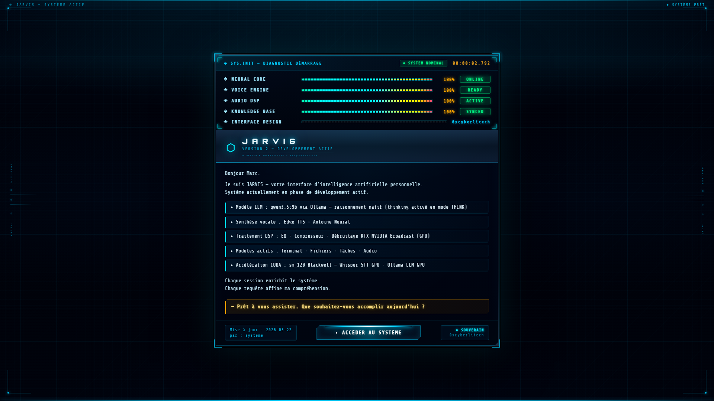
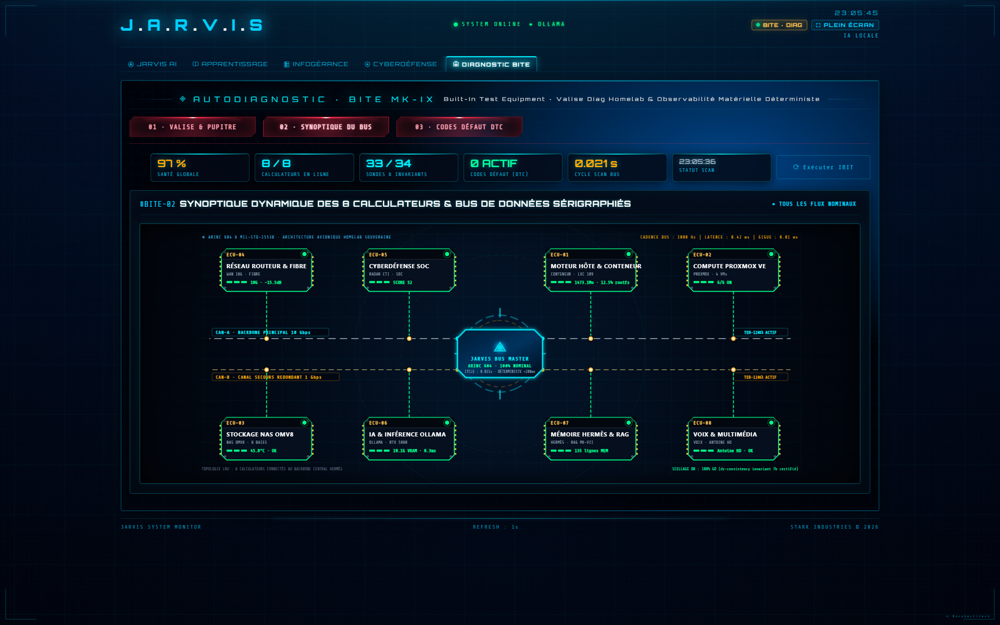
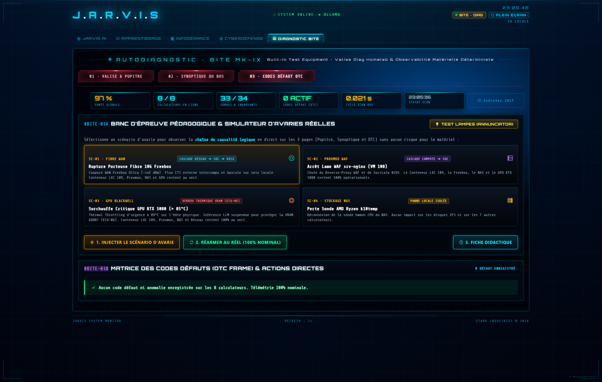

    

  

    

  <h2>Fiche 05 · Station BITE MK-IX (Autodiagnostic Avionique & Banc d'Épreuve)</h2>

  

    
    
    
    
    
    
    
  

  

  

    <strong>Standards ARINC 604 &amp; MIL-STD-1553B</strong> &nbsp;•&nbsp; <strong>8 Calculateurs LRU</strong> &nbsp;•&nbsp; <strong>Banc d'Épreuve Didactique &amp; DTC</strong>
  

> [!IMPORTANT]
> **Vitrine Technologique : Architecture & Démonstration d'Ingénierie**  
> Ce document technique détaille la **Station BITE MK-IX** (Built-In Test Equipment) et son logigramme de diagnostic avionique déterministe.  
> 🔒 **Propriété Intellectuelle & Sécurité Opérationnelle** : Les scripts de tests d'invariants réels, registres de codes de diagnostic et topologies internes restent **strictement confinés** au sein de l'Atelier souverain 0xCyberLiTech.

---

## 🧭 1. Vue d'Ensemble & Rôle Opérationnel

Inspirée directement de l'ingénierie aéronautique et spatiale (Airbus A350, Rafale, Boeing 787), la **Station BITE MK-IX** (*Built-In Test Equipment*) est le **Central Maintenance Computer** autonome de JARVIS.

Dans une infrastructure hybride souveraine, un agent d'IA ne peut pas se contenter d'« espérer » que ses briques matérielles fonctionnent. La Station BITE remplit trois missions fondamentales :
1. **La Primauté Déterministe Absolue (Règle 13) :** Zéro modèle probabiliste ni hallucination sur l'état physique. Tout indicateur est mesuré par du code machine bare-metal direct (< 200 ms).
2. **L'Accessibilité Souveraine pour Marc :** Synthèse vocale instantanée par Antoine HD (`fr-CA-AntoineNeural`) énonçant l'état de santé global et les anomalies sans imposer de lecture de logs denses.
3. **Le Banc d'Épreuve Didactique :** Pour prouver qu'un système de surveillance fonctionne, il faut être capable de **l'éprouver contre ses propres pannes**. BITE embarque un simulateur d'avaries en mémoire vive démontrant la chaîne de causalité logique sans danger pour le matériel.

---

## 📊 2. Logigramme Déterministe d'Isolation de Panne & Résilience

Le moteur BITE applique un cycle strict inspiré de la norme **ARINC 604** :

---

## 📸 3. Les 3 Sous-Interfaces Maîtresses de la Station BITE

La Station BITE déploie **3 interfaces spécialisées**, interconnectées en temps réel :

### 🧰 Sous-Page 01 · La Valise & le Pupitre des 8 Calculateurs LRU

Le pupitre principal présente la vue d'ensemble télémétrique (Santé globale, Calculateurs en ligne, Sondes & Invariants, Codes Défaut DTC, Cadence de scan) et les **8 boîtiers électroniques LRU** (*Line Replaceable Units*) dotés de cabochons LED 3D et jauges segmentées :

*Sous-Page 01 : Pupitre des 8 calculateurs LRU avec statut télémétrique haute fidélité.*

---

### ⚡ Sous-Page 02 · Le Synoptique Dynamique du Bus Vectoriel SVG

Le synoptique vectoriel matérialise l'architecture avionique **MIL-STD-1553B / ARINC 604** :
- **CAN-A (Backbone Principal 10 Gbps) :** Magistral principal actif (tracé cyan néon) reliant le cœur JARVIS aux calculateurs d'infrastructure.
- **CAN-B (Canal de Secours Redondant 1 Gbps) :** Canal de secours en attente chaude (tracé ambre néon) assurant la continuité de service en cas de rupture de lien.
- **JARVIS Bus Master :** Cœur de synchronisation central cadencé à **1000 Hz** (latence mesurée de **0.42 ms**, gigue de **0.01 ms**).

*Sous-Page 02 : Synoptique vectoriel SVG du double bus de données et des 8 boîtiers blindés.*

---

### 🛡️ Sous-Page 03 · Le Banc d'Épreuve Pédagogique & Matrice des Codes Défaut (DTC)

Véritable laboratoire de résilience, cette sous-page permet d'injecter des scénarios d'avarie contrôlés pour visualiser en direct la propagation des pannes et leur confinement étanche :
- **Annunciator Lamp Test :** Bouton `💡 TEST LAMPES` allumant instantanément tous les voyants LED du pupitre pour certifier l'absence d'ampoule ou d'indicateur grillé.
- **4 Scénarios Réels d'Avarie :**
  1. `SC-01 · FIBRE WAN` : Rupture de liaison montante WAN (cascade Réseau ➔ SOC ➔ bascule sur voix locale autonome).
  2. `SC-02 · PROXMOX WAF` : Arrêt brutal du reverse-proxy srv-nginx VM 108 (confinement : le conteneur CT 109 et le GPU restent au vert).
  3. `SC-03 · GPU BLACKWELL` : Surchauffe simulée > 85°C sur la RTX 5080 (verrouillage thermique VRAM immédiat pour protéger le composant bare-metal).
  4. `SC-04 · STOCKAGE NAS` : Perte de la sonde de température (panne locale isolée sans impact sur les volumes ZFS).
- **Deck de Contrôle & Fiche Didactique :** Injection, réarmement instantané au réel, et ouverture d'une fiche didactique détaillant la cause racine, les répercussions et la procédure de dépannage.
- **Matrice des Codes Défaut (DTC Frame) :** Registre officiel des pannes actives avec horodatage, sévérité et remédiation directe.

*Sous-Page 03 : Banc d'épreuve pédagogique, injecteur de pannes et matrice des codes DTC.*

---

## 🔬 4. Cartographie Technique des 8 Calculateurs LRU

| LRU Code | Désignation | Équipements Physiques & Virtuels Rattachés | Sondes Machine Contrôlées |
|:---:|:---|:---|:---|
| **ECU-01** | **Moteur Hôte & Conteneur** | Conteneur LXC 109 Debian 13 (Flask/Waitress) | RSS RAM (< 2 Go), Threads (33), Socket MCP :5010, WebSocket PTY :5001 |
| **ECU-02** | **Compute Proxmox VE** | Hyperviseur bare-metal i9 multicœur | API PVE, 4 VMs Debian (101, 106, 107, 108), KVM hyperviseur |
| **ECU-03** | **Stockage NAS ZFS** | Serveur bare-metal 8 baies NVMe / ZFS | Sonde matérielle thermique, montages NFS/SMB, volumes ZFS |
| **ECU-04** | **Réseau Routeur & Fibre** | Passerelle Fibre 10G + Routeur 10G Frontal | Port WAN 10G, latence WAN, débit crête, uplink inter-switch 2.5G |
| **ECU-05** | **Cyberdéfense SOC** | Sentinelle SOC Cockpit & Threat Intelligence | Détection Suricata NIDS, IP bannies CrowdSec, jails Fail2ban, score C2 |
| **ECU-06** | **IA & Inférence GPU** | Station Tour Windows Bare-metal (RTX 5080) | VRAM GDDR7 (11.6 Go / 16 Go), port 11434, tunnel SSH, modèle NeMo 12B |
| **ECU-07** | **Mémoire Hermès & RAG** | Base Vectorielle & Sceau Hermès | Base ChromaDB (4469 chunks), intégrité cognitive anti-dérive |
| **ECU-08** | **Voix & Multimédia** | Pipeline Vocal Antoine HD | Plancher de parole (68 ms/caractère), player MCI Windows, latence < 100 ms |

---

## 🎖️ 5. Pourquoi Cette Approche dans un Projet Personnel ?

La plupart des assistants virtuels grand public masquent leurs défaillances derrière des messages vagues (*« Oups, une erreur est survenue »*). 

Dans le cadre d'un système autonome conçu pour un opérateur malvoyant, **l'incertitude est proscrite**. La Station BITE apporte une traçabilité totale :
* Chaque panne a un nom, un code, une cause et un périmètre de confinement.
* Marc sait à la milliseconde près si un ralentissement provient de la liaison fibre de l'opérateur, d'une chauffe temporaire de la carte graphique, ou d'une maintenance sur l'hyperviseur.
* La résilience n'est pas un concept théorique : elle est prouvée, mesurée et démontrée en permanence.

---

| [← 🏢 Page Précédente : Infogérance Parc](04-INFOGERANCE-PARC-ET-VMS.md) | [🏠 Hub Principal](../README.md) | [📱 Page Suivante : Mobile & Voix ➔](06-MOBILE-ET-VOIX-SOUVERAINE.md) |
|:---|:---:|---:|

 

<table>
<tr>
<td align="center"><b>🖥️ Infrastructure &amp; Sécurité</b></td>
<td align="center"><b>💻 Développement &amp; Web</b></td>
<td align="center"><b>🤖 Intelligence Artificielle</b></td>
</tr>
<tr>
<td align="center">
  
  
  
   
  
  
</td>
<td align="center">
  
  
  
   
  
  
  
</td>
<td align="center">
  
    
  
</td>
</tr>
</table>

 

🔒 Conçu et maintenu par <a href="https://github.com/0xCyberLiTech">Marc (0xCyberLiTech)</a> · Ingénierie souveraine & Pair-Programming IA d'élite 🔒

