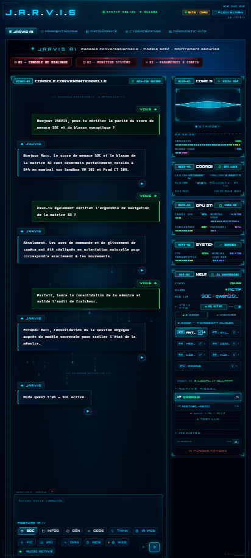

  

# 📱 Fiche 06 · Accessibilité Mobile Nomade & Voix Souveraine MCI
### Ergonomie PWA Tactile · Tunnel VPN WireGuard Isolé · Moteur Audio Natif Windows MCI

---

## 🎯 Introduction & Rôle Opérationnel

L'accessibilité est le principe cardinal qui a guidé l'architecture de JARVIS. L'interface a été spécialement conçue pour offrir un confort auditif et un retour vocal immédiat à l'opérateur.

Le système met en œuvre deux canaux d'accès souverains complémentaires :
1. **L'Interface Mobile PWA Nomade :** Une vue tactile ultra-légère accessible en déplacement exclusivement au travers d'un tunnel VPN chiffré privé (zéro port ouvert sur Internet).
2. **La Passerelle Vocale Souveraine Antoine HD :** Un moteur de restitution sonore natif Windows MCI diffusant les alertes directement sur les enceintes de l'Atelier sans dépendre du navigateur web.

---

## 📸 L'Interface Mobile Nomade (Extreme HUD Touch)

 <em>Interface tactile mobile JARVIS : ergonomie pensée pour le pouce, consultation instantanée de la santé globale et dialogue vocal chiffré.</em>

---

## 🔬 Les Deux Vecteurs d'Interaction Souverains

### 1. L'Accès Mobile Sécurisé (Zero Trust & VPN Privé)
* **Cloisonnement Réseau Strict :** L'application mobile ne traverse aucun cloud public ni relais tiers. La liaison s'établit au travers d'un tunnel **WireGuard chiffré de bout en bout**.
* **Architecture Découplée (BFF - Backend For Frontend) :** L'IHM mobile fonctionne comme un module consommateur indépendant (`mobile_bus.py`). Le Cœur de JARVIS ne dépend pas du mobile et démarre nominalement même en l'absence de client nomade.
* **Ergonomie Pensée pour le Pouce :** Boutons d'action rapides, bascule instantanée entre les modes d'arbitrage (`SOC`, `INFOG`, `GÉN`), et déclenchement micro par simple maintien tactile.

### 2. La Synthèse Vocale Souveraine Antoine HD via Windows MCI
* **Qualité Haute Fidélité :** Voix chaleureuse et fluide d'Antoine HD générée localement.
* **Diffusion Native au Niveau OS (Windows MCI) :** La restitution sonore est confiée à l'API système MCI (*Media Control Interface*) de Windows. Cela permet à JARVIS de parler sur les enceintes de l'Atelier même lorsque le navigateur est fermé ou réduit en arrière-plan.
* **Plancher de Parole Déterministe (~68 ms/caractère) :** Calcul mathématique de la durée exacte de chaque annonce pour empêcher toute coupure intempestive de phrase.
* **Hiérarchie Vocale d'Urgence :** Toute alerte critique de sécurité coupe instantanément les bilans d'état réguliers pour transmettre l'information vitale sans latence.

---

| [← 🧪 Page Précédente : Station BITE](05-BITE-DIAGNOSTIC-STATION.md) | [🏠 Retour au Hub Principal](../README.md) |
|:---|---:|

